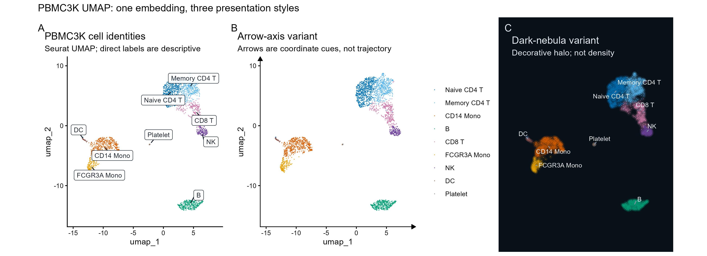
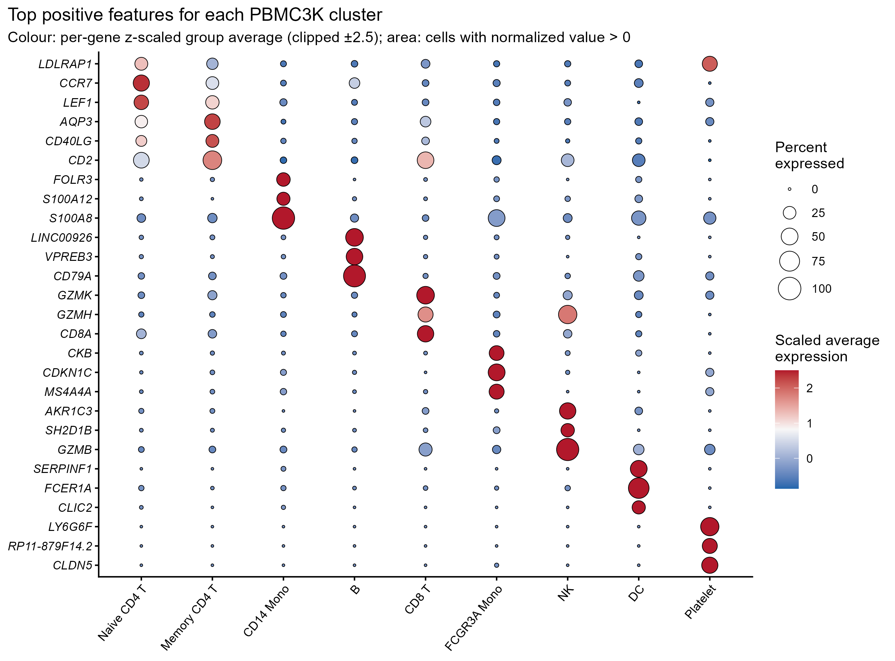
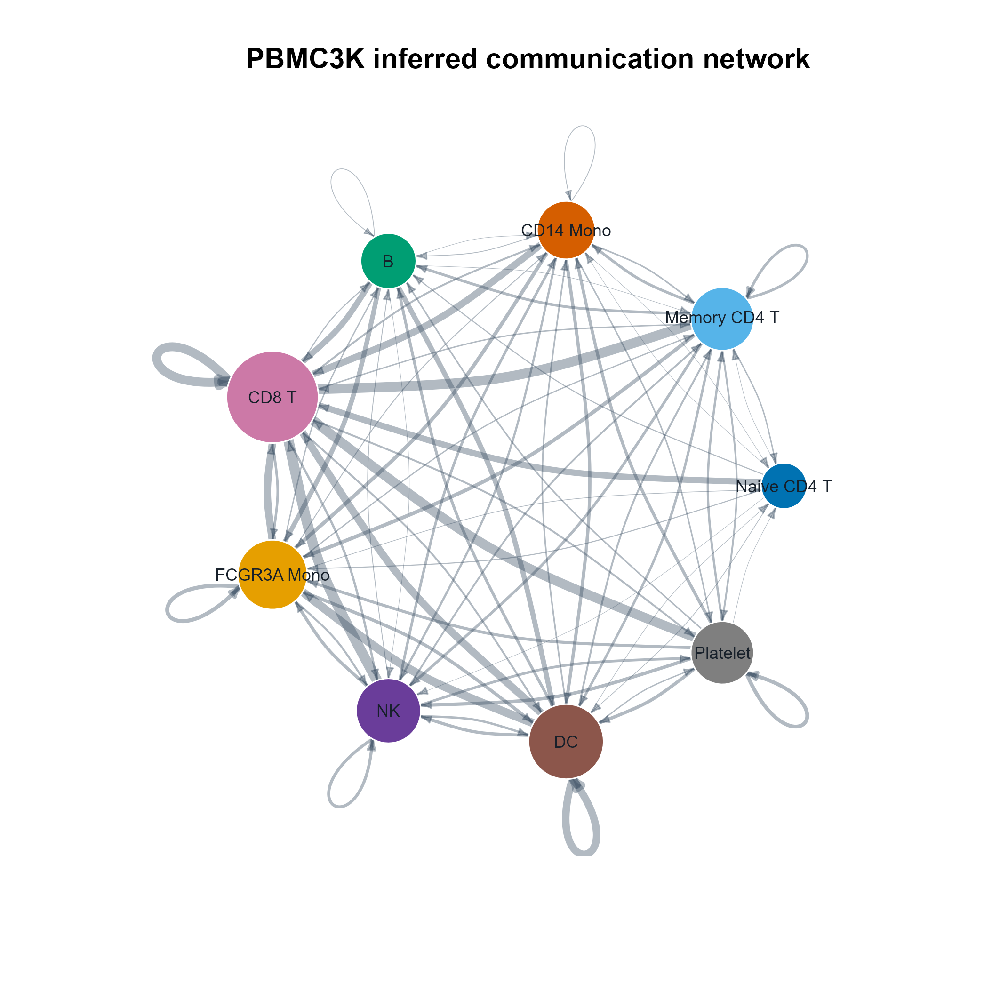
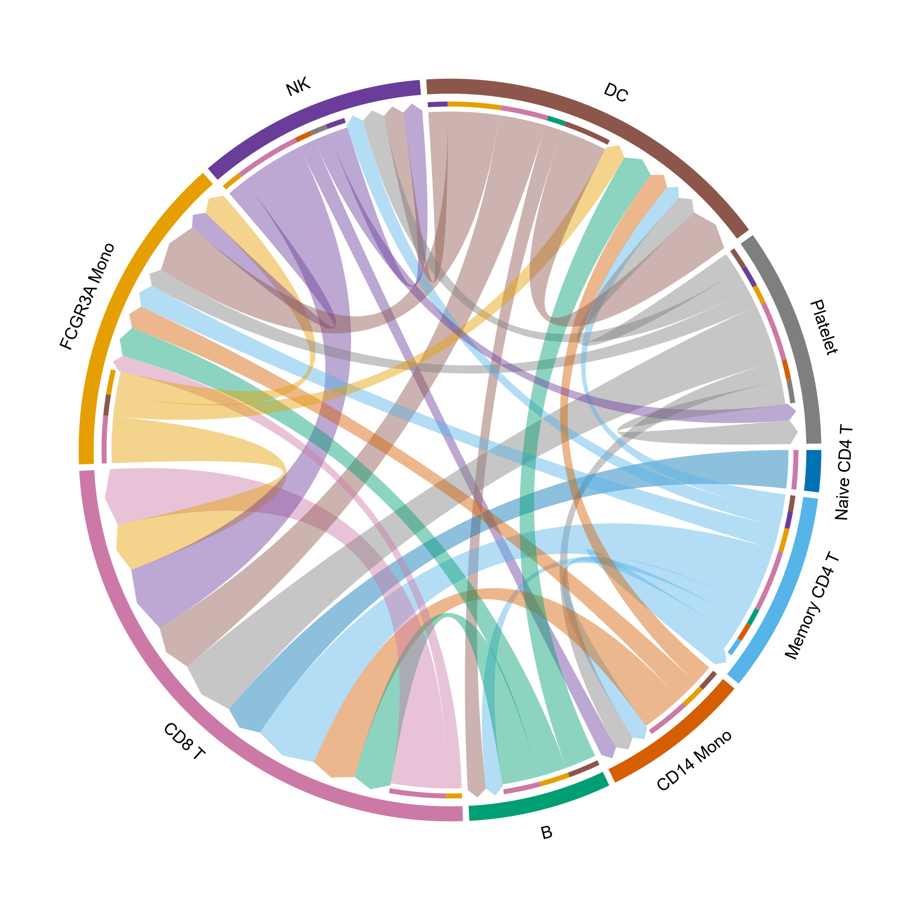
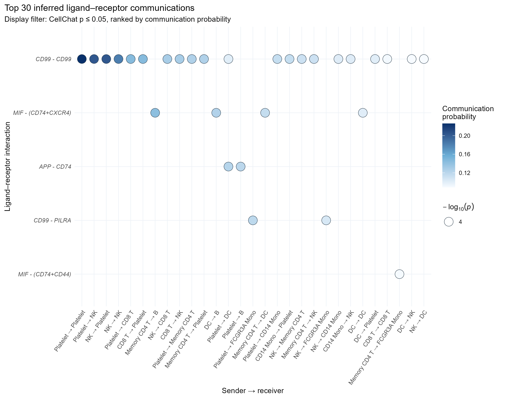
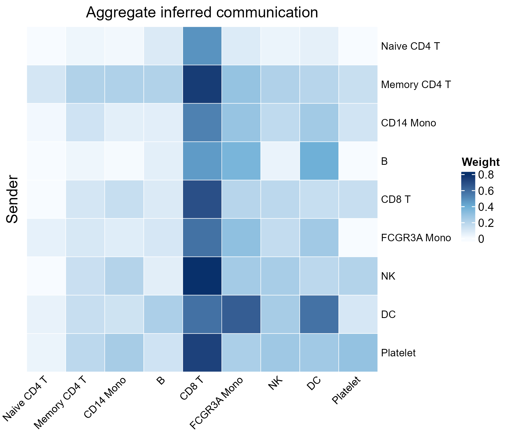

# 结果与解读示例

## Seurat 流程

使用与 Seurat PBMC3K 教程一致的主要 QC 条件：`nFeature_RNA > 200`、`nFeature_RNA < 2500`、`percent.mt < 5`。2700 个细胞中保留 2638 个；之后执行 LogNormalize（scale factor 10,000）、2000 个 VST features、PCA、前 10 个 PC 的邻居图、resolution 0.5 聚类和 UMAP。

| Cluster | 注释 | Cells | 分配得分 |
|---:|---|---:|---:|
| 0 | Naive CD4 T | 652 | 2.130 |
| 1 | Memory CD4 T | 485 | 1.773 |
| 2 | CD14 Mono | 481 | 2.552 |
| 3 | B | 344 | 2.350 |
| 4 | CD8 T | 314 | 1.898 |
| 5 | FCGR3A Mono | 162 | 2.376 |
| 6 | NK | 155 | 2.604 |
| 7 | DC | 32 | 2.434 |
| 8 | Platelet | 13 | 2.667 |

数字 ID 不能跨版本直接套用旧教程标签。本次 Seurat 5.4.0 的 cluster 1/2 特征与某些旧示例顺序不同，因此注释来自 canonical signature 得分和一对一分配。详见 `pbmc3k_signature_scores.csv` 与 `pbmc3k_signature_mapping.csv`。

## UMAP 多风格

- `visible`：9 个群在三个风格中位置一致，标签均未裁切。
- `interpretable`：颜色映射 `cell_type`；箭头只标识坐标方向；深色 halo 只作展示装饰。
- `confirmed`：三个面板复用同一个 Seurat UMAP embedding，没有重算坐标。
- `cannot_assert`：不能由 UMAP 证明细胞轨迹、全局群间距离、差异丰度、显著性或因果关系。

白底基线图适合打印；dark-nebula 更适合屏幕展示，不能用 halo 表达密度。

## marker dot plot

每群展示 3 个 positive features，共 27 个。点面积表示该群中归一化表达值大于 0 的细胞百分比；填色表示每个基因跨群平均线性表达的 z-score（显示裁剪到 `+/-2.5`）。

图中可见 CD14 Mono 的 `FOLR3/S100A12/S100A8`、B 的 `LINC00926/VPREB3/CD79A`、CD8 T 的 `GZMK/GZMH/CD8A` 等相对富集模式。Platelet 只有 13 个细胞，其 top-ranked features 对抽样和聚类十分敏感，不能把这三个基因当作稳定的跨供者 marker 结论。

## CellChat 聚合结果

参数：`CellChatDB.human`、`triMean`、`raw.use = TRUE`、`population.size = FALSE`、`distance.use = FALSE`、`min.cells = 10`、通信表阈值 `p <= 0.05`。得到 441 条通信记录、15 条 signaling pathways 和 74 条非零聚合边。

### Circle：完整网络概览

边宽是相对聚合推断权重；节点大小是 incoming + outgoing。CD8 T 的总聚合权重最高（约 7.27，主要来自 incoming），DC 的 outgoing 权重最高（约 2.67）。这是单数据集模型量，不是效应量或可重复的 donor-level 统计。

### Chord：前 35 条显示边

只为了可读性展示权重最高的 35 条正向边；完整网络并未在推断阶段被裁剪，显示矩阵另存为 `cellchat_chord_display_top35_matrix.csv`。

### Bubble：配体-受体细节

前 30 条中 `CD99-CD99` 占比较多，也出现 MIF、APP 等模式。颜色表示通信概率；面积表示 `-log10(CellChat model p)`，`p = 0` 的显示按 `1e-4` floor 封顶。该 p 值来自模型计算，不等价于生物学重复或多供者显著性。

### Heatmap：完整 sender-receiver 矩阵

行是 sender，列是 receiver，颜色是未变换的完整聚合权重。它适合比较整体模式，但颜色不是显著性。通信记录按通路计数较多的包括 MHC-II、MHC-I、GALECTIN 和 CD99；“记录数多”也不等于通路活性更强。

## 可以和不能得出的结论

可以报告：本次固定版本、固定参数、固定注释下的描述性细胞分布、marker 汇总和 CellChat 模型输出。

不能报告：跨供者差异、疾病效应、物理配体受体结合、空间接触、分子通量、因果方向、临床机制或可推广性。要支持这些结论，需要独立样本、sample-aware 统计、敏感性分析及表达/蛋白/空间/实验验证。
