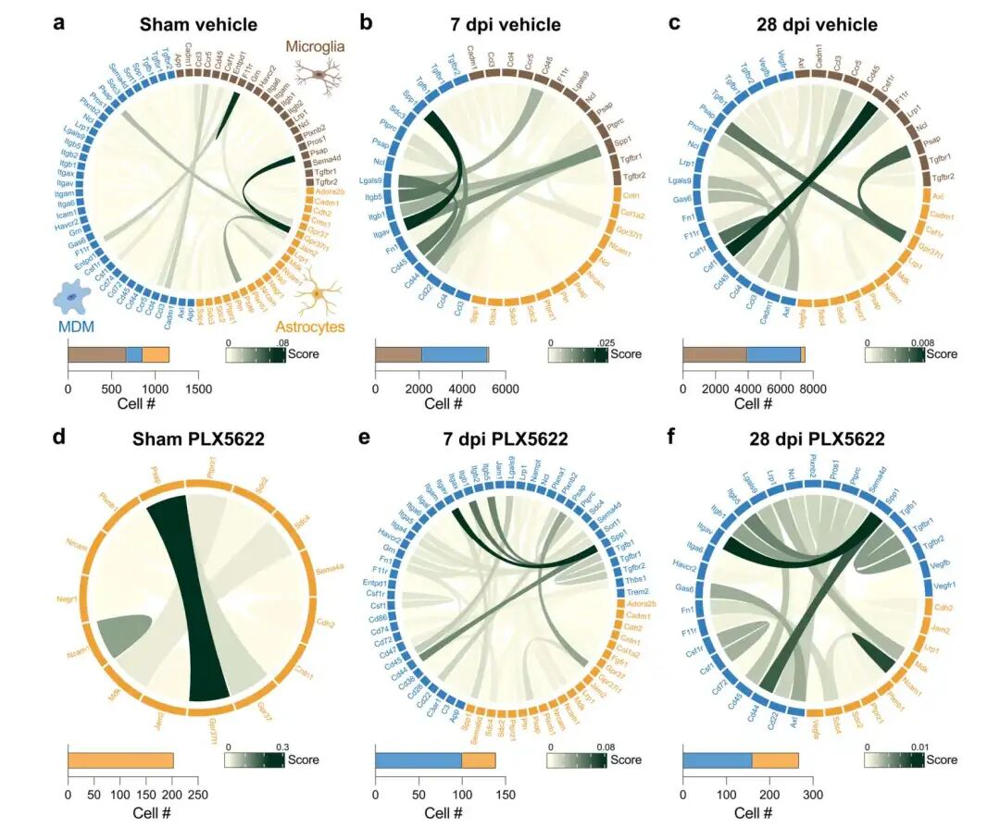
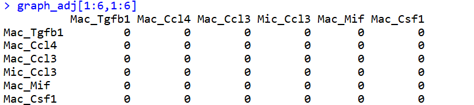
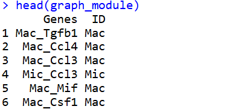
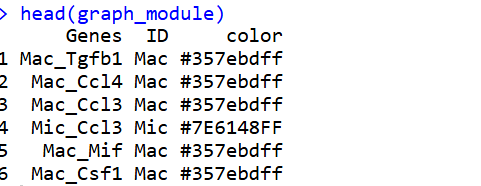
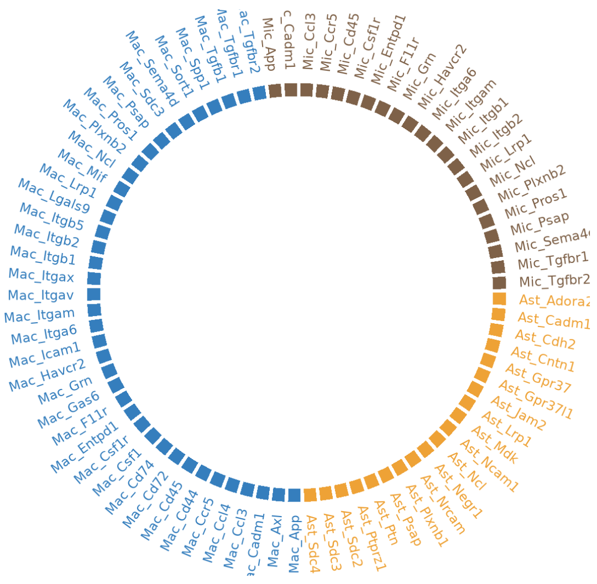
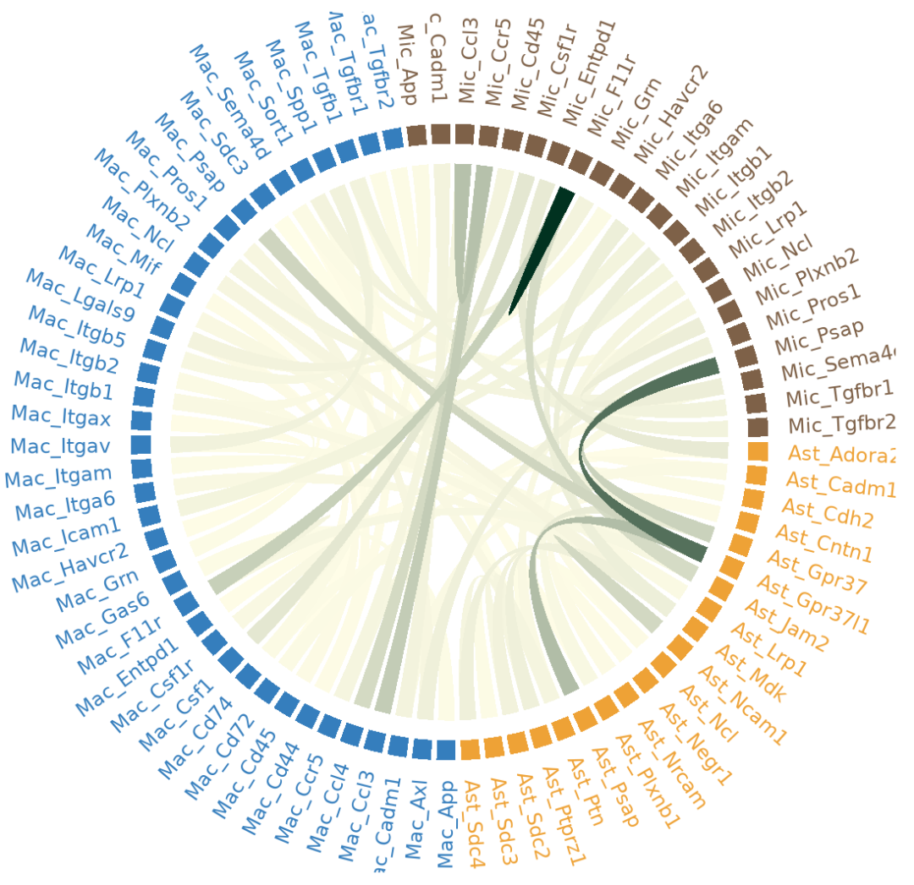
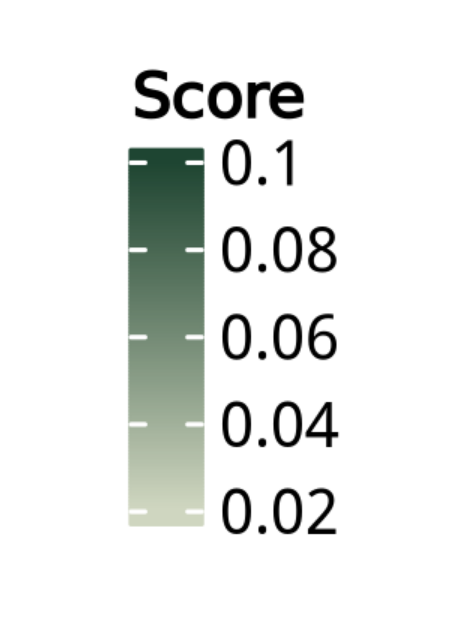

# 高颜值个性化的细胞通讯Cellchat结果弦图绘制（后续）

- 专辑：绘图小技巧2025
- 公众号：生信技能树
- 发布时间：2025-12-29 19:07
- 原文：[微信公众平台](https://mp.weixin.qq.com/s?__biz=MzAxMDkxODM1Ng%3D%3D&mid=2247548106&idx=1&sn=3a3a0a8d365a6d96c80089ec0fa982e2&chksm=9b4b7c71ac3cf5675da3af6072280ec1f08f0c7c1b331f2608a4fb416235023e1ed2f80873ad)

---
前提：前面学习弦图绘制，还差最后一个成品，2025年最后几天了，现在来收个尾。

[cellchat细胞通讯绘制弦图函数的参数这么难搞定吗？](https://mp.weixin.qq.com/s?__biz=MzAxMDkxODM1Ng%3D%3D&mid=2247542658&idx=1&sn=adabcd404adc4cd33d3991909888ec76#wechat_redirect)

[基本功修炼：Chord diagram 和弦图的基础函数](https://mp.weixin.qq.com/s?__biz=MzAxMDkxODM1Ng%3D%3D&mid=2247544490&idx=1&sn=9a3e5918921f89126470514d7516094e#wechat_redirect)

[NC高分杂志cellchat细胞通讯结果个性化绘制之弦图](https://mp.weixin.qq.com/s?__biz=MzAxMDkxODM1Ng%3D%3D&mid=2247544913&idx=1&sn=fb5ab3ded41912c8019a81a54f76d685#wechat_redirect)


如果下面的代码对你来说有绘制困难，可以看看我们每月一期的0基础生信入门培训：[生信入门&数据挖掘线上直播课2026年1月班](https://mp.weixin.qq.com/s?__biz=MzAxMDkxODM1Ng%3D%3D&mid=2247547917&idx=1&sn=76afb50b6e9e433e3f2b3d039f72dac4#wechat_redirect)

目标图如下：

来自2022年7月14号发表在 Nature Communications 杂志，文献标题**《Microglia coordinate cellular interactions during spinal cord repair in mice》**，这个图展示了在假手术（sham）、7天（7 dpi）和28天（28 dpi）脊髓中，小胶质细胞（棕色）、MDM（蓝色）和星形胶质细胞（橙色）之间的相互作用。



## 数据预处理

数据的背景等见上面的稿子。

这里先看看作者的数据，我前面已经做完了cellchat分析，理论上取出来其中的三列变成 **邻接矩阵**就可以了。

这里我先拿作者的数据绘图看看。

数据下载地址：https://doi.org/10.5281/zenodo.6590552

```r
rm(list=ls())
library(tidyverse)
library(circlize)
library(ggsci)
library(igraph)
library(gtools)
library(ComplexHeatmap)
library(ggsci)
library(scales)

# mat    : the adjacency matrix for the CCIs
# cat   : the category for each gene, i.e., cell type
# prefix : the prefix of the figure and legend files

# plot diagrams in batch
mat.list <- Sys.glob("./data/codes_for_CellChat/all_cells/*_mat.csv") # the list of adjacency matrix files
mat.list
cat.list <- Sys.glob("./data/codes_for_CellChat/all_cells/*_cat.csv") # the list of the gene category files, i.e., cell types
cat.list
W
i <- 1
print(mat.list[i])
# "./data/codes_for_CellChat/all_cells/ctrl.00d_mat.csv"
print(cat.list[i])
# "./data/codes_for_CellChat/all_cells/ctrl.00d_cat.csv"
mat = mat.list[i]
cat = cat.list[i]
prefix = strsplit(x = mat.list[i], split = '_')[[1]][1]
prefix
# "./data/codes"


# 数据读取
graph_adj <- read.csv(mat, row.names = 1)
graph_module <- read.csv(cat, row.names = 1)
g <- graph.adjacency(as.matrix(graph_adj), weighted = T)
graph_adj[1:6,1:6]
head(graph_module)
```

其中mat矩阵如下：the adjacency matrix for the CCIs



cat 矩阵如下： the category for each gene, i.e., cell type



### 颜色设置

```r
# set up color palette
module_color <- pal_locuszoom()(7)
show_col(pal_locuszoom("default")(7))

graph_module <- graph_module %>%
  mutate(color = as_factor(ID)) %>%
  mutate(color = fct_recode(color,
                            "#357ebdff" = "Mac",
                            "#7E6148FF" = "Mic",
                            # "#4DBBD5FF" = "turquoise.module",
                            "#EEA236FF" = "Ast"))
head(graph_module)
```



### 其他处理

1.  `get.edgelist(g)`：从图对象 `g` 中获取边的列表，返回一个矩阵，包含两列（源节点V1和目标节点V2）

2.  `E(g)$weight`：获取图 `g` 中所有边的权重值

3.  `cbind(get.edgelist(g), E(g)$weight)`：将边的两列与权重列合并，形成一个三列的矩阵

4.  `as.data.frame()`：将矩阵转换为数据框

```r
# filter graph by weights
g <- graph.adjacency(as.matrix(graph_adj), weighted = T)

raw_edges <-  as.data.frame(cbind(get.edgelist(g), E(g)$weight)) %>%
  mutate(
    V1 = gsub('\.', '-', V1), # 将第一列（V1，源节点）中的所有 点号. 替换为 连字符-
    V2 = gsub('\.', '-', V2), # 将第二列（V2，目标节点）中的所有 点号. 替换为 连字符-
    V3 = as.numeric(V3),
    V4 = 1
  )
edges <- raw_edges %>%
  arrange(V3)
head(edges)

nodes <-  unique(c(edges$V1, edges$V2))

sectors <- sort(unique(c(raw_edges$V1, raw_edges$V2)))

# diagram colors
grid_col <- graph_module %>%
  dplyr::filter(Genes %in% nodes) %>%
  dplyr::select(Genes, color) %>%
  mutate(color = as.character(color)) %>%
  deframe()
#https://vuetifyjs.com/en/styles/colors/#material-colors
col_fun = colorRamp2(range(edges$V3), c("#FFFDE7", "#013220"))
```

## 开始绘图

这里还是使用 circlize 这个基础包：https://jokergoo.github.io/circlize_book/book/

### 初始化设置

使用 **circlize** 包（环状可视化包）创建一个环形图的基础布局：

```r
# 设置扇区内边距为0，设置轨道间的边距
circos.par(cell.padding = c(0, 0, 0, 0), track.margin = c(-0.15,0.2))
# 初始化环形图：
circos.initialize(sectors, xlim = c(0, 1))
# 添加第一个绘图轨道：
circos.trackPlotRegion(ylim = c(0, 1), track.height = 0.05, bg.border = NA)
```

### 绘制外圈

在已经创建的环形图中，返回到第一个轨道，根据基因所属的模块（颜色）来设置扇区背景色和标签颜色。

```r
# we go back to the first track and customize sector labels
circos.track(
  track.index = 1,
  panel.fun = function(x, y) {
    sector.name = get.cell.meta.data("sector.index")
    xlim = get.cell.meta.data("xlim")
    this_node_text_color <- graph_module %>%
      dplyr::filter(Genes == sector.name) %>%
      pull(color) %>%
      as.character()

    circos.rect( xlim[1], 0, xlim[2], 1, col = this_node_text_color, border = NA )
    circos.text( mean(xlim), 2, CELL_META$sector.index, facing = "clockwise",
                 niceFacing = TRUE, adj = c(0, 0.5), col= this_node_text_color )
  },
  bg.border = NA
)
```

结果如下：



### 绘制内部的线条

```r
for (i in seq_len(nrow(edges))) {
  link <- edges[i,]
  circos.link(link[[1]], c(0, 1), link[[2]], c(0, 1), col = col_fun(link[[3]]),  border = NA)
}
```



完美！

### 再搞一个图例保存

```r
# plot legend
lgd <- Legend(title ="Score", col_fun = col_fun)
png( paste(paste0(prefix, "_legend.png"), sep = ""), width = 1000, height = 1000, res = 300 )
grid.draw(lgd)
dev.off()
```



今天到这~

下周开始年度盘点我们的《绘图小专辑2025》，开启新的一年《绘图小专辑2026》！

转发：

- [生信入门&数据挖掘线上直播课2026年1月班](https://mp.weixin.qq.com/s?__biz=MzAxMDkxODM1Ng%3D%3D&mid=2247547917&idx=1&sn=76afb50b6e9e433e3f2b3d039f72dac4#wechat_redirect)，你的生物信息学入门课

- [时隔5年，我们的生信技能树VIP学徒继续招生啦](https://mp.weixin.qq.com/s?__biz=MzAxMDkxODM1Ng%3D%3D&mid=2247525079&idx=1&sn=0b997af16a58195b4192691373048fd5#wechat_redirect)

- [满足你生信分析计算需求的低价解决方案](https://mp.weixin.qq.com/s?__biz=MzUzMTEwODk0Ng%3D%3D&mid=2247530048&idx=1&sn=28aa7bbd5e00521f79e074496a5f5d66#wechat_redirect)

- [生信故事会](https://mp.weixin.qq.com/mp/appmsgalbum?__biz=MzAxMDkxODM1Ng%3D%3D&action=getalbum&album_id=1679199708449144836#wechat_redirect)，来看看他们的生信入门故事

- [生信马拉松答疑专辑](https://mp.weixin.qq.com/mp/appmsgalbum?__biz=MzAxMDkxODM1Ng%3D%3D&action=getalbum&album_id=3690970204957147140#wechat_redirect)，获取你的生信专属答疑

<!-- wechat-article-fetcher: complete -->
