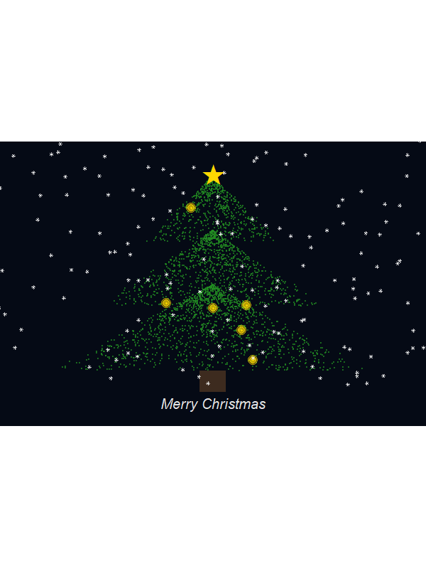
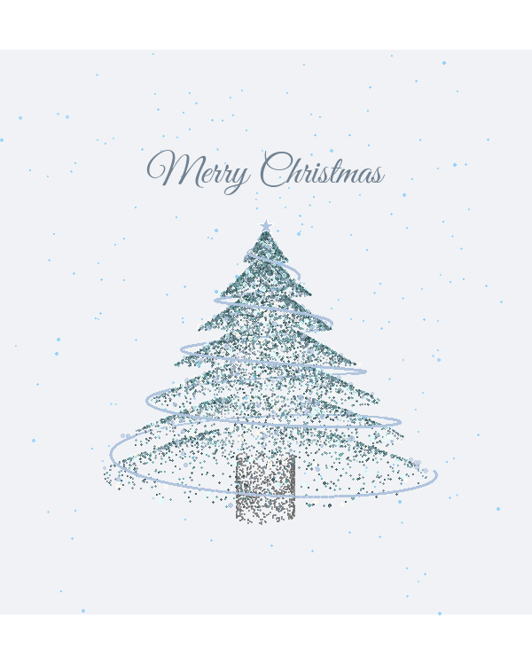
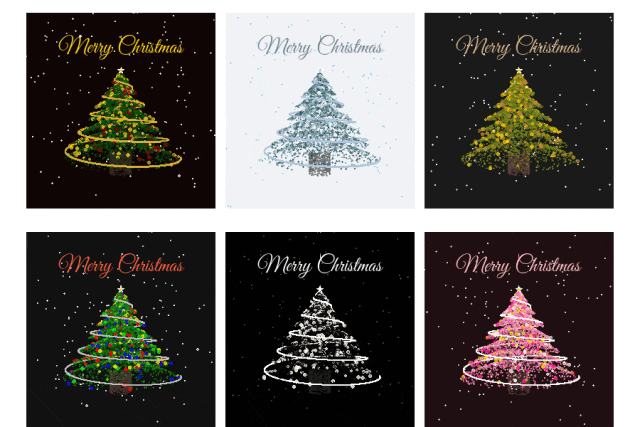

# 独属生信人的浪漫：送你一棵特别的圣诞树

- 专辑：绘图小技巧2025
- 公众号：生信技能树
- 发布时间：2025-12-23 12:17
- 原文：[微信公众平台](https://mp.weixin.qq.com/s?__biz=MzAxMDkxODM1Ng%3D%3D&mid=2247547960&idx=1&sn=baa7085af4209fd72acfc8b5e60d1ff9&chksm=9b4b7c83ac3cf595e44c7fad013f136ab9d4d0970e218b53b765b94124b9064a71306dfb0729)

---
> 圣诞节快到了，在生信技能树的群聊里面薅到了几个万能的群里发出来的画圣诞树的代码，代码来源未知（好像有一个是来自小红书，侵权可删）。
>
> 一起来画画看！

如果上面的代码对你来说有绘制困难，可以看看我们每月一期的0基础生信入门培训：[生信入门&数据挖掘线上直播课2026年1月班](https://mp.weixin.qq.com/s?__biz=MzAxMDkxODM1Ng%3D%3D&mid=2247547917&idx=1&sn=76afb50b6e9e433e3f2b3d039f72dac4#wechat_redirect)

等你！

## 版本一

下面的代码可以直接无脑一键运行：

```r
# -------------------------------------------------------------------
# 进阶版动态圣诞树 - 视觉优化版
# -------------------------------------------------------------------

# 1. 自动环境配置----
if (!requireNamespace("pacman", quietly = TRUE)) {
  install.packages("pacman")
}
pacman::p_load(ggplot2, gganimate, dplyr, tidyr, purrr)

# 参数设置
n_frames <- 30
set.seed(2025)

# 2. 模拟树冠 (使用分层生成算法)----
# 每一层都是一个向下的锥形，且底部带有弧度
generate_tree_tier <- function(y_range, width, n_points, frame_count) {
  data.frame(
    y = runif(n_points, y_range[1], y_range[2]),
    frame = rep(1:frame_count, length.out = n_points)
  ) %>%
    mutate(
      # 根据 y 的位置计算宽度，形成锥形，加上一点随机抖动模拟松针
      max_w = width * (y_range[2] - y) / (y_range[2] - y_range[1]),
      x = runif(n(), -max_w, max_w) * (1 + runif(n(), -0.1, 0.1))
    )
}

# 生成三层树冠
canopy_df <- bind_rows(
  generate_tree_tier(c(0.7, 1.0), 0.3, 20000, n_frames), # 顶层
  generate_tree_tier(c(0.4, 0.75), 0.5, 30000, n_frames), # 中层
  generate_tree_tier(c(0.1, 0.5), 0.7, 40000, n_frames)   # 底层
)

# 3. 装饰灯 (带发光效果)----
# 选出 120 个位置放灯，通过叠加三层不同大小的圆点模拟 Glow
n_lights <- 120
lights_pos <- canopy_df %>%
  slice_sample(n = n_lights) %>%
  mutate(light_id = row_number())

lights_df <- map_df(1:3, function(l) {
  lights_pos %>%
    mutate(
      size = l * 1.8,       # 越向外点越大
      alpha = 0.9 / l,      # 越向外越透明
      layer = l
    )
})

# 4. 动态雪花 (正弦波漂移)----
snow_df <- data.frame(
  id = 1:150,
  x_base = runif(150, -1, 1),
  y_start = runif(150, 0, 1.2),
  speed = runif(150, 0.015, 0.035),
  drift = runif(150, 0.02, 0.05)
) %>%
  crossing(frame = 1:n_frames) %>%
  mutate(
    y = (y_start - speed * (frame - 1)) %% 1.2,
    # 使用 sin 函数增加左右摆动
    x = x_base + drift * sin(frame / 3 + id)
  )

# 5. 树干----
trunk_df <- data.frame(xmin = -0.06, xmax = 0.06, ymin = 0, ymax = 0.1)

# 6. 开始绘图----
p <- ggplot() +
# 深蓝色夜空背景
  theme_void() +
  theme(
    plot.background = element_rect(fill = "#050a15", color = NA),
    panel.background = element_rect(fill = "#050a15", color = NA)
  ) +
  coord_fixed(xlim = c(-0.9, 0.9), ylim = c(-0.1, 1.1)) +
# 树干 (咖啡色)
  geom_rect(data = trunk_df, aes(xmin=xmin, xmax=xmax, ymin=ymin, ymax=ymax), fill = "#3d2b1f") +
# 树冠 (深森林绿)
  geom_point(data = canopy_df, aes(x, y),  color = "#228B22", alpha = 0.6, size = 0.7) +
# 装饰灯 (闪烁效果由 frame %% 2 控制)
  geom_point(data = lights_df, aes(x, y, size = size, alpha = alpha * (frame %% 2)), color = "#FFD700") +
# 雪花
  geom_point(data = snow_df, aes(x, y), color = "white", alpha = 0.7, size = 1.2, shape = 8) +
# 树顶星 (放大感)
  annotate("text", x = 0, y = 1.02, label = "★",  color = "#FFD700", size = 18, family = "serif") +
# 底部文字
  annotate("text", x = 0, y = -0.05, label = "Merry Christmas", color = "#E5E5E5", size = 7, fontface = "italic") +
# 动画设置
  guides(size = "none", alpha = "none") +
  transition_manual(frame)

# 7. 渲染输出----
# 如果在 Windows 上运行慢，建议减小 nframes
animate(
  p,
  nframes = n_frames,
  fps = 10,
  width = 600,
  height = 800,
  renderer = gifski_renderer("Better_Christmas_Tree.gif")
)

cat("优化版圣诞树已保存至当前目录下的 Better_Christmas_Tree.gif
")
```

一颗闪闪发光的圣诞树就画好啦！




## 版本2

我看到群里发的代码不止一个，又搞了一款：

```r
if (!requireNamespace("pacman", quietly = TRUE)) {
  install.packages("pacman")
}
pacman::p_load(ggplot2, gganimate, dplyr, tidyr,showtext,av, jsonlite,curl,gifski, purrr)

# library(ggplot2)
# library(gganimate)
# library(dplyr)
# library(tidyr)
# library(showtext)
# library(av)
# library(jsonlite)
# library(curl)
# library(gifski)

font_add_google("Great Vibes", "christmas_font")
showtext_auto()
current_style_id <- 2# 【在此切换风格 1-6】
styles <- list(
"1" = list(
    bg_col = "#0f0505", tree_cols = c("#0B3D0B", "#144514", "#006400"),
    trunk_col = "#3e2723", decor_cols = c("#FFD700", "#CCA43B", "#8B0000"),
    star_col = "#FFD700", text_col = "#FFD700", snow_col = "white",
    ribbon = TRUE, ribbon_col = "#D4AF37", ribbon_width = 1.5
  ),
"2" = list(
    bg_col = "#F0F2F5", tree_cols = c("#2F4F4F", "#5F9EA0", "#708090"),
    trunk_col = "#696969", decor_cols = c("#B0C4DE", "#FFFAF0", "#E0FFFF"),
    star_col = "#B0C4DE", text_col = "#708090", snow_col = "#87CEFA",
    ribbon = TRUE, ribbon_col = "#B0C4DE", ribbon_width = 1.5
  ),
"3" = list(
    bg_col = "#1a1a1a", tree_cols = c("#556B2F", "#6B8E23", "#808000"),
    trunk_col = "#5D4037", decor_cols = c("#CD853F", "#FFCC00"),
    star_col = "#FFCC00", text_col = "#DEB887", snow_col = "white",
    ribbon = FALSE, ribbon_col = NA, ribbon_width = 0
  ),
"4" = list(
    bg_col = "#101010", tree_cols = c("#006400", "#228B22"),
    trunk_col = "#4E342E", decor_cols = c("#FF0000", "#00FF00", "#0000FF", "#FFFF00"),
    star_col = "#FFD700", text_col = "#FF6347", snow_col = "white",
    ribbon = TRUE, ribbon_col = "#C0C0C0", ribbon_width = 1.0
  ),
"5" = list(
    bg_col = "#000000", tree_cols = c("#111111", "#050505"),
    trunk_col = "#222222", decor_cols = c("#FFFFFF", "#FFFFE0"),
    star_col = "#FFFFFF", text_col = "#FFFFFF", snow_col = "gray30",
    ribbon = TRUE, ribbon_col = "#FFFFFF", ribbon_width = 0.8
  ),
"6" = list(
    title = "Pink Romance",
    bg_col = "#1F0F12",
    tree_cols = c("#D87093", "#FF69B4", "#FFB6C1"),
    trunk_col = "#4A3728",
    decor_cols = c("#FFFFFF", "#FFD700", "#FF1493"),
    star_col = "#FFD700",
    text_col = "#FFC0CB",
    snow_col = "#FFF0F5",
    ribbon = TRUE,
    ribbon_col = "#F8F8FF",
    ribbon_width = 0.8,
    ribbon_burr = 0.04
  )
)
cfg <- styles[[as.character(current_style_id)]]
set.seed(2025)
get_star_polygon <- function(x_center, y_center, radius) {
  angles <- seq(pi/2, 2.5 * pi, length.out = 11)[-11]
  radii <- rep(c(radius, radius * 0.4), 5)
  data.frame(x = x_center + radii * cos(angles), y = y_center + radii * sin(angles))
}
generate_tree_data <- function(cfg) {
  n_leaves <- 8000
  h <- runif(n_leaves, 0, 1)
  base_r <- (1 - h)
  layer_cycle <- (h * 7) %% 1
  r <- base_r * 0.65 * (0.4 + 0.6 * (1 - layer_cycle)^0.7)
  theta <- runif(n_leaves, 0, 2*pi)
  df_tree <- data.frame(
    x = r * cos(theta), y = h - 0.5, z = r * sin(theta),
    col = sample(cfg$tree_cols, n_leaves, replace = TRUE),
    size = runif(n_leaves, 0.6, 1.8), type = "tree", alpha = 0.95
  )
  n_trunk <- 1000
  h_trunk <- runif(n_trunk, -0.7, -0.45)
  r_trunk <- 0.12
  theta_trunk <- runif(n_trunk, 0, 2*pi)
  df_trunk <- data.frame(
    x = r_trunk * cos(theta_trunk), y = h_trunk, z = r_trunk * sin(theta_trunk),
    col = cfg$trunk_col, size = 1.2, type = "trunk", alpha = 1
  )
  n_decor <- 600
  h_dec <- runif(n_decor, 0, 0.95)
  base_r_dec <- (1 - h_dec)
  layer_cycle_dec <- (h_dec * 7) %% 1
  r_dec <- base_r_dec * 0.68 * (0.4 + 0.6 * (1 - layer_cycle_dec)^0.7)
  theta_dec <- runif(n_decor, 0, 2*pi)
  df_decor <- data.frame(
    x = r_dec * cos(theta_dec), y = h_dec - 0.5, z = r_dec * sin(theta_dec),
    col = sample(cfg$decor_cols, n_decor, replace = TRUE),
    size = runif(n_decor, 2, 4), type = "decor", alpha = 1
  )
  df_ribbon <- NULL
if (cfg$ribbon) {
    n_rib <- 6000
    h_rib <- seq(0, 0.95, length.out = n_rib)
    base_r_rib <- (1 - h_rib) * 0.65 * 1.05
    theta_rib <- 10 * pi * h_rib
    df_ribbon <- data.frame(
      x = base_r_rib * cos(theta_rib),
      y = h_rib - 0.5,
      z = base_r_rib * sin(theta_rib),
      col = cfg$ribbon_col,
      size = cfg$ribbon_width,
      type = "ribbon",
      alpha = 1
    )
  }
  bind_rows(df_trunk, df_tree, df_decor, df_ribbon)
}
generate_snow <- function(n_flakes=250) {
  data.frame(
    x = runif(n_flakes, -1, 1), y = runif(n_flakes, -0.8, 1.2), z = runif(n_flakes, -1, 1),
    col = cfg$snow_col, size = runif(n_flakes, 0.5, 2),
    type = "snow", alpha = runif(n_flakes, 0.5, 0.9), speed = runif(n_flakes, 0.015, 0.035)
  )
}
static_data <- generate_tree_data(cfg)
snow_data <- generate_snow(250)
star_shape <- get_star_polygon(0, 0.4, 0.03)
n_frames <- 90
fps_val <- 24
process_frame <- function(frame_id) {
  angle <- 2 * pi * (frame_id / n_frames)
  tree_rot <- static_data %>%
    mutate(
      x_rot = x * cos(angle) - z * sin(angle),
      z_rot = z * cos(angle) + x * sin(angle),
      y_final = y
    )
  snow_curr <- snow_data %>%
    mutate(
      y_final = -0.8 + (y - frame_id * speed - (-0.8)) %% 2,
      x_rot = x, z_rot = z
    )
  bind_rows(tree_rot, snow_curr) %>%
    mutate(
      depth = 1 / (2.5 - z_rot),
      x_proj = x_rot * depth * 2,
      y_proj = y_final * depth * 2,
      size_vis = size * depth * 1.5,
      alpha_vis = alpha * ifelse(type == "snow", 1, (z_rot + 1.2) / 2.2)
    ) %>%
    arrange(depth) %>%
    mutate(frame = frame_id)
}
all_frames <- lapply(1:n_frames, process_frame) %>% bind_rows()
p <- ggplot() +
  geom_point(data = all_frames,
             aes(x = x_proj, y = y_proj, color = I(col), size = I(size_vis), alpha = I(alpha_vis)),
             shape = 19) +
  geom_polygon(data = star_shape, aes(x = x, y = y),
               fill = cfg$star_col, color = "white", size = 0.3) +
  annotate("text", x = 0, y = 0.6, label = "Merry Christmas",
           family = "christmas_font", color = cfg$text_col, size = 12) +
  scale_size_identity() +
  scale_alpha_identity() +
  coord_fixed(xlim = c(-0.8, 0.8), ylim = c(-0.8, 0.9)) +
  theme_void() +
  theme(
    plot.background = element_rect(fill = cfg$bg_col, color = NA),
    panel.background = element_rect(fill = cfg$bg_col, color = NA)
  ) +
  transition_manual(frame)
animate(p, nframes = n_frames, fps = fps_val, width = 600, height = 750,
        renderer = gifski_renderer(loop = TRUE))

anim_save("./Christmas_Trees_1.gif", fps = 20, width = 900, height = 600, res = 150)
```

这个好好看！




## 版本3

还有一个一键出多颗树的，也是无脑运行即可：

```r
library(ggplot2)
library(gganimate)
library(dplyr)
library(tidyr)
library(showtext)
library(av)
library(jsonlite)
library(curl)
library(gifski)

# --- 1. 字体与风格定义 ---
font_add_google("Great Vibes", "christmas_font")
showtext_auto()

styles <- list(
"1" = list(
    title = "Classic Green",
    bg_col = "#0f0505", tree_cols = c("#0B3D0B", "#144514", "#006400"),
    trunk_col = "#3e2723", decor_cols = c("#FFD700", "#CCA43B", "#8B0000"),
    star_col = "#FFD700", text_col = "#FFD700", snow_col = "white",
    ribbon = TRUE, ribbon_col = "#D4AF37", ribbon_width = 1.2
  ),
"2" = list(
    title = "Frozen Blue",
    bg_col = "#F0F2F5", tree_cols = c("#2F4F4F", "#5F9EA0", "#708090"),
    trunk_col = "#696969", decor_cols = c("#B0C4DE", "#FFFAF0", "#E0FFFF"),
    star_col = "#B0C4DE", text_col = "#708090", snow_col = "#87CEFA",
    ribbon = TRUE, ribbon_col = "#B0C4DE", ribbon_width = 1.2
  ),
"3" = list(
    title = "Rustic Gold",
    bg_col = "#1a1a1a", tree_cols = c("#556B2F", "#6B8E23", "#808000"),
    trunk_col = "#5D4037", decor_cols = c("#CD853F", "#FFCC00"),
    star_col = "#FFCC00", text_col = "#DEB887", snow_col = "white",
    ribbon = FALSE, ribbon_col = NA, ribbon_width = 0
  ),
"4" = list(
    title = "Neon Party",
    bg_col = "#101010", tree_cols = c("#006400", "#228B22"),
    trunk_col = "#4E342E", decor_cols = c("#FF0000", "#00FF00", "#0000FF", "#FFFF00"),
    star_col = "#FFD700", text_col = "#FF6347", snow_col = "white",
    ribbon = TRUE, ribbon_col = "#C0C0C0", ribbon_width = 0.8
  ),
"5" = list(
    title = "Midnight Mono",
    bg_col = "#000000", tree_cols = c("#111111", "#050505"),
    trunk_col = "#222222", decor_cols = c("#FFFFFF", "#FFFFE0"),
    star_col = "#FFFFFF", text_col = "#FFFFFF", snow_col = "gray30",
    ribbon = TRUE, ribbon_col = "#FFFFFF", ribbon_width = 0.6
  ),
"6" = list(
    title = "Pink Romance",
    bg_col = "#1F0F12",
    tree_cols = c("#D87093", "#FF69B4", "#FFB6C1"),
    trunk_col = "#4A3728",
    decor_cols = c("#FFFFFF", "#FFD700", "#FF1493"),
    star_col = "#FFD700",
    text_col = "#FFC0CB",
    snow_col = "#FFF0F5",
    ribbon = TRUE,
    ribbon_col = "#F8F8FF",
    ribbon_width = 0.7
  )
)

# --- 2. 数据生成函数 (增加风格参数) ---

get_star_polygon <- function(x_center, y_center, radius, style_name, star_col) {
  angles <- seq(pi/2, 2.5 * pi, length.out = 11)[-11]
  radii <- rep(c(radius, radius * 0.4), 5)
  data.frame(
    x = x_center + radii * cos(angles),
    y = y_center + radii * sin(angles),
    style_name = style_name,
    fill_col = star_col
  )
}

generate_tree_data <- function(cfg, style_name) {
# (为了提高速度，稍微减少了点的数量)
  n_leaves <- 5000
  h <- runif(n_leaves, 0, 1)
  base_r <- (1 - h)
  layer_cycle <- (h * 7) %% 1
  r <- base_r * 0.65 * (0.4 + 0.6 * (1 - layer_cycle)^0.7)
  theta <- runif(n_leaves, 0, 2*pi)
  df_tree <- data.frame(
    x = r * cos(theta), y = h - 0.5, z = r * sin(theta),
    col = sample(cfg$tree_cols, n_leaves, replace = TRUE),
    size = runif(n_leaves, 0.6, 1.5), type = "tree", alpha = 0.95
  )

  n_trunk <- 600
  h_trunk <- runif(n_trunk, -0.7, -0.45)
  r_trunk <- 0.12
  theta_trunk <- runif(n_trunk, 0, 2*pi)
  df_trunk <- data.frame(
    x = r_trunk * cos(theta_trunk), y = h_trunk, z = r_trunk * sin(theta_trunk),
    col = cfg$trunk_col, size = 1.2, type = "trunk", alpha = 1
  )

  n_decor <- 400
  h_dec <- runif(n_decor, 0, 0.95)
  base_r_dec <- (1 - h_dec)
  layer_cycle_dec <- (h_dec * 7) %% 1
  r_dec <- base_r_dec * 0.68 * (0.4 + 0.6 * (1 - layer_cycle_dec)^0.7)
  theta_dec <- runif(n_decor, 0, 2*pi)
  df_decor <- data.frame(
    x = r_dec * cos(theta_dec), y = h_dec - 0.5, z = r_dec * sin(theta_dec),
    col = sample(cfg$decor_cols, n_decor, replace = TRUE),
    size = runif(n_decor, 2, 3.5), type = "decor", alpha = 1
  )

  df_ribbon <- NULL
if (cfg$ribbon) {
    n_rib <- 4000
    h_rib <- seq(0, 0.95, length.out = n_rib)
    base_r_rib <- (1 - h_rib) * 0.65 * 1.05
    theta_rib <- 10 * pi * h_rib
    df_ribbon <- data.frame(
      x = base_r_rib * cos(theta_rib),
      y = h_rib - 0.5,
      z = base_r_rib * sin(theta_rib),
      col = cfg$ribbon_col,
      size = cfg$ribbon_width,
      type = "ribbon",
      alpha = 1
    )
  }
  bind_rows(df_trunk, df_tree, df_decor, df_ribbon) %>%
    mutate(style_name = style_name, bg_col = cfg$bg_col, text_col = cfg$text_col)
}

generate_snow <- function(cfg, style_name, n_flakes=150) {
  data.frame(
    x = runif(n_flakes, -1, 1), y = runif(n_flakes, -0.8, 1.2), z = runif(n_flakes, -1, 1),
    col = cfg$snow_col, size = runif(n_flakes, 0.5, 1.5),
    type = "snow", alpha = runif(n_flakes, 0.5, 0.9), speed = runif(n_flakes, 0.015, 0.035),
    style_name = style_name, bg_col = cfg$bg_col, text_col = cfg$text_col
  )
}

# --- 3. 批量生成所有风格的静态数据 ---
set.seed(2025)
all_static_data <- list()
all_snow_data <- list()
all_star_shapes <- list()
bg_rect_data <- list() # 用于绘制各自分面背景的矩形数据

for (i in1:6) {
  style_cfg <- styles[[as.character(i)]]
  s_name <- paste0(i, ". ", style_cfg$title) # 组合编号和标题

  all_static_data[[i]] <- generate_tree_data(style_cfg, s_name)
  all_snow_data[[i]] <- generate_snow(style_cfg, s_name)
  all_star_shapes[[i]] <- get_star_polygon(0, 0.4, 0.03, s_name, style_cfg$star_col)

# 生成一个铺满各自面板的背景矩形数据
  bg_rect_data[[i]] <- data.frame(
    xmin = -1, xmax = 1, ymin = -1, ymax = 1,
    bg_col = style_cfg$bg_col,
    text_col = style_cfg$text_col, # 补齐这一列
    style_name = s_name
  )
}

combined_static <- bind_rows(all_static_data)
combined_snow <- bind_rows(all_snow_data)
combined_star <- bind_rows(all_star_shapes)
combined_bg_rect <- bind_rows(bg_rect_data)

# --- 4. 动画帧处理函数 ---
n_frames <- 60   # 适当减少帧数以加快渲染
fps_val <- 20

process_frame_all <- function(frame_id) {
  angle <- 2 * pi * (frame_id / n_frames)

# 处理树的旋转
  tree_rot <- combined_static %>%
    mutate(
      x_rot = x * cos(angle) - z * sin(angle),
      z_rot = z * cos(angle) + x * sin(angle),
      y_final = y
    )

# 处理雪的下落
  snow_curr <- combined_snow %>%
    mutate(
      y_final = -0.8 + (y - frame_id * speed - (-0.8)) %% 2,
      x_rot = x, z_rot = z
    )

# 合并并计算透视投影
  bind_rows(tree_rot, snow_curr) %>%
    mutate(
      depth = 1 / (2.5 - z_rot),
      x_proj = x_rot * depth * 2,
      y_proj = y_final * depth * 2,
      size_vis = size * depth * 1.5,
      alpha_vis = alpha * ifelse(type == "snow", 1, (z_rot + 1.2) / 2.2)
    ) %>%
    arrange(depth) %>%
    mutate(frame = frame_id)
}

# 生成所有动画帧数据 (这一步会比较慢，耐心等待)
final_anim_data <- lapply(1:n_frames, process_frame_all) %>% bind_rows()

all_text_persistent <- combined_bg_rect %>%
  select(style_name, text_col) %>%
  tidyr::expand_grid(frame = 1:n_frames) %>% # 为每一帧复制一份文字
  mutate(x = 0, y = 0.65, label = "Merry Christmas")

# --- 5. 绘图与动画 ---
p <- ggplot() +
# 1. 绘制独立的背景色块 (利用 geom_rect 和分面)
  geom_rect(data = combined_bg_rect,
            aes(xmin = xmin, xmax = xmax, ymin = ymin, ymax = ymax, fill = I(bg_col))) +

# 2. 绘制树和雪花点
  geom_point(data = final_anim_data,
             aes(x = x_proj, y = y_proj, color = I(col), size = I(size_vis), alpha = I(alpha_vis)),
             shape = 19) +

# 3. 绘制星星 (需要指定 data 和分面变量)
  geom_polygon(data = combined_star,
               aes(x = x, y = y, fill = I(fill_col)), color = "white", size = 0.2) +

# 4. 添加文字 (利用数据中的 text_col 列来实现不同风格不同字色)
# 注意：这里只需用 final_anim_data 的第一帧数据来定位文字即可，避免重复绘制
  geom_text(data = all_text_persistent,
            aes(x = x, y = y, label = label, color = I(text_col), frame = frame),
            family = "christmas_font", size = 8) +

# 5. 设置比例和样式
  scale_size_identity() +
  scale_alpha_identity() +
  coord_fixed(xlim = c(-0.8, 0.8), ylim = c(-0.8, 0.85)) +
  theme_void() +
  theme(
    # 移除 plot 的总体背景，让 geom_rect 生效
    plot.background = element_blank(),
    panel.background = element_blank(),
    # 设置分面标题的样式
    strip.text = element_text(family = "christmas_font", size = 14, color = "white", margin = margin(b = 5)),
    strip.background = element_blank(), # 移除分面标题的背景框
    # 增加一些分面间的间距
    panel.spacing = unit(1, "lines")
  ) +

# 6. 核心：使用分面功能，排成 2 行 3 列
  facet_wrap(~style_name, ncol = 3) +

# 7. 动画过渡
  transition_manual(frame)

# 渲染动画 (画布要设置得大一些，以容纳 6 个图)
animate(p, nframes = n_frames, fps = fps_val, width = 900, height = 600,
        renderer = gifski_renderer(loop = TRUE))

anim_save("./Christmas_Trees_6in1.gif", fps = 20, width = 900, height = 600, res = 150)
```



一次拥有6棵！

上面的代码如果你想偷懒不想复制，加我微信直接发你R脚本：Biotree123。

提前祝大家圣诞快乐！

转发：

- [生信入门&数据挖掘线上直播课2026年1月班](https://mp.weixin.qq.com/s?__biz=MzAxMDkxODM1Ng%3D%3D&mid=2247547917&idx=1&sn=76afb50b6e9e433e3f2b3d039f72dac4#wechat_redirect)，你的生物信息学入门课

- [时隔5年，我们的生信技能树VIP学徒继续招生啦](https://mp.weixin.qq.com/s?__biz=MzAxMDkxODM1Ng%3D%3D&mid=2247525079&idx=1&sn=0b997af16a58195b4192691373048fd5#wechat_redirect)

- [满足你生信分析计算需求的低价解决方案](https://mp.weixin.qq.com/s?__biz=MzUzMTEwODk0Ng%3D%3D&mid=2247530048&idx=1&sn=28aa7bbd5e00521f79e074496a5f5d66#wechat_redirect)

- [生信故事会](https://mp.weixin.qq.com/mp/appmsgalbum?__biz=MzAxMDkxODM1Ng%3D%3D&action=getalbum&album_id=1679199708449144836#wechat_redirect)，来看看他们的生信入门故事

- [生信马拉松答疑专辑](https://mp.weixin.qq.com/mp/appmsgalbum?__biz=MzAxMDkxODM1Ng%3D%3D&action=getalbum&album_id=3690970204957147140#wechat_redirect)，获取你的生信专属答疑

<!-- wechat-article-fetcher: complete -->
