# 学习一个粉丝推荐的高级版upset图R包：ComplexUpset

- 专辑：绘图小技巧2025
- 公众号：生信技能树
- 发布时间：2025-12-15 23:35
- 原文：[微信公众平台](https://mp.weixin.qq.com/s?__biz=MzAxMDkxODM1Ng%3D%3D&mid=2247547735&idx=1&sn=8a37b968dc94464470fb9d612c065f35&chksm=9b4b7becac3cf2fab40e716a44554e6af92e82dc8755ea1da79a388c8e839e8941c6e9121366)

---
> 在上一周的绘图专辑稿子中，我去学习了upset图怎么绘制，见稿子：[顶刊杂志同款高颜值UpSet图展示多组交集结果](https://mp.weixin.qq.com/s?__biz=MzAxMDkxODM1Ng%3D%3D&mid=2247547354&idx=1&sn=44a95c22402e85294278df0d4963ca60#wechat_redirect)，里面使用的 R包是 UpSetR ，绘制起来呢总有一些不尽如意的地方，然后留言区万能的网友又来给我支招了：可能是用ComplexUpset画的，这个包比UpsetR的自定义功能多多了！！
>
> 这就来学习！主打一个听劝~

ComplexUpset包的官网：https://krassowski.github.io/complex-upset/

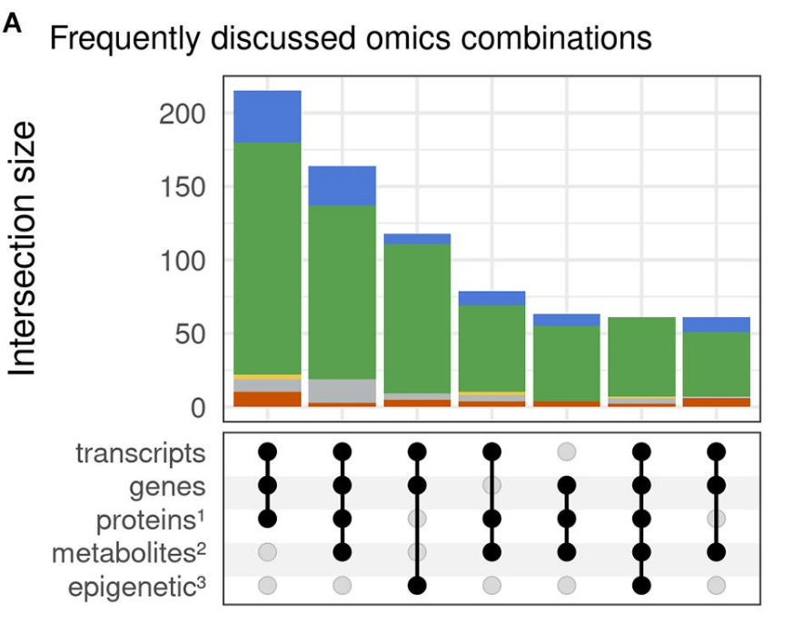

Analyses for State of the field in multi-omics research: from computational needs to data mining and sharing Figure 5(https://www.frontiersin.org/articles/10.3389/fgene.2020.610798/full\#F5)

## 安装：

如果github安装方式不好装，就老实用来自cran的安装方式：

```r
## 使用西湖大学的 Bioconductor镜像
options(BioC_mirror="https://mirrors.westlake.edu.cn/bioconductor")
options("repos"=c(CRAN="https://mirrors.westlake.edu.cn/CRAN/"))

if(!require(devtools)) install.packages("devtools")
devtools::install_github("krassowski/complex-upset")

# 或者你的网络不行使用下面这个
install.packages('ComplexUpset')

rm(list=ls())
library(ggplot2)
library(ComplexUpset)
# 查看 ggplot2 中的数据集
data(package = "ggplot2")
```

## 示例数据

#### 数据介绍：`ggplot2movies::movies` 数据集包含 58,788 部电影的信息，有 24 个变量（列）。以下是每一列的含义：

##### 基础信息

- **title**: 电影标题

- **year**: 发行年份（1902-2005）

- **length**: 电影时长（分钟）

##### 评分与商业信息

- **budget**: 制作预算（美元）

- **rating**: IMDb用户平均评分（1-10分）

- **votes**: 评分用户数量

##### 电影类型（二进制：1=是，0=否）

- **Action**: 动作片

- **Animation**: 动画片

- **Comedy**: 喜剧片

- **Drama**: 剧情片

- **Documentary**: 纪录片

- **Romance**: 爱情片

- **Short**: 短片

##### 分级信息

- **mpaa**: 美国电影分级（G, PG, PG-13, R, NC-17）

##### 人口统计评分

- **r1**: 18-29岁男性评分百分比

- **r2**: 18-29岁女性评分百分比

- **r3**: 30-44岁男性评分百分比

- **r4**: 30-44岁女性评分百分比

- **r5**: 45岁以上男性评分百分比

- **r6**: 45岁以上女性评分百分比

- **r7**: 18-29岁顶级用户评分百分比

- **r8**: 30-44岁顶级用户评分百分比

- **r9**: 45岁以上顶级用户评分百分比

- **r10**: 美国以外顶级用户评分百分比

对所有数据取个子集：

```r
## 1.示例数据
# 检查是否已安装ggplot2movies包，如果没有则安装
if(!require(ggplot2movies)) {
  install.packages('ggplot2movies')
}

# 加载ggplot2movies包中的movies数据集
movies = ggplot2movies::movies
# 将数据集转换为数据框格式（确保数据结构一致）
movies = as.data.frame(ggplot2movies::movies)
# 显示数据的前3行，查看数据结构
head(movies, 3)

# 提取电影类型列名（第18到24列对应不同类型的列）
genres = colnames(movies)[18:24]
# 显示提取的类型列名
genres

# 将类型列的值转换为逻辑值（TRUE/FALSE）
# 原数据中1表示属于该类型，0表示不属于，转换为布尔值便于分析
movies[genres] = movies[genres] == 1
# 显示转换后前3行的类型数据
t(head(movies[genres], 3))

# 处理缺失值：将mpaa列为空字符串的值替换为NA
movies[movies$mpaa == '', 'mpaa'] = NA
# 删除包含任何NA值的行（数据清洗，只保留完整数据）
movies = na.omit(movies)
```

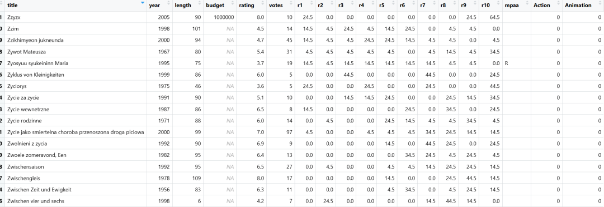

## 基本用法

需提供两个必需参数：

- 第一个参数应为包含分组的数据框；

- 第二个参数需指定一个列表，其中包含表示分组归属的列名。

&nbsp;

- `name`（用于指定交集矩阵的 `xlab()` 标签）

- `width_ratio`（用于指定集合大小面板应占的空间比例）

```r
genres
upset(movies, # 包含分组的数据框
      genres, # 指定一个列表，其中包含表示分组归属的列名
      name='genre',  # x坐标轴名字
      width_ratio=0.1)
```

显示每种类型的电影总数和特定类型组合的电影数量

- Action：动作片的数量

- Animation：动画片的数量

- Comedy：喜剧片的数量

- Drama：剧情片的数量

- Documentary：纪录片的数量

- Romance：爱情片的数量

- Short：短片的数量

可以根据实际图形观察：

- 哪些类型经常一起出现？

- 哪些类型组合的电影数量最多？

- 有没有类型很少与其他类型组合？

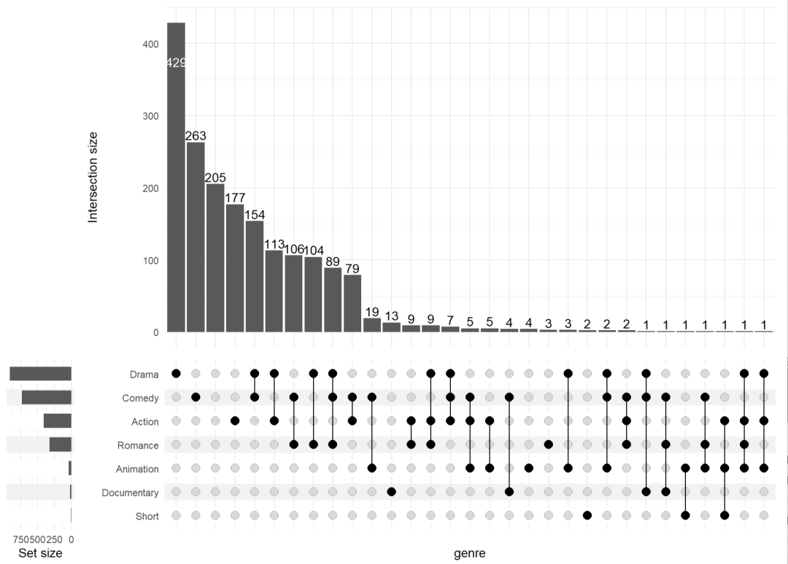

## 添加组件

可以添加 使用条形图来展示分类变量比例的差异：

```r
p <- ggplot(mapping=aes(fill=mpaa)) +
  geom_bar(stat='count', position='fill') +
  scale_y_continuous(labels=scales::percent_format()) +
  scale_fill_manual(values=c( 'R'='#E41A1C', 'PG'='#377EB8','PG-13'='#4DAF4A', 'NC-17'='#FF7F00')) +
  ylab('MPAA Rating')
p

upset(
  movies,
  genres,
  annotations = list( 'MPAA Rating'=p ), # 添加的堆积柱状图
  width_ratio=0.1
)
```

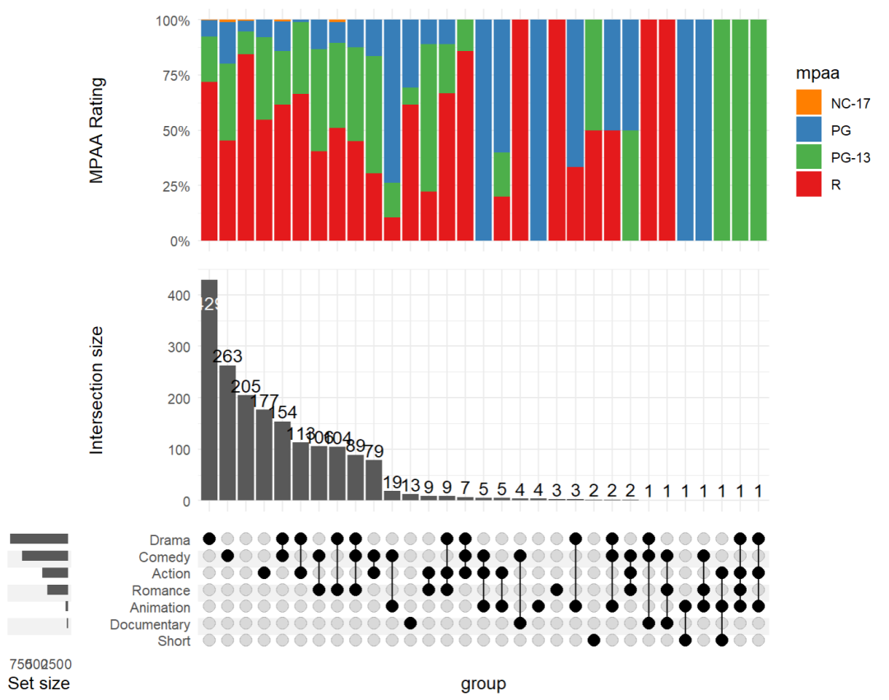

## 上半部分柱子相关调整

### 不显示数字

```r
upset(
  movies,
  genres,
  base_annotations=list( 'Intersection size'=intersection_size(counts=FALSE) ),
  min_size=10,
  width_ratio=0.1
)
```

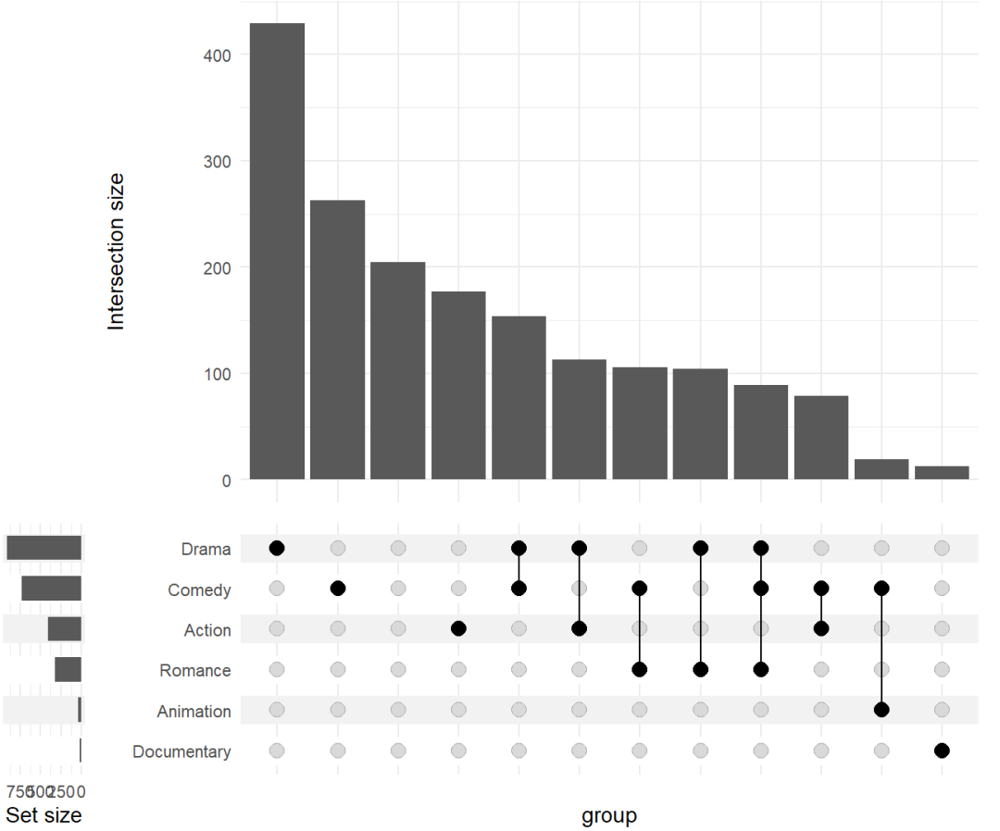

### 设置数字的颜色

```r
upset(
  movies,
  genres,
  base_annotations=list( 'Intersection size'=intersection_size( text_colors=c( on_background='brown', on_bar='yellow' ) )
    + annotate(
      geom='text', x=Inf, y=Inf, label=paste('Total:', nrow(movies)), vjust=1, hjust=1 ) # 右上角添加总数
    + ylab('Intersection size') # y轴标题
  ),
  min_size=10,
  width_ratio=0.1
)
```

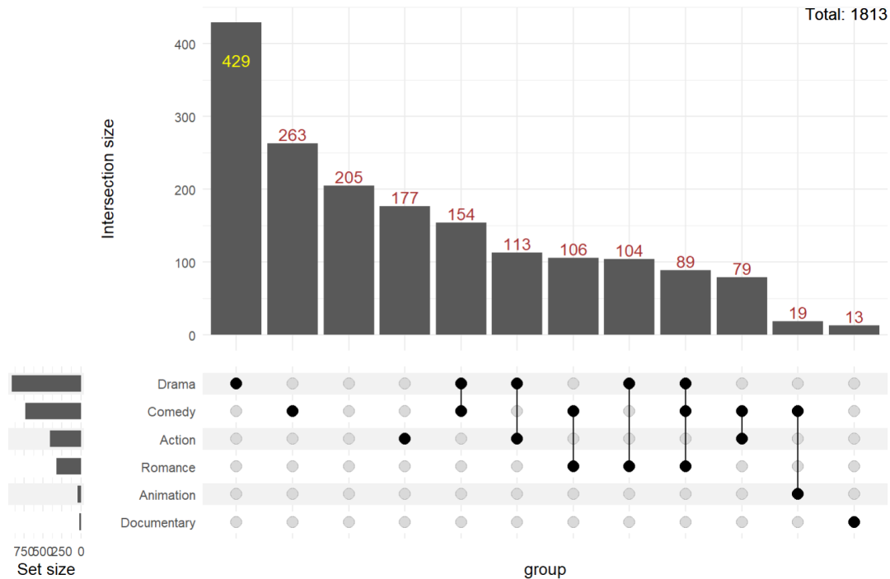

### 改变柱子的填充色

```r
# 默认配色
upset(
  movies,
  genres,
  base_annotations=list('Intersection size'=intersection_size( counts=FALSE, mapping=aes(fill=mpaa)) ), # 按照mpaa填充
  width_ratio=0.1
)
# 修改配色
upset(
  movies,
  genres,
  base_annotations=list(
    'Intersection size'=intersection_size( counts=FALSE, mapping=aes(fill=mpaa)) +  # 按照mpaa填充
     scale_fill_manual(values=c('R'='#E41A1C', 'PG'='#377EB8','PG-13'='#4DAF4A', 'NC-17'='#FF7F00'))
  ),
  width_ratio=0.1
)
```

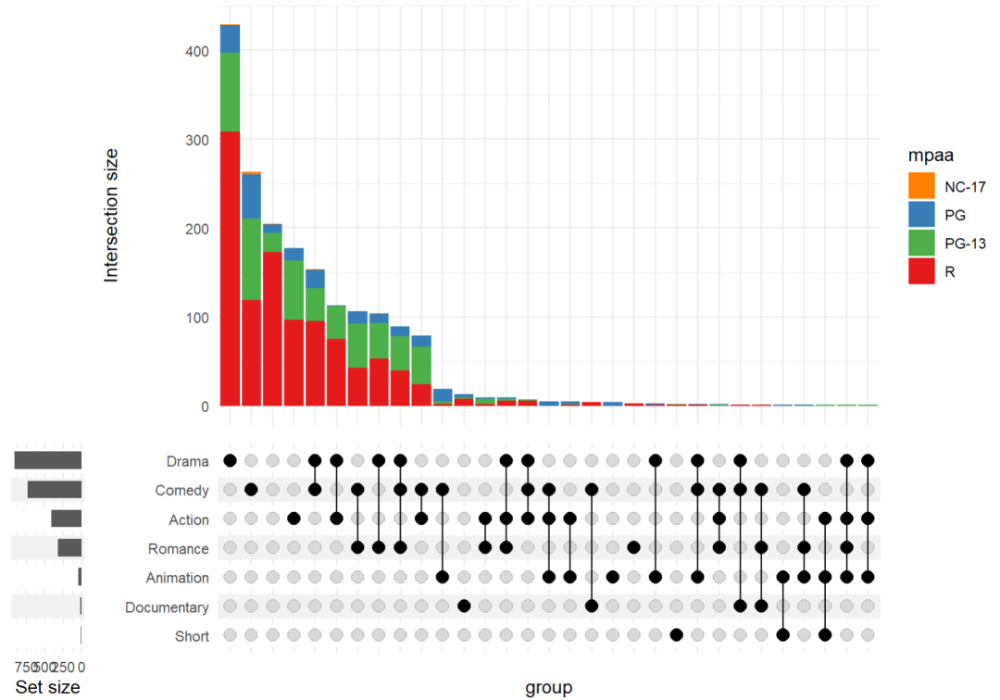

### 调整上方柱子的高度

height_ratio=0.6, \# 设置高度 ，这个值是一个相比对，值越大，下方的点矩阵越高，值越小，上面的柱子越高。

```r
upset(
  movies,
  genres,
  height_ratio=0.6, # 设置高度
  width_ratio=0.1
)
```

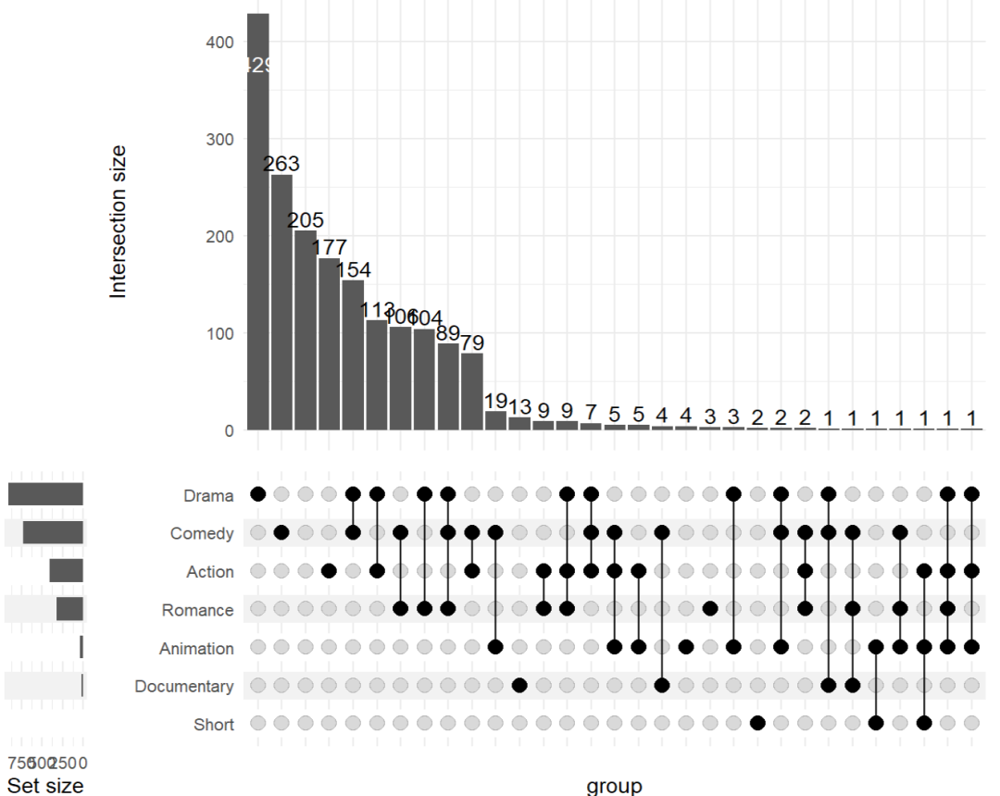

### 只显示交集矩阵

```r
upset(
  movies,
  genres,
  base_annotations=list(), # 只显示下面的交集矩阵
  min_size=10,
  width_ratio=0.1
)
```

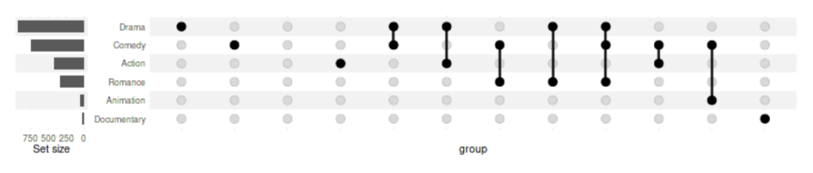

## 左边的柱子修改

### 坐标柱子显示数字

```r
upset(
  movies, genres,
  min_size=10,
  width_ratio=0.3,
  encode_sets=FALSE,  # for annotate() to select the set by name disable encoding
  set_sizes=(
    upset_set_size()
    + geom_text(aes(label=..count..), hjust=1.1, stat='count')
    # you can also add annotations on top of bars:
    + annotate(geom='text', label='@', x='Drama', y=850, color='white', size=3)
    + expand_limits(y=1100)
    + theme(axis.text.x=element_text(angle=90))
  )
)
```

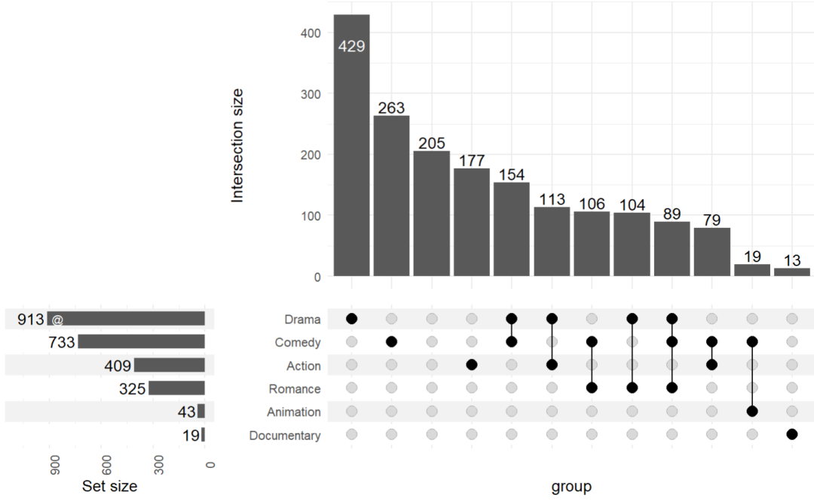

### 调整柱子位置以及修改颜色

```r
upset(
  movies, genres,
  min_size=10,
  width_ratio=0.3,
  set_sizes=(upset_set_size(geom=geom_bar(aes(fill=mpaa, x=group),width=0.8),position='right')),
  # moves legends over the set sizes
  guides='over'
)
```

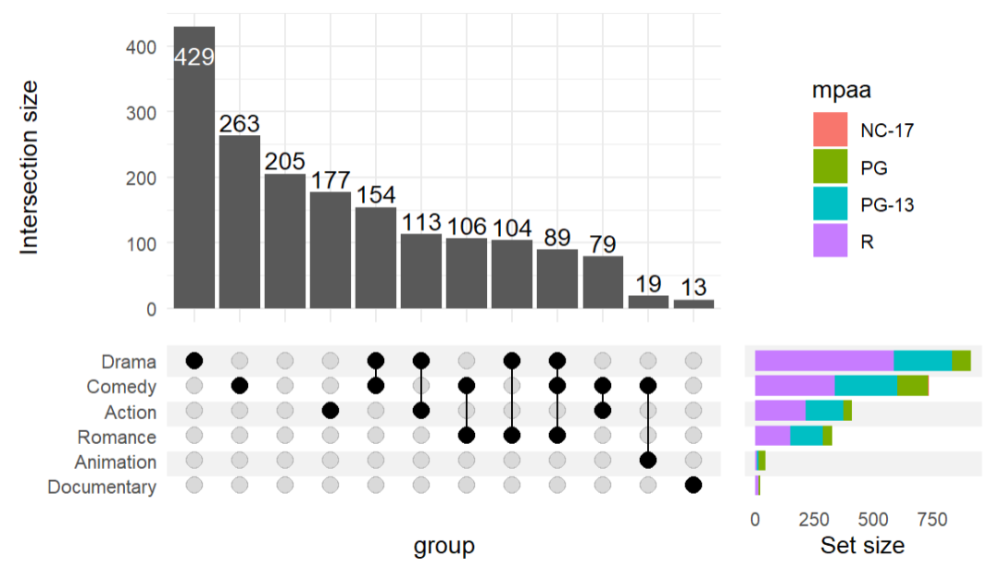

### 隐藏左边的柱子

设置 set_sizes=FALSE 即可：

```r
upset(
    movies, genres,
    min_size=10,
    set_sizes=FALSE
)
```

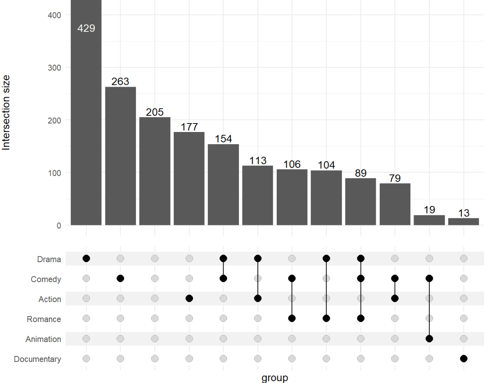

## 高亮某一部分：queries

这部分是我最感兴趣的。来看看！

使用 `upset_query()` 工具生成的列表列表传递给可选的 `queries` 参数，以选择性修改特定交集或集合的美学属性。

使用 `set` 或 `intersect` 参数中的一个（不能同时使用）来指定要高亮的内容：

- `set` 将高亮集合大小面板中的条形图，

- `intersect` 将高亮某个交集在所有组件上（默认情况下），或通过 `only_components` 参数选择的组件上

#### 第一个查询：高亮 "Drama + Comedy" 组合：红色部分

#### 第二个查询：高亮 "Drama" 类：蓝色部分

#### 第三个查询：高亮 "Romance + Comedy" 的统计信息：黄色部分

```r
upset(
  movies, genres, name='genre', width_ratio=0.1, min_size=10,
  annotations = list(
    'Length'=list(
      aes=aes(x=intersection, y=length),
      geom=geom_boxplot(na.rm=TRUE)
    )
  ),
  queries=list(
    upset_query(
      intersect=c('Drama', 'Comedy'),
      color='red',
      fill='red',
      only_components=c('intersections_matrix', 'Intersection size')
    ),
    upset_query(
      set='Drama',
      fill='blue'
    ),
    upset_query(
      intersect=c('Romance', 'Comedy'),
      fill='yellow',
      only_components=c('Length')
    )
  )
)
```

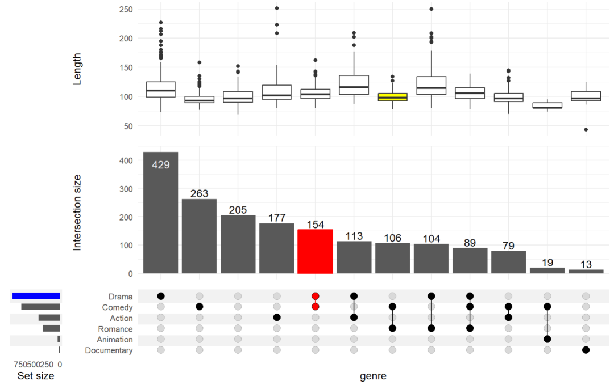

分析动作片(Action)、喜剧片(Comedy)、剧情片(Drama) 三种类型关系的 UpSet 图：

分别设置三个部分的颜色：

```r
upset(
  movies, c("Action", "Comedy", "Drama"),
  width_ratio=0.2,
  group_by='sets',
  queries=list(
    # 1. 高亮 "Drama + Comedy" 组合（红色）
    upset_query(
      intersect=c('Drama', 'Comedy'),
      color='red',
      fill='red',
      only_components=c('intersections_matrix', 'Intersection size')
    ),
    # 2-4. 按组着色（在交集矩阵中）
    upset_query(group='Drama', color='blue'),
    upset_query(group='Comedy', color='orange'),
    upset_query(group='Action', color='purple'),
    # 5-7. 集合大小面板着色
    upset_query(set='Drama', fill='blue'),
    upset_query(set='Comedy', fill='orange'),
    upset_query(set='Action', fill='purple')
  )
)
```

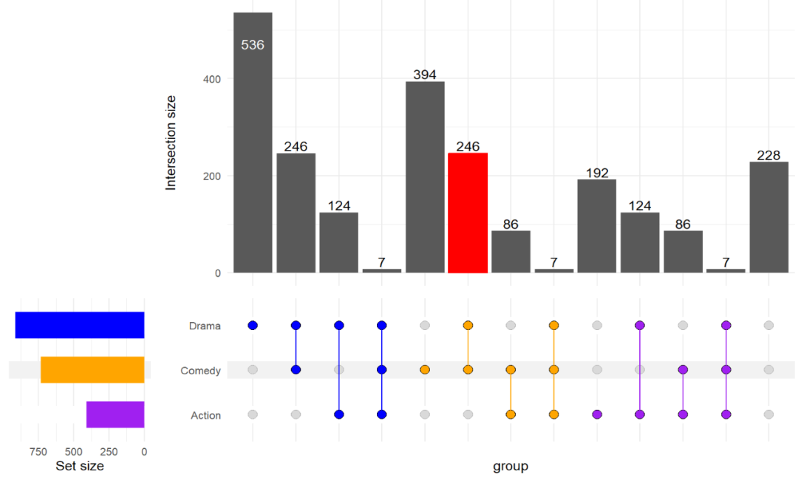

还有更多细节可以去看看官方文档，今天分享到这~

转发：

- [生信入门&数据挖掘线上直播课12月班](https://mp.weixin.qq.com/s?__biz=MzAxMDkxODM1Ng%3D%3D&mid=2247547012&idx=1&sn=f55923d9a6d9e04c3e923c2a3cae6e56#wechat_redirect)，你的生物信息学入门课

- [时隔5年，我们的生信技能树VIP学徒继续招生啦](https://mp.weixin.qq.com/s?__biz=MzAxMDkxODM1Ng%3D%3D&mid=2247525079&idx=1&sn=0b997af16a58195b4192691373048fd5#wechat_redirect)

- [满足你生信分析计算需求的低价解决方案](https://mp.weixin.qq.com/s?__biz=MzUzMTEwODk0Ng%3D%3D&mid=2247530048&idx=1&sn=28aa7bbd5e00521f79e074496a5f5d66#wechat_redirect)

- [生信故事会](https://mp.weixin.qq.com/mp/appmsgalbum?__biz=MzAxMDkxODM1Ng%3D%3D&action=getalbum&album_id=1679199708449144836#wechat_redirect)，来看看他们的生信入门故事

- [生信马拉松答疑专辑](https://mp.weixin.qq.com/mp/appmsgalbum?__biz=MzAxMDkxODM1Ng%3D%3D&action=getalbum&album_id=3690970204957147140#wechat_redirect)，获取你的生信专属答疑

<!-- wechat-article-fetcher: complete -->
