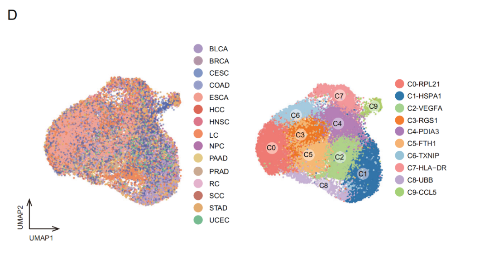
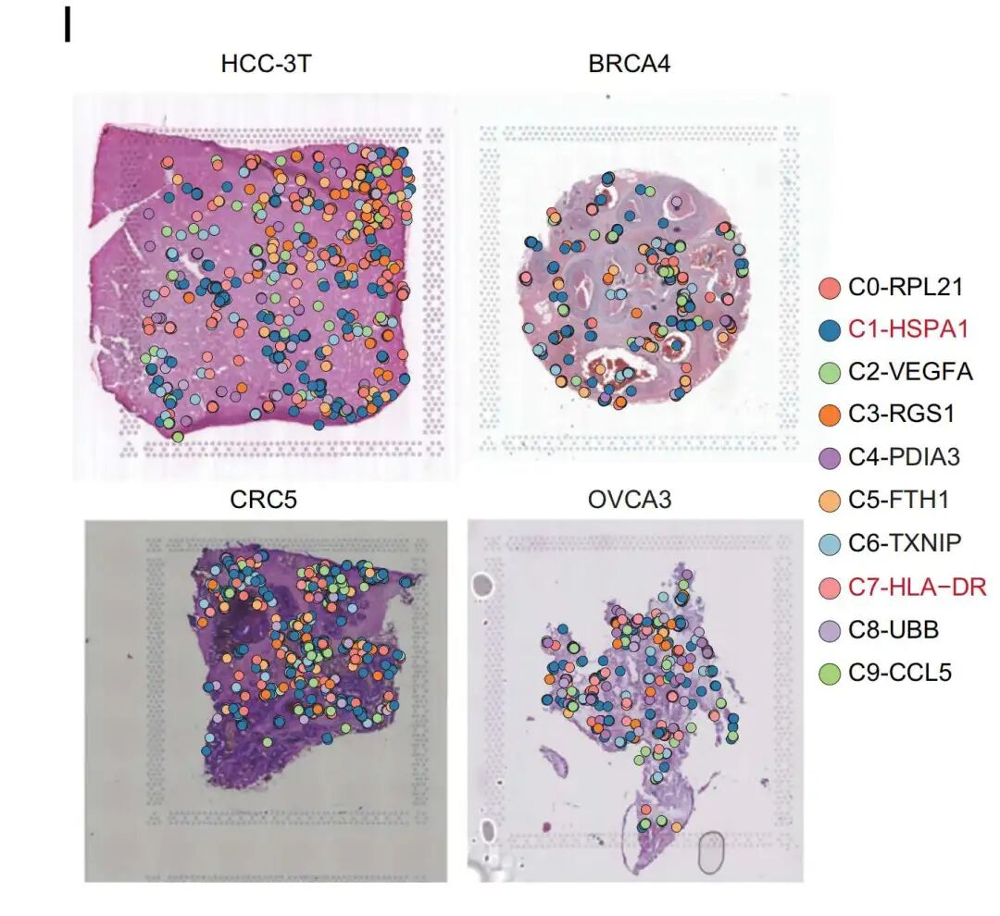
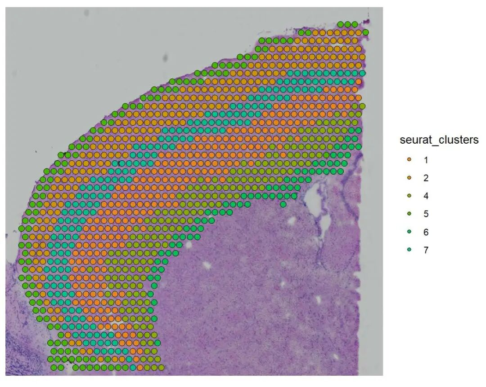
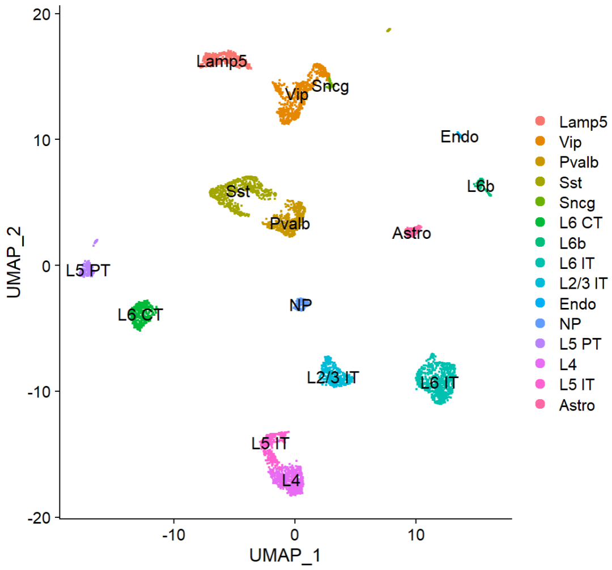
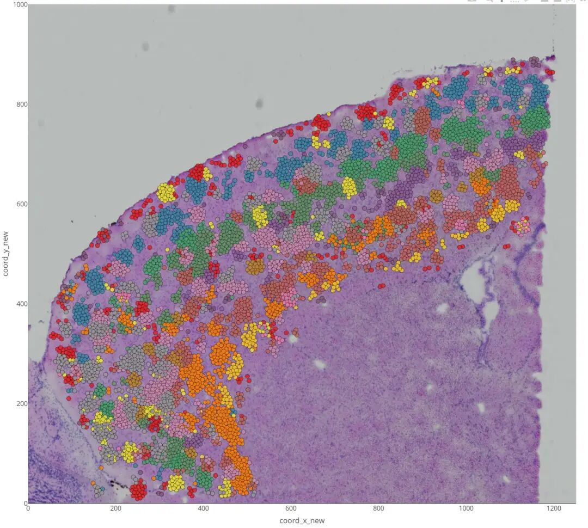

# 单细胞亚群在空间HE切片中的定位可视化图绘制

- 专辑：绘图小技巧2025
- 公众号：生信技能树
- 发布时间：2025-12-08 22:23
- 原文：[微信公众平台](https://mp.weixin.qq.com/s?__biz=MzAxMDkxODM1Ng%3D%3D&mid=2247547499&idx=1&sn=c1c7fd90c2f4078aeb8fc8d0834992b2&chksm=9b4b7ad0ac3cf3c69b4ccb154fb3014a694debd141e1cda06b2c0ab6fee8e36588a57de6f8fe)

---
> 今天学习一篇于2025年10月10号发表在Oncogene杂志的文献，标题为《Comprehensive single-cell analysis reveals mast cells’ roles in cancer immunity》。文献中有一个细胞亚群在空转HE切片中的共定位分析图我比较感兴趣，来学习一下吧~

图如下：这幅图利用 CellTrek 技术进行癌细胞样本中肥大细胞的空间定位分析。

**方法描述：**

为了获取细胞的空间坐标信息，使用 CellTrek（v0.0.94版）R软件包并采用其默认参数。该工具通过机器学习方法整合单细胞数据与空间转录组数据，能够将单个细胞直接映射回其在组织切片中的原始空间位置，并采用`run_kdist`函数计算了不同细胞类型之间的空间k距离。

**结果描述：**

收集了来自**264名患者**的**37,462个肥大细胞**，涵盖**15种不同的癌症类型**。样本来源包括肿瘤组织、转移病灶、癌旁正常组织、血液以及淋巴结（图1C）。通过单细胞RNA测序技术，共鉴定出**10个具有不同转录特征的肥大细胞亚群**，分别命名为：C0-RPL21、C1-HSPA1、C2-VEGFA、C3-RGS1、C4-PDIA3、C5-FTH1、C6-TXNIP、C7-HLA-DR、C8-UBB和C9-CCL5（图1D–F及S1D, E；附表S2）。这些发现凸显了肥大细胞的异质性，并初步描绘了其在不同肿瘤微环境中的分布图谱。



为了探究肥大细胞亚群在空间肿瘤微环境中的组织结构，将其细胞亚群注释信息整合到 CellTrek 对象中（图3I，表S4）。研究发现，C1-HSPA1 和 C7-HLA-DR 亚群普遍浸润于恶性肿瘤区域，而 C9-CCL5 亚群则分布在远离肿瘤细胞的位置。这一观察结果表明，肥大细胞的功能状态与其在肿瘤微环境中的空间定位密切相关（图3J）。



图注：

> Fig. 3 Spatial and tissue distribution heterogeneity of mast cells.

先来简单学习一下这个方法~

## CellTrek分析

CellTrek 是一种基于 scRNA-seq 与空间转录组（ST）数据、能将单细胞直接映射回组织切片空间坐标的计算框架。该方法的逻辑与空间转录组解卷积技术不同，为结合空间拓扑结构研究单细胞数据提供了更灵活直接的范式。CellTrek 工具包还包含两个下游分析模块：用于空间共定位分析的 SColoc 模块与用于空间共表达分析的 SCoexp 模块。

跑一下代码看看。

软件发表的文献：https://pmc.ncbi.nlm.nih.gov/articles/PMC9673606/

软件地址：https://github.com/navinlabcode/CellTrek

### 包安装

这里经过尝试分析，需要安装指定版本的  Seurat to version 4.3.0 和 SeuratObject to version 4.1.4, it works。代码如下：

```r
rm(list=ls())
if(F) {
## 使用西湖大学的 Bioconductor镜像
  options(BioC_mirror="https://mirrors.westlake.edu.cn/bioconductor")
  options("repos"=c(CRAN="https://mirrors.westlake.edu.cn/CRAN/"))
# https://github.com/navinlabcode/CellTrek/issues/36
# I have been running fine with SeuratObject_4.1.4 / Seurat_4.4.0
# SeuratObject_4.1.3 / Seurat_4.3.0 should also work as mentionned
# download link is https://github.com/satijalab/seurat-object/archive/refs/tags/v4.1.4.tar.gz
# 关闭已加载的扩展包可以用detach(),如
  library(Seurat)
  library(SeuratObject)
  detach("package:SeuratObject")
  detach("package:Seurat")
# remotes::install_version("SeuratObject", "4.1.4", repos = c("https://satijalab.r-universe.dev", getOption("repos")))
  devtools::install_local("CellTrek/seurat-object-4.1.4/")
  packageVersion("SeuratObject")
# remotes::install_version("Seurat", "4.3.0", repos = c("https://satijalab.r-universe.dev", getOption("repos")))
  devtools::install_local("CellTrek/seurat-release-4.3.0.zip")
  packageVersion("Seurat")
}

options(stringsAsFactors = F)
library("CellTrek")
library("dplyr")
library("Seurat")
library("viridis")
# BiocManager::install("ConsensusClusterPlus")
library("ConsensusClusterPlus")
packageVersion("Seurat")
```

如果是版本seurat v5，就会报下面的错误：

报错1：

```r
Finding transfer anchors...
Using 2000 features for integration...
Running CCA
Merging objects
错误于validObject(object = value):
  类别为“VisiumV1”的对象无效: slots in class definition but not in object: "misc"
此外: 警告信息:
Command ScaleData.RNA changing from SeuratCommand to SeuratCommand
收捲时出错: 没有名称为"misc"的插槽对于此对象类 "VisiumV1"
Error: no more error handlers available (recursive errors?); invoking 'abort' restart
```

解决方法：

```r
# https://github.com/satijalab/seurat/issues/9573
brain_st_cortex <- UpdateSeuratObject(brain_st_cortex)
```

报错2：

```r
Finding transfer anchors...
Using 2000 features for integration...
Running CCA
Merging objects
Finding neighborhoods
Finding anchors
 Found 3730 anchors
Data transfering...
Finding integration vectors
Finding integration vector weights
0%   10   20   30   40   50   60   70   80   90   100%
[----|----|----|----|----|----|----|----|----|----|
**************************************************|
Transfering 2000 features onto reference data
Creating new Seurat object...
警告: Data is of class data.frame. Coercing to dgCMatrix.
错误于CellTrek::traint(st_data = brain_st_cortex, sc_data = brain_sc, :
  没有名称为"counts"的插槽对于此对象类 "Assay5"
此外: 警告信息:
1: Command ScaleData.RNA changing from SeuratCommand to SeuratCommand
2: Adding image data that isn't associated with any assays
3: The `slot` argument of `GetAssayData()` is deprecated as of SeuratObject 5.0.0.
ℹ Please use the `layer` argument instead.
ℹ The deprecated feature was likely used in the CellTrek package.
  Please report the issue to the authors.
This warning is displayed once every 8 hours.
Call `lifecycle::last_lifecycle_warnings()` to see where this warning was generated.
```

解决方法1：https://github.com/navinlabcode/CellTrek/issues/39\#issue-2058604923

解决方法2：用里面的函数 https://github.com/navinlabcode/CellTrek/issues/36

只能解决能够重新修改的那几个函数，其他的分析还是会报错。

所以我有索性单独开了一个R环境，专门装了上面两个版本的包，suerat v5版本做其他日常分析使用。

**还有一点不太好的地方：这个软件已经很久没有人维护了。**

### 示例数据

作者给的两个示例数据如下：

单细胞下载链接：https://www.dropbox.com/s/ruseq3necn176c7/brain_sc.rds?dl=0

空转下载链接：https://www.dropbox.com/s/azjysbt7lbpmbew/brain_st_cortex.rds?dl=0

读取进来简单处理：

```r
## 1.读取数据----
# 空转数据
brain_st_cortex <- readRDS("data/brain_st_cortex.rds")
brain_st_cortex
head(Cells(brain_st_cortex))
head(brain_st_cortex@meta.data)
Idents(brain_st_cortex)
## 为细胞/位点设置符合语法规范的名称,细胞名中的-改成.
brain_st_cortex <- RenameCells(brain_st_cortex, new.names=make.names(Cells(brain_st_cortex)))
## Visualize the ST data
SpatialDimPlot(brain_st_cortex,pt.size.factor = 1.8,group.by = "seurat_clusters")
DefaultAssay(brain_st_cortex)
# brain_st_cortex <- UpdateSeuratObject(brain_st_cortex)

# 单细胞数据
brain_sc <- readRDS("data/brain_sc.rds")
brain_sc
head(brain_sc@meta.data)
brain_sc <- RenameCells(brain_sc, new.names=make.names(Cells(brain_sc)))
## Visualize the scRNA-seq data
DimPlot(brain_sc, label = T, label.size = 4.5)
```

空转：



单细胞：



### 使用CellTrek进行细胞图谱构建

我们首先使用 traint 方法对空间转录组与单细胞RNA测序数据集进行联合嵌入：

```r
## 2.使用CellTrek进行细胞图谱构建----
brain_traint <- traint(st_data=brain_st_cortex,
                       sc_data=brain_sc,
                       sc_assay='RNA',
                       cell_names='cell_type'# 单细胞数据注释label
                      )
brain_traint

## We can check the co-embedding result to see if there is overlap between these two data modalities
DimPlot(brain_traint, group.by = "type")

# After coembedding, we can chart single cells to their spatial locations.
# Here, we use the non-linear interpolation (intp = T, intp_lin=F) approach to augment the ST spots.
brain_celltrek <- celltrek(st_sc_int=brain_traint, int_assay='traint',
                           sc_data=brain_sc, sc_assay = 'RNA',
                           reduction='pca',
                           intp=T, intp_pnt=5000, intp_lin=F,
                           nPCs=30, ntree=1000,
                           dist_thresh=0.55, top_spot=5, spot_n=5,
                           repel_r=20, repel_iter=20, keep_model=T)$celltrek

## 3.可视化结果----
# 交互式可视化
unique(brain_celltrek$cell_type)
brain_celltrek$cell_type <- factor(brain_celltrek$cell_type, levels=sort(unique(brain_celltrek$cell_type)))

df <- brain_celltrek@meta.data %>%
  dplyr::select(coord_x, coord_y, cell_type:id_new)
head(df)
brain_celltrek@images$anterior1@image
brain_celltrek@images$anterior1@scale.factors$lowres

CellTrek::celltrek_vis(df, brain_celltrek@images$anterior1@image, brain_celltrek@images$anterior1@scale.factors$lowres)
```

结果如下：



上面文献中的图，数据处理中~

今天分享到这~

友情转发：

- [生信入门&数据挖掘线上直播课12月班](https://mp.weixin.qq.com/s?__biz=MzAxMDkxODM1Ng%3D%3D&mid=2247547012&idx=1&sn=f55923d9a6d9e04c3e923c2a3cae6e56#wechat_redirect)，你的生物信息学入门课

- [时隔5年，我们的生信技能树VIP学徒继续招生啦](https://mp.weixin.qq.com/s?__biz=MzAxMDkxODM1Ng%3D%3D&mid=2247525079&idx=1&sn=0b997af16a58195b4192691373048fd5#wechat_redirect)

- [满足你生信分析计算需求的低价解决方案](https://mp.weixin.qq.com/s?__biz=MzUzMTEwODk0Ng%3D%3D&mid=2247530048&idx=1&sn=28aa7bbd5e00521f79e074496a5f5d66#wechat_redirect)

- [生信故事会](https://mp.weixin.qq.com/mp/appmsgalbum?__biz=MzAxMDkxODM1Ng%3D%3D&action=getalbum&album_id=1679199708449144836#wechat_redirect)，来看看他们的生信入门故事

- [生信马拉松答疑专辑](https://mp.weixin.qq.com/mp/appmsgalbum?__biz=MzAxMDkxODM1Ng%3D%3D&action=getalbum&album_id=3690970204957147140#wechat_redirect)，获取你的生信专属答疑

<!-- wechat-article-fetcher: complete -->
