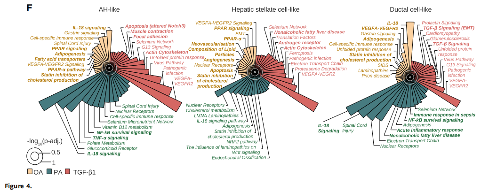
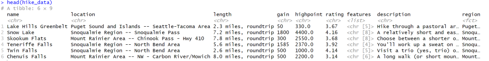
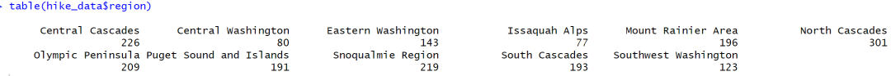
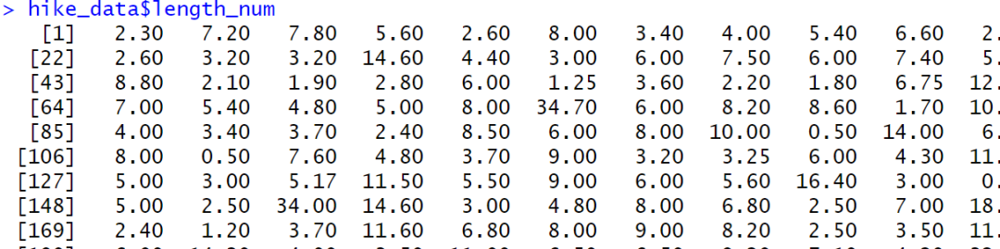
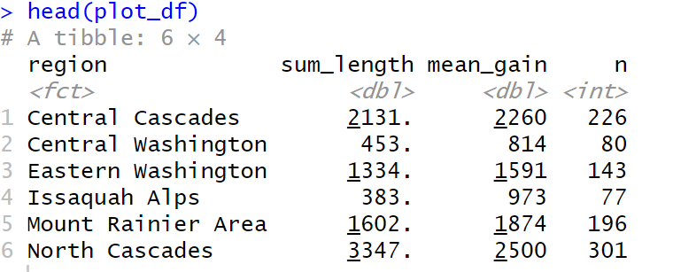
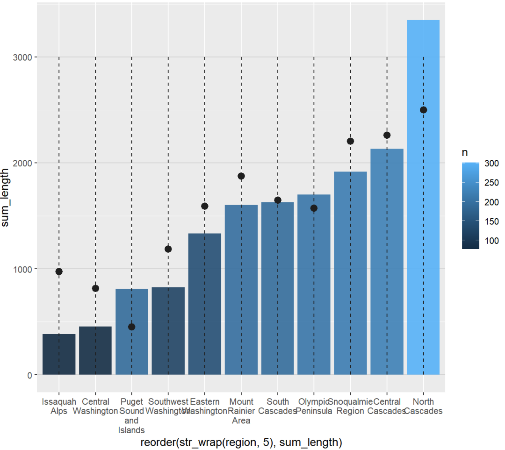
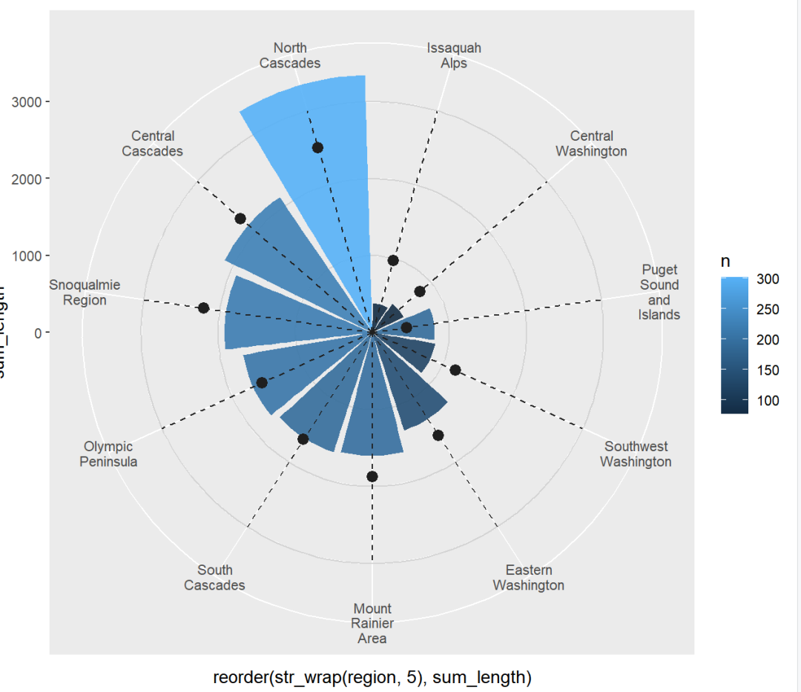
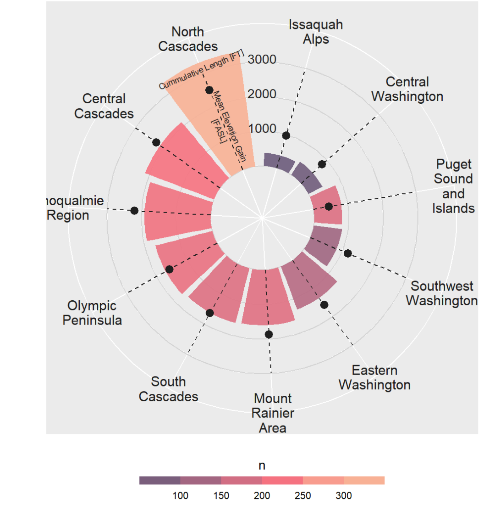

# 万里挑一的功能富集结果玫瑰图

- 专辑：绘图小技巧2025
- 公众号：生信技能树
- 发布时间：2025-12-02 23:08
- 原文：[微信公众平台](https://mp.weixin.qq.com/s?__biz=MzAxMDkxODM1Ng%3D%3D&mid=2247547373&idx=1&sn=9ebdbc10014f781ede38d472897782ad&chksm=9b4b7956ac3cf040bd73339928dc5b5f722ae4c9672f36f99a1a29edb4d5b2237aa757b4aaff)

---
这篇文献《Single-cell transcriptomics stratifies organoid models of metabolic dysfunction-associated steatotic liver disease》中有一个非常好看的功能富集结果的玫瑰图。

原图如下，展示了不同处理条件下不同细胞亚群的 cell-type-resolved pathway analysis的Top enriched WikiPathways 功能富集结果。

处理条件为：**TGF-β1、OA（油酸Oleic acid）、PA（棕榈酸palmitic acid）**

细胞类型为：AH, adult hepatocyte，hepatic stellate cell， DC, ductal cell-like

**此图主要涉及的点有：多亚群同时展示，配色雅致，通路标签不重叠，条形旋转，有两个阈值白色线圈**



先来学一下基础的barplot旋转图，我找了一个资源，开干！

> R代码：https://r-graph-gallery.com/web-circular-barplot-with-R-and-ggplot2.html

## 加载并准备数据

这里以可视化华盛顿州多个徒步地点的特征数据。

使用的数据集发布于2020年11月24日当周的 TidyTuesday 活动。您可以在 https://xn--yfrp2mj0jt4h0kdd64f/ 找到原始公告及更多数据信息。

数据下载链接：https://github.com/rfordatascience/tidytuesday/raw/main/data/2020/2020-11-24/hike_data.rds

### 1.加载数据集：

现在，让我们开始加载数据集：

```r
rm(list=ls())
library(dplyr)
library(ggplot2)
library(stringr)

hike_data <- readRDS('hike_data.rds')
head(hike_data)
dim(hike_data)
```



### 2.得到region信息

从location列中提取区域信息。该信息由“--”符号前的文本给出。

```r
# 得到region
hike_data$location
hike_data$region <- as.factor(word(hike_data$location, 1, sep = " -- "))
hike_data$region
table(hike_data$region)
```



### 3.提取 **miles**的数量

```r
# 得到miles
hike_data$length
hike_data$length_num <- as.numeric(sapply(strsplit(hike_data$length, " "), "[[", 1))
hike_data$length_num
range(hike_data$length_num)
```



### 4.计算每个区域的指标

最后，计算每个区域的累计路线长度和平均海拔增益，同时记录每个区域包含的路线数量。

```r
# 计算每个区域的指标
plot_df <- hike_data %>%
  group_by(region) %>%
  summarise(
    sum_length = sum(length_num),
    mean_gain = mean(as.numeric(gain)),
    n = n()
  ) %>%
  mutate(mean_gain = round(mean_gain, digits = 0))
head(plot_df)
```



## 基本radar图

在ggplot2中将图表从笛卡尔坐标系转换为环形（极）坐标系非常简单，只需在绘图代码中添加`coord_polar()`函数即可。

绘制：各地区平均海拔增益的棒棒糖杆（基础柱形）

```r
### 绘图
plt <- ggplot(plot_df) +
# Make custom panel grid
  geom_hline(aes(yintercept = y), data.frame(y = c(0:3) * 1000),color = "lightgrey" ) +
# Add bars to represent the cumulative track lengths
# str_wrap(region, 5) 每行最多5个字符
  geom_col( aes( x = reorder(str_wrap(region, 5), sum_length), y = sum_length, fill = n),
    position = "dodge2", show.legend = TRUE, alpha = .9 ) +
# Add dots to represent the mean gain
  geom_point( aes( x = reorder(str_wrap(region, 5),sum_length), y = mean_gain), size = 3, color = "gray12" ) +
  geom_segment(aes(x = reorder(str_wrap(region, 5), sum_length), y = 0,
                   xend = reorder(str_wrap(region, 5), sum_length), yend = 3000), linetype = "dashed", color = "gray12" )
plt
```

x轴线为区域，Y轴为 累计路线长度：



**掰弯：**

```r
# 掰弯极坐标
p1 <- plt +
  coord_polar()
p1
```



## 添加标注和图例

上图柱形的高度代表什么并不清晰。虽然有一些垂直刻度标记，但它们显然没有放在正确的位置。此外，颜色代表什么含义？让我们来改进这一点！

```r
## 优化
p2 <- p1 +
# 为柱形和棒棒糖图添加标注
  annotate(x = 11, y = 1300,label = "Mean Elevation Gain
[FASL]", geom = "text",angle = -67.5,color = "gray12",size = 2.5,family = "Bell MT" ) +
  annotate(x = 11, y = 3150,label = "Cummulative Length [FT]",geom = "text",angle = 23, color = "gray12",size = 2.5,family = "Bell MT") +
# 在图表内部添加自定义比例尺标注
  annotate(x = 11.7, y = 1100, label = "1000", geom = "text", color = "gray12", family = "Bell MT" ) +
  annotate(x = 11.7, y = 2100, label = "2000", geom = "text", color = "gray12", family = "Bell MT") +
  annotate(x = 11.7, y =3100, label = "3000",  geom = "text", color = "gray12", family = "Bell MT") +
# 调整Y轴尺度，避免柱形从中心点开始
  scale_y_continuous( limits = c(-1500, 3500),expand = c(0, 0), breaks = c(0, 1000, 2000, 3000) ) +
# 为各地区路线数量设置新的填充色和图例标题
  scale_fill_gradientn( colours = c( "#6C5B7B","#C06C84","#F67280","#F8B195")) + # "Amount of Tracks"
# 将填充色的图例设置为离散型
  guides( fill = guide_colorsteps(
      barwidth = 15, barheight = .5, title.position = "top", title.hjust = .5 )
      ) +
  theme(
    axis.title = element_blank(),
    axis.ticks = element_blank(),
    axis.text.y = element_blank(),
    axis.text.x = element_text(color = "gray12", size = 12),
    legend.position = "bottom",
  )
p2
```



完美！跟文献里面那个很接近了，下次就画它！

友情转发：

- [生信入门&数据挖掘线上直播课12月班](https://mp.weixin.qq.com/s?__biz=MzAxMDkxODM1Ng%3D%3D&mid=2247547012&idx=1&sn=f55923d9a6d9e04c3e923c2a3cae6e56#wechat_redirect)，你的生物信息学入门课

- [时隔5年，我们的生信技能树VIP学徒继续招生啦](https://mp.weixin.qq.com/s?__biz=MzAxMDkxODM1Ng%3D%3D&mid=2247525079&idx=1&sn=0b997af16a58195b4192691373048fd5#wechat_redirect)

- [满足你生信分析计算需求的低价解决方案](https://mp.weixin.qq.com/s?__biz=MzUzMTEwODk0Ng%3D%3D&mid=2247530048&idx=1&sn=28aa7bbd5e00521f79e074496a5f5d66#wechat_redirect)

- [生信故事会](https://mp.weixin.qq.com/mp/appmsgalbum?__biz=MzAxMDkxODM1Ng%3D%3D&action=getalbum&album_id=1679199708449144836#wechat_redirect)，来看看他们的生信入门故事

- [生信马拉松答疑专辑](https://mp.weixin.qq.com/mp/appmsgalbum?__biz=MzAxMDkxODM1Ng%3D%3D&action=getalbum&album_id=3690970204957147140#wechat_redirect)，获取你的生信专属答疑

<!-- wechat-article-fetcher: complete -->
