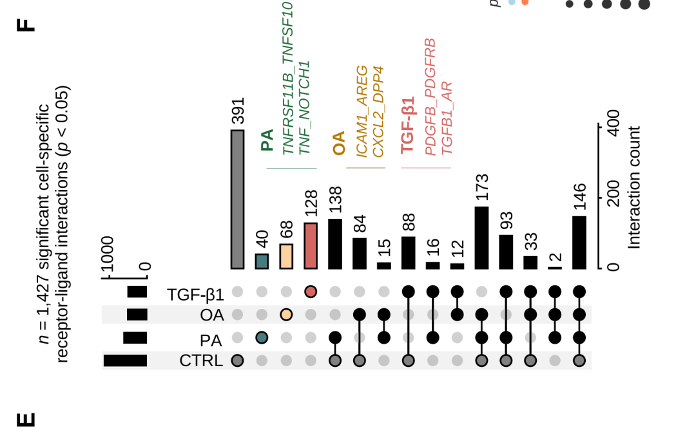
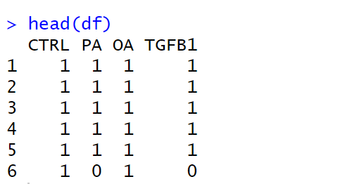
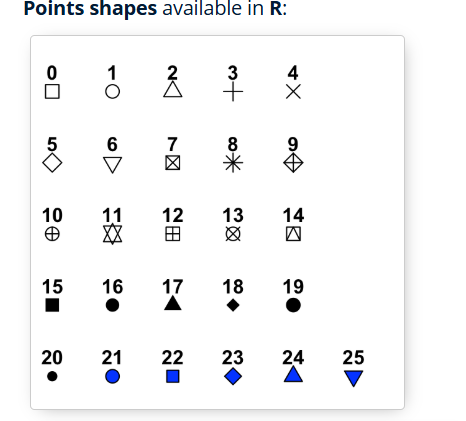
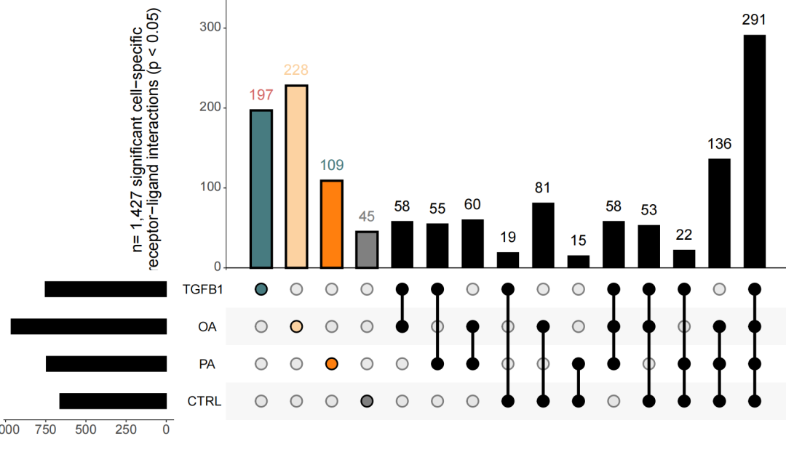

# 顶刊杂志同款高颜值UpSet图展示多组交集结果

- 专辑：绘图小技巧2025
- 公众号：生信技能树
- 发布时间：2025-12-02 16:46
- 原文：[微信公众平台](https://mp.weixin.qq.com/s?__biz=MzAxMDkxODM1Ng%3D%3D&mid=2247547354&idx=1&sn=44a95c22402e85294278df0d4963ca60&chksm=9b4b7961ac3cf077e6740df604e5cf4d8f28d211f9ce68716557b33d83ba8541c8667d63ab0f)

---
> 今天来学习之前珍藏了很久的一篇文献，里面有很多好看的图。文献与2023年12月11号发表在 EMBO J.  杂志上，标题为《Single-cell transcriptomics stratifies organoid models of metabolic dysfunction-associated steatotic liver disease》。

**UpSet 图展示了经 OA、PA、TGF-β1处理和对照组的HLOs中，具有显著性（P值 \< 0.05）的细胞类型特异性受体-配体相互作用的交集与独有数量。**图中展示了各类处理条件下含有独有相互作用的受体-配体对类别示例。数据包含1,427对显著的细胞-细胞配对特异性受体-配体相互作用，每种处理条件下设置2个重复样本，并包含6个对照组样本。

**核心要点：**

1.  通过UpSet图可视化四种处理条件下受体-配体相互作用的共性与独有特征；

2.  重点展示各处理组特有的受体-配体互作模式；

3.  研究基于1,427对显著性相互作用，采用重复实验设计进行验证。



图注：

> Figure 5. OA induces an interactome distinct from crosstalk observed with TGF-β1 and PA treatment.
>
> UpSet plot displays the numbers of intersecting and unique significant (P-value \< 0.05) cell-type-specific receptor-ligand interactions of HLOs treated with OA, PA, TGF-β1, and controls.

## 数据预处理

上面的图对应的数据在文献的附件：embj2023113898-sup-0008-datasetev7.xlsx

读取进来：

```r
rm(list=ls())
library(ggplot2)
# 加载包
library(readxl)
library(ggpubr)


# 读取特定工作表（按名称）
data <- read_excel("embj2023113898-sup-0008-datasetev7.xlsx", sheet = "Dataset_EV7")
head(data)
table(data$sample)
table(data$condition)
table(data$sample_group)
# 总共 1427对
length(unique(data$unique_interaction))

CTRL <- unique(data[data$sample_group=="CTRL", "unique_interaction"])
OA <- unique(data[data$sample_group=="OA500", "unique_interaction"])
PA <- unique(data[data$sample_group=="PA", "unique_interaction"])
TGFB1 <- unique(data[data$sample_group=="TGFB1", "unique_interaction"])


df_list <- list(CTRL=as.character(CTRL$unique_interaction),
                PA=as.character(PA$unique_interaction),
                OA=as.character(OA$unique_interaction),
                TGFB1=as.character(TGFB1$unique_interaction))
df_list
df <- fromList(df_list)
head(df)
```

这样数据就整理好了输入格式（这里的数目跟原文有点对不上，不追究了，这里的重点是怎么绘图，后面自己的项目按照这个格式输入就可以了。）：



## 开始绘图！

使用 UpSetR 绘图 这里有一个小问题，作者包里面的点 的形状写死了，是 shape = 16， 这个值不能有点的外边框和点的内部填充色设置，是个实心圆。如下：



然后upset 图上半部分的柱子边框也不能设置粗细，这里我把源码下载下来，简单的修改了一下 shape=21（你肯定也可以找到对应的修改的地方，如果不会来找我哇，微信 Biotree123）：

包地址：https://github.com/cran/UpSetR/tree/master

下载下来解压，然后修改R目录中的代码，然后安装：

```r
# 移除特定包
detach("package:UpSetR", unload = TRUE)
install.packages("UpSetR-master/",repos = NULL,type = "source")
library(UpSetR)
```

重新绘图 并保存：

```r
p <- upset(df, nsets =4, sets =c("CTRL","PA","OA","TGFB1"),
           keep.order =T, number.angles =0,
           line.size =1.5, mb.ratio =c(0.6,0.4),  # 主条形图和矩阵图的比例
           order.by =c("degree"),
           decreasing = F,

           main.bar.color = c("#d56763","#fcd2a1","#477b80","#808080",rep("#000000",11) ) , #上方y轴柱状图颜色
           matrix.color = "#000000",             # 矩阵点颜色
           sets.bar.color = "#000000",           # 集合柱状图颜色

           point.size = 5, #矩阵中交点大小

           # 只显示包含某一组的交集
           queries = list(
             list(query = intersects, params = list("CTRL"),  color = "#808080", active = TRUE),
             list(query = intersects, params = list("PA"),  color = "#ff7f0e",  active = TRUE),
             list(query = intersects, params = list("OA"),  color = "#fcd2a1",  active = TRUE),
             list(query = intersects, params = list("TGFB1"),  color = "#477b80",  active = TRUE)
             ),

           # text.scale参数说明：
           # • 第1个值：Y轴标题
           # • 第2个值：Y轴刻度标签
           # • 第3个值：X轴标题
           # • 第4个值：X轴刻度标签
           # • 第5个值：集合名字大小
           # • 第6个值：柱体s上的数字
           text.scale =c( 2, 2,1.8, 2,2,2.5),
           # 标签
           sets.x.label ="",
           mainbar.y.label ="n= 1,427 significant cell-specific
receptor-ligand interactions (p < 0.05)",

           # 边距
           set.metadata =NULL
           )
library(ggplotify)
pdf(file = "Fig5E.pdf",width = 12,height = 7)
print(p)
dev.off()
```



完美！

这个包的参数非常多，其实整体上个性化调整不是很好搞，做成这样再去AI大法好微调吧。

友情转发：

- [生信入门&数据挖掘线上直播课12月班](https://mp.weixin.qq.com/s?__biz=MzAxMDkxODM1Ng%3D%3D&mid=2247547012&idx=1&sn=f55923d9a6d9e04c3e923c2a3cae6e56#wechat_redirect)，你的生物信息学入门课

- [时隔5年，我们的生信技能树VIP学徒继续招生啦](https://mp.weixin.qq.com/s?__biz=MzAxMDkxODM1Ng%3D%3D&mid=2247525079&idx=1&sn=0b997af16a58195b4192691373048fd5#wechat_redirect)

- [满足你生信分析计算需求的低价解决方案](https://mp.weixin.qq.com/s?__biz=MzUzMTEwODk0Ng%3D%3D&mid=2247530048&idx=1&sn=28aa7bbd5e00521f79e074496a5f5d66#wechat_redirect)

- [生信故事会](https://mp.weixin.qq.com/mp/appmsgalbum?__biz=MzAxMDkxODM1Ng%3D%3D&action=getalbum&album_id=1679199708449144836#wechat_redirect)，来看看他们的生信入门故事

- [生信马拉松答疑专辑](https://mp.weixin.qq.com/mp/appmsgalbum?__biz=MzAxMDkxODM1Ng%3D%3D&action=getalbum&album_id=3690970204957147140#wechat_redirect)，获取你的生信专属答疑

<!-- wechat-article-fetcher: complete -->
