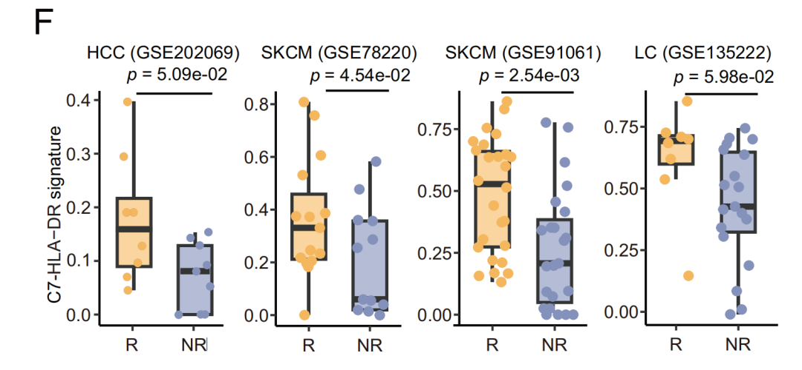
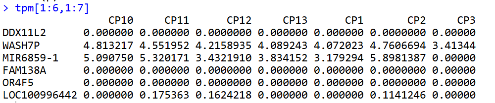
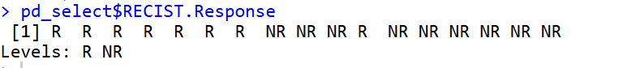
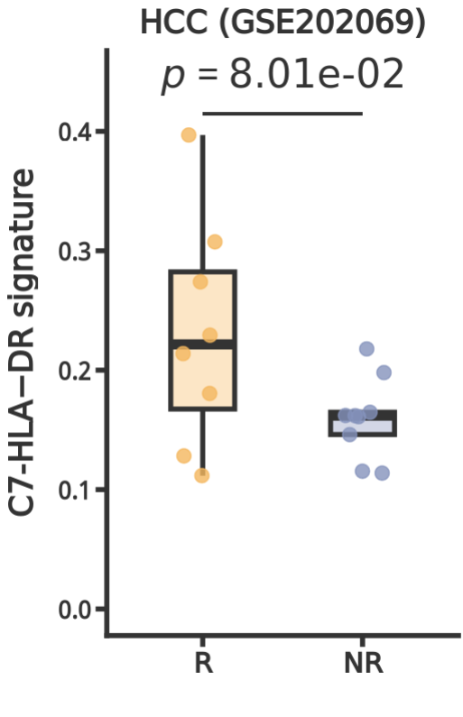

# 组间差异箱线图：单细胞亚群signature在bulk转录组中的应用

- 专辑：绘图小技巧2025
- 公众号：生信技能树
- 发布时间：2025-11-24 17:56
- 原文：[微信公众平台](https://mp.weixin.qq.com/s?__biz=MzAxMDkxODM1Ng%3D%3D&mid=2247547182&idx=1&sn=69ee3c504aae8d74a99d36117c0da9e9&chksm=9b4b7995ac3cf083cc54922ac01ae162ebb90e6e81f04d503908e21506e6ca86f354e3b59084)

---
> 今天来学习一篇文献，里面使用单细胞亚群：Mast细胞的一个细分亚群C7的特征基因，计算其在有治疗信息的bulk-RNAseq样本中的打分，并进行组间比较，以此来查看亚群是否与临床预后相关。
>
> 文献信息：2025年10月10号发表在Oncogene杂志，文献标题为《Comprehensive single-cell analysis reveals mast cells’ roles in cancer immunity》。

此外，我们生信技能树每月都有一期针对0基础的生信入门培训班，12月份开始招生啦，快来瞧一瞧：[生信入门&数据挖掘线上直播课12月班](https://mp.weixin.qq.com/s?__biz=MzAxMDkxODM1Ng%3D%3D&mid=2247547012&idx=1&sn=f55923d9a6d9e04c3e923c2a3cae6e56#wechat_redirect)。

给你最好的答疑！

就是下面这个图，放了四个GEO的bulk转录组数据的亚群C7的特征基因打分在有药物治疗响应分组里面的差异。



> Fig. 4 The relationship between C7-HLA-DR cluster and clinical outcomes.
>
> F Boxplots depict higher C7-HLA-DR cluster score in responders (R) compared to non-responders (NR) in immunotherapy bulk RNA-seq datasets, analyzed using Student’s t-test.

## 数据预处理

我们这里处理第一个数据，其余的就留给各位自己去试试看啦。

### 1.先下载表达矩阵

GSE202069：https://www.ncbi.nlm.nih.gov/geo/query/acc.cgi?acc=GSE202069

下载 GSE202069_gene_tpm_expression.txt.gz 文件。

```r
rm(list = ls())#清空当前的工作环境
options(scipen = 0)#以科学计数法显示
library(data.table)
library(tinyarray)
library(stringr)
library(dplyr)
library(tidyverse)
library(ggplot2)
library(ggpubr)
library(readxl)

## tpm表达
tpm <- data.table::fread("GSE202069/GSE202069_gene_tpm_expression.txt.gz",data.table = F,header = T)
rownames(tpm) <- tpm[,1]
tpm <- tpm[,-1]
tpm[1:6,1:7]
```



### 2.得到样本用药响应不响应信息

预后信息在这里：《Multiomics identifies metabolic subtypes based on fatty acid degradation allocating personalized treatment in hepatocellular carcinoma》的附表 https://cdn-links.lww.com/permalink/hep/h/hep_2023_08_01_yu_hep-22-2164r1_sdc1.xlsx

```r
## 生存预后相关信息
pd <- read_excel("GSE202069/hep_2023_08_01_yu_hep-22-2164r1_sdc1.xlsx", sheet = 1,skip = 1)
pd$Label
pd$RECIST.Response
table(pd$RECIST.Response)
pd_select <- pd[pd$RECIST.Response!="NA",c("Label","RECIST.Response")] %>% as.data.frame()

## 修改一下因子
pd_select <- pd_select %>%
  mutate(
    RECIST.Response = recode_factor(
      RECIST.Response,
      "Responders" = "R",
      "Non-responders" = "NR",
      .ordered = FALSE)
    )
pd_select$RECIST.Response
```



总共17个样本。

### 3.计算AUC打分

这里需要用到 C7-HLA−DR signature：文献的附表 41388_2025_3590_MOESM3_ESM.xls，链接 https://static-content.springer.com/esm/art%3A10.1038%2Fs41388-025-03590-y/MediaObjects/41388_2025_3590_MOESM3_ESM.xls

```r
## AUCell  打分
# C7-HLA−DR signature
library(AUCell)
# gene <- c("TPSAB1","HLA-DPB1","HLA-DPA1","HLA-DQB1","HLA-DMB")
gene <-  c(
"CD74", "HLA-DRA", "HLA-DRB1", "HLA-DPB1", "HLA-DPA1",
"HLA-DQA1", "HLA-DQB1", "HLA-DRB5", "HLA-DMA", "HLA-B",
"HLA-C", "HLA-DMB", "HLA-DQA2", "B2M", "PSMB9",
"HLA-A", "STAT1", "IFITM3", "TAP1", "HLA-E",
"HLA-F", "IFI6", "IFITM1", "CASP1", "LY6E",
"PSME2", "CARD16", "EPSTI1", "PSMB8", "CTSS",
"TRIM22", "IFI44L", "CORO1A", "CD52", "UBE2L6",
"PSME1", "GBP4", "ISG15", "CTSH", "LSP1",
"ISG20", "NCF1", "CASP4", "APOC1", "LTB",
"TYMP", "PSMB10", "POU2F2", "CYTIP", "GRN"
)

# Convert to sparse
library(Matrix)
cts <- tpm[, pd_select$Label]
kp <- rowSums(cts) >1
table(kp)
cts <- as.matrix(cts[kp, ])
intersect(rownames(cts),gene)
exprMatrix <- as(cts, "dgCMatrix")
exprMatrix
dim(exprMatrix)

geneSets <- list(C7_signature = gene)
cells_AUC <- AUCell_run(exprMatrix, geneSets)
```

提取打分结果并与样本信息合并：

```r
sort(getAUC(cells_AUC)["C7_signature", ])
aucs <- as.data.frame(getAUC(cells_AUC)["C7_signature", ]) %>% rownames_to_column("ID")
colnames(aucs)[2] <- "Score"
aucs

df <- merge(aucs, pd_select, by.x="ID",by.y="Label")
df
```

组间差异t检验：

```r
# 进行t检验
t_test_result <- t.test(Score ~ RECIST.Response, data = df)
p_value <- t_test_result$p.value
p_value # 0.08008757
p_sci <- sprintf("%.2e", p_value)  # "8.01e-02"
p_sci
p_expression <- bquote(italic(p) == .(p_sci))
p_expression
```

## ggplot2绘图

这里手动添加显著性，智能提取添加的位置：

```r
# 手动添加显著性标记
y_max <- max(df$Score) * 1.1
y_line <- y_max * 0.95
y_line
y_text <- y_max * 1.02
y_text
```

开始绘图：一键全搞定

```r
p <- ggplot(df, aes(x = RECIST.Response, y = Score, fill = RECIST.Response)) +
  # 箱线图
  geom_boxplot(alpha = 0.6, outlier.shape = NA, width = 0.4,lwd=1.2) +
# 抖动散点
  geom_jitter(aes(color = RECIST.Response),  width = 0.15, alpha = 0.8, size = 3) +
# 手动添加短横线
  geom_segment(aes(x = 1, xend = 2, y = y_line, yend = y_line), color = "grey20", linewidth = 0.8) +
# 手动添加p值文本（斜体p）
  annotate("text", x = 1.5, y = y_text, label =  deparse(p_expression), parse = TRUE, size = 7, color = "grey20",fontface = "bold") +
# 美化设置
  scale_fill_manual(values = c("R" = "#fad5a0", "NR" = "#b5bcd6")) +
  scale_color_manual(values = c("R" = "#f4b75e",  "NR" = "#8492bb")) +
  scale_y_continuous(limits = c(0, NA)) +  # y轴从0开始
  labs(title = "HCC (GSE202069)", x = "", y = "C7-HLA−DR signature") +
  theme_classic() +
  theme(
    legend.position = "none",
    # 标题灰黑色加粗加大
    plot.title = element_text(size = 16, face = "bold", hjust = 0.5, color = "grey20"),
    # 坐标轴标题灰黑色加粗加大
    axis.title.x = element_text(size = 16, face = "bold", margin = margin(t = 10), color = "grey20"),
    axis.title.y = element_text(size = 16, face = "bold", margin = margin(r = 10), color = "grey20"),
    # 坐标轴刻度标签灰黑色加粗加大
    axis.text.x = element_text(size = 14, face = "bold", color = "grey20"),
    axis.text.y = element_text(size = 12, face = "bold", color = "grey20"),
    # 坐标轴线灰黑色加粗
    axis.line = element_line(linewidth = 1.2, color = "grey20"),
    # 坐标轴刻度线灰黑色加粗
    axis.ticks = element_line(linewidth = 1.2, color = "grey20"),
    axis.ticks.length = unit(0.2, "cm")
  )
p

ggsave(filename = "Fig4F.pdf",width = 3.2,height = 4.5,plot = p)
```

最终结果如下（跟作者计算出来的p有点不一样，但是都是不显著pvalue\>0.05）：



完美！如果上面的内容对你有帮助，欢迎一键三连！

友情转发：

- [生信入门&数据挖掘线上直播课12月班](https://mp.weixin.qq.com/s?__biz=MzAxMDkxODM1Ng%3D%3D&mid=2247547012&idx=1&sn=f55923d9a6d9e04c3e923c2a3cae6e56#wechat_redirect)，你的生物信息学入门课

- [时隔5年，我们的生信技能树VIP学徒继续招生啦](https://mp.weixin.qq.com/s?__biz=MzAxMDkxODM1Ng%3D%3D&mid=2247525079&idx=1&sn=0b997af16a58195b4192691373048fd5#wechat_redirect)

- [满足你生信分析计算需求的低价解决方案](https://mp.weixin.qq.com/s?__biz=MzUzMTEwODk0Ng%3D%3D&mid=2247530048&idx=1&sn=28aa7bbd5e00521f79e074496a5f5d66#wechat_redirect)

- [生信故事会](https://mp.weixin.qq.com/mp/appmsgalbum?__biz=MzAxMDkxODM1Ng%3D%3D&action=getalbum&album_id=1679199708449144836#wechat_redirect)，来看看他们的生信入门故事

- [生信马拉松答疑专辑](https://mp.weixin.qq.com/mp/appmsgalbum?__biz=MzAxMDkxODM1Ng%3D%3D&action=getalbum&album_id=3690970204957147140#wechat_redirect)，获取你的生信专属答疑

<!-- wechat-article-fetcher: complete -->
