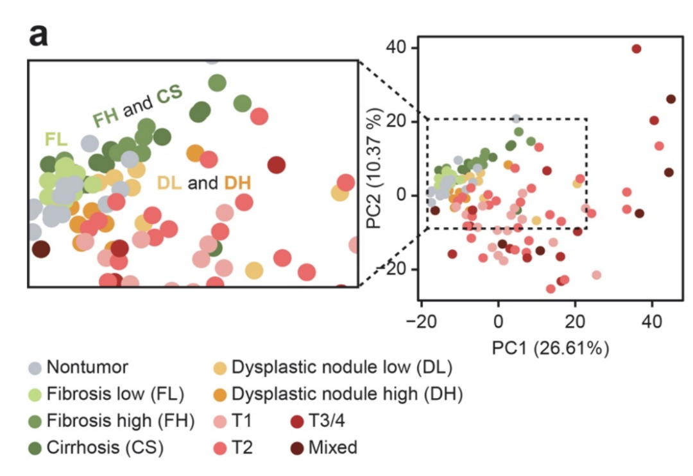
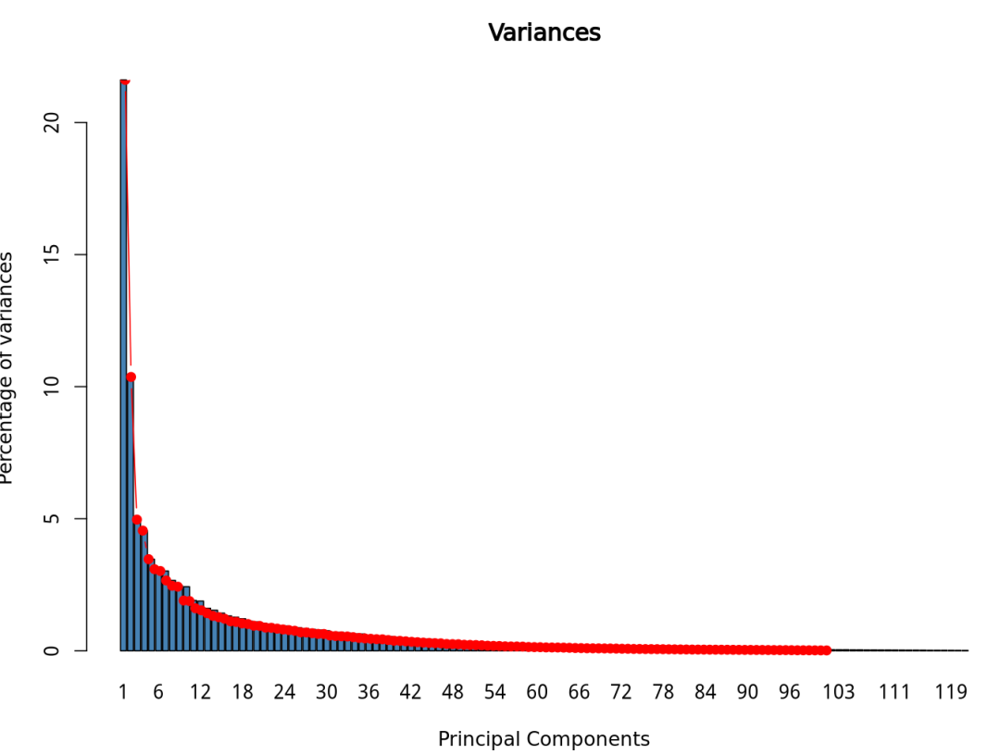
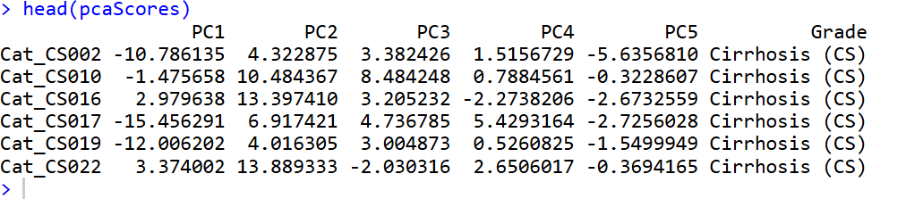
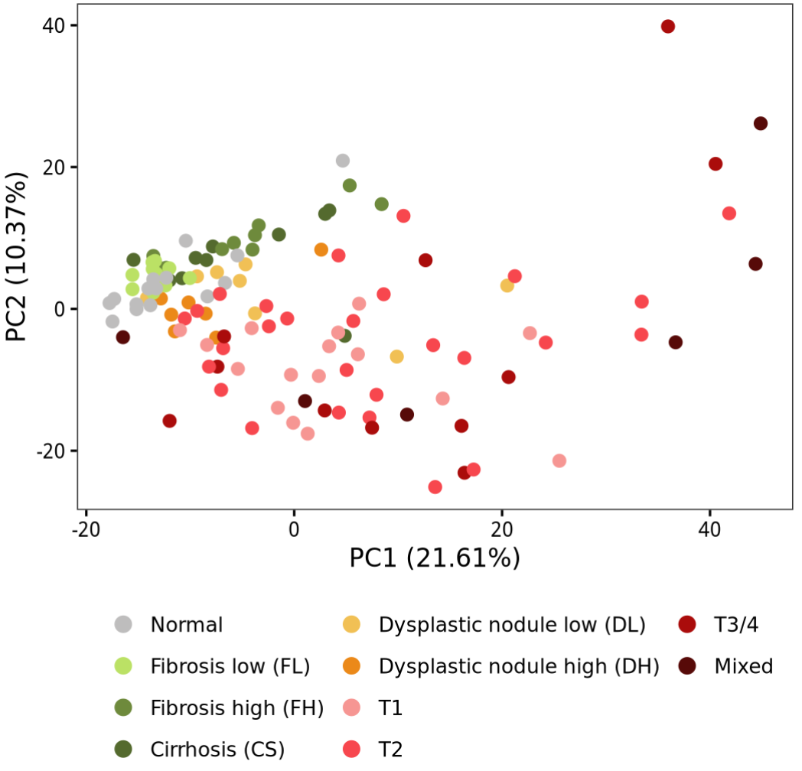
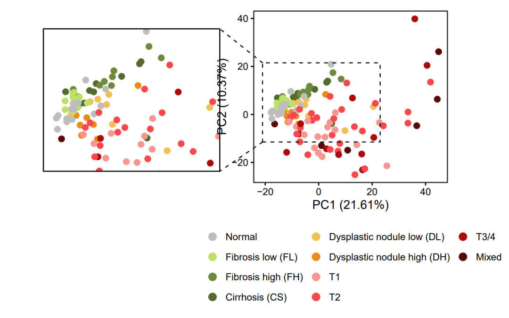

# 给你的PCA主成分分析添加一个局部放大图

- 专辑：绘图小技巧2025
- 公众号：生信技能树
- 发布时间：2025-11-10 15:26
- 原文：[微信公众平台](https://mp.weixin.qq.com/s?__biz=MzAxMDkxODM1Ng%3D%3D&mid=2247546854&idx=1&sn=6826b858dc2299001c377d8de07c5c89&chksm=9b4b775dac3cfe4be26c618627e4539b2bf61adbd9c7dd5ae1cf303805d6f5a89c084f01097e)

---
> 今天又是周一啦，感觉周末跟没过一样就完了！绘图时间，今天来画一个PCA散点图，然后添加一个局部区域放大的地方看里面的细节，就像拿了个放大镜，找细节。图来自2021年3月26发表在NPJ Precis Oncol杂志的文献，标题为：《Preoperative immune landscape predisposes adverse outcomes in hepatocellular carcinoma patients with liver transplantation》。

研究对来自韩国 HCC 队列的 124 个样本进行了转录组测序，包括 62 个恶性肿瘤样本、47 个癌旁非肿瘤样本和 15 个正常组织样本。为探究疾病分期之间的关系，采用 Top1000 变异度最大的蛋白质编码基因进行主成分分析（PCA），将样本投射至二维空间（附图1a）。肿瘤样本与非肿瘤样本呈现明显分离，而非肿瘤样本处于中间状态。**值得注意的是，不典型增生结节（DN）样本与肿瘤样本聚集分布，而纤维化及肝硬化组织样本则与正常样本邻近（附图1a插图）。**

上面加粗字体的部分就是作者提到的细节。



图注：

> Supplementary Fig. 1. Transcriptomic dissections of an HCC and adjacent nontumor meta-dataset by disease stage and by cohort.

## 数据预处理

作者提供了代码和示例数据：

数据：https://www.ncbi.nlm.nih.gov/geo/query/acc.cgi?acc=GSE148355

代码：https://github.com/sangho1130/KOR_HCC

但是呢，是个半成品：

```r
rm(list = ls())
library(FactoMineR)
library(ggplot2)
library(factoextra)

# 读取数据
data <- read.delim(file = '../data/Figure 1B input.txt', header = TRUE, sep = '	', check.names = FALSE, row.names = 1)
dim(data)
# 已经是挑选好了基因，并且转置的表达矩阵，适合做PCA分析
data[1:4,1:4]
dataGrade <- data.frame(row.names = rownames(data), grade = data$Grade)
head(dataGrade)
data$Grade <- NULL
unique(dataGrade$grade)
# 对grade重命名
label_old <- c("Normal", 'FL', 'FH', 'CS', 'DL', 'DH', 'T1', 'T2', 'T3-4', 'Mixed')
label <- c("Normal", 'Fibrosis low (FL)', 'Fibrosis high (FH)',
           'Cirrhosis (CS)', 'Dysplastic nodule low (DL)',
           'Dysplastic nodule high (DH)', 'T1', 'T2', 'T3/4', 'Mixed')

dataGrade$grade <- gsub("FL", "Fibrosis low (FL)", dataGrade$grade)
dataGrade$grade <- gsub("FH", "Fibrosis high (FH)", dataGrade$grade)
dataGrade$grade <- gsub("CS", "Cirrhosis (CS)", dataGrade$grade)
dataGrade$grade <- gsub("DL", "Dysplastic nodule low (DL)", dataGrade$grade)
dataGrade$grade <- gsub("DH", "Dysplastic nodule high (DH)", dataGrade$grade)
dataGrade$grade <- gsub("T3-4", "T3/4", dataGrade$grade)
dataGrade$grade <- factor(dataGrade$grade, levels = label )

# pca分析
pca <- PCA(data,graph = F)
# 这个时候的pca图非常的原始，丑爆了
max(pca$var$contrib[,1:2])
contribution <- as.data.frame(pca$var$contrib)
colnames(contribution) <- c('PC1', 'PC2', 'PC3', 'PC4', 'PC5')
contribution <- cbind(gene = rownames(contribution), contribution)
head(contribution)
write.table(contribution, '../results/Figure1B_PCA_contribution.txt',row.names = F, col.names = T, quote = F, sep = '	')

pcaScores <- as.data.frame(pca$ind$coord)
colnames(pcaScores) <- c('PC1', 'PC2', 'PC3', 'PC4', 'PC5')
pcaScores$Grade <- dataGrade$grade
head(pcaScores)
table(pcaScores$Grade)

# 每个pc的贡献度
eigenvalues <- pca$eig
barplot(eigenvalues[, 2], names.arg=1:nrow(eigenvalues),
        main = "Variances", xlab = "Principal Components", ylab = "Percentage of variances", col ="steelblue")
lines(x = 1:nrow(eigenvalues), eigenvalues[, 2], type="b", pch=19, col = "red")
```



head(pcaScores)的内容：PC1和PC2的坐标以及Grade设置点的样本分组颜色



## 开始绘图

还是使用ggplot2。

### 先画个基础的

设置颜色：

```r
# 颜色
color1 <- c("Normal" = "#bebdbd",
            "Fibrosis low (FL)" = "#bbe165",
            'Fibrosis high (FH)' = '#6e8a3c',
            'Cirrhosis (CS)' = '#546a2e',
            "Dysplastic nodule low (DL)" = "#f1c055",
            'Dysplastic nodule high (DH)' = '#eb8919',
            "T1" = '#f69693',
            'T2' = '#f7474e',
            'T3/4' = '#aa0c0b',
            'Mixed' = '#570a08')
```

基本散点图：

```r
p <- ggplot(pcaScores, aes(x = PC1, y = PC2, colour = Grade)) +
  geom_point(size = 3) +
  scale_colour_manual(name='', values = color1)  +
  xlab(label = paste0("PC1 (", round(eigenvalues[1,2],2),"%)") ) +
  ylab(label = paste0("PC2 (", round(eigenvalues[2,2],2),"%)") ) +
  theme_bw(base_size = 15) +
  guides(color=guide_legend(nrow = 4,override.aes = list(size=4))) +
  theme(axis.text = element_text(colour = 'black'),
        axis.ticks = element_line(colour = 'black'),
        plot.title = element_text(hjust = 0.5),
        panel.grid = element_blank(),
        legend.position = "bottom"
        )
p
```



### 添加放大区域

这里使用 ggmagnify 包，搜的帖子知道的：[这里](https://mp.weixin.qq.com/s?__biz=MzIyOTY3MDA3MA%3D%3D&mid=2247518088&idx=1&sn=8b10bd6013f25a7dba960f28a9312ac2#wechat_redirect)

包的网页：https://github.com/hughjonesd/ggmagnify

直接安装或者下载下来本地安装，包链接: https://pan.baidu.com/s/1vuUAX1motjjhQh1lj_UbNA?pwd=y7xa 提取码: y7xa

```r
# 直接安装
###### 添加放大区域
## 使用西湖大学的 Bioconductor镜像
options(BioC_mirror="https://mirrors.westlake.edu.cn/bioconductor")
options("repos"=c(CRAN="https://mirrors.westlake.edu.cn/CRAN/"))
# 安装ggmagnify包；
# install.packages("remotes")
# remotes::install_github("hughjonesd/ggmagnify")
# devtools::install_local("ggmagnify-master.zip",upgrade = F)
# 本地安装
devtools::install_local("ggmagnify-master.zip",upgrade = F)

# 载入图形放大所需R包；
library(ggplot2)
library(ggmagnify)
library(ggfx)
```

添加放大区域：

```r
# 设置放大区域；
# Names xmin, xmax, ymin, ymax are optional:
from <- c(xmin = -18, xmax = 20.5, ymin = -10, ymax = 20)
to <- c(-100, -40, -21, 33)

# t (top): 上边距 = 10
# r (right): 右边距 = 60
# b (bottom): 下边距 = 10
# l (left): 左边距 = 10

p1 <- p +
# xlim(-20, 50)  + # 从2到8
  coord_cartesian(clip = "off") +
  theme(plot.margin = ggplot2::margin(t = 1, r = 3, b = 1, l = 15,unit = "cm")) +
  geom_magnify(from = from, to = to,
               target.linetype = 2,
               proj.linetype = 2, linewidth = 0.6)
p1
ggsave(filename = "PCA_boom.pdf",width = 28,height = 15,bg="white",plot = p1,units = "cm")
```



完美！

今天分享到这~

如果上面的内容对你有帮助，欢迎一键三连！

友情转发：

- [11月3日开课：生信入门&数据挖掘线上直播课](https://mp.weixin.qq.com/s?__biz=MzAxMDkxODM1Ng%3D%3D&mid=2247546471&idx=1&sn=4c0cf9e67f972cd573092d53fb57d2c9#wechat_redirect)，你的生物信息学入门课

- [时隔5年，我们的生信技能树VIP学徒继续招生啦](https://mp.weixin.qq.com/s?__biz=MzAxMDkxODM1Ng%3D%3D&mid=2247525079&idx=1&sn=0b997af16a58195b4192691373048fd5#wechat_redirect)

- [满足你生信分析计算需求的低价解决方案](https://mp.weixin.qq.com/s?__biz=MzUzMTEwODk0Ng%3D%3D&mid=2247530048&idx=1&sn=28aa7bbd5e00521f79e074496a5f5d66#wechat_redirect)

- [生信故事会](https://mp.weixin.qq.com/mp/appmsgalbum?__biz=MzAxMDkxODM1Ng%3D%3D&action=getalbum&album_id=1679199708449144836#wechat_redirect)，来看看他们的生信入门故事

- [生信马拉松答疑专辑](https://mp.weixin.qq.com/mp/appmsgalbum?__biz=MzAxMDkxODM1Ng%3D%3D&action=getalbum&album_id=3690970204957147140#wechat_redirect)，获取你的生信专属答疑

<!-- wechat-article-fetcher: complete -->
