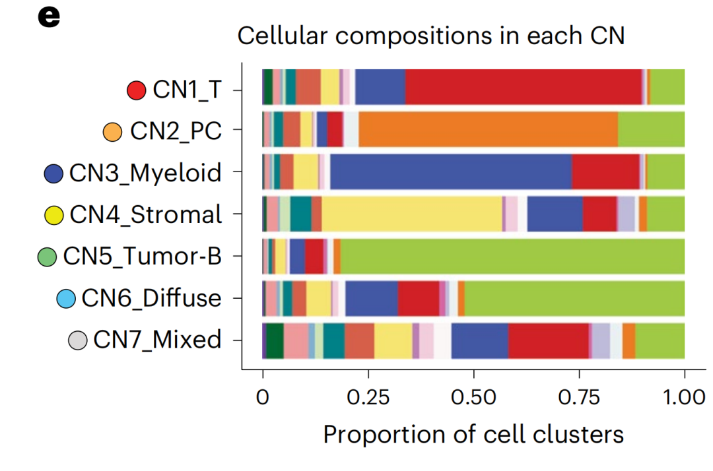
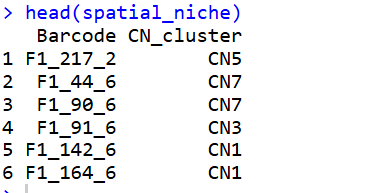
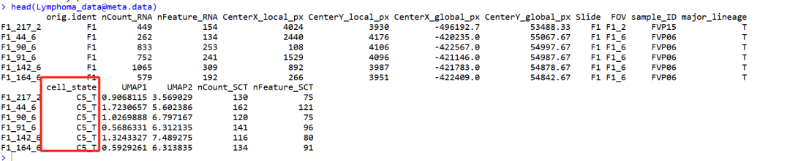
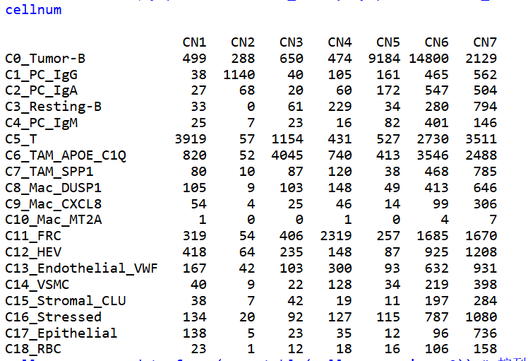
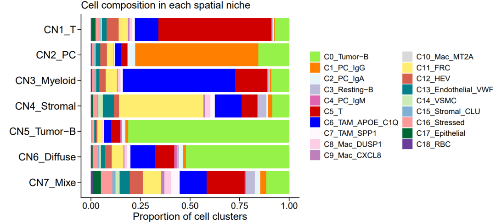

# 给我那刚入门单细胞的朋友画一个单细胞中的堆积柱状图

- 专辑：绘图小技巧2025
- 公众号：生信技能树
- 发布时间：2025-10-28 00:29
- 原文：[微信公众平台](https://mp.weixin.qq.com/s?__biz=MzAxMDkxODM1Ng%3D%3D&mid=2247546494&idx=1&sn=aa6647399d604c79fb38fb68434f09cc&chksm=9b4b76c5ac3cffd3e25543f0b5b74076889af19c66bb8ca645873cd5f134e85816704faa1c41)

---
> 我的那个基友以前专门做服务器管理等工作，最近开始学习R和空间转录组，还有单细胞。最近问我有没有堆积柱状图的代码，我一看我的[绘图小专辑](https://mp.weixin.qq.com/s?__biz=MzAxMDkxODM1Ng%3D%3D&mid=2247539767&idx=1&sn=ed0c3b0eb2a8b4414a5d40d620605444#wechat_redirect)，额里面好像没有专门画单细胞的，这就来给他画一个！基情满满~前面还写了一篇：[给我那刚入门R的朋友写一个Visium HD数据分析教程](https://mp.weixin.qq.com/s?__biz=MzAxMDkxODM1Ng%3D%3D&mid=2247545917&idx=1&sn=bc6c5f8eface72bc594be43185bbbd34#wechat_redirect)。

其实，专辑里面有一个连线的堆积柱状图就是：

- [NC杂志同款高颜值连线堆积柱状图](https://mp.weixin.qq.com/s?__biz=MzAxMDkxODM1Ng%3D%3D&mid=2247539767&idx=1&sn=ed0c3b0eb2a8b4414a5d40d620605444#wechat_redirect)

- 绘图小技巧进群方式：添加微信 Biotree123，发18.8的进群门票，可以在群里交流学习绘图，并发布许愿绘图~

Fig2中的e图：展示的是空间转录组数据中7个细胞生态位CN1-7中每个生态位里面不同细胞亚群的组成比例变化。类似的图还有如不同样本中细胞亚群组成变化。来自**2025年10月21号发表在Nature Genetics杂志**上的文献，标题为《Multi-modal spatial characterization of tumor immune microenvironments identifies targetable inflammatory niches in diffuse large B cell lymphoma》。



图注：

> Fig. 2: Cellular neighborhood structures and unique spatial niches in B cell lymphoma. e, The cell state compositions of each spatial niche, represented by the sub-segmented barplots colored according to pane.

## 数据背景

作者利用78例大B细胞淋巴瘤切除活检样本及5例对照组织（4例扁桃体、1例淋巴结）构建了六组组织微阵列。作者抽取了部分示例数据以及代码放在github上面：https://github.com/Coolgenome/Lymphoma-spatial

下载好的： 链接: https://pan.baidu.com/s/1ISXLXLEmgdwtBrLTTdkPOQ?pwd=b49k 提取码: b49k

详细介绍见：[一行代码给你的单细胞UMAP图添加左下角小箭头坐标轴](https://mp.weixin.qq.com/s?__biz=MzAxMDkxODM1Ng%3D%3D&mid=2247546483&idx=1&sn=acea4ccfb046a373c767523ccc41a266#wechat_redirect)

## 绘图

先读取绘图数据，需要的是一个数据框，每一个CN中不同细胞类型的比例组成：

```r
### Figure 2 ###
rm(list=ls())
### load essential packages ###
library(Seurat)
library(tidyverse)
library(dplyr)
library(ggplot2)
library(SCP)
# 极速安装
# install.packages("tidydr")
library(tidydr)

### Figure 2d-f ###
# k-means clustering based on neighborhood matrix to obtain 7 unique spatial cellular niches (CN).
# Here we directly provide the results with CN allocation of cells.
spatial_niche <- readRDS("./demo_data/spatial_niche.rds")
head(spatial_niche)
table(spatial_niche$CN_cluster)
```

niche数据为两列：第一列是细胞barcode，第二列是每个细胞所属的CN类型，总共有CN1-7七大类：



接着是细胞亚群分类信息：

```r
### Data reading in, preprocessing, cleaning, and cell type and state identification are described in the separate script Preprocessing.r
### Here for demonstrating the workflow, we directly provide the demo data, including count matrix and metadata. The processing of demo data is described in Figure 1.r
### load data object ###
### This is saved from the step of Figure 1b.
Lymphoma_data <- readRDS("./demo_data/Lymphoma_data.rds")
Lymphoma_data
head(Lymphoma_data@meta.data)
```

需要其中的cell_state列，共19中细胞类型：



将上面两种信息合并在一起，并计算比例：

```r
## 合并上面两部分的数据
# plot cell composition in each CN (Figure 2e) #
Lymphoma.meta <- rownames_to_column(Lymphoma_data@meta.data, var="Barcode")
Lymphoma.meta <- left_join(Lymphoma.meta, spatial_niche, by="Barcode")
head(Lymphoma.meta)

cellnum <- table(Lymphoma.meta$cell_state, Lymphoma.meta$CN_cluster)
cellnum
cell.prop <- as.data.frame(prop.table(cellnum,margin = 2)) # 按列计算比例
colnames(cell.prop)<-c("cell_state","CN_cluster","Proportion")
head(cell.prop) # 得到每一个CN1中不同细胞亚群的相对比例
sum(cell.prop[cell.prop$cell_state=="C0_Tumor-B",3])
sum(cell.prop[cell.prop$CN_cluster=="CN1",3]) # 和为1
sum(cell.prop[,3])
```

cellnum数据结构为：



然后使用核心代码：`cell.prop <- as.data.frame(prop.table(cellnum,margin = 2)) # 按列计算比例`

计算每一列中不同细胞类型的相对比例，每一列计算完后比例加和应该等于1.

开始绘图：

```r
# # 设置堆积柱状图中细胞亚群的放置顺序，因子变量
levels=c("C0_Tumor-B","C1_PC_IgG","C2_PC_IgA","C3_Resting-B","C4_PC_IgM","C5_T",
         "C6_TAM_APOE_C1Q","C7_TAM_SPP1","C8_Mac_DUSP1","C9_Mac_CXCL8","C10_Mac_MT2A",
         "C11_FRC","C12_HEV","C13_Endothelial_VWF","C14_VSMC","C15_Stromal_CLU",
         "C16_Stressed","C17_Epithelial","C18_RBC")

cell.prop$cell_state <- factor(cell.prop$cell_state, levels=levels)
cell.prop$CN_cluster <- factor(cell.prop$CN_cluster, levels=c(paste0("CN",7:1)))

# # 设置颜色
color <- c("#96F148","#ff7f00","#e5f5f9","#bebada","#df65b0","#D10000","#0000FF","#fff7fb","#fccde5","#bc80bd",
           "#d9d9d9","#ffed6f","#d6604d","#02818a","#ccecb5","#80b1d3","#fb9a99","#006837","#6a3d9a")
```

绘图：

```r
# 绘图
p <- ggplot(cell.prop,aes(CN_cluster,Proportion,fill=cell_state)) +
  geom_bar(stat = "identity",position = "fill") +
  ggtitle("Cell composition in each spatial niche") +
  ylab(label = "Proportion of cell clusters") +
  scale_x_discrete(name = "", labels = rev(c("CN1_T", "CN2_PC", "CN3_Myeloid","CN4_Stromal","CN5_Tumor-B",
                                         "CN6_Diffuse","CN7_Mixe"))) +
  coord_flip() +
  theme_bw() +
  scale_fill_manual(values=color) +
  theme_classic() +
  theme(axis.ticks.length = unit(0.2,'cm'),
        legend.position = "right",  # 设置图例位置
        legend.direction = "vertical",  # 设置图例方向
        legend.box = "vertical",  # 设置图例框的方向
        legend.text = element_text( size = 12, face = "plain",color = "black"),
        plot.title = element_text(size = 16),  # 修改图片标题的字体大小和样式
        axis.title.x = element_text(size = 16),  # 修改x轴标题的字体大小
        axis.text.x = element_text(size = 14),  # 修改x轴刻度标签的字体大小
        axis.text.y = element_text(size = 16)   # 修改y轴刻度标签的字体大小
        ) +
  guides(fill=guide_legend(title = NULL,ncol=2))
p
ggsave(filename = "fig2e.pdf", width = 11,height = 5,plot = p)
```



今天分享到这~

如果你也想要一个会生信的朋友，来，加我：Biotree123，风里雨里等你！

如果上面的内容对你有用，欢迎一键三连！

友情转发：

- [生信入门&数据挖掘线上直播课11月班](https://mp.weixin.qq.com/s?__biz=MzAxMDkxODM1Ng%3D%3D&mid=2247546276&idx=1&sn=b2a133dd0ff3c571eef5bfbe5dd82c59#wechat_redirect)，你的生物信息学入门课

- [时隔5年，我们的生信技能树VIP学徒继续招生啦](https://mp.weixin.qq.com/s?__biz=MzAxMDkxODM1Ng%3D%3D&mid=2247525079&idx=1&sn=0b997af16a58195b4192691373048fd5#wechat_redirect)

- [满足你生信分析计算需求的低价解决方案](https://mp.weixin.qq.com/s?__biz=MzUzMTEwODk0Ng%3D%3D&mid=2247530048&idx=1&sn=28aa7bbd5e00521f79e074496a5f5d66#wechat_redirect)

- [生信故事会](https://mp.weixin.qq.com/mp/appmsgalbum?__biz=MzAxMDkxODM1Ng%3D%3D&action=getalbum&album_id=1679199708449144836#wechat_redirect)，来看看他们的生信入门故事

- [生信马拉松答疑专辑](https://mp.weixin.qq.com/mp/appmsgalbum?__biz=MzAxMDkxODM1Ng%3D%3D&action=getalbum&album_id=3690970204957147140#wechat_redirect)，获取你的生信专属答疑

<!-- wechat-article-fetcher: complete -->
