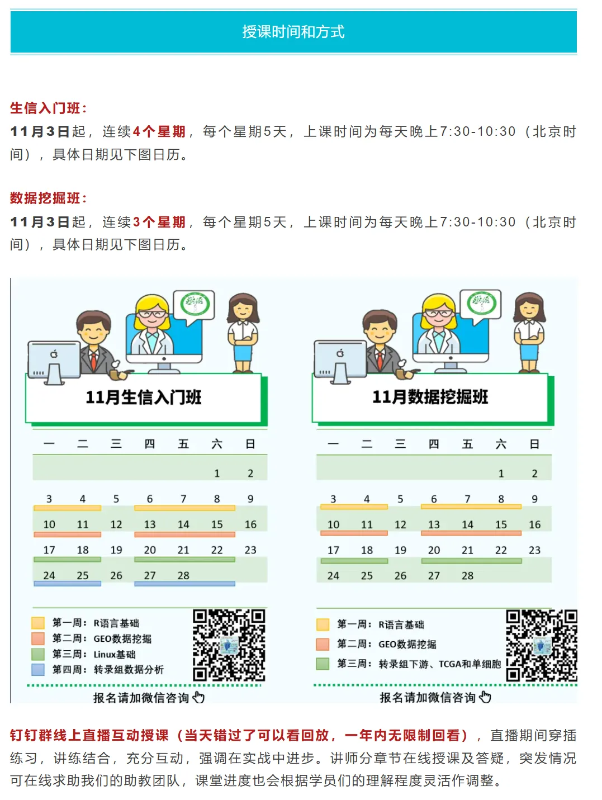
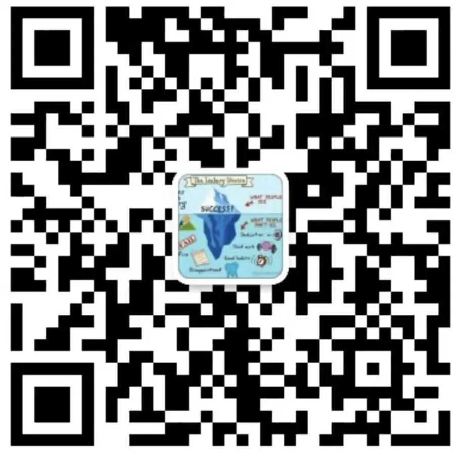
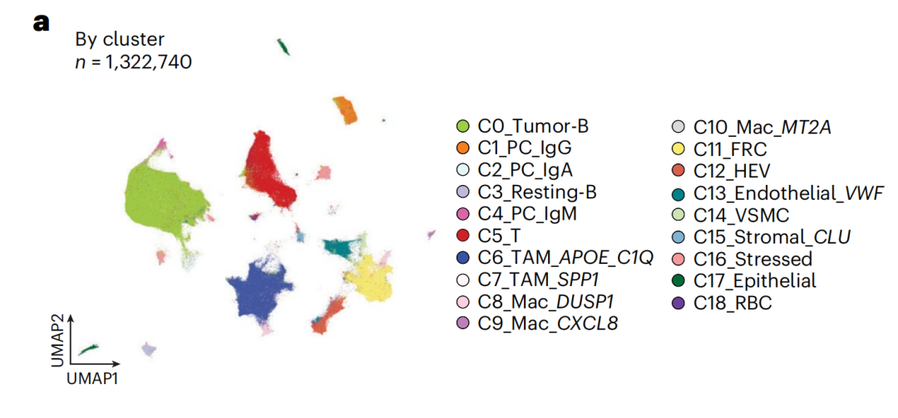
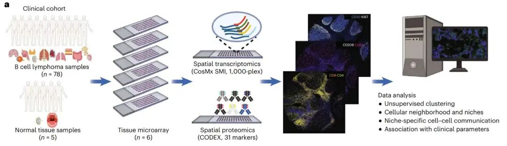
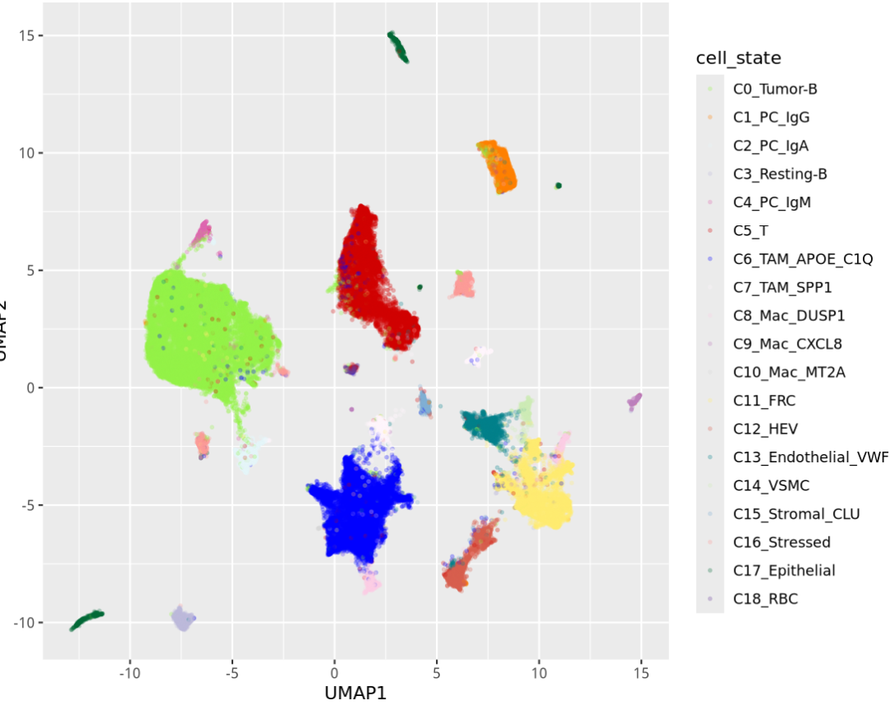
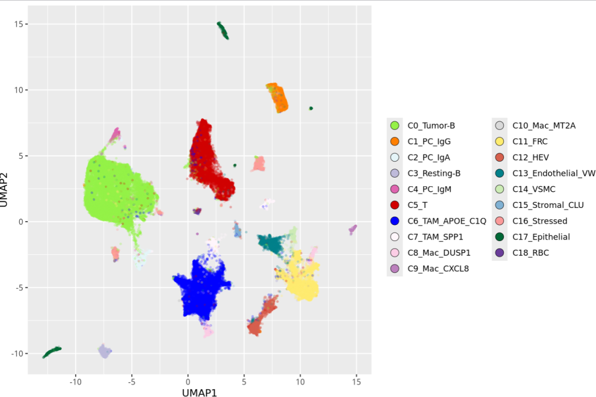
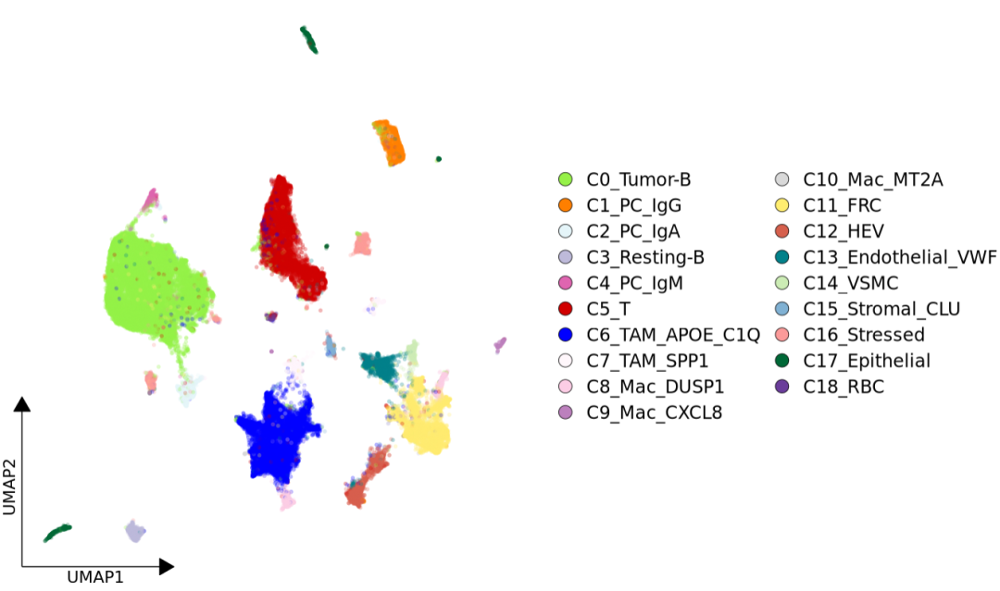

# 一行代码给你的单细胞UMAP图添加左下角小箭头坐标轴

- 专辑：绘图小技巧2025
- 公众号：生信技能树
- 发布时间：2025-10-27 19:18
- 原文：[微信公众平台](https://mp.weixin.qq.com/s?__biz=MzAxMDkxODM1Ng%3D%3D&mid=2247546483&idx=1&sn=acea4ccfb046a373c767523ccc41a266&chksm=9b4b76c8ac3cffde07fa428320743abf21c5dca307a248df69b90d572e73bea4446d7643f3cf)

---
> 最近看到王凌华大佬团队又又又发了一篇NG，马不停蹄的马上来学习，文献于2025年10月21号发表在Nature Genetics杂志上，标题为《Multi-modal spatial characterization of tumor immune microenvironments identifies targetable inflammatory niches in diffuse large B cell lymphoma》。每周一是绘图学习日，今天学习其中的Fig2，并看看文献的具体奇思妙想。

此外，我们技能树最新一期生信入门就在11月3号开课，还没上车的可以看一看瞄一瞄，详细介绍页面可以点击：[生信入门&数据挖掘线上直播课11月班](https://mp.weixin.qq.com/s?__biz=MzAxMDkxODM1Ng%3D%3D&mid=2247546276&idx=1&sn=b2a133dd0ff3c571eef5bfbe5dd82c59#wechat_redirect)，**完全适合0基础小白**。



快来添加小助手报名咨询吧：



关于单细胞的UMAP图，前面我们介绍了这么多啦：

- [给你的单细胞umap图加个cell杂志同款的圈](https://mp.weixin.qq.com/s?__biz=MzAxMDkxODM1Ng%3D%3D&mid=2247537290&idx=1&sn=ad76831349df67bb5236370dab088536#wechat_redirect)

- [5种方式美化你的单细胞umap散点图](https://mp.weixin.qq.com/s?__biz=MzAxMDkxODM1Ng%3D%3D&mid=2247536822&idx=1&sn=5f695d4ee6d8ba00a0961c02c4cf83bd#wechat_redirect)

- [画个同款新奇的“Galaxy”星系UMAP图（Nat Immunol：IF27.8）](https://mp.weixin.qq.com/s?__biz=MzAxMDkxODM1Ng%3D%3D&mid=2247538773&idx=1&sn=094b2cef83702267589de13dd50a0b58#wechat_redirect)

- [Nature杂志同款高颜值单细胞星云+圈款UMAP图](https://mp.weixin.qq.com/s?__biz=MzAxMDkxODM1Ng%3D%3D&mid=2247545881&idx=1&sn=08f74aef7c233b8d4725408c628ece2d#wechat_redirect)

- [张泽民院士团队爱用的”云雾感“ UMAP 图](https://mp.weixin.qq.com/s?__biz=MzAxMDkxODM1Ng%3D%3D&mid=2247545487&idx=1&sn=497b176fdc10855214d36d2a00413be5#wechat_redirect)

- [顶刊杂志同款CD8+ T cells亚群signature score的umap图绘制（IF=58.7）](https://mp.weixin.qq.com/s?__biz=MzAxMDkxODM1Ng%3D%3D&mid=2247543628&idx=1&sn=744ce66821f9501950c357b401ac9129#wechat_redirect)

- [展示你的特征基因：带"辣椒粉"的markers基因umap图](https://mp.weixin.qq.com/s?__biz=MzAxMDkxODM1Ng%3D%3D&mid=2247539400&idx=1&sn=ffa29d61d95453199ad6157d743403d7#wechat_redirect)

- 绘图小技巧进群方式：添加微信 Biotree123，发18.8的进群门票，可以在群里交流学习绘图，并发布许愿绘图~

Fig2中的a图：是一幅非常常见的单细胞UMAP散点图，展示了细胞类型注释结果。图用了左下角的小箭头坐标，图例使用的 带外圈的小圆点并经过了精细调整。



图注：

> Fig. 2: Cellular neighborhood structures and unique spatial niches in B cell lymphoma. a, High-resolution cell state identification in the CosMx SMI dataset.

## 数据背景

作者利用78例大B细胞淋巴瘤切除活检样本及5例对照组织（4例扁桃体、1例淋巴结）构建了六组组织微阵列。大B细胞淋巴瘤样本包括：

- 66例非特指型弥漫性大B细胞淋巴瘤

- 5例EB病毒阳性非特指型弥漫性大B细胞淋巴瘤

- 4例T细胞/组织细胞丰富型大B细胞淋巴瘤

- 2例原发纵隔大B细胞淋巴瘤

- 1例移植后淋巴增殖性疾病

每个组织微阵列均采用 NanoString CosMx 平台进行单细胞空间转录组学分析，并采用包含31种抗体的CODEX多重检测技术进行空间蛋白质组学分析（图1a）：



基于CosMx数据的高分辨率聚类分析共鉴定出19种细胞类型与状态（图2a）：

- **B cell cluster**：肿瘤性B细胞（C0_Tumor-B）；

- **plasma cells**：三类浆细胞簇（分别以不同免疫球蛋白重链表达为特征：C1_PC_IgG、C2_PC_IgA、C4_PC_IgM）及一群表达CD44的静息B细胞（resting B cell population，C3_Resting-B）；

- **T cells**：T细胞簇（C5_T）；

- tumor-associated macrophages (TAMs)：肿瘤相关巨噬细胞（C6_TAM_APOE_C1Q、C7_TAM_SPP1）；

- **other macrophage subsets**：多个巨噬细胞亚群（C8_Mac_DUSP1、C9_Mac_CXCL8、C10_Mac_MT2A）；

- **non-hematopoietic compartment**：非造血细胞区室包含滤泡网状细胞（follicular reticular cells (FRCs)，C11_FRC）、高内皮微静脉细胞（high endothelial venule cells，C12_HEV）、表达血管性血友病因子的内皮细胞（C13_Endothelial_VWF）、血管平滑肌细胞（vascular smooth muscle cells，C14_VSMC）、滤泡树突状细胞（follicular dendritic cells，C15_FDC）及少量上皮细胞（epithelial cells，C17_Epithelial）；

- **red blood cells**：少量红细胞簇（C18_RBC）；

- **表达热休克蛋白的应激标志性细胞**（C16_Stressed）：这个群感觉有点奇怪，这个名字。

作者抽取了部分示例数据以及代码放在github上面：

https://github.com/Coolgenome/Lymphoma-spatial

## 绘图

先读取数据：

```r
### Figure 2 ###
rm(list=ls())
### load essential packages ###
library(Seurat)
library(tidyverse)
library(dplyr)
library(ggplot2)
library(SCP)

# 极速安装
# install.packages("tidydr")
library(tidydr)

### Data reading in, preprocessing, cleaning, and cell type and state identification are described in the separate script Preprocessing.r
### Here for demonstrating the workflow, we directly provide the demo data, including count matrix and metadata. The processing of demo data is described in Figure 1.r
### load data object ###
Lymphoma_data <- readRDS("./demo_data/Lymphoma_data.rds") ### This is saved from the step of Figure 1b.
Lymphoma_data
head(Lymphoma_data@meta.data)
table(Lymphoma_data$orig.ident)
table(Lymphoma_data$Slide)
table(Lymphoma_data$FOV)
table(Lymphoma_data$sample_ID)
table(Lymphoma_data$major_lineage)
table(Lymphoma_data$cell_state)
```

对数据进行了简单探索，详细的细胞注释结果在 cell_state 里面。

先来绘制一个基础的umap图：

```r
# 设置颜色
### Figure 2a ###
### UMAP for cell states ###
color <- c("#96F148","#ff7f00","#e5f5f9","#bebada","#df65b0","#D10000","#0000FF","#fff7fb","#fccde5",
           "#bc80bd","#d9d9d9","#ffed6f","#d6604d","#02818a","#ccecb5","#80b1d3","#fb9a99","#006837",
           "#6a3d9a")

p <- ggplot(Lymphoma_data@meta.data, aes(x=UMAP1, y=UMAP2, color=cell_state)) +
  geom_point(size=0.1, alpha=0.3,shape = 21, stroke = 0.9) +
  scale_color_manual(values=color)
p
```

结果如下：



接着修改一下图片的图例：

```r
p <- ggplot(Lymphoma_data@meta.data, aes(x=UMAP1, y=UMAP2, color=cell_state)) +
  geom_point(size=0.1, alpha=0.3,shape = 21, stroke = 0.9) +
  scale_color_manual(values=color) +
  guides( color = guide_legend( title = "", override.aes = list( fill=color,color = "black",stroke = 0.3, size = 4, alpha = 1), ncol = 2 ))
p
```



最后，使用来自 tidydr包的 theme_dr() 一键添加小箭头：

```r
# 左下小箭头
p <- ggplot(Lymphoma_data@meta.data, aes(x=UMAP1, y=UMAP2, color=cell_state)) +
  geom_point(size=0.1, alpha=0.3,shape = 21, stroke = 0.9) +
  scale_color_manual(values=color) +
  guides( color = guide_legend( title = "", override.aes = list( fill=color,color = "black",stroke = 0.3, size = 4, alpha = 1), ncol = 2 )) +  # 图例中点的大小
  theme_dr() +   # 应用带小箭头的坐标轴主题（来自tidydr包）
  theme( panel.grid = element_blank(),
         legend.text = element_text( size = 12, face = "plain",color = "black")
         )    # 去除所有网格线
p
```

最终效果如下：



是不是非常棒！今天分享到这~ 

如果上面的内容对你有用，欢迎一键三连！

友情转发：

- [生信入门&数据挖掘线上直播课11月班](https://mp.weixin.qq.com/s?__biz=MzAxMDkxODM1Ng%3D%3D&mid=2247546276&idx=1&sn=b2a133dd0ff3c571eef5bfbe5dd82c59#wechat_redirect)，你的生物信息学入门课

- [时隔5年，我们的生信技能树VIP学徒继续招生啦](https://mp.weixin.qq.com/s?__biz=MzAxMDkxODM1Ng%3D%3D&mid=2247525079&idx=1&sn=0b997af16a58195b4192691373048fd5#wechat_redirect)

- [满足你生信分析计算需求的低价解决方案](https://mp.weixin.qq.com/s?__biz=MzUzMTEwODk0Ng%3D%3D&mid=2247530048&idx=1&sn=28aa7bbd5e00521f79e074496a5f5d66#wechat_redirect)

- [生信故事会](https://mp.weixin.qq.com/mp/appmsgalbum?__biz=MzAxMDkxODM1Ng%3D%3D&action=getalbum&album_id=1679199708449144836#wechat_redirect)，来看看他们的生信入门故事

- [生信马拉松答疑专辑](https://mp.weixin.qq.com/mp/appmsgalbum?__biz=MzAxMDkxODM1Ng%3D%3D&action=getalbum&album_id=3690970204957147140#wechat_redirect)，获取你的生信专属答疑

<!-- wechat-article-fetcher: complete -->
