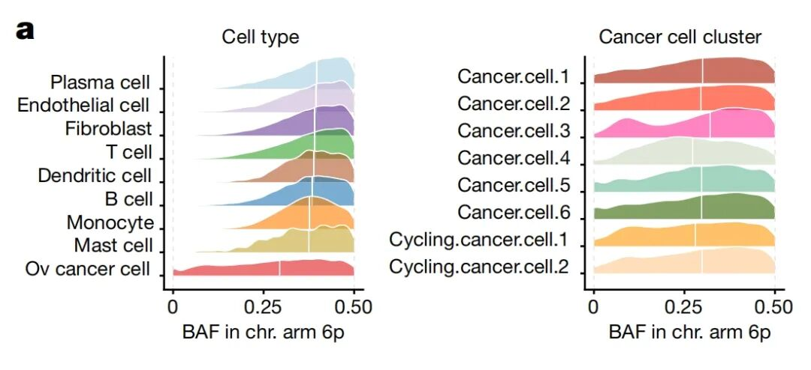
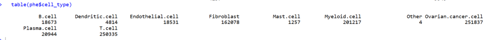
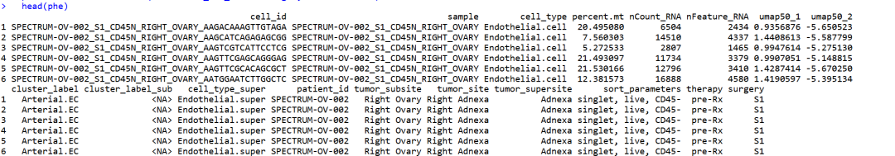
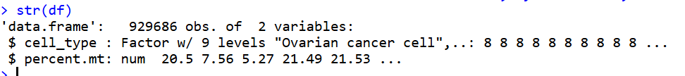
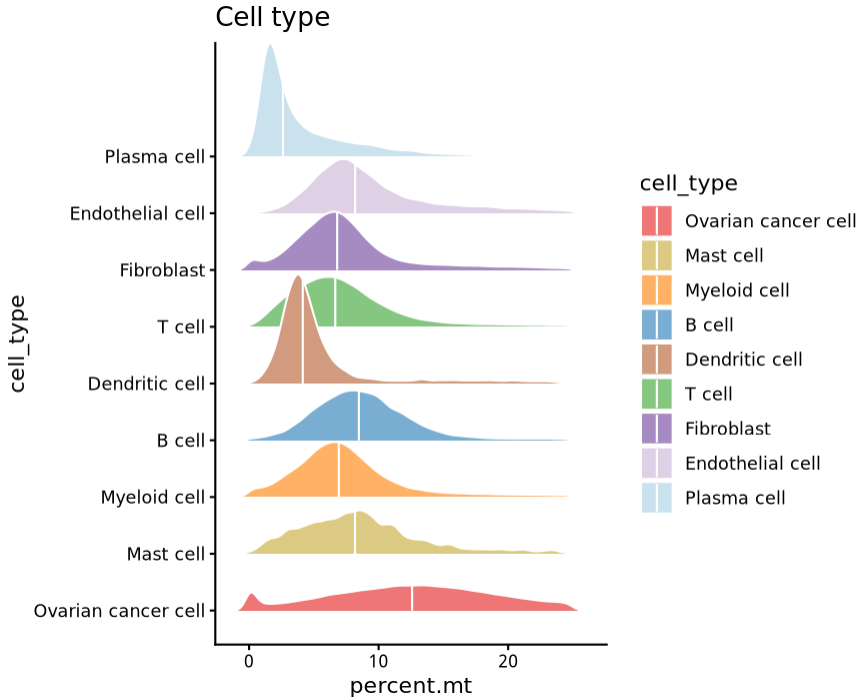
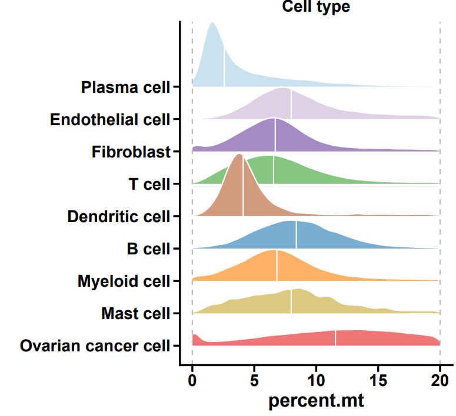

# 顶刊Nature杂志同款配色一流的山峦图

- 专辑：绘图小技巧2025
- 公众号：生信技能树
- 发布时间：2025-10-20 18:04
- 原文：[微信公众平台](https://mp.weixin.qq.com/s?__biz=MzAxMDkxODM1Ng%3D%3D&mid=2247546286&idx=1&sn=f0975bdc1fb6203637203a934aa3fd4b&chksm=9b4b7515ac3cfc030a726958cadb02f6fad0f799b17f86349ccaefe796d24700bff89e0f3d52)

---
> 今天分享一篇来自顶刊 Nature 杂志的山峦图，这个图配色一流，来自文献《Ovarian cancer mutational processes drive site-specific immune evasion》，于2022年12月14号发表在 Nature 上。



图注：

> 图5 \| HLA缺失作为一种免疫逃逸机制。a，左图，按细胞类型中位数 6p BAF 排序的单细胞 RNA 测序数据中 6 号染色体臂 6p BAF 的细胞分布。右图，癌症细胞簇中 6p BAF 的等位基因不平衡。白色垂直线表示中位数。Chr.，染色体

山峦图我们在前面也分享过一篇：[Nat Commun同款山脊图：千里江山图](https://mp.weixin.qq.com/s?__biz=MzAxMDkxODM1Ng%3D%3D&mid=2247540687&idx=1&sn=315b1f5757a97375a6425c3e751f7304#wechat_redirect)

## 数据背景

使用 signals 工具在 scrna-seq 数据中推断等位基因特异性拷贝数得到的结果，上面的山峦图展示的每个细胞亚群中得到的 BAF 在 6p 染色体上的结果分布。signals 这个工具的数据要求比较多，这里不太容易能够复现这个分析，感兴趣的可以去工具的网址看看那：https://shahcompbio.github.io/signals/articles/ASCN-RNA.html

我这里就找一下数据的随便一个特征绘制上面的图好了，这个特征只需要是每个细胞的连续值就行。

单细胞数据总共有156样本，共 929,686个细胞，上传到了 GEO：https://www.ncbi.nlm.nih.gov/geo/query/acc.cgi?acc=GSE180661，

此外在这里可以下载到 h5ad格式的注释后的数据：

scRNA-seq  cellxgene：https://cellxgene.cziscience.com/collections/4796c91c-9d8f-4692-be43-347b1727f9d8

我们从GEO下载：GSE180661_GEO_cells.tsv.gz 文件，读取进来：

```r
###
### juan zhang (492482942@qq.com)
###
rm(list=ls())
library(dplyr)
library(future)
library(Seurat)
library(data.table)
library(ggplot2)
library(patchwork)
library(stringr)
library(qs)
library(Matrix)

phe <- data.table::fread('GSE180661_GEO_cells.tsv.gz',data.table = F)
head(phe)
table(phe$sample)
table(phe$cell_type)
```

有细胞类型，还有每个细胞中的连续数据有 表达的umi数，基因数，线粒体基因表达比例：





我们就用上面的每个细胞亚群中表达的线粒体百分比绘图吧，看看每个亚群中的这个比值分布情况。后面你套用任何特征都可以。

## 山峦图绘制

#### 首先提取必要的绘图数据并进行预处理：

```r
## 数据预处理
df <- phe[,c("cell_type","percent.mt")]
table(df$cell_type)

# 去掉4个other 细胞
df <- df[df$cell_type!="Other", ]

# 将细胞名字中的. 换成空格
df$cell_type <- gsub("\."," ", df$cell_type)
head(df)
table(df$cell_type)

# 设置因子水平
df$cell_type <- factor(df$cell_type, levels = rev(c("Plasma cell", "Endothelial cell","Fibroblast","T cell","Dendritic cell",
                                                    "B cell","Myeloid cell","Mast cell","Ovarian cancer cell")))
str(df)
```



#### 使用ggplot2绘图：

```r
## 绘图
colors <- c("#cae2ee","#ded0e5","#a68bc2","#85c680","#d09b7e","#79aed2","#ffb266","#dcca83","#ee7677")
names(colors) <- c("Plasma cell", "Endothelial cell","Fibroblast","T cell","Dendritic cell",
                   "B cell","Myeloid cell","Mast cell","Ovarian cancer cell")
colors


library(ggridges)
p <- ggplot(df, aes(x = percent.mt, y = cell_type, fill = cell_type)) +
  geom_density_ridges(quantile_lines = TRUE, quantiles = 2, color= 'white', # #显示分位数线,2为显示中位数，颜色为白色
                      rel_min_height = 0.01, #尾部修剪，数值越大修剪程度越高
                      scale = 2, #山脊重叠程度，数值越大重叠度越高
                      ) +
  scale_fill_manual(values = colors) +
  ggtitle("Cell type") +
  theme_classic()
p
```



#### 美化修整一下：

```r
## 美化
p1 <- p +
  scale_x_continuous(limits = c(0.0, 20), breaks = seq(0, 20, by = 5)) +  # 设置线粒体范围0-20%
  geom_vline(xintercept = c(0.0, 20),size = 0.5, color = 'grey',lty = 'dashed') + # 添加两条竖着的虚线
  ylab(label = "") +
  theme(legend.position = 'none',  # 去掉图例
        # 设置标题居中、加粗、放大
        plot.title = element_text(hjust = 0.5, size = 14, face = "bold"),
        # 加粗和放大坐标轴线
        axis.line = element_line(color = "black", size = 0.8),
        # 加粗和放大x坐标轴刻度
        axis.ticks = element_line(color = "black", size = 0.8),
        axis.ticks.length = unit(0.2, "cm"),  # x坐标轴刻度线长度
        # 加粗和放大x坐标轴刻度标签
        axis.text = element_text(color = "black", size = 14, face = "bold"),
        # 加粗和放大x坐标轴标题
        axis.title = element_text(color = "black", size = 16, face = "bold")
        )
p1
ggsave(filename = "Fig5a.pdf",width = 5.5,height = 5,plot = p1)
```

最终结果如下：



今天分享到这~

如果上面的内容对你有帮助，欢迎一键三连~

友情转发：

- [生信入门&数据挖掘线上直播课10月班](https://mp.weixin.qq.com/s?__biz=MzAxMDkxODM1Ng%3D%3D&mid=2247545889&idx=1&sn=b7b37a458eead4645137126753d58c34#wechat_redirect)，你的生物信息学入门课

- [时隔5年，我们的生信技能树VIP学徒继续招生啦](https://mp.weixin.qq.com/s?__biz=MzAxMDkxODM1Ng%3D%3D&mid=2247525079&idx=1&sn=0b997af16a58195b4192691373048fd5#wechat_redirect)

- [满足你生信分析计算需求的低价解决方案](https://mp.weixin.qq.com/s?__biz=MzUzMTEwODk0Ng%3D%3D&mid=2247530048&idx=1&sn=28aa7bbd5e00521f79e074496a5f5d66#wechat_redirect)

- [生信故事会](https://mp.weixin.qq.com/mp/appmsgalbum?__biz=MzAxMDkxODM1Ng%3D%3D&action=getalbum&album_id=1679199708449144836#wechat_redirect)，来看看他们的生信入门故事

- [生信马拉松答疑专辑](https://mp.weixin.qq.com/mp/appmsgalbum?__biz=MzAxMDkxODM1Ng%3D%3D&action=getalbum&album_id=3690970204957147140#wechat_redirect)，获取你的生信专属答疑

<!-- wechat-article-fetcher: complete -->
