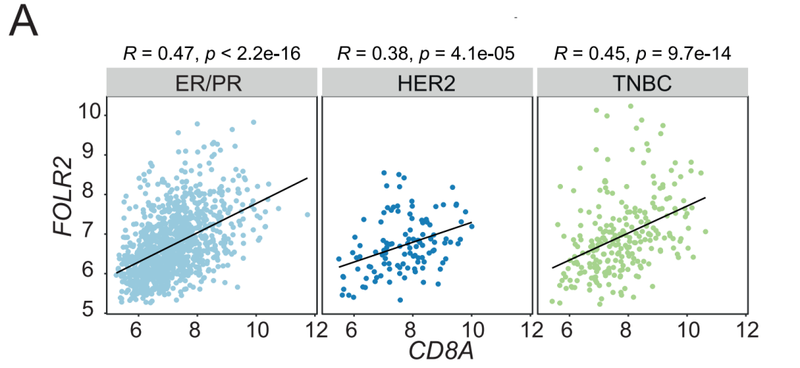
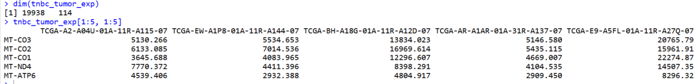
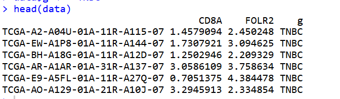
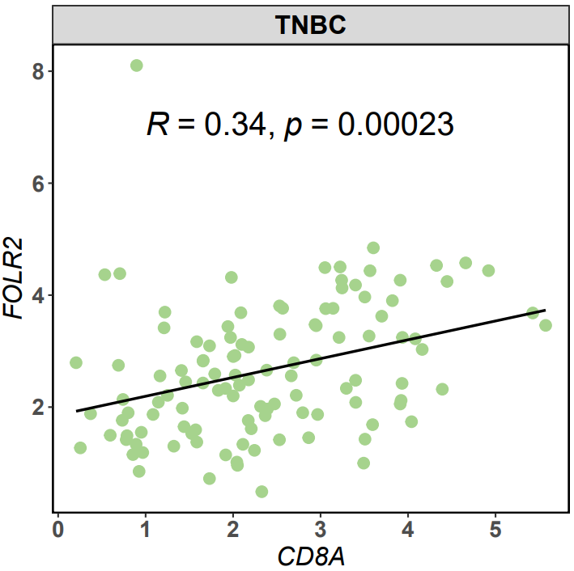

# Cell杂志同款高颜值两个基因的表达相关性图绘制

- 专辑：绘图小技巧2025
- 公众号：生信技能树
- 发布时间：2025-10-13 23:13
- 原文：[微信公众平台](https://mp.weixin.qq.com/s?__biz=MzAxMDkxODM1Ng%3D%3D&mid=2247546162&idx=1&sn=9f471da5c4d90ef63e18334d512b5ede&chksm=9b4b7589ac3cfc9ffcfdb24f3a0aaa751df5223da3d8be29cb34c5080a81117b7b496f173d31)

---
> 每周一的科研绘图结果美化时间又到了，给你提供各种美化思路技巧，关注我们不迷路《[绘图小技巧2025](https://mp.weixin.qq.com/mp/appmsgalbum?__biz=MzAxMDkxODM1Ng%3D%3D&action=getalbum&album_id=3792985494804332545#wechat_redirect)》！今天来学习一篇2022年3月31号发表在顶刊Cell杂志上的文献，标题为《Tissue-resident FOLR2+ macrophages associate with CD8+ T cell infiltration in human breast cancer》，这篇文献中的图也都很好看，**「今天来看看基因表达相关性图吧，一个使用非常多的图~」**

这个散点图展示了乳腺癌中三个亚型ER/PR、HER2以及三阴性乳腺癌TNBC中，FOLR2 和 CD8A 基因表达的相关性：



图注：

> Figure S6. (A) Correlation between FOLR2 and CD8A expression in patients from the METABRIC dataset stratified by subtypes

## 示例数据

作者使用的TCGA数据库的乳腺癌样本，数据下载方法以及样本类型整理见下面这个帖子：

[WGCNA鉴定三阴性乳腺癌中的core lncRNA之数据提取（2025版）](https://mp.weixin.qq.com/s?__biz=MzAxMDkxODM1Ng%3D%3D&mid=2247538714&idx=1&sn=cd0e8fe469587ea4000fa18342cf9541#wechat_redirect)

上面的整理还比较繁琐，我这里直接提供一个整理好的表达矩阵：TCGA_BRCA/mrna_fpkm_tnbc.Rdata

这个Rdata里面包含了TNBC和乳腺癌旁样本，链接: https://pan.baidu.com/s/1NKC1rNP9FqyUma_SVzHNQA?pwd=nc3r

#### 数据直接加载进来：

```r
# 挑选三阴性乳腺癌的样本
# 参考链接 https://mp.weixin.qq.com/s/t48BBhj19LZtLNcuHM3QEQ
rm(list = ls())
library(ggplot2)
library(ggpubr)
library(ggprism)

################################################
## 官网的数据看看
## 整合

# 加载三阴性乳腺癌对应的fpkm矩阵
load(file = 'TCGA_BRCA/mrna_fpkm_tnbc.Rdata')
dim(mrna_fpkm_tnbc)
mrna_fpkm_tnbc[1:5, 1:5]

# 看一下样本类型，前面应该保存的是正常和TNBC的都有
table(substr(colnames(mrna_fpkm_tnbc),14,16))

# 提取出来肿瘤样本
tnbc_tumor_exp <- mrna_fpkm_tnbc[,substr(colnames(mrna_fpkm_tnbc),14,16)=="01A"]
dim(tnbc_tumor_exp)
tnbc_tumor_exp[1:5, 1:5]
```



这里的样本数筛选完感觉比文献中的要少一些。

##### 提取图中的两个基因的表达：

```r
## 提取CD8A与FOLR2的表达
data <- t(tnbc_tumor_exp[c("CD8A","FOLR2"), ])
data <- log2(data+1)
data <- as.data.frame(data)
head(data)
range(data)
data$g <- "TNBC"
```



## 绘制相关性图

使用ggpubr包中的`ggscatter()`函数绘制，这个包支持ggplot2的语法，可以随意修改。

此外这里的相关性可以使用pearson（数据需要log转换，避免离群点的影响），或者 spearman（不需要log，比较值的相对大小，log是单调函数，转不转都可以）。

```r
## 绘图
p <- ggscatter(data, x = "CD8A", y = "FOLR2", color = "#a6d38d", add = "none", conf.int =F,size = 3) +  # 置信区间的填充色
  stat_cor(method = "pearson",  # 相关系数的计算方法
           label.x = 1,  # 相关系数标签的 x 坐标
           label.y = 7, # 相关系数标签的 y 坐标
           size = 7) +  # 相关系数标签的大小
  geom_smooth(method = "lm", color = "black", linetype = "solid",linewidth = 0.8,se = F) + # 回归线的线型
  labs(x = "CD8A", y = "FOLR2") +
  facet_grid(~g) +
  theme_bw() +
  theme(
    # 加粗边框
    panel.border = element_rect(color = "black", size = 0.8, fill = NA),
    # 加粗加大坐标轴标签
    axis.text = element_text(face = "bold", size = 14),
    axis.title = element_text(face = "italic", size = 16),
    # 加粗加大分面标题
    strip.text = element_text(face = "bold", size = 16, color = "black"),
    # 去掉背景网格线
    panel.grid.major = element_blank(),
    panel.grid.minor = element_blank()
  )
p

# 保存，找到一个合适的尺寸保存
ggsave(filename = "tnbc_cd8a-folr2_cor.pdf", width = 5,height = 5,plot = p)
```

#### 结果如下：



#### 然后上面的其他两个乳腺癌亚型可以同样的绘制，最后拼图在一起就ok啦！

#### 学废了吗~

#### 如果上面的内容对你有帮助，欢迎一键三连！

友情转发：

- [生信入门&数据挖掘线上直播课10月班](https://mp.weixin.qq.com/s?__biz=MzAxMDkxODM1Ng%3D%3D&mid=2247545889&idx=1&sn=b7b37a458eead4645137126753d58c34#wechat_redirect)，你的生物信息学入门课

- [时隔5年，我们的生信技能树VIP学徒继续招生啦](https://mp.weixin.qq.com/s?__biz=MzAxMDkxODM1Ng%3D%3D&mid=2247525079&idx=1&sn=0b997af16a58195b4192691373048fd5#wechat_redirect)

- [满足你生信分析计算需求的低价解决方案](https://mp.weixin.qq.com/s?__biz=MzUzMTEwODk0Ng%3D%3D&mid=2247530048&idx=1&sn=28aa7bbd5e00521f79e074496a5f5d66#wechat_redirect)

- [生信故事会](https://mp.weixin.qq.com/mp/appmsgalbum?__biz=MzAxMDkxODM1Ng%3D%3D&action=getalbum&album_id=1679199708449144836#wechat_redirect)，来看看他们的生信入门故事

- [生信马拉松答疑专辑](https://mp.weixin.qq.com/mp/appmsgalbum?__biz=MzAxMDkxODM1Ng%3D%3D&action=getalbum&album_id=3690970204957147140#wechat_redirect)，获取你的生信专属答疑

<!-- wechat-article-fetcher: complete -->
