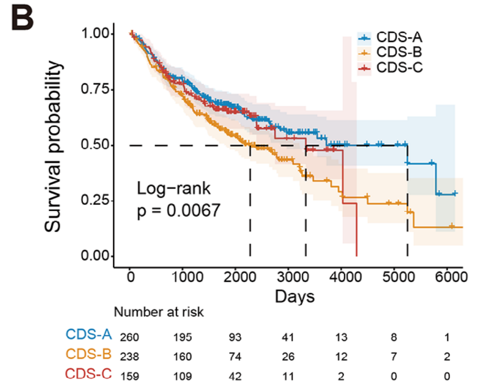
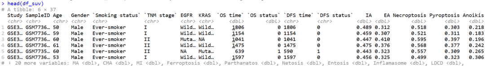
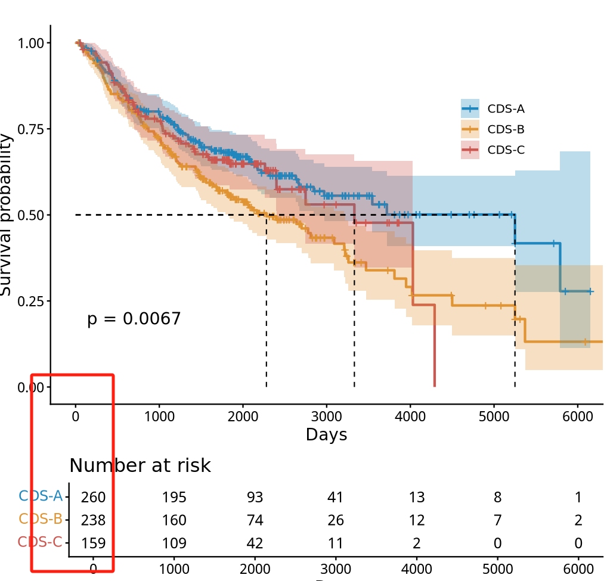
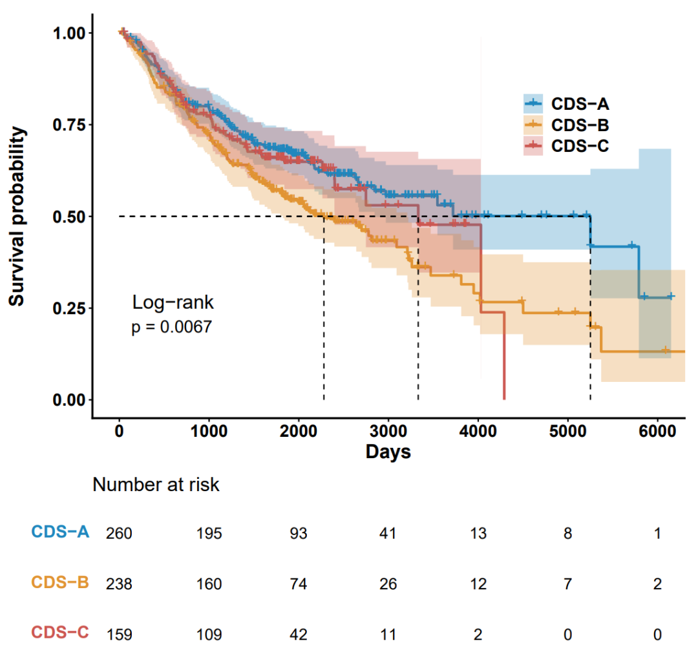

# 高分杂志中同款高颜值生存曲线图绘制

- 专辑：绘图小技巧2025
- 公众号：生信技能树
- 发布时间：2025-09-29 23:58
- 原文：[微信公众平台](https://mp.weixin.qq.com/s?__biz=MzAxMDkxODM1Ng%3D%3D&mid=2247545975&idx=1&sn=5efe43e8c3692b41af301346c4bbad51&chksm=9b4b74ccac3cfdda422f0e1456adb965811c612a73ccea356d00a5fd72b2c0bd1aa4ac9ec897)

---
> 2025年5月发表在MedComm杂志上的文献，标题为《Cell Death and Senescence-Based Molecular Classification and an Individualized Prediction Model for Lung Adenocarcinoma》，今天学习其中的生存曲线绘制~

图如下：展示的LUAD数据的样本分型CDS三组的总生存时间差异，**「这个生存曲线颜色比较好看，然后图的上部分和下部分都使用ggplot2经过了精细的调整，今天就用非常规手段代码技巧来修饰它！」**



图注：

> Fig2. Clustering for CDS regulation patterns, clinicopathological features, biological functions, and TME characteristics of each pattern.  (B and C) Kaplan–Meier curves of OS for three CDS subtypes of patients in the (B) LuMMD.

## 文献的简单背景

本研究对15个队列中的1788例肺腺癌病例的21种CDS特征的活性及其相互联系进行了特征分析，并采用无监督聚类方法将患者分为三种具有不同TME特征的CDS亚型。通过主成分分析得出的CDS指数（CDSI）被开发用于评估个体肿瘤的CDS调控模式。通过单细胞分析，确定了12个CDSI核心基因，这些基因在TME中的增殖T细胞中富集，并验证了它们的功能作用和预后意义。

在发现队列、四个独立验证队列以及亚组分析中，高CDSI与改善的总生存率相关。CDSI低的患者对免疫治疗有良好的临床反应，并可能对有丝分裂途径药物敏感，而CDSI高的患者可能从针对ERK/MAPK和MDM2–p53途径的药物中受益。

进一步使用9185个泛癌样本验证了CDSI的临床应用价值，证明了我们的预测模型在各种癌症类型中的广泛相关性及其在癌症管理中的潜在临床意义。

几个缩写：

- cell death and cellular senescence (CDS)

- The CDS index (CDSI)

- regulated cell death (RCD)

## 示例数据

上面的图数据作者放在了附件：https://pmc.ncbi.nlm.nih.gov/articles/instance/12122187/bin/MCO2-6-e70237-s002.xlsx

其中的Table S6，读取进来：

```r
rm(list=ls())
library(readxl)
library(survminer)
library(survival)

## 1.读取数据
# CDS 定量以及生存信息
df_suv <- readxl::read_excel("MCO2-6-e70237-s002.xlsx", sheet = "Table S6", skip = 1)
head(df_suv)
colnames(df_suv)
```



#### 简单的处理一下：

```r
# 去掉生存数据NA值
df_suv <- df_suv[df_suv$`OS time`!="NA" & df_suv$`OS status`!="NA", ]
df_suv$`OS time`
df_suv$`OS status`
df_suv$`OS time` <- as.numeric(df_suv$`OS time`)
df_suv$`OS status` <- as.numeric(df_suv$`OS status`)
# 去掉生存期为0的数据
df_suv <- df_suv[df_suv$`OS time`>30,]
# 样本数
table(df_suv$`CDS cluster`)
colnames(df_suv)
```

#### 提取相关信息：

```r
## 绘图：生存曲线KM图
data <- df_suv[,c("SampleID","OS time","OS status","CDS cluster")]
colnames(data) <- c("SampleID","OStime","OSstatus","CDScluster")
fit <- survfit(Surv(data$OStime, data$OSstatus) ~ data$CDScluster, data = data)
fit
```

## ggsurvplot绘图

这个包绘图感觉有些参数不是很好修改，就用了一些骚操作修改：

```r
p <- ggsurvplot(fit, data = data, conf.int = TRUE,
            pval = TRUE,             # 添加P值
            surv.median.line = "hv", # 添加中位生存时间线
            risk.table = TRUE,       # 添加风险表
            legend = c(0.8,0.75),    # 指定图例位置
            legend.title = "",       # 设置图例标题
            legend.labs = c("CDS-A", "CDS-B","CDS-C"), # 指定图例分组标签
            palette = c("#1f87be", "#e19433","#cc5650"),
            xlab = "Days", # 指定x轴标签
            break.x.by = 1000,          # 设置x轴刻度间距
            title = ""  # 添加图表标题，
           )
p
```



> 这里可以看到上下是没有对齐的，而且坐标轴，标签等各种字体和图例大小修改都需要，来一下骚操作：

#### 修改上部分：

```r
p$plot <- p$plot +
  annotate("text", x = 600, y = 0.21, label = "Log-rank", size = 5.5, color = "black", hjust = 0.5, vjust = -1)  # 设置文本样式

p$plot@theme$axis.title.x@face <- "bold"
p$plot@theme$axis.title.x@size <- 16
p$plot@theme$axis.title.y@face <- "bold"
p$plot@theme$axis.title.y@size <- 16

p$plot@theme$axis.line@linewidth <- 0.8
p$plot@theme$axis.text.x@size  <- 14
p$plot@theme$axis.text.x@face  <- "bold"
p$plot@theme$axis.text.y@size  <- 14
p$plot@theme$axis.text.y@face  <- "bold"
p$plot@theme$legend.text@size <- 14
p$plot@theme$legend.text@face <- "bold"
```

#### 修改下面的部分：

```r
p$table@theme$axis.text.y$size <- 14
p$table@theme$axis.text.y$face <- "bold"
p$table

p$table <- p$table +
  xlab(NULL) +
  theme(
    # 去掉 x 和 y 坐标轴的刻度和标签
    axis.text.x = element_blank(),  # 去掉 x 轴刻度标签
    axis.ticks.x = element_blank(), # 去掉 x 轴刻度线
    axis.ticks.y = element_blank(), # 去掉 y 轴刻度线
    axis.line = element_blank()     # 去掉坐标轴线
  )
p$table
```

#### 将两个部分拼在一起解决对不齐的问题：

```r
library(patchwork)
# 垂直拼接，调整图形的相对高度
pt <- p$plot / p$table + plot_layout(nrow = 2, heights = c(2, 0.8))
ggsave(filename = "svr_os.pdf", plot = pt, width = 8, height = 8,bg = "white")
```

结果如下：



完美！

大家假期快乐~

友情转发：

- [生信入门&数据挖掘线上直播课10月班](https://mp.weixin.qq.com/s?__biz=MzAxMDkxODM1Ng%3D%3D&mid=2247545889&idx=1&sn=b7b37a458eead4645137126753d58c34#wechat_redirect)，你的生物信息学入门课

- [时隔5年，我们的生信技能树VIP学徒继续招生啦](https://mp.weixin.qq.com/s?__biz=MzAxMDkxODM1Ng%3D%3D&mid=2247525079&idx=1&sn=0b997af16a58195b4192691373048fd5#wechat_redirect)

- [满足你生信分析计算需求的低价解决方案](https://mp.weixin.qq.com/s?__biz=MzUzMTEwODk0Ng%3D%3D&mid=2247530048&idx=1&sn=28aa7bbd5e00521f79e074496a5f5d66#wechat_redirect)

- [生信故事会](https://mp.weixin.qq.com/mp/appmsgalbum?__biz=MzAxMDkxODM1Ng%3D%3D&action=getalbum&album_id=1679199708449144836#wechat_redirect)，来看看他们的生信入门故事

- [生信马拉松答疑专辑](https://mp.weixin.qq.com/mp/appmsgalbum?__biz=MzAxMDkxODM1Ng%3D%3D&action=getalbum&album_id=3690970204957147140#wechat_redirect)，获取你的生信专属答疑

<!-- wechat-article-fetcher: complete -->
