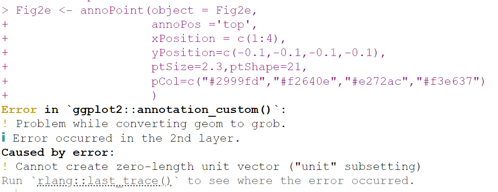
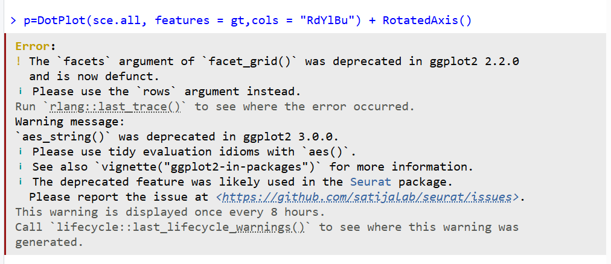
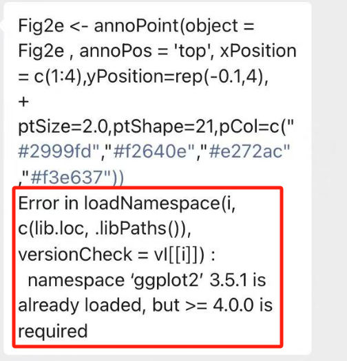
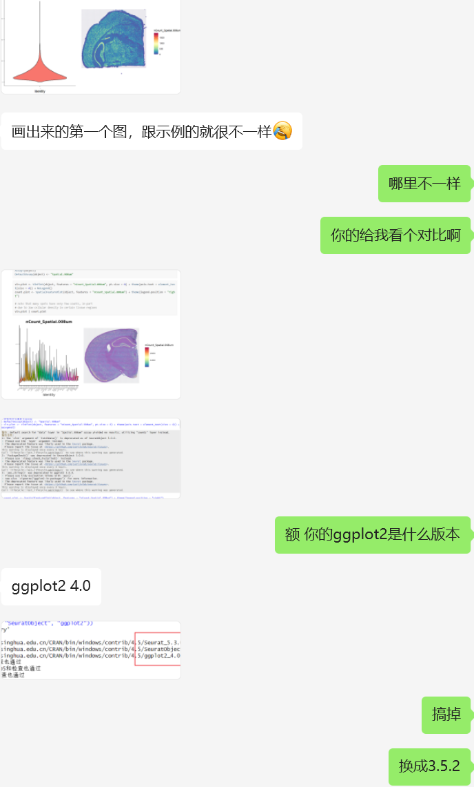
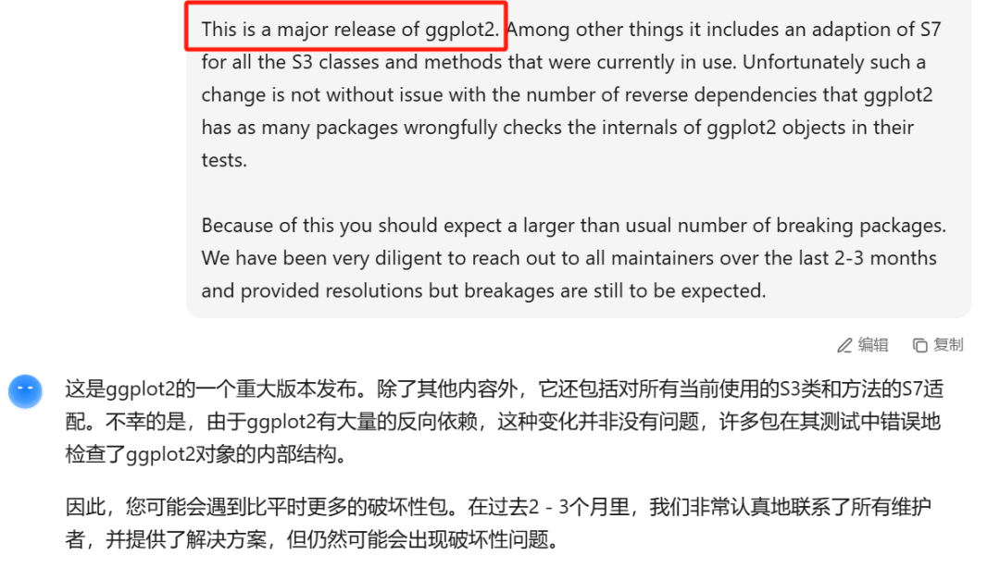
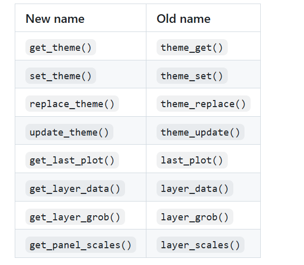

# ggplot2版本发布重大更新：v4.0.0（影响了超多其依赖他的包）

- 专辑：绘图小技巧2025
- 公众号：生信技能树
- 发布时间：2025-09-23 11:38
- 原文：[微信公众平台](https://mp.weixin.qq.com/s?__biz=MzAxMDkxODM1Ng%3D%3D&mid=2247545899&idx=1&sn=5bcc4404979a94e0b1ae66ae34b903b7&chksm=9b4b7490ac3cfd868a463a58f96c3ccdc6ee6c0437405342b37e21e3a5dbdf3bf8f542d49b36)

---
> 你最近画图是不是频繁地遇到各种报错？包括但不限于以下内容：







#### 好基友也发了一个报错来：



## 重大更新内容

https://github.com/tidyverse/ggplot2/blob/main/NEWS.md



## 更新了哪些内容呢？

### ggplot2 4.0.0 Breaking changes

- **「ggplot2的S3部分已被S7组件替换（\#6352）。」**

- **「（重大变更）」**geom_violin（quantiles）现在基于数据的实际分位数，而不是基于计算出的密度推断的分位数。取代draw_quantiles的分位数参数现在属于stat_ydensity（），而不是geom_violin（）（@teunbrand，\#4120）。

- **「（重大变更）」**可以在主题中一次性设置所有几何对象的默认值。（@teunbrand，基于@dpseidel的开创性工作，\#2239）

  - 新增了一个theme（geom）参数用于跟踪这些默认值。

  - 可以使用element_geom（）函数来填充该参数。

  - from_theme（）函数允许在aes（）函数内部访问主题默认字段。

- 在描述文件中**「移动了以下包」**。如果您的包依赖ggplot2来安装这些依赖项，您可能需要将它们列在您自己的DESCRIPTION文件中（\#5986）。

  - 将mgcv从Imports移动到Suggests

  - 将tibble从Imports移动到Suggests

  - 移除了glue依赖

- 默认标签现在是在build_ggplot（）（以前是ggplot_build（））中派生的，而不是在update_ggplot（）（以前是ggplot_add.Layer（））的图层方法中。这可能会影响访问plot\$labels属性的代码（@teunbrand，\#5894）。

- 在分箱统计中，现在默认边界的选择更好地遵循nbin参数。这可能会影响使用默认分箱的图表（@teunbrand，\#5882，\#5036）。

### Lifecycle changes

- **「在ggplot2 3.0.0之前的版本中，已弃用的函数和参数现在会抛出错误而不是警告。」**

- **「在ggplot2 3.4.0之前的版本中，被软弃用的函数和参数现在会抛出警告。」**

- annotation_borders（）取代了现**「已弃用」**的borders（）（@teunbrand，\#6392）

- 在geom_bar（）/geom_col（）中**「关闭了」**将尺寸回退到线宽转换的功能（\#4848）。

- 在geom_boxplot（）、geom_crossbar（）和geom_pointrange（）中，fatten参数**「已被弃用」**（@teunbrand，\#4881）。

- **「以下方法已被弃用」**：fortify.lm（）、fortify.glht（）、fortify.confint.glht（）、fortify.summary.glht（）和fortify.cld（）。建议使用broom::augment（）和broom::tidy（）来替代（@teunbrand，\#3816）。

- geom_errorbarh（）**「已被弃用」**，建议使用geom_errorbar（orientation = “y”）来替代（@teunbrand，\#5961）。

- 为了保持一致性并实现更好的自动补全功能，特殊的getter和setter函数**「已重命名」**为带有get\_\*和set\_\*前缀的函数。旧的名称仍然可用，以确保向后兼容性（@teunbrand，\#5568）。



- `facet_wrap()`为`dir`参数**「新增了」**选项，以便更好地控制面板方向。这些新选项取代了现已弃用的`as.table`参数的相关功能。在内部，`dir = "h"`或`dir = "v"`已被弃用（@teunbrand，\#5212）。

- `coord_trans()`**「已被重命名」**为`coord_transform()`（@nmercadeb，\#5825）。

更多更新细节可以看：https://github.com/tidyverse/ggplot2/blob/main/NEWS.md

## 让子弹先飞一会

这种重大更新的影响应该还挺大的，可以先等一段时间。各位可以先还是保持ggplot2 3.5.2的版本，方法如下：

```r
# 检查包的版本
packageVersion("ggplot2")
# 安装3.5.2版本
remotes::install_version("ggplot2", version = "3.5.2")
# 安装后需要重启Rstudio
```

当然，如果你没有遇到任何报错，就不用更改任何东西！

友情转发：

- [生信入门&数据挖掘线上直播课10月班](https://mp.weixin.qq.com/s?__biz=MzAxMDkxODM1Ng%3D%3D&mid=2247545889&idx=1&sn=b7b37a458eead4645137126753d58c34#wechat_redirect)，你的生物信息学入门课

- [时隔5年，我们的生信技能树VIP学徒继续招生啦](https://mp.weixin.qq.com/s?__biz=MzAxMDkxODM1Ng%3D%3D&mid=2247525079&idx=1&sn=0b997af16a58195b4192691373048fd5#wechat_redirect)

- [满足你生信分析计算需求的低价解决方案](https://mp.weixin.qq.com/s?__biz=MzUzMTEwODk0Ng%3D%3D&mid=2247530048&idx=1&sn=28aa7bbd5e00521f79e074496a5f5d66#wechat_redirect)

- [生信故事会](https://mp.weixin.qq.com/mp/appmsgalbum?__biz=MzAxMDkxODM1Ng%3D%3D&action=getalbum&album_id=1679199708449144836#wechat_redirect)，来看看他们的生信入门故事

- [生信马拉松答疑专辑](https://mp.weixin.qq.com/mp/appmsgalbum?__biz=MzAxMDkxODM1Ng%3D%3D&action=getalbum&album_id=3690970204957147140#wechat_redirect)，获取你的生信专属答疑

<!-- wechat-article-fetcher: complete -->
