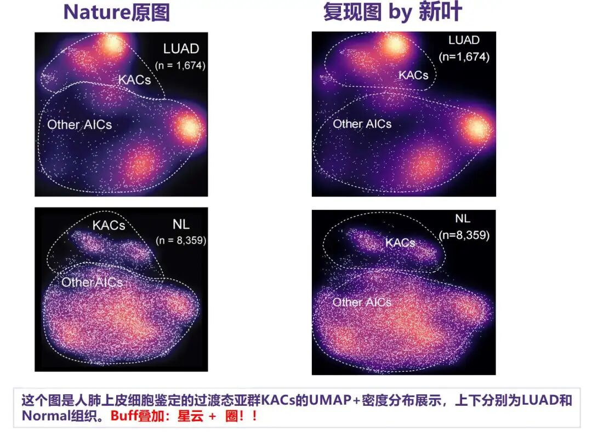
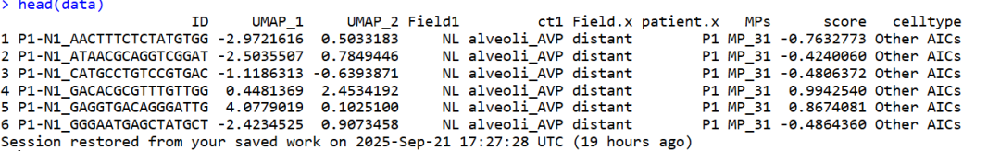
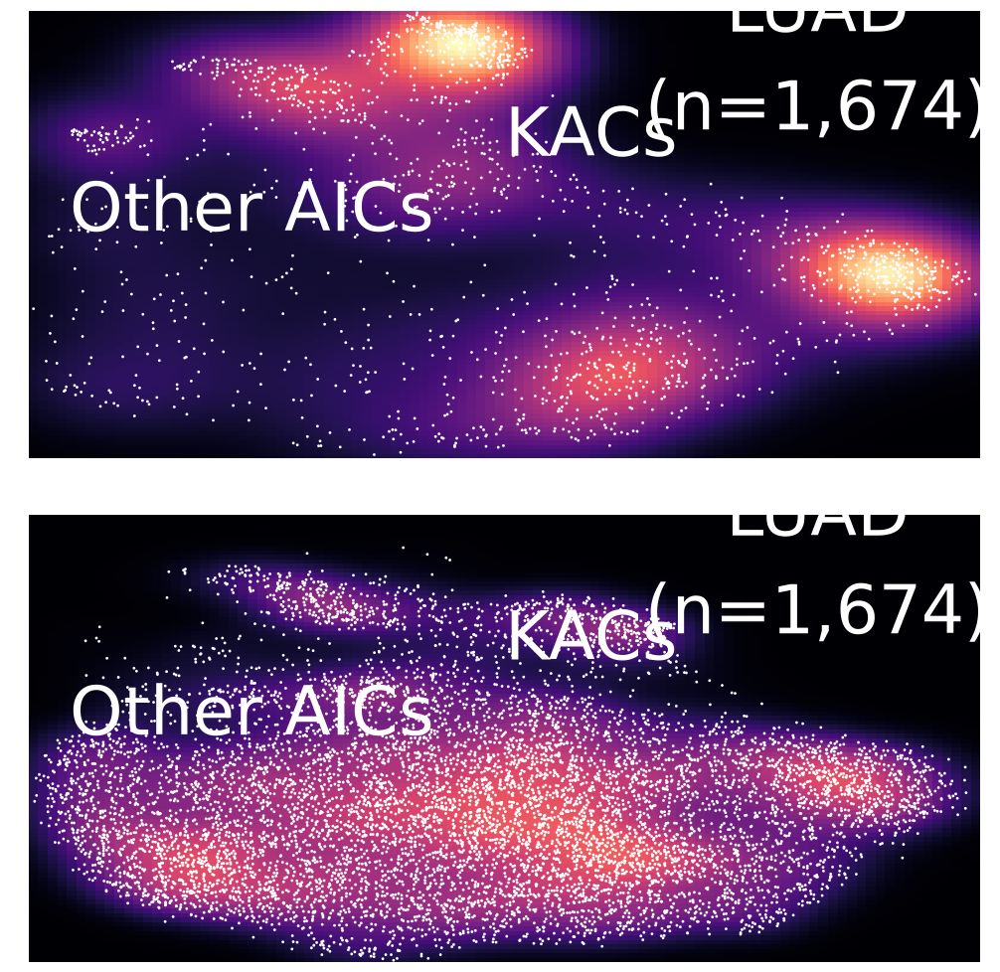
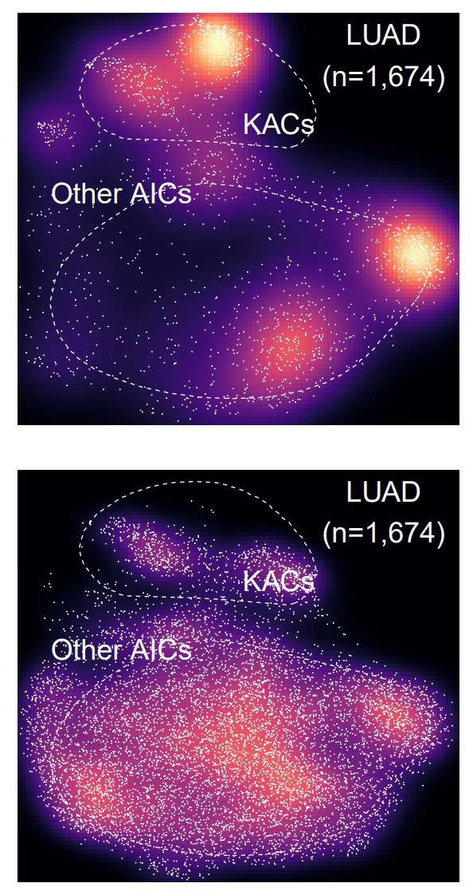
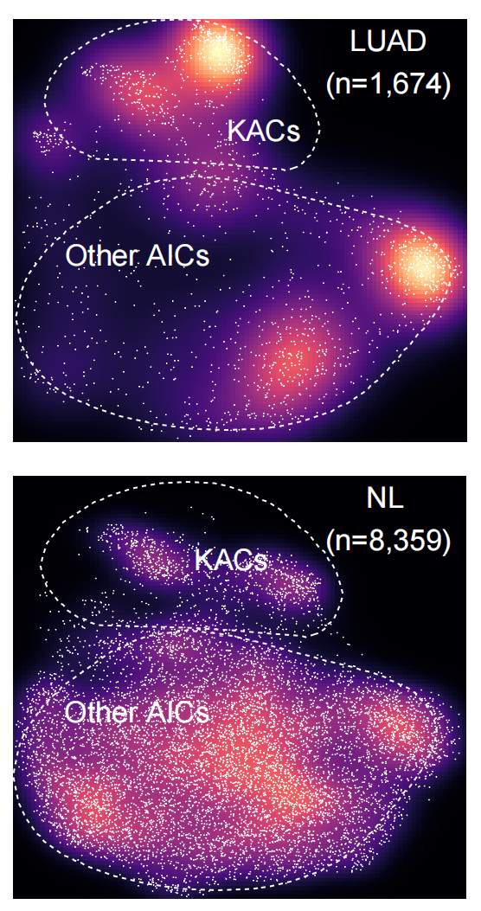

# Nature杂志同款高颜值单细胞星云+圈款UMAP图

- 专辑：绘图小技巧2025
- 公众号：生信技能树
- 发布时间：2025-09-22 20:58
- 原文：[微信公众平台](https://mp.weixin.qq.com/s?__biz=MzAxMDkxODM1Ng%3D%3D&mid=2247545881&idx=1&sn=08f74aef7c233b8d4725408c628ece2d&chksm=9b4b74a2ac3cfdb4c1ef21523ceb24922af9b05acc7cc926775fe06781cc4de17bae0cdd49ac)

---
> 又是每周一的绘图环节啦，今天学习2024年2月28发表在nature杂志上《An atlas of epithelial cell states and plasticity in lung adenocarcinoma》中的一个umap图，这个UMAP图集攒了我们前面给大家介绍的星系UMAP+给UMAP加个圈！

前面的UMAP款式：

- [5种方式美化你的单细胞umap散点图](https://mp.weixin.qq.com/s?__biz=MzAxMDkxODM1Ng%3D%3D&mid=2247536822&idx=1&sn=5f695d4ee6d8ba00a0961c02c4cf83bd#wechat_redirect)

- [给你的单细胞umap图加个cell杂志同款的圈](https://mp.weixin.qq.com/s?__biz=MzAxMDkxODM1Ng%3D%3D&mid=2247537290&idx=1&sn=ad76831349df67bb5236370dab088536#wechat_redirect)

- [画个同款新奇的“Galaxy”星系UMAP图（Nat Immunol：IF27.8）](https://mp.weixin.qq.com/s?__biz=MzAxMDkxODM1Ng%3D%3D&mid=2247538773&idx=1&sn=094b2cef83702267589de13dd50a0b58#wechat_redirect)

学习的图如下：这个图是人肺上皮细胞鉴定的过渡态亚群KACs的UMAP+密度分布展示，上下分别为LUAD和Normal组织。Buff叠加：星云 +  圈！！



图注：

> Extended Data Fig. 3 \| Phenotypic diversity and states of human normal lung epithelial cells.  k, Differences in cell densities between LUAD (top) and NL tissues (bottom)

## 绘图数据

上面这个图的数据需要umap坐标以及细胞类型对应的标签，作者提供在代码中：https://github.com/guangchunhan/LUAD_Code/tree/main/Input_data

对应的文件为：

umap坐标：LUAD_Code-main/Input_data/Fig2h_KAC_UmapData.rds

细胞类型注释文件：LUAD_Code-main/Input_data/Fig2k_VlnPlotData-v1.rds

读取数据：

```r
library(ggplot2)
library(viridis)
library(ggpubr)

data_umap = readRDS('LUAD_Code-main/Input_data/Fig2h_KAC_UmapData.rds')
data_umap <- as.data.frame(data_umap)
head(data_umap)

data_celltype = readRDS('LUAD_Code-main/Input_data/Fig2k_VlnPlotData-v1.rds')
data_celltype <- as.data.frame(data_celltype)
head(data_celltype)
table(data_celltype$celltype)

data <- merge(data_umap, data_celltype, by="ID")
dim(data)
table(data$celltype)
table(data$Field1)
table(data$Field1, data$celltype)

data$Field1 = factor(data$Field1,levels = c('tumor','NL'))
head(data)
```



## 定义星云图的主图

这里作者给的代码直接定义了一个主题，如下：

```r
## figure2h: galaxy plot showing cell density of KAC in UMAP separating LUAD and normal lung tissue
## 定义一个黑色背景的主题
galaxyTheme_black = function(base_size = 12, base_family = "") {
  theme_grey(base_size = base_size, base_family = base_family) %+replace%
    theme(
      # Specify axis options
      axis.line = element_blank(),
      axis.text.x = element_text(size = base_size*0.8, color = "white", lineheight = 0.9),
      axis.text.y = element_text(size = base_size*0.8, color = "white", lineheight = 0.9),
      axis.ticks = element_line(color = "white", size  =  0.2),
      axis.title.x = element_text(size = base_size, color = "white", margin = margin(0, 10, 0, 0)),
      axis.title.y = element_text(size = base_size, color = "white", angle = 90, margin = margin(0, 10, 0, 0)),
      axis.ticks.length = unit(0.3, "lines"),
      # Specify legend options
      legend.background = element_rect(color = NA, fill = "black"),
      legend.key = element_rect(color = "white",  fill = "black"),
      legend.key.size = unit(1.2, "lines"),
      legend.key.height = NULL,
      legend.key.width = NULL,
      legend.text = element_text(size = base_size*0.8, color = "white"),
      legend.title = element_text(size = base_size*0.8, face = "bold", hjust = 0, color = "white"),
      legend.position = "none",
      legend.text.align = NULL,
      legend.title.align = NULL,
      legend.direction = "vertical",
      legend.box = NULL,
      # Specify panel options
      panel.background = element_rect(fill = "black", color  =  NA),
      panel.border = element_rect(fill = NA, color = "white"),
      ##panel.grid.major = element_line(color = "grey35"),
      panel.grid.major = element_blank(),
      ##panel.grid.minor = element_line(color = "grey20"),
      panel.grid.minor = element_blank(),
      panel.spacing = unit(0.5, "lines"),
      # Specify facetting options
      strip.background = element_rect(fill = "grey30", color = "grey10"),
      strip.text.x = element_text(size = base_size*0.8, color = "white"),
      strip.text.y = element_text(size = base_size*0.8, color = "white",angle = -90),
      # Specify plot options
      plot.background = element_rect(color = "black", fill = "black"),
      plot.title = element_text(size = base_size*1.2, color = "white"),
      plot.margin = unit(rep(1, 4), "lines")
    )
}
```

## 绘图

### 1、基本星系图

先绘制一个基本星系图，我对作者提供的代码进行了一些修改：

```r
# stat_density_2d：计算二维密度。
# aes(fill = ..density..)：将密度值映射到填充颜色。
# geom = "raster"：使用栅格几何对象来绘制密度图。
# contour = F：不绘制等高线。

Fig2h_Umap = ggplot(data = data, aes(x = UMAP_1, y = UMAP_2)) +
  stat_density_2d(aes(fill = ..density..), geom = "raster",contour = F) +
  geom_point(color = 'white',size = .02) +
  annotate(geom = "text", x = 1, y = 4, label = "KACs", color = "white",size =12) +
  annotate(geom = "text", x = -2, y = 2, label = "Other AICs", color = "white",size = 12) +
  annotate(geom = "text", x = 3, y = 6, label = "LUAD
(n=1,674)", color = "white",size = 12) +
  facet_wrap(~Field1,ncol = 1) +
  scale_fill_viridis(option="magma") +
  galaxyTheme_black() +
  theme_void() +
  theme(strip.text = element_blank(),  # 去掉分面标题
        legend.position = "none" )   # 去掉图例
Fig2h_Umap
```



这个我还没有保存出去，作者提示保存出去的时候，图片的尺寸要设置大一点。

### 2、加圈

加圈的代码见：[给你的单细胞umap图加个cell杂志同款的圈](https://mp.weixin.qq.com/s?__biz=MzAxMDkxODM1Ng%3D%3D&mid=2247537290&idx=1&sn=ad76831349df67bb5236370dab088536#wechat_redirect)。

并且保存为pdf：注意保存代码上面的备注

```r
## 加圈
library(mascarade)
# 制作masktable
# smoothSigma = 0.05：控制加圈的平滑成都，值越大加的圈越平滑
# minDensity ：控制 加圈的松紧成都，值越小，加的圈边界与umap散点距离越大越宽松
maskTable <- generateMask( dims=data[,2:3], cluster=data$celltype, minDensity = 15,smoothSigma = 0.1 )
class(maskTable)
dim(maskTable)
head(maskTable)

Fig2h <- Fig2h_Umap +
  geom_path(data=maskTable, aes(group=group),linewidth=0.6,linetype = 2, colour = "white")
Fig2h

##suggest to save in a figure with large width and height, cause the cell dots plotted in a small figure affect the visualization of the actual density
ggsave(filename = "Fig2h_Umap.pdf",height = 15, width = 8,plot = Fig2h)
```

结果如下：已经差不多啦，还需要修改一下细节~



### 3、AI修改细节

使用下面这个软件 Adobe lllustrator 打开 保存的 pdf文件：Fig2h_Umap.pdf


1.将下面的分面中的 LUAD(n=1,674) 改为 NL(n=8,359)

2.调整圈的位置，字体的位置

最终效果如下：



#### 完美！今天分享到这~

#### 如果对你有帮助，求一键三连~

友情转发：

- [生信入门&数据挖掘线上直播课9月班](https://mp.weixin.qq.com/s?__biz=MzAxMDkxODM1Ng%3D%3D&mid=2247545329&idx=1&sn=71930835b79306606c59d7aa8c632490#wechat_redirect)，你的生物信息学入门课

- [时隔5年，我们的生信技能树VIP学徒继续招生啦](https://mp.weixin.qq.com/s?__biz=MzAxMDkxODM1Ng%3D%3D&mid=2247525079&idx=1&sn=0b997af16a58195b4192691373048fd5#wechat_redirect)

- [满足你生信分析计算需求的低价解决方案](https://mp.weixin.qq.com/s?__biz=MzUzMTEwODk0Ng%3D%3D&mid=2247530048&idx=1&sn=28aa7bbd5e00521f79e074496a5f5d66#wechat_redirect)

- [生信故事会](https://mp.weixin.qq.com/mp/appmsgalbum?__biz=MzAxMDkxODM1Ng%3D%3D&action=getalbum&album_id=1679199708449144836#wechat_redirect)，来看看他们的生信入门故事

- [生信马拉松答疑专辑](https://mp.weixin.qq.com/mp/appmsgalbum?__biz=MzAxMDkxODM1Ng%3D%3D&action=getalbum&album_id=3690970204957147140#wechat_redirect)，获取你的生信专属答疑

<!-- wechat-article-fetcher: complete -->
