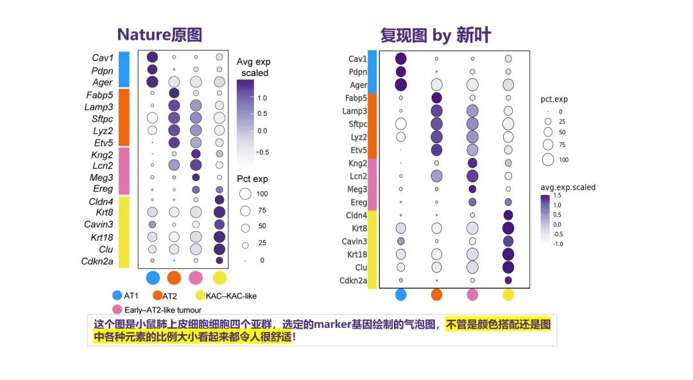
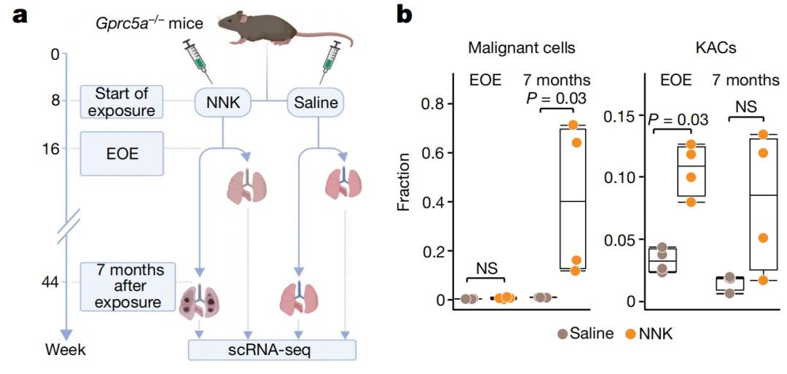
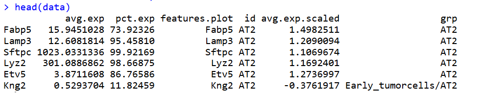
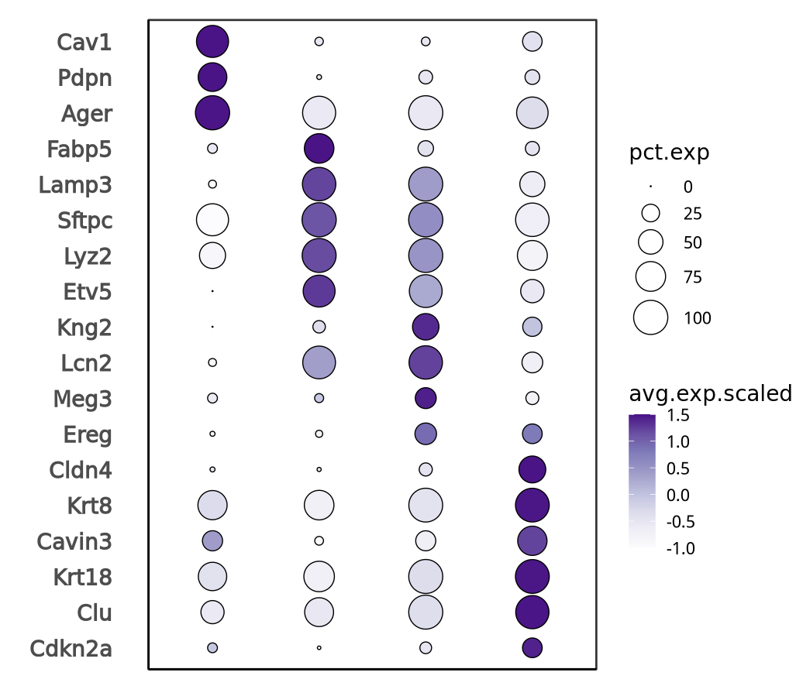
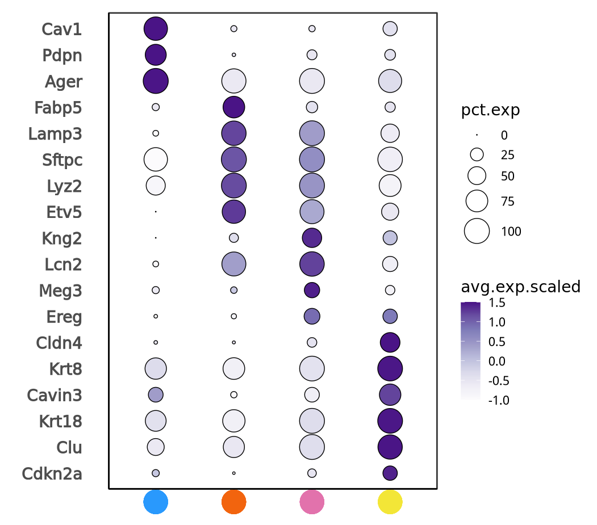
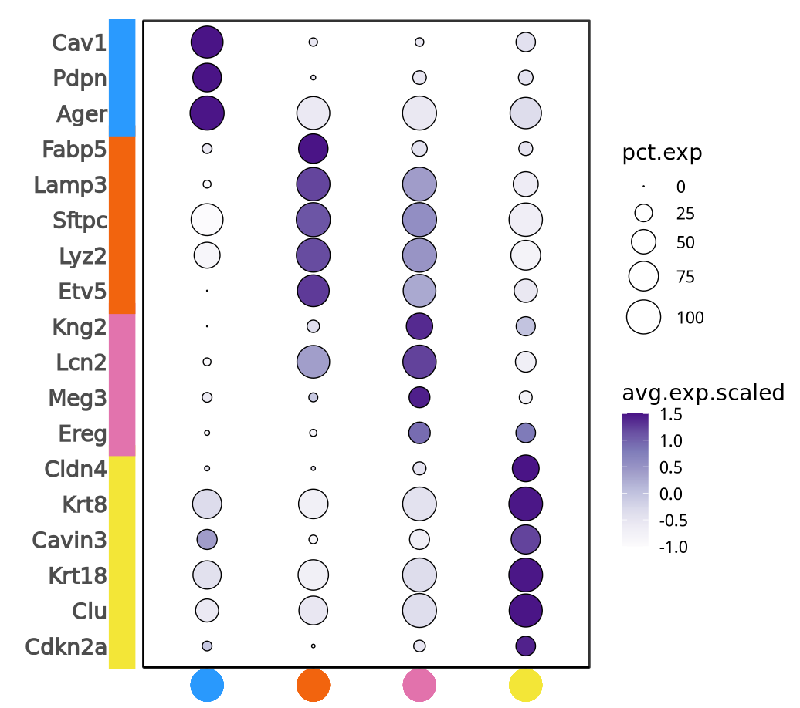

# Nature杂志同款高颜值单细胞基因表达气泡图（王凌华团队）

- 专辑：绘图小技巧2025
- 公众号：生信技能树
- 发布时间：2025-09-17 20:35
- 原文：[微信公众平台](https://mp.weixin.qq.com/s?__biz=MzAxMDkxODM1Ng%3D%3D&mid=2247545796&idx=1&sn=bb7ae79db9b3c3a0542187e1b6b31bc5&chksm=9b4b737fac3cfa69725fff74f60e2a2095a5ddd196b31b8384da2aeb44270efba303332cd68e)

---
> 今天学习一篇来自**「生信大牛王凌华团队的顶刊文章，于2024年2月28发表在 Nature 杂志上，文献标题为《An atlas of epithelial cell states and plasticity in lung adenocarcinoma》」**。今天学习绘制里面的一个单细胞亚群标志marker基因表达气泡图！

文章的主要发现：发现了一群新的细胞 KACs，特征是KRT8表达升高，分化程度降低，可塑性增加，存在驱动KRAS突变。KACs可能是AT2细胞向肿瘤细胞转化过程中的中间体。下面这个图是小鼠肺上皮细胞细胞四个亚群，选定的marker基因绘制的气泡图，不管是颜色搭配还是图中各种元素的比例大小看起来都令人很舒适！



图注：Extended Data Fig. 11. \| KACs are enriched in lungs and they precede the formation of KrasG12D tumours in an AT2 lineage reporter tobacco carcinogenesis mouse model.   c, Proportions and average expression levels of select marker genes for mouse normal alveolar cell lineages and tumour cells defined in b.

## 数据背景

对 Gprc5a （肺谱系特异性G蛋白偶联受体α基因）基因被敲除的小鼠肺上皮细胞进行了单细胞RNA测序分析。这些小鼠在暴露于烟草致癌物后会发展出KM-LUADs。研究分析了在暴露结束 EOE 和暴露后7个月（KM-LUAD发病时间点）接受 NNK（尼古丁衍生亚硝胺酮） 或生理盐水处理的小鼠肺部，每组和每个时间点4只小鼠。对9272个高质量上皮细胞的聚类分析揭示了不同的谱系，包括位于AT1和AT2细胞亚群之间且靠近肿瘤细胞的KACs。



小鼠的数据上传到了GEO：https://www.ncbi.nlm.nih.gov/geo/query/acc.cgi?acc=GSE222901

文章的代码：https://doi.org/10.5281/zenodo.8280138 和  https://github.com/guangchunhan/LUAD_Code

这一次我们不用处理原始数据啦，作者给了图的数据，在 LUAD_Code-main/Input_data/Fig4d_bubblePlotData.rds

## 绘图

ggplot2绘图 + 基础绘图语法（这里我直接用了张俊的包：junjunlab/jjAnno）

### 1.读取数据

```r
# ## fig2e bubbleplot
rm(list=ls())
#devtools::install_github("junjunlab/jjAnno")
library(jjAnno) # 对ggplot2添加图形区域外的注释如点或者注释条
library(ggplot2)

data = readRDS(file = 'LUAD_Code-main/Input_data/Fig4d_bubblePlotData.rds')
data$features.plot = factor(data$features.plot, levels = rev(c(
  'Cav1', 'Pdpn', 'Ager', 'Fabp5', 'Lamp3', 'Sftpc', 'Lyz2', 'Etv5', 'Kng2', 'Lcn2', 'Meg3', 'Ereg', 'Cldn4', 'Krt8', 'Cavin3', 'Krt18', 'Clu', 'Cdkn2a'
)))
head(data)
data$pct.exp
summary(data$avg.exp.scaled)
str(data)
```

数据结构如下：



### 2.基础气泡图

先绘制基础气泡图，并设置颜色：

```r
## 设置颜色
colors = c('#fcfbfd', '#efedf5', '#dadaeb', '#bcbddc', '#9e9ac8', '#807dba', '#6a51a3', '#4a1486')
colors1 = colorRampPalette(colors)(50)

Fig2e <- ggplot(data, aes(y = features.plot, x = id)) + ## global aes
  geom_point(aes(fill = avg.exp.scaled, size =pct.exp), color='black',shape=21)  +  ## geom_point for circle illusion
  scale_fill_gradientn(colours=colors1,  limits = c(-1,1.5)) +  ## color of the corresponding aes
  labs(x='',y='') +
  scale_size(range = c(0,10), limits = c(0, 100), breaks = c(0,25,50,75,100)) +   ## to tune the size of circles
  coord_cartesian(clip = 'off') +
  theme_bw(base_size = 14) +
  theme(panel.grid.major = element_blank(),
    panel.grid.minor = element_blank(),
    panel.background = element_blank(),
    axis.line = element_line(colour = "black"),
    plot.margin = margin(t = 20, r = 20, b = 30, l = 20, unit = "pt"),  # 设置四周的空白区域
    axis.text.x=element_blank(),
    axis.ticks.x = element_blank(),
    axis.ticks.y = element_blank(),
    axis.text.y = element_text(
      face = "bold",  # 设置字体为斜体
      # family = "Arial" ,  # 设置字体为 Times New Roman
      hjust = 1,  # 设置文本右对齐
      size = 14,
      margin = margin(r = 20))  # 调整 y 轴刻度标签与 y 轴的距离
    )

print(Fig2e)
```



### 3.添加底部的注释

需要自己找到一个合适的位置和比例：

```r
# default plot
Fig2e <- annoPoint(object = Fig2e, annoPos = 'top', xPosition = c(1:4),yPosition=rep(-0.1,4),
          ptSize=2.3,ptShape=21,pCol=c("#2999fd","#f2640e","#e272ac","#f3e637"))
Fig2e
```



### 4.添加左侧的注释条

添加注释条并保存：

```r
# annotate mannually
Fig2e <- annoSegment(object = Fig2e, annoPos = 'left', annoManual = T,
            xPosition = rep(0.2, 5),
            yPosition = list(c(1,7,11,16), c(6,10,15,18) ),
            pCol = c("#f3e637","#e273ad","#f2640e","#2a9afe"),
            segWidth = 0.56, lwd = 23)
ggsave(filename = "Fig2e.pdf", plot = Fig2e,width = 7.3,height = 7)
```



#### 完美！今天分享到这~

#### 如果对你有帮助，求一键三连~

友情转发：

- [生信入门&数据挖掘线上直播课9月班](https://mp.weixin.qq.com/s?__biz=MzAxMDkxODM1Ng%3D%3D&mid=2247545329&idx=1&sn=71930835b79306606c59d7aa8c632490#wechat_redirect)，你的生物信息学入门课

- [时隔5年，我们的生信技能树VIP学徒继续招生啦](https://mp.weixin.qq.com/s?__biz=MzAxMDkxODM1Ng%3D%3D&mid=2247525079&idx=1&sn=0b997af16a58195b4192691373048fd5#wechat_redirect)

- [满足你生信分析计算需求的低价解决方案](https://mp.weixin.qq.com/s?__biz=MzUzMTEwODk0Ng%3D%3D&mid=2247530048&idx=1&sn=28aa7bbd5e00521f79e074496a5f5d66#wechat_redirect)

- [生信故事会](https://mp.weixin.qq.com/mp/appmsgalbum?__biz=MzAxMDkxODM1Ng%3D%3D&action=getalbum&album_id=1679199708449144836#wechat_redirect)，来看看他们的生信入门故事

- [生信马拉松答疑专辑](https://mp.weixin.qq.com/mp/appmsgalbum?__biz=MzAxMDkxODM1Ng%3D%3D&action=getalbum&album_id=3690970204957147140#wechat_redirect)，获取你的生信专属答疑

<!-- wechat-article-fetcher: complete -->
