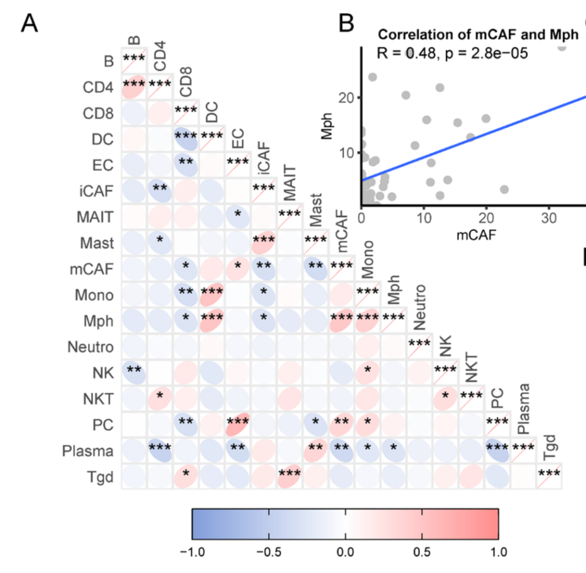
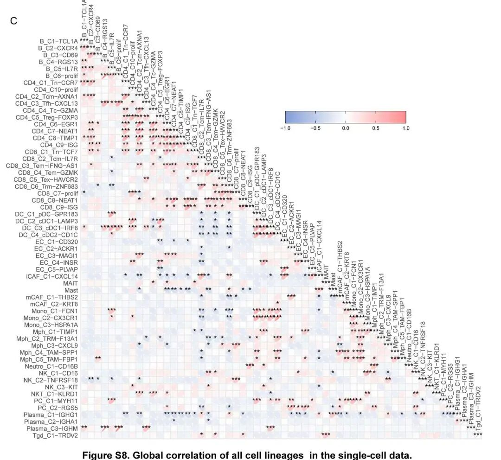
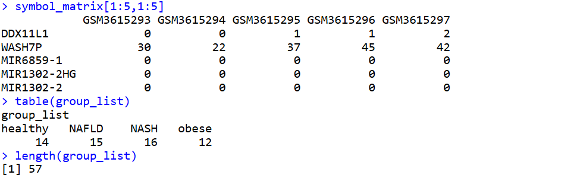
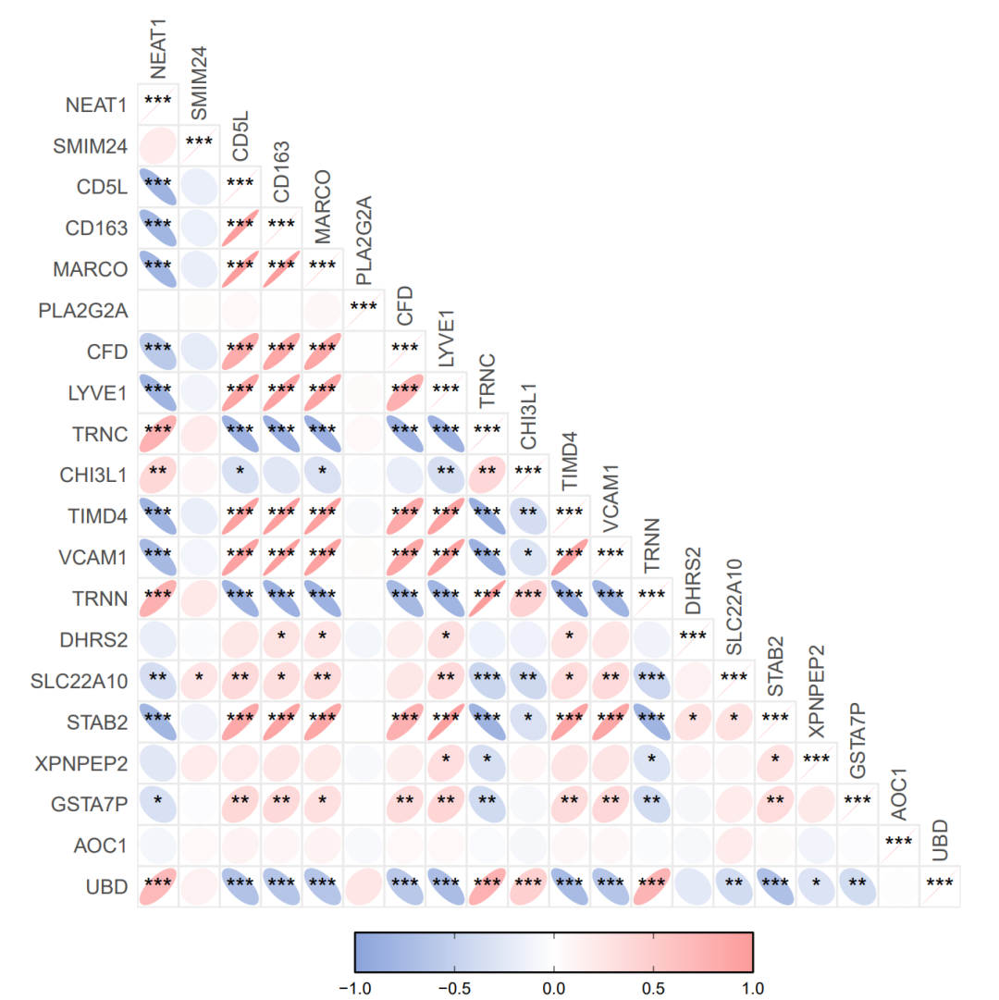

# 高分杂志同款基因表达相关性图（IF=24.5）

- 专辑：绘图小技巧2025
- 公众号：生信技能树
- 发布时间：2025-09-01 22:21
- 原文：[微信公众平台](https://mp.weixin.qq.com/s?__biz=MzAxMDkxODM1Ng%3D%3D&mid=2247545477&idx=1&sn=402be110af17f036d783edf01315abcd&chksm=9b4b723eac3cfb283a88ac6e22baaf3d34e3ed71c03b13243c9bada42d0048302b2b26fcfb49)

---
> 今天给大家分享一个高分杂志中的相关性图，图来自2024年发表在杂志 Gut （IF=24.5）上的文献，标题为《CAF-macrophage crosstalk in tumour microenvironments governs the response to immune checkpoint blockade in gastric cancer peritoneal  metastases》，文献中用来展示细胞亚群之间的相关性，我们这里可以应用到基因表达相关性中。

这种图比一般的热图要好看一些，图中的椭圆越细，表明相关性越高（正相关为红色，负相关为蓝色）。

我们在前面也给大家介绍过：[你没见过的两种高颜值单细胞亚群相关性热图](https://mp.weixin.qq.com/s?__biz=MzAxMDkxODM1Ng%3D%3D&mid=2247536601&idx=1&sn=a9027e4226364f984ccea332c8b6fa28#wechat_redirect)



图注：

> **「Figure 6」** Crosstalk between fibroblasts and macrophages in peritoneal metastases of gastric cancer. (A) Heatmap displaying the correlations across all cell types in the single-cell data. 

如果是样本数或者基因数或者细胞亚群数比较多的时候，是这个效果：



下面就看试试！

## 示例数据

这里就用以前的帖子：[多分组差异表达分析实战：GSE126848（DESeq2版本）](https://mp.weixin.qq.com/s?__biz=MzAxMDkxODM1Ng%3D%3D&mid=2247542498&idx=1&sn=0dee2bd4d1ddf0a85c514cea81c178ea#wechat_redirect)

这个数据有四个分组，每组样本数如下：

- **「健康正常体重个体」**：healthy normal weight (n  14)，共14例，作为对照组，其体重处于正常范围，没有肝脏疾病。

- **「肥胖个体」**：obese (n  12)，共12例，体重超出正常范围，但文中未明确说明这些肥胖个体是否伴有肝脏疾病，可能仅用于对比正常体重个体的肝脏状态。

- **「NAFL患者」**：NAFL (n  15)，非酒精性脂肪肝患者NAFLD，共15例。这类患者肝脏存在脂肪堆积，但未达到非酒精性脂肪性肝炎的严重程度。

- **「NASH患者」**：NASH (n  16)，非酒精性脂肪性肝炎患者NASH，共16例。这类患者不仅存在肝脏脂肪堆积，还伴有炎症和肝细胞损伤，是NAFL的更严重形式。

样本表达矩阵与分组信息处理就用上面这个帖子中的代码，这里直接加载处理好的数据：

```r
rm(list=ls())
options(scipen = 1000)
# 加载seurat数据集
library(tidyverse)
library(ggpubr)
library(magrittr)
library(ggsignif)
library(ggrastr)
# devtools::install_github("LKremer/ggpointdensity")
library(ggpointdensity)
# InstallData("pbmc3k")
# BiocManager::install('caijun/ggcorrplot2')
library(ggcorrplot2) # 绘制下三角相关性椭圆图ggcorrplot
library(ggplot2)
library(sur)
library(reshape2)
library(psych) # 相关性计算

## 加载数据
load("/nas2/zhangj/project/02-bulk-rnaseq/2019-GSE126848-nash病人的4分组转录组/GSE126848/step1-output.Rdata")
ls()
head(dat) # cpm标准化值
symbol_matrix[1:5,1:5] # counts值
table(group_list) # 57个样本，分组信息
length(group_list)
```



## 相关性图绘制

上面这种图有负的相关性和正的相关性做起来会比较好看，不太适用于样本与样本之间的相关性（基本上都是正相关），因为 ggcorrplot 函数里面颜色的映射范围为\[-1,1\]。

这里我们就先做基因表达相关性吧，下次想办法搞个样本间的相关性。

这里的基因我们随便选择20个，如果是自己做项目，可以根据差异基因或者预后或者其他什么条件筛选一些基因出来进行展示：

```r
# 选择差异变化大的基因算相关性
# mad: 绝对中位差
# sd:标准差
exprSet <- dat
exprSet <- exprSet[names(sort(apply(exprSet, 1, mad),decreasing = T)[1:20]),]
exprSet <- t(exprSet)
dim(exprSet)
pheatmap::pheatmap(cor(exprSet))


cor_value <- cor(exprSet)
cor_test_mat <- corr.test(exprSet)$p

cor_pp1 <- ggcorrplot(cor_value, method = "ellipse",type = "lower",
                    p.mat = cor_test_mat,
                    col = c("#8aa3db", "white", "#fd9a9a"),
                    pch.cex = 4.5, # 显著性*号的大小
                    insig = "label_sig", sig.lvl = c(0.05, 0.01, 0.001) # (e.g. "*", "**", "***")
                    )  +
  guides(color = guide_legend(override.aes = list(size = 1))) +
  theme(axis.text = element_text(size=10),
        legend.key.width = unit(0.5, "lines"),  # 调整图例键的宽度
        legend.key.height = unit(0.5, "lines")  # 调整图例键的高度
  )

cor_pp1
ggsave(filename = 'gene_cor.pdf',width = 8,height = 8,plot = cor_pp1 )
```

结果如下：



是不是很漂亮！

如果上面的代码学习对你来说有困难，可以看看下面的链接！

- [生信入门&数据挖掘线上直播课9月班](https://mp.weixin.qq.com/s?__biz=MzAxMDkxODM1Ng%3D%3D&mid=2247545329&idx=1&sn=71930835b79306606c59d7aa8c632490#wechat_redirect)，你的生物信息学入门课

- [时隔5年，我们的生信技能树VIP学徒继续招生啦](https://mp.weixin.qq.com/s?__biz=MzAxMDkxODM1Ng%3D%3D&mid=2247525079&idx=1&sn=0b997af16a58195b4192691373048fd5#wechat_redirect)

- [满足你生信分析计算需求的低价解决方案](https://mp.weixin.qq.com/s?__biz=MzUzMTEwODk0Ng%3D%3D&mid=2247530048&idx=1&sn=28aa7bbd5e00521f79e074496a5f5d66#wechat_redirect)

- [生信故事会](https://mp.weixin.qq.com/mp/appmsgalbum?__biz=MzAxMDkxODM1Ng%3D%3D&action=getalbum&album_id=1679199708449144836#wechat_redirect)，来看看他们的生信入门故事

- [生信马拉松答疑专辑](https://mp.weixin.qq.com/mp/appmsgalbum?__biz=MzAxMDkxODM1Ng%3D%3D&action=getalbum&album_id=3690970204957147140#wechat_redirect)，获取你的生信专属答疑

<!-- wechat-article-fetcher: complete -->
