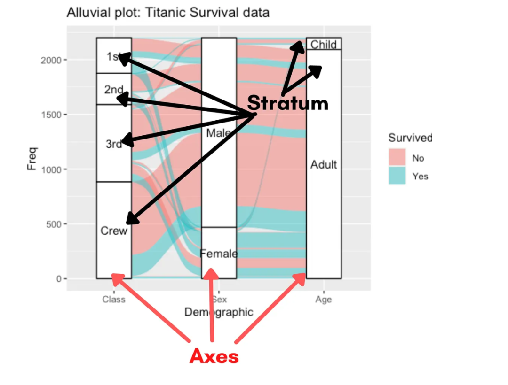
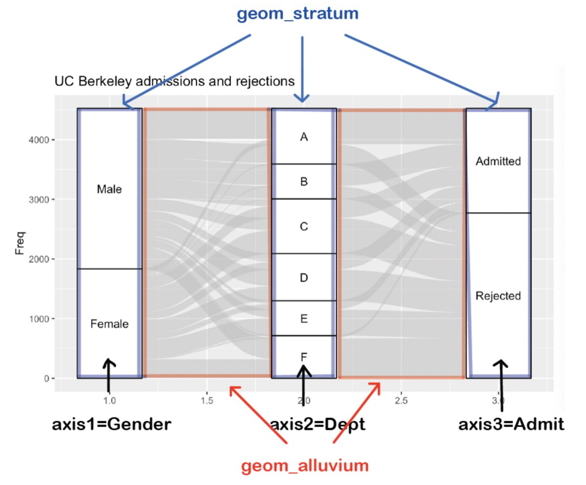
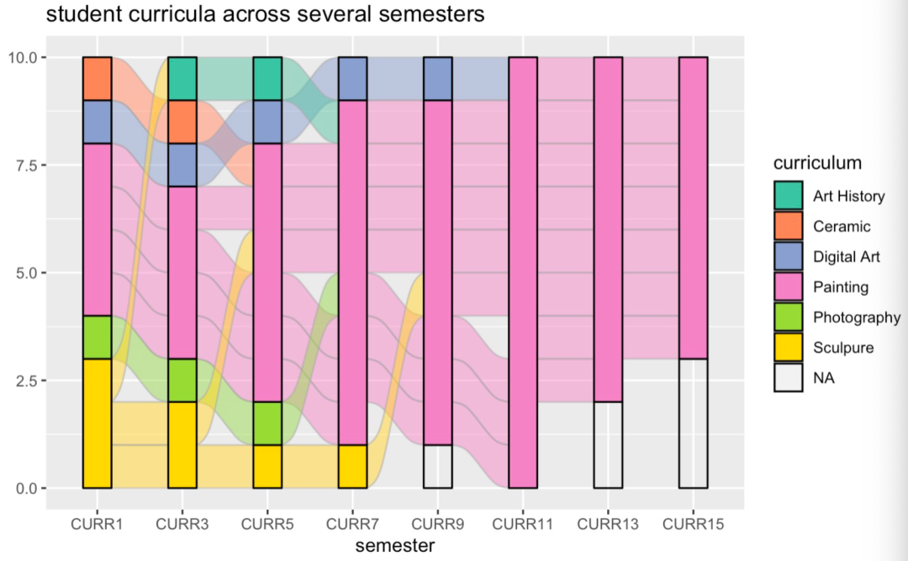
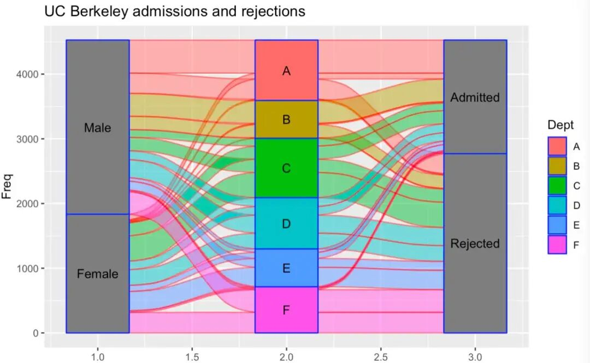
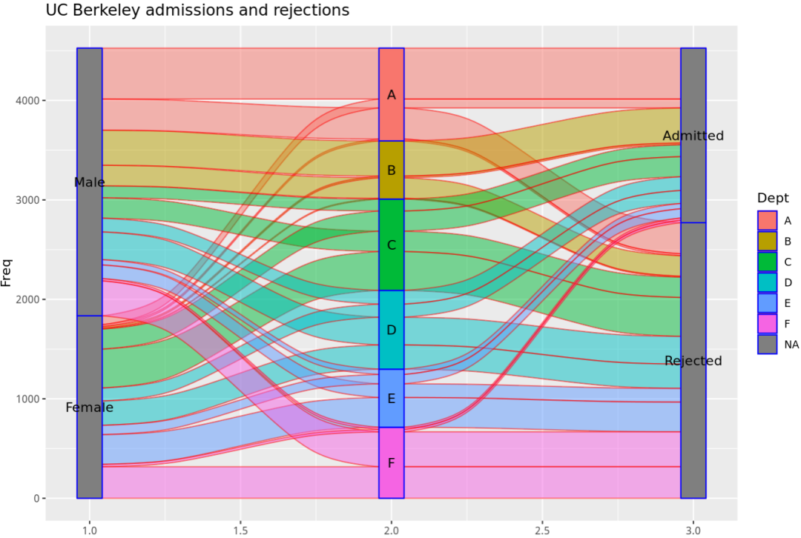
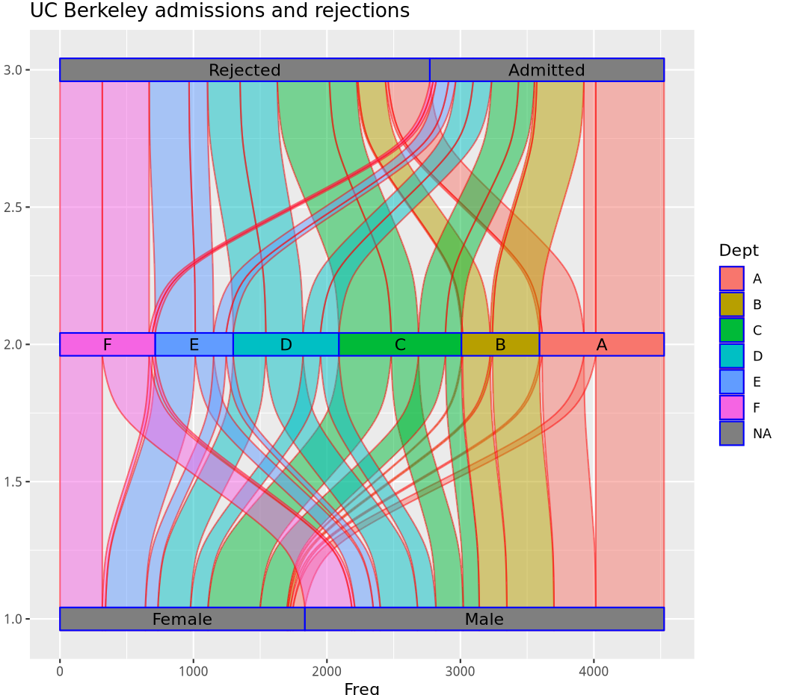
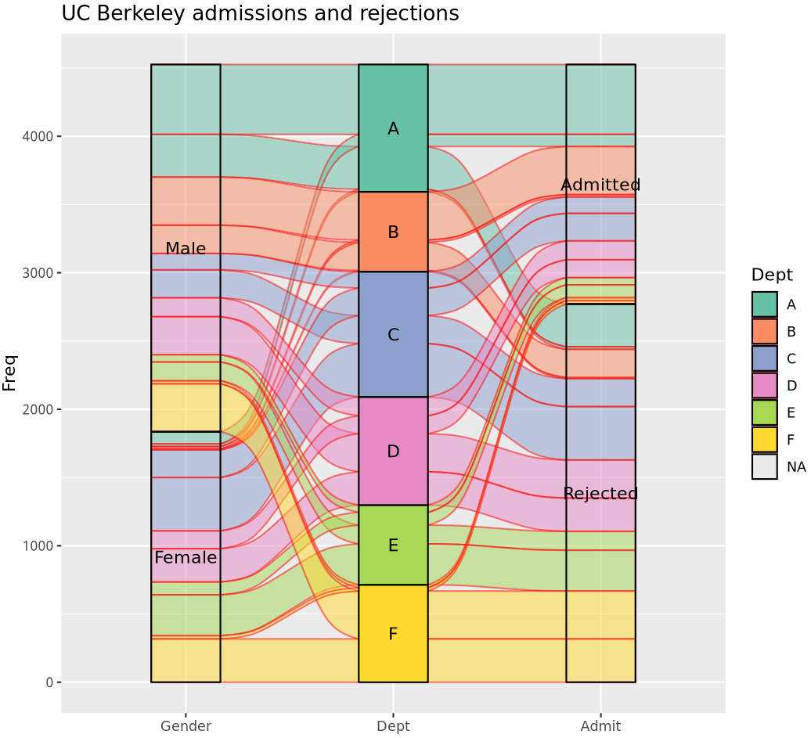

# 桑基图：桑葚图？这个图长得也不像桑葚啊！

- 专辑：绘图小技巧2025
- 公众号：生信技能树
- 发布时间：2025-08-26 17:40
- 原文：[微信公众平台](https://mp.weixin.qq.com/s?__biz=MzAxMDkxODM1Ng%3D%3D&mid=2247545366&idx=1&sn=d3339ec66816b6d367475d4479fac97f&chksm=9b4b72adac3cfbbbd49b40181decddf6e3de700f2dd22ea60c538b8634268abba481991b50be)

---
> 昨天的稿子[《NC杂志同款桑基图：连接富集结果中的通路与基因》](https://mp.weixin.qq.com/s?__biz=MzAxMDkxODM1Ng%3D%3D&mid=2247545344&idx=1&sn=9dc9fe17b8ff971c40a3c8d4c96064d0#wechat_redirect)中，将桑基图写成了桑葚图，我当时还纳闷呢，桑葚图？这个图长得也不像桑葚啊！后来网友留言告诉我人家叫桑基图，我说是没错啊。嗯对比了一下两个字，谁懂600°眼睛的痛！！！（ps：我平时不带眼镜，包括敲代码的时候，因为还有一只眼睛视力1.0，最近干眼症的症状越来越严重了，不知道有没有万能的网友有啥办法缓解啊！）。

此外，我们生信技能树**每个月都有一期带领初学者，0基础的生信入门培训，会有各种贴心的答疑，最新一期在9月8号**，感兴趣的可以去看看呀：[生信入门&数据挖掘线上直播课9月班](https://mp.weixin.qq.com/s?__biz=MzAxMDkxODM1Ng%3D%3D&mid=2247545329&idx=1&sn=71930835b79306606c59d7aa8c632490#wechat_redirect)。

那为什么桑基图要叫桑基图呢？来看看~

## ggalluvial 介绍

ggalluvial 是ggplot2的一个扩展包，用来生成“alluvial plots”， 翻译成中文是 “冲积图” 或 “桑基图（Sankey diagram）”

**冲积图（Alluvial Plot）**：这个名字来源于地理学中的“冲积”现象，指的是河流携带的泥沙在河口或低洼地区沉积形成的地貌。在数据可视化中，冲积图用来展示数据在不同类别之间的流动和变化，类似于河流的分支和汇合。

**桑基图（Sankey Diagram）**：这是一种特殊的流图，用于展示数据在不同节点之间的流动和变化。它以德国工程师桑基（Matthew Henry Phineas Riall Sankey）的名字命名，他在1898年首次使用这种图来展示蒸汽机的热效率。桑基图的特点是流的宽度与数据量成正比，能够直观地展示数据的流动方向和大小。

### 五个基本构成

**AIXS**：一个维度（变量），数据在固定的水平位置上沿此维度垂直分组。

**ALLUVIUM冲积带**：水平（x轴）样条曲线，称为冲积带（alluvia），贯穿整个图表的宽度。

**STRATUM层状结构**：每个轴上的分组被描绘成不透明的块，称为地层（strata）。

**LODE**：水平方向（x轴方向）的样条曲线，被称为冲积层（alluvia），横跨整个图形的宽度。

**FLOW**：冲积层（alluvia）在相邻轴对之间的各段是流动（flows）。



### 数据格式

有两种：Alluvial (Wide) Format 和 Lodes (Long) Format

### Alluvial (Wide) Format

数据集“UCBAdmissions”是1973年伯克利大学六个最大系研究生申请人的汇总数据，按录取情况和性别分类。 它是一个三维数组，由对4526个观测值在3个变量上的交叉汇总而成。

```r
data <- as.data.frame(UCBAdmissions)
head(data)
#
# Admit Gender Dept Freq
# 1 Admitted   Male    A  512
# 2 Rejected   Male    A  313
# 3 Admitted Female    A   89
# 4 Rejected Female    A   19
# 5 Admitted   Male    B  353
# 6 Rejected   Male    B  207

library(ggalluvial)
gg <- ggplot(data, aes(y = Freq, axis1 = Gender, axis2 = Dept, axis3 = Admit)) +
  geom_alluvium() +
  geom_stratum() +
  geom_text(stat = "stratum", aes(label = paste(after_stat(stratum)))) +
  ggtitle("UC Berkeley admissions and rejections")
gg
```



### Basic Lodes (Long) Format

可以由上面的数据格式转换为长数据格式：Lodes format，使用 to_lod­es\_­for­m() 函数。

长格式需要一个额外的索引列，用于链接属于同一队列的行。这些数据跟踪了10名学生在8个学期的主要课程。缺失值表示尚未宣布专业。一个包含80行和3个变量的数据框：

- student：学生标识符

- semester：学期

- curriculum：已宣布的专业课程

```r
data(majors)
majors$curriculum <- as.factor(majors$curriculum)
head(majors)
table(majors$semester)
table(majors$curriculum)
table(majors$student)

# lode.guidance 参数控制流动路径的绘制方式。在这里，"frontback" 表示流动路径会从前面（front）到后面（back）绘制
gg <- ggplot(majors,aes(x = semester, stratum = curriculum, alluvium = student,fill = curriculum, label = curriculum)) +
  geom_flow(stat = "alluvium", lode.guidance = "frontback",color = "darkgray") +
  geom_stratum() +
  ggtitle("student curricula across several semesters")
gg
```



这张图清晰地展示了若干学期中一组学生的学业课程安排，学生在不同学期选修课程的变化。

采用流格式（lode format）使我们能够对相邻轴之间的流动进行汇总，当相邻轴之间的转换是主要关注点时，这种方法可能是合适的。

### 修改颜色

alluvium 冲击带的边框颜色：geom_alluvium(color="red")

alluvium 冲击带的填充颜色：geom_alluvium(aes(fill=Dept))

stratum 层的边框颜色：geom_stratum(color="blue")

stratum 层的填充颜色：geom_stratum(aes(fill=Admit))

```r
#########################
data <- as.data.frame(UCBAdmissions)
head(data)

library(ggalluvial)
gg <- ggplot(data, aes(y = Freq, axis1 = Gender, axis2 = Dept, axis3 = Admit)) +
  geom_alluvium(color="red", aes(fill=Dept)) +
  geom_stratum(color="blue", aes(fill=Dept)) +
  geom_text(stat = "stratum", aes(label = paste(after_stat(stratum)))) +
  ggtitle("UC Berkeley admissions and rejections")
gg
```

设置效果：



1

### 修改宽度

alluvium 冲击带的宽度：geom_alluvium(color="red", aes(fill=Dept),width=1/12)

stratum 层的宽度：geom_stratum(color="blue", aes(fill=Dept),width=1/12)

```r
data <- as.data.frame(UCBAdmissions)
head(data)

library(ggalluvial)
gg <- ggplot(data, aes(y = Freq, axis1 = Gender, axis2 = Dept, axis3 = Admit)) +
  geom_alluvium(color="red", aes(fill=Dept),width=1/12) +
  geom_stratum(color="blue", aes(fill=Dept),width=1/12) +
  geom_text(stat = "stratum", aes(label = paste(after_stat(stratum)))) +
  ggtitle("UC Berkeley admissions and rejections")
gg
```

设置效果如下：



### 坐标轴颠倒

使用 coord_flip() 函数

```r
#########################
data <- as.data.frame(UCBAdmissions)
head(data)

library(ggalluvial)
gg <- ggplot(data, aes(y = Freq, axis1 = Gender, axis2 = Dept, axis3 = Admit)) +
  geom_alluvium(color="red", aes(fill=Dept),width=1/12) +
  geom_stratum(color="blue", aes(fill=Dept),width=1/12) +
  geom_text(stat = "stratum", aes(label = paste(after_stat(stratum)))) +
  ggtitle("UC Berkeley admissions and rejections") +
  coord_flip()
gg
```



### 修改x/y轴属性

坐标添加上刻度标签label，并修改填充颜色：

```r
#########################
data <- as.data.frame(UCBAdmissions)
head(data)

library(ggalluvial)
gg <- ggplot(data, aes(y = Freq, axis1 = Gender, axis2 = Dept, axis3 = Admit)) +
  geom_alluvium(color="red", aes(fill=Dept)) +
  geom_stratum(color="black", aes(fill=Dept)) +
  geom_text(stat = "stratum", aes(label = paste(after_stat(stratum)))) +
  ggtitle("UC Berkeley admissions and rejections") +
  scale_x_discrete(limits = c("Gender", "Dept","Admit")) +
  scale_fill_brewer(type = "qual", palette = "Set2")
gg
```



### ref：

introduction：https://jtr13.github.io/cc21fall2/ggalluvial-cheatsheet.html

cheat sheet：https://cheatography.com/seleven/cheat-sheets/ggalluvial/

blog：https://medium.com/@arnavsaxena96/all-about-alluvial-diagrams-21da1505520b

https://jtr13.github.io/cc21fall2/index.html

https://corybrunson.github.io/ggalluvial/

https://cran.r-project.org/web/packages/ggalluvial/ggalluvial.pdf

https://github.com/davidsjoberg/ggsankey

今天分享到这~

#### 文末友情宣传

强烈建议你推荐给身边的**博士后以及年轻生物学PI**，多一点数据认知，让他们的科研上一个台阶：

- [生信入门&数据挖掘线上直播课9月班](https://mp.weixin.qq.com/s?__biz=MzAxMDkxODM1Ng%3D%3D&mid=2247545329&idx=1&sn=71930835b79306606c59d7aa8c632490#wechat_redirect)，你的生物信息学入门课

- [时隔5年，我们的生信技能树VIP学徒继续招生啦](https://mp.weixin.qq.com/s?__biz=MzAxMDkxODM1Ng%3D%3D&mid=2247525079&idx=1&sn=0b997af16a58195b4192691373048fd5#wechat_redirect)

- [满足你生信分析计算需求的低价解决方案](https://mp.weixin.qq.com/s?__biz=MzUzMTEwODk0Ng%3D%3D&mid=2247530048&idx=1&sn=28aa7bbd5e00521f79e074496a5f5d66#wechat_redirect)

- [生信故事会](https://mp.weixin.qq.com/mp/appmsgalbum?__biz=MzAxMDkxODM1Ng%3D%3D&action=getalbum&album_id=1679199708449144836#wechat_redirect)，来看看他们的生信入门故事

- [生信马拉松答疑专辑](https://mp.weixin.qq.com/mp/appmsgalbum?__biz=MzAxMDkxODM1Ng%3D%3D&action=getalbum&album_id=3690970204957147140#wechat_redirect)，获取你的生信专属答疑

<!-- wechat-article-fetcher: complete -->
