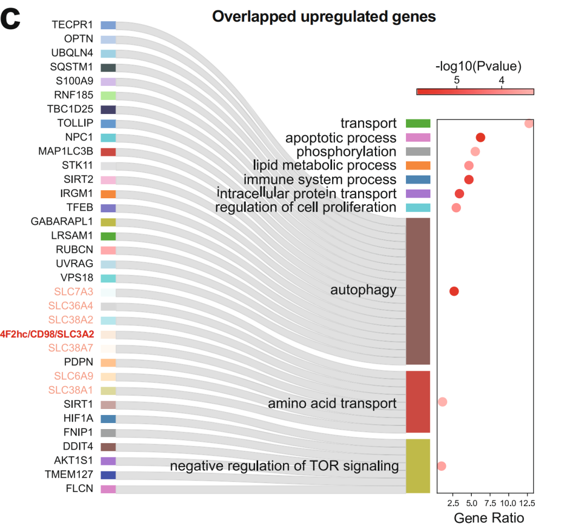
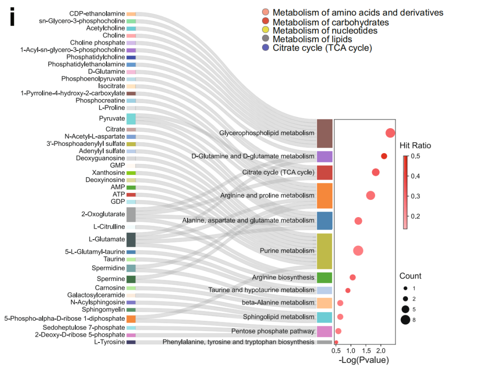
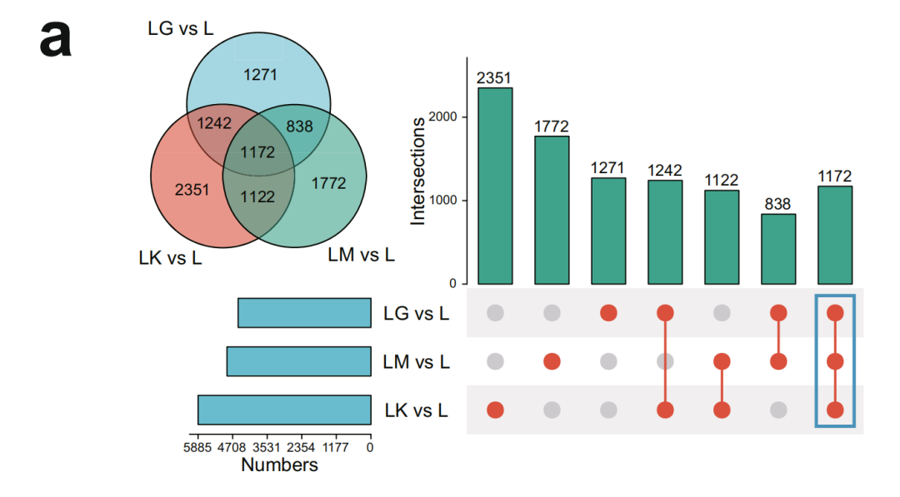
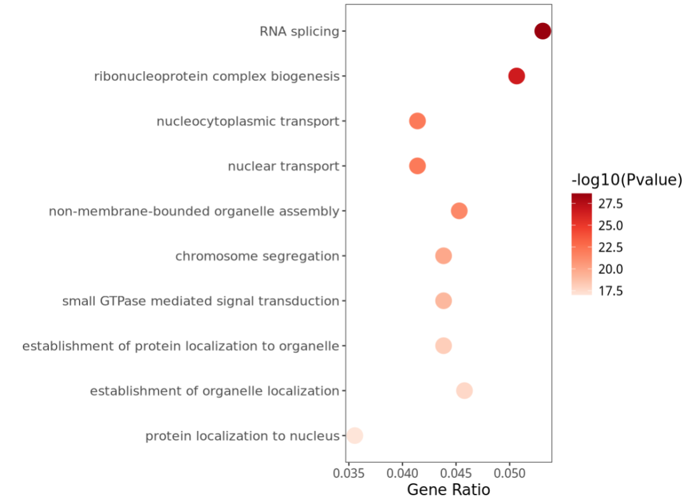
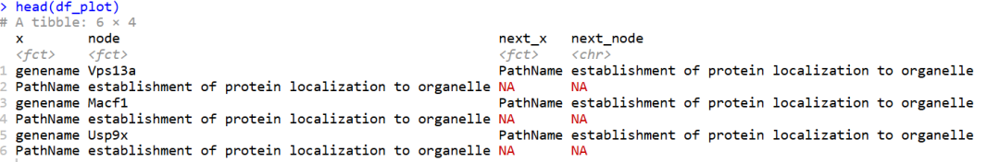
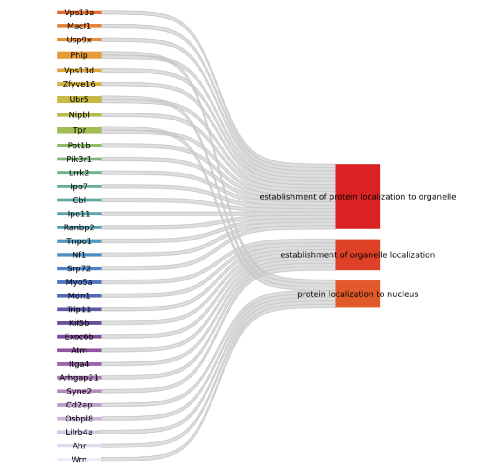

# NC杂志同款桑基图：连接富集结果中的通路与基因

- 专辑：绘图小技巧2025
- 公众号：生信技能树
- 发布时间：2025-08-25 23:40
- 原文：[微信公众平台](https://mp.weixin.qq.com/s?__biz=MzAxMDkxODM1Ng%3D%3D&mid=2247545344&idx=1&sn=9dc9fe17b8ff971c40a3c8d4c96064d0&chksm=9b4b72bbac3cfbad28f61d4b7ec5841ea8934960b1163ed1d1da183a50a6d02b45772d29a24e)

---
今天来看下这篇于2022年6月2号发表在 nature communications 杂志上的文献，标题为《Kir2.1-mediated membrane potential promotes nutrient acquisition and inflammation through regulation of nutrient transporters》。这幅图将基因的功能富集结果与通路中的基因关联信息进行了展示，并且还高亮标注了通路中关键基因，是对功能富集结果展示不错的一种版本哟！图注：

> Fig. 5: Kir2.1-mediated Vm drives nutrient uptake by retaining nutrient transporters on the macrophage cell surface. pathway enrichment analysis of overlapped downregulated genes (b) and upregulated genes (c).



文献中还有一处地方也展示了这个图，展示的是其他组学之间的数据关联，图注：

> Fig. 1 i.Pathway Enrichment analysis of metabolites in the highlighted cluster with MetaboAnalyst 5.0 based on the the combined KEGG and SMPDB database analysis：



## 数据背景

文章中做了三个组别的差异分析，数据上传到了GEO：https://www.ncbi.nlm.nih.gov/geo/query/acc.cgi?acc=GSE146158

```r
GSE146158_KLPSvsLPS_A.txt.gz 1.9 Mb (ftp)(http) TXT
GSE146158_LMvsLPS_B.xlsx 4.1 Mb (ftp)(http) XLSX
GSE146158_LPS_AvsControl.txt.gz 2.0 Mb (ftp)(http) TXT
```



下载下来读取进R，但是感觉上面的分组有点不好对应，我这里就只用一个差异分组数据好了，目的是得到上调或者下调基因，做功能富集分析然后绘制上面的图。

桑葚图使用的R包：https://github.com/davidsjoberg/ggsankey

```r
rm(list=ls())
library(data.table)
library(dplyr)
library(xlsx)
library(clusterProfiler)
library(org.Mm.eg.db)
library(GSEABase)
library(ggplot2)
library(tidyverse)
# 相关R包下载与载入：
# devtools::install_github("davidsjoberg/ggsankey")
library(ggsankey)

##
LK_vs_L <- fread("GSE146158_KLPSvsLPS_A.txt.gz",data.table = F)
head(LK_vs_L)
LK_vs_L$reg <- if_else(LK_vs_L$log2FoldChange>0, "up", "down")
LK_vs_L_sig <- LK_vs_L[LK_vs_L$padj<0.05, ]
table(LK_vs_L_sig$reg)

upgene <- LK_vs_L_sig[LK_vs_L_sig$reg=="up", "gene_name"]
downgene <- LK_vs_L_sig[LK_vs_L_sig$reg=="down", "gene_name"]

## GO BP 功能富集分析
ego_BP <- enrichGO(gene=upgene, OrgDb= 'org.Mm.eg.db', keyType='SYMBOL', ont="BP", pvalueCutoff= 1,qvalueCutoff= 1)
```

## 富集分析气泡图

这里挑选前top10的通路，富集分析结果已经默认按照fdr从小到大进行了排序：

```r
## plot
data <- ego_BP@result[1:10, ]
data$Description <- factor(data$Description, levels = rev(data$Description))
temp <- str_split(data$GeneRatio,pattern = "/",simplify = T,n=2)
data$GeneRatio1 <- as.numeric(temp[,1]) / as.numeric(temp[,2])
```

绘图：

```r
# 自定义主题与配色修改：
p <- ggplot() +
  geom_point(data = data, aes(x = GeneRatio1, y = Description,  color = -log10(pvalue)), size =6) +
  scale_colour_distiller(palette = "Reds", direction = 1) + #更改配色
  labs(x = "Gene Ratio", y = "",color="-log10(Pvalue)") +
  theme_bw() +
  theme(axis.title = element_text(size = 13),
        axis.text = element_text(size = 11),
        # axis.text.y = element_blank(), # 不展示y轴标题
        # axis.ticks.y = element_blank(),
        legend.title = element_text(size = 13),
        legend.text = element_text(size = 11),
        panel.grid.major = element_blank(),  # 去掉主要网格线
        panel.grid.minor = element_blank()   # 去掉次要网格线
  )
p
```



## 左边桑基图绘制

选择其中三条通路且展示通路中的部分基因，注意这里的挑选结果没有实际的生物学含义，仅仅是为了模拟绘图的数据：

```r
data_sankey <- data[8:10, c("Description","geneID","Count")]
# 每个通路挑选部分基因出来19,8,7个
df1 <- data.frame(genename=strsplit(data_sankey[1, 2],split = "/")[[1]][1:19],PathName=data_sankey[1,1],Count=19)
df2 <- data.frame(genename=strsplit(data_sankey[2, 2],split = "/")[[1]][1:9],PathName=data_sankey[2,1],Count=9)
df3 <- data.frame(genename=strsplit(data_sankey[3, 2],split = "/")[[1]][1:8],PathName=data_sankey[3,1],Count=8)
df <- rbind(df1,df2,df3)
head(df)

#将数据转换为绘图所需格式：
df_plot <- df %>%
  make_long(genename, PathName)
head(df_plot)

# 指定绘图顺序（转换为因子）：
df_plot$node <- factor(df_plot$node, levels = c( rev(unique(as.character(df$PathName))),
                                                 rev(unique(df$genename))))
head(df_plot)
```



绘图：

```r
#自定义配色：
library(cols4all)
c4a_gui()
mycol <- c4a('rainbow_wh_rd',length(unique(df_plot$node)))
mycol

#绘图：
p2 <- ggplot(df_plot, aes(x = x, next_x = next_x, node = node, next_node = next_node, fill = node, label = node)) +
  geom_sankey(flow.alpha = 0.5,
              flow.fill = 'grey',
              flow.color = 'grey80', #条带描边色
              node.fill = mycol, #节点填充色
              smooth = 8,
              width = 0.16) +
  geom_sankey_text(size = 3.2, color = "black")+
  theme_void() +
  theme(legend.position = 'none',
        text = element_text(family = "Arial", size = 12, color = "black"),  # 设置全局字体样式
        plot.margin = unit(c(0,5,0,0),units="cm")
        )
p2
```



然后使用AI将两部分拼在一起就ok啦，今天分享到这~

#### 文末友情宣传

强烈建议你推荐给身边的**博士后以及年轻生物学PI**，多一点数据认知，让他们的科研上一个台阶：

- [生信入门&数据挖掘线上直播课8月班](https://mp.weixin.qq.com/s?__biz=MzAxMDkxODM1Ng%3D%3D&mid=2247544311&idx=1&sn=d41b5838e799f52280e78703135bb603#wechat_redirect)，你的生物信息学入门课

- [时隔5年，我们的生信技能树VIP学徒继续招生啦](https://mp.weixin.qq.com/s?__biz=MzAxMDkxODM1Ng%3D%3D&mid=2247525079&idx=1&sn=0b997af16a58195b4192691373048fd5#wechat_redirect)

- [满足你生信分析计算需求的低价解决方案](https://mp.weixin.qq.com/s?__biz=MzUzMTEwODk0Ng%3D%3D&mid=2247530048&idx=1&sn=28aa7bbd5e00521f79e074496a5f5d66#wechat_redirect)

- [生信故事会](https://mp.weixin.qq.com/mp/appmsgalbum?__biz=MzAxMDkxODM1Ng%3D%3D&action=getalbum&album_id=1679199708449144836#wechat_redirect)，来看看他们的生信入门故事

- [生信马拉松答疑专辑](https://mp.weixin.qq.com/mp/appmsgalbum?__biz=MzAxMDkxODM1Ng%3D%3D&action=getalbum&album_id=3690970204957147140#wechat_redirect)，获取你的生信专属答疑

<!-- wechat-article-fetcher: complete -->
