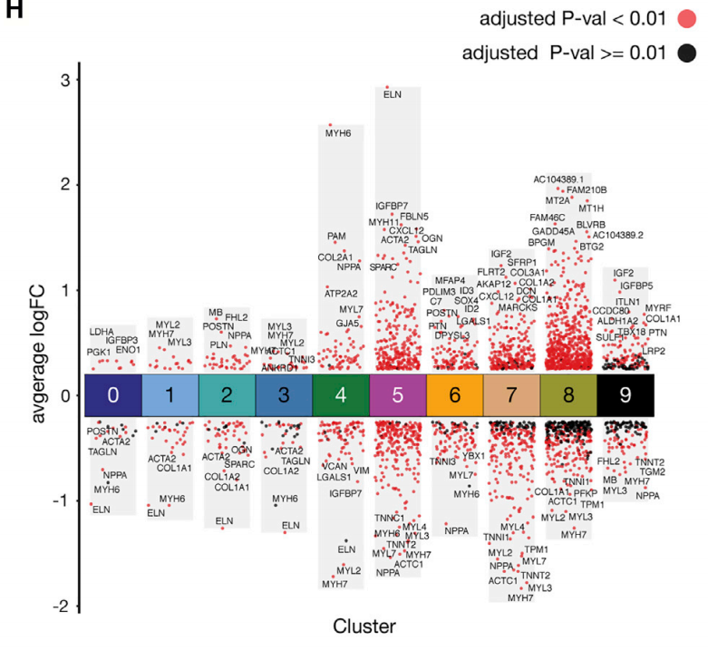
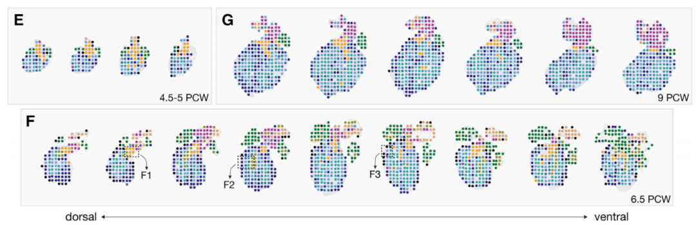
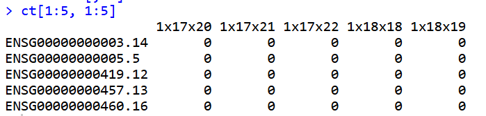
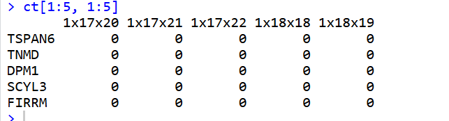
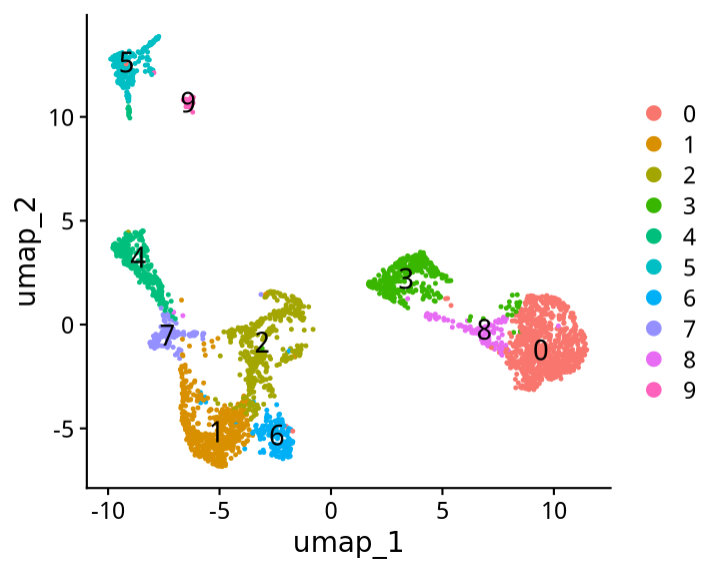
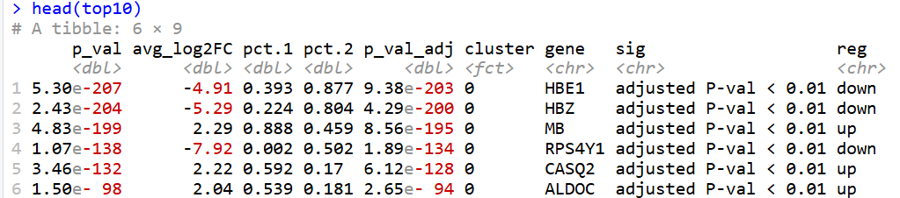
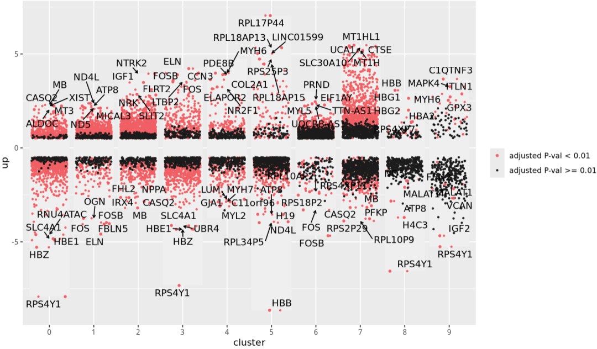
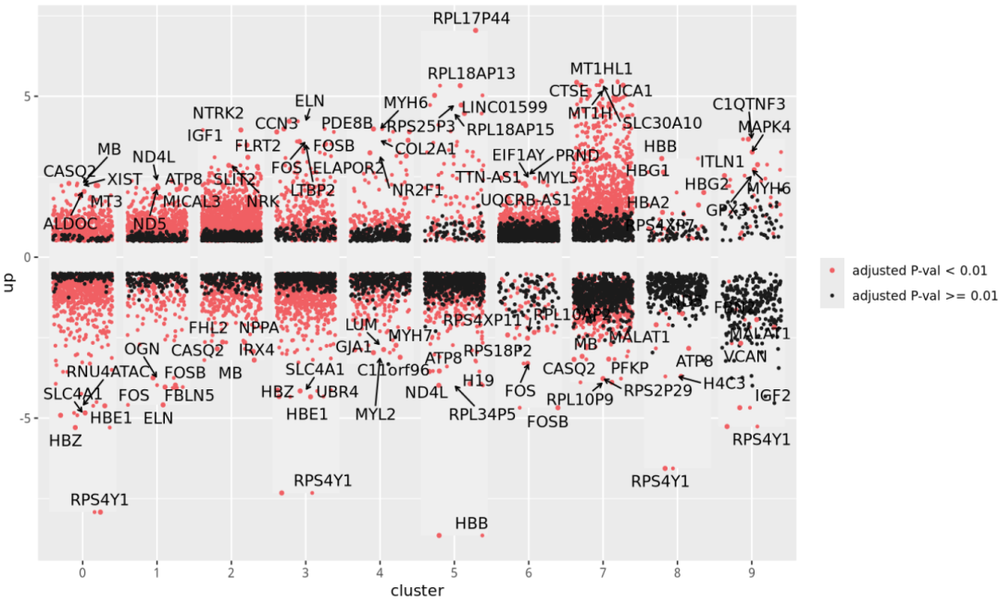
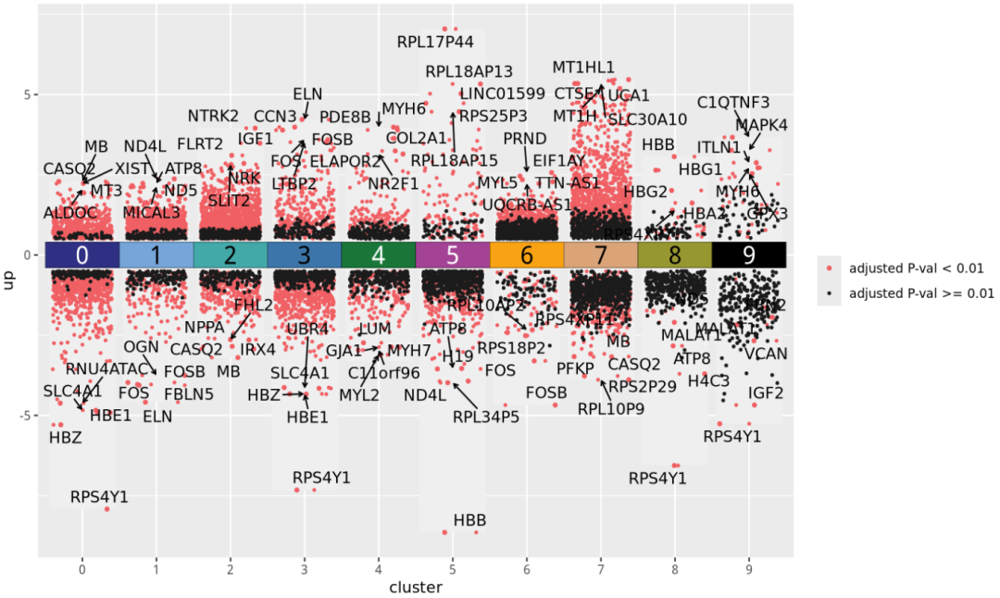
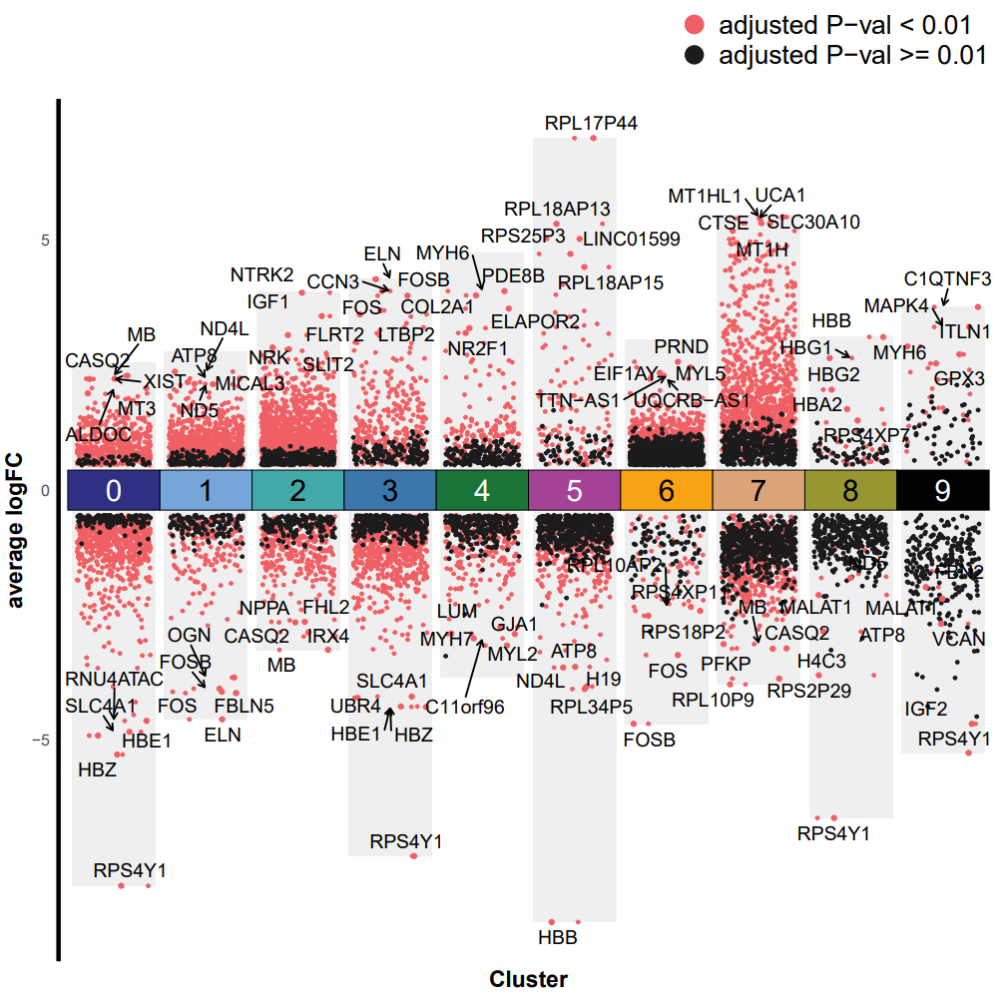

# Cell杂志同款单细胞亚群差异火山图

- 专辑：绘图小技巧2025
- 公众号：生信技能树
- 发布时间：2025-08-20 22:01
- 原文：[微信公众平台](https://mp.weixin.qq.com/s?__biz=MzAxMDkxODM1Ng%3D%3D&mid=2247545217&idx=1&sn=34669128ac57100f7a21b3fb16e0f5a0&chksm=9b4b713aac3cf82c988deece7530ab270def5be583641cf92bc332d63d6dbd2a2e19f5b98939)

---
> 又看到了一个好图，不画不痛快。这个图应该有很多笔记了，我整理一个自己的笔记版。图来自2019年年12月12号发表在CELL杂志上，文献标题《A Spatiotemporal Organ-Wide Gene Expression and Cell Atlas of the Developing Human Heart》。

绘图群进入方式：[绘图小技巧2025交流群](https://mp.weixin.qq.com/s?__biz=MzAxMDkxODM1Ng%3D%3D&mid=2247538699&idx=1&sn=871cb62f043fc30e1996066dc50430dd#wechat_redirect)。

前面跟差异结果展示有关的图有：

- [基础绘图函数绘制高颜值火山图](https://mp.weixin.qq.com/s?__biz=MzAxMDkxODM1Ng%3D%3D&mid=2247540112&idx=1&sn=f0875ae81923d38d86145991361ec551#wechat_redirect)

- [Science杂志：比火山图多一点信息的火山图](https://mp.weixin.qq.com/s?__biz=MzAxMDkxODM1Ng%3D%3D&mid=2247539963&idx=1&sn=35a7f9aa1a032dab77ab3fd859a9834e#wechat_redirect)

- [带有疾病进展的多分组差异结果如何展示？](https://mp.weixin.qq.com/s?__biz=MzAxMDkxODM1Ng%3D%3D&mid=2247536217&idx=1&sn=3f1893e79b3474230cd3993c37d2aa34#wechat_redirect)

- [Science杂志同款：又一款好看的火山图](https://mp.weixin.qq.com/s?__biz=MzAxMDkxODM1Ng%3D%3D&mid=2247543292&idx=1&sn=0ca40d5f5d3a15c30ef7812a92c68774#wechat_redirect)

- [Nat Commun同款高颜值单细胞亚群组间差异火山图](https://mp.weixin.qq.com/s?__biz=MzAxMDkxODM1Ng%3D%3D&mid=2247541328&idx=1&sn=8236af56b7ae118299426bb30380e527#wechat_redirect)

**图的含义：**为了识别差异表达的基因，使用Seurat软件包中的FindAllMarkers函数（设置：min.pct = 0.25，thresh.use = 0.25）对各个cluster与其他所有cluster进行了成对比较。关于ST簇差异基因表达分析的统计细节可以在结果部分的“人类心脏发育过程中的时空基因表达动态”一节以及图2D、2H和表S2中找到。

**图例：**来自Figure 2 Global Spatiotemporal Analysis of Three Cardiac Developmental Stages.  (H) 展示差异基因表达分析所有十个cluster中上调和下调的基因。调整后的p值小于0.01的用红色表示，而调整后的p值\>=0.01的用黑色表示。



## 数据背景

分别从4.5-5、6.5和9孕周的心脏组织沿背腹轴收集了四片、九片和六片组织切片，联合数据集总共包含3,115个单独的点。



数据可以在这里下载：我看到他们课题组算是有一个专门的网站，上面放了很多发表的文献和文献相关的数据

https://www.spatialresearch.org/resources-publications/

https://data.mendeley.com/datasets/mbvhhf8m62/2 ;

https://data.mendeley.com/datasets/dgnysc3zn5/1

## 数据预处理

下载下来并读取：

```r
###
### Create: Jianming Zeng
### Date:  2023-12-31
### Email: jmzeng1314@163.com
### Blog: http://www.bio-info-trainee.com/
### Forum:  http://www.biotrainee.com/thread-1376-1-1.html
### CAFS/SUSTC/Eli Lilly/University of Macau
### Update Log: 2023-12-31   First version
### Update Log: 2024-12-09   by juan zhang (492482942@qq.com)
###
rm(list=ls())
options(stringsAsFactors = F)
library(ggsci)
library(dplyr)
library(future)
library(Seurat)
library(clustree)
library(cowplot)
library(data.table)
library(ggplot2)
library(patchwork)
library(stringr)
library(qs)
library(Matrix)

###### step1: 导入数据 ######
ct <- data.table::fread("filtered_ST_matrix_and_meta_data/filtered_matrix.tsv.gz",data.table = F)
ct[1:5, 1:5]
dim(ct)
rownames(ct) <- ct[,1]
ct <- ct[,-1]
ct[1:5, 1:5]
```



基因ID转换：

```r
## 转换ensid to 基因name 方法1：使用包
temp <- str_split(rownames(ct),pattern = "\.",simplify = T,n = 2)[,1]
rownames(ct) <- temp
library(org.Hs.eg.db) #不同物种 homo sapiens ，包不一样
library(clusterProfiler)
id2symbol <- bitr(temp, fromType = "ENSEMBL", toType = "SYMBOL",  OrgDb = org.Hs.eg.db)
head(id2symbol)
id2symbol <- id2symbol[!duplicated(id2symbol$SYMBOL),]
kp <- rownames(ct) %in% id2symbol[,1]
table(kp)
ct <- ct[kp, ]
summary(match(rownames(ct), id2symbol[,1]))
rownames(ct) <- id2symbol[match(rownames(ct), id2symbol[,1]),2]
ct[1:5, 1:5]
```



创建对象：

```r
## 读取表型信息
phe <- data.table::fread('filtered_ST_matrix_and_meta_data/meta_data.tsv.gz',data.table = F)
head(phe)
table(phe$Sample)
rownames(phe) <- phe[,1]
phe <- phe[,-1]
table(phe$Sample)
identical(rownames(phe),colnames(ct))

# 创建对象
sce.all <- CreateSeuratObject(counts = ct, meta.data = phe, min.cells = 3,assay = "Spatial")
sce.all

# 查看特征
as.data.frame(sce.all@assays$RNA$counts[1:10, 1:2])
head(sce.all@meta.data, 10)
table(sce.all$orig.ident)
sce.all$orig.ident <- sce.all$Sample

library(qs)
qsave(sce.all, file="sce.all.qs")
```

降为聚类分群：

```r
################# 降为聚类分群
# 标准化降维聚类
object <- sce.all
object <- SCTransform(object, assay = "Spatial")
object <- RunPCA(object, assay = "SCT") %>%
  FindNeighbors(., reduction = "pca", dims = 1:30) %>%
  FindClusters(resolution = 0.5) %>%
  RunUMAP(., reduction = "pca", dims = 1:30)

head(object@meta.data)
DimPlot(object, reduction = "umap", label = TRUE,label.size = 5)
DimPlot(object, reduction = "umap", label = TRUE,label.size = 5,group.by = "res.0.8")
```

得到9个cluster：



## 亚群差异分析

这里有上下调基因，将下调的也保存：only.pos = F

```r
################ 亚群差异分析
table(object$SCT_snn_res.0.5)
sce.markers <- FindAllMarkers(object, only.pos = F,return.thresh = 0.01,logfc.threshold = 0.5,min.pct = 0.2)
head(sce.markers)

## 添加显著性 红色 p_val_adj < 0.01,  黑色 p_val_adj >= 0.01
sce.markers$sig <- if_else(sce.markers$p_val_adj < 0.01, "adjusted P-val < 0.01", "adjusted P-val >= 0.01")
sce.markers$reg <- if_else(sce.markers$avg_log2FC > 0, "up", "down")
table(sce.markers$sig)
table(sce.markers$cluster, sce.markers$sig)

## 挑选 红色 p_val_adj < 0.01 中log2FC的top10
top10 <- sce.markers %>%
  filter(sig =="adjusted P-val < 0.01") %>%
  group_by(cluster,reg) %>%
  top_n(abs(avg_log2FC),n = 5) %>%
  ungroup()

head(top10)
```



## 绘图

依然是ggplot2：

```r
## 绘图整体
# 绘制每个Cluster 的散点火山图：
library(ggrepel)
p <- ggplot() +
  geom_jitter(data = sce.markers, aes(x = cluster, y = avg_log2FC, color = sig),
              size = 0.6, width =0.4) +
  geom_jitter(data = top10, aes(x = cluster, y = avg_log2FC, color = sig),
              size = 1, width =0.4) + ## top10的点，大小突出一下
  scale_color_manual(name=NULL, values = c("#f05f63","#1b1b1b")) + ## 点的颜色调整
  geom_text_repel(data=top10, aes(x=cluster,y=avg_log2FC,label=gene), force = 1.2,
    arrow = arrow(length = unit(0.008, "npc"),type = "open", ends = "last") ) ## 添加文字标签
p
```



### 添加灰色柱子：

灰色柱子要放在图层的最底层：

```r
## 灰色背景柱子
#根据图p中log2FC区间确定背景柱长度：
top_log2FC <- sce.markers %>%
  group_by(cluster) %>%       # 按cluster分组
  slice_max(avg_log2FC, n = 1) %>%# 在每个分组中选择log2FC最大的值
  ungroup()                   # 取消分组

down_log2FC <- sce.markers %>%
  group_by(cluster) %>%       # 按cluster分组
  slice_min(avg_log2FC, n = 1) %>%# 在每个分组中选择log2FC最大的值
  ungroup()                   # 取消分组

dfbar <- data.frame(cluster=unique(sce.markers$cluster), up=top_log2FC$avg_log2FC, down=down_log2FC$avg_log2FC)

## 绘制背景柱：这里注意要将背景画在底部，不然放在点图后面会遮住点
p <- ggplot() +
  geom_col(data = dfbar, mapping = aes(x = cluster,y = up), fill = "#efefef") +
  geom_col(data = dfbar,mapping = aes(x = cluster,y = down), fill = "#efefef") +
  geom_jitter(data = sce.markers, aes(x = cluster, y = avg_log2FC, color = sig),
              size = 0.6, width =0.4) +
  geom_jitter(data = top10, aes(x = cluster, y = avg_log2FC, color = sig),
              size = 1, width =0.4) + ## top10的点，大小突出一下
  scale_color_manual(name=NULL, values = c("#f05f63","#1b1b1b")) + ## 点的颜色调整
  geom_text_repel(data=top10, aes(x=cluster,y=avg_log2FC,label=gene), force = 1.2,
                  arrow = arrow(length = unit(0.008, "npc"),type = "open", ends = "last") ) ## 添加文字标签

p
```



这里颜色比较浅，等后面调整好了主题就可以清楚地看出来了。

### 添加cluster方框

方框的高度为前面 log2FC的阈值的两倍，好看一点可以\*0.8

```r
## 添加cluster方框
## 方框的高度为前面 log2FC的阈值的两倍，好看一点可以*0.8
# 添加X轴的cluster色块标签：
dfcol <- data.frame(x= unique(sce.markers$cluster), y=0, label=unique(sce.markers$cluster),
                    labelcol = c("white",rep("black",3),rep("white",2),rep("black",3),"white" )
                    )
dfcol
mycol <- c("#2f3084","#76a5d9","#43a8a8","#3c75a9","#197638","#a44395","#f9a213","#dba478","#969730","#000000")

p2 <- p +
  geom_tile(data = dfcol, aes(x=x,y=y), height=0.5 * 2 * 0.8, color = "black", fill = mycol,  show.legend = F) +
  geom_text(data=dfcol, aes(x=x,y=y,label=label), size =6, color = dfcol$labelcol) ## 添加方框中的cluster标签

p2
```



### 修改其他主题

稍微难一点的在图例里面的点的大小调整：

```r
## 修改其他主题
p3 <- p2 +
  labs(x="Cluster",y="average logFC") +
  theme_minimal()+
  theme( axis.title = element_text(size = 13, color = "black",face = "bold"),
    axis.line.y = element_line(color = "black",size = 1.2),
    axis.line.x = element_blank(),
    axis.text.x = element_blank(),
    panel.grid = element_blank(),
    legend.position = "top",
    legend.direction = "vertical",
    legend.justification = c(1,0),
    legend.text = element_text(size = 15)
    ) +
  guides(color=guide_legend(override.aes = list(size=4.5))) ## 修改图例中图标的大小

p3

## 保存
ggsave(filename = "cluster_fc.pdf",width = 8, height = 8,plot = p3)
```



完美！这里不止单细胞亚群差异分析可以放这个图，常规bulk转录组如果也有很多差异分组也可以用这个！

#### 文末友情宣传

强烈建议你推荐给身边的**博士后以及年轻生物学PI**，多一点数据认知，让他们的科研上一个台阶：

- [生信入门&数据挖掘线上直播课8月班](https://mp.weixin.qq.com/s?__biz=MzAxMDkxODM1Ng%3D%3D&mid=2247544311&idx=1&sn=d41b5838e799f52280e78703135bb603#wechat_redirect)，你的生物信息学入门课

- [时隔5年，我们的生信技能树VIP学徒继续招生啦](https://mp.weixin.qq.com/s?__biz=MzAxMDkxODM1Ng%3D%3D&mid=2247525079&idx=1&sn=0b997af16a58195b4192691373048fd5#wechat_redirect)

- [满足你生信分析计算需求的低价解决方案](https://mp.weixin.qq.com/s?__biz=MzUzMTEwODk0Ng%3D%3D&mid=2247530048&idx=1&sn=28aa7bbd5e00521f79e074496a5f5d66#wechat_redirect)

- [生信故事会](https://mp.weixin.qq.com/mp/appmsgalbum?__biz=MzAxMDkxODM1Ng%3D%3D&action=getalbum&album_id=1679199708449144836#wechat_redirect)，来看看他们的生信入门故事

- [生信马拉松答疑专辑](https://mp.weixin.qq.com/mp/appmsgalbum?__biz=MzAxMDkxODM1Ng%3D%3D&action=getalbum&album_id=3690970204957147140#wechat_redirect)，获取你的生信专属答疑

<!-- wechat-article-fetcher: complete -->
