# 超越单细胞气泡图的表现方式：来看看FlexDotPlot！

- 专辑：绘图小技巧2025
- 公众号：生信技能树
- 发布时间：2025-08-18 22:17
- 原文：[微信公众平台](https://mp.weixin.qq.com/s?__biz=MzAxMDkxODM1Ng%3D%3D&mid=2247545105&idx=1&sn=3b83f4d620c8064db08d66f5d7b79162&chksm=9b4b71aaac3cf8bcc072a28cd710b94aaeef6d5b1eff1f082581adab7d6c748f0ea9a98bb84a)

---
> 到了每周一的绘图修炼环节，前一天晚上可能就在焦虑要画啥，好在平时各种网上冲浪收集了很多带有小心思小技巧的图，今天来看看这个有意思的气泡饼图！我们的绘图专辑有个群，大家感兴趣的可以从这里进去：[绘图小技巧2025交流群](https://mp.weixin.qq.com/s?__biz=MzAxMDkxODM1Ng==&mid=2247538699&idx=1&sn=871cb62f043fc30e1996066dc50430dd&scene=21#wechat_redirect)，欢迎给我发各种有魅力的图~

今天学习的这个图来自R包FlexDotPlot，于2022年3月23号发表在Bioinformatics Advances杂志上，文献标题为《FlexDotPlot: a universal and modular dot plot visualization tool for complex multifaceted data》。

网址：https://github.com/Simon-Leonard/FlexDotPlot

## 安装

简单安装一下：

```r
## 使用西湖大学的 Bioconductor镜像
options(BioC_mirror="https://mirrors.westlake.edu.cn/bioconductor")
options("repos"=c(CRAN="https://mirrors.westlake.edu.cn/CRAN/"))

devtools::install_github("Simon-Leonard/FlexDotPlot")

## 加载
library(FlexDotPlot)
```

## 输入数据

FlexDotPlot 包以数据框作为输入：前两列包含沿 x 轴和 y 轴展开的两个因素，随后是相应的定量和/或定性数据以供显示。

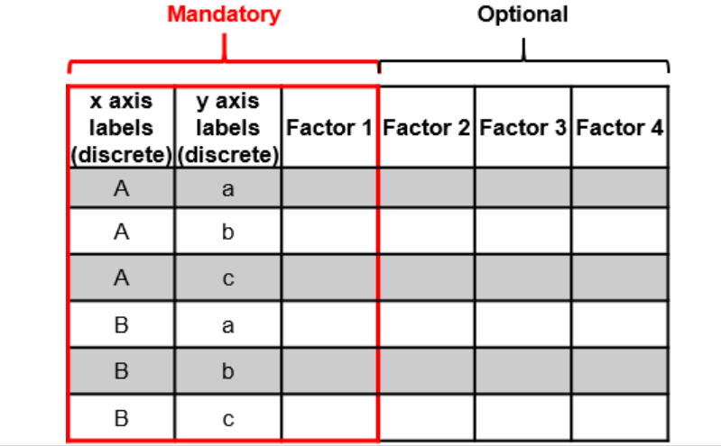

还可以指定在图中显示哪个因素，以及每个因素应该如何显示：

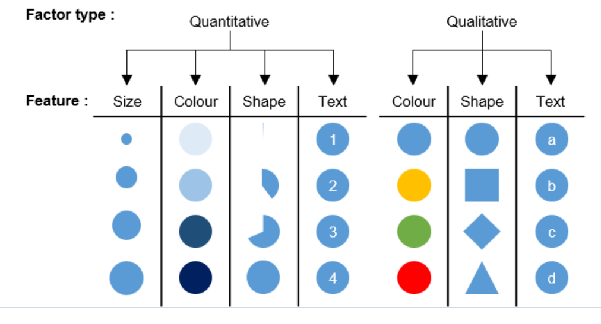

## 绘图看看

先那示例数据绘图看看，示例数据为 data(PBMC3K_example_data)

```r
data(PBMC3K_example_data)
head(PBMC3K_example_data)
table(PBMC3K_example_data$id)
```

看起来是单细胞数据差异分析结果：

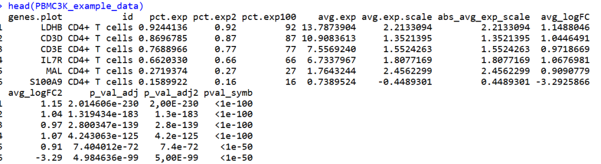

### 不同大小的点：size

可以使用 `size_var` 参数指定列名来设置大小。可以使用 `shape.scale` 参数调整大小比例尺：这里是基因在多少细胞中表达的比例

```r
dot_plot(data.to.plot = PBMC3K_example_data, size_var = "pct.exp", shape.scale = 8)
```

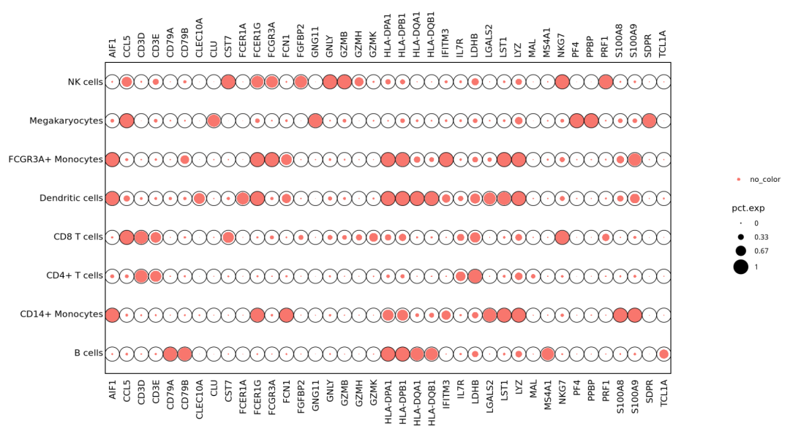

### 不同颜色的点：colors

选择一列设置颜色映射：

```r
dot_plot(data.to.plot = PBMC3K_example_data, col_var = "pct.exp", shape.scale = 20)
```

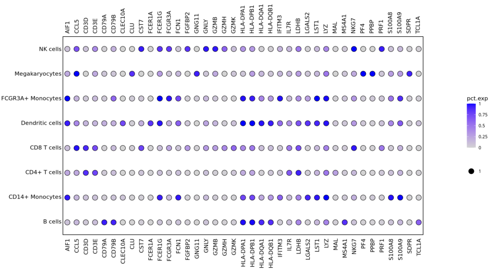

### 不同形状的点：shape

选择一列设置形状映射：

```r
dot_plot(data.to.plot = PBMC3K_example_data, shape_var = "pct.exp", shape.scale = 20)
```

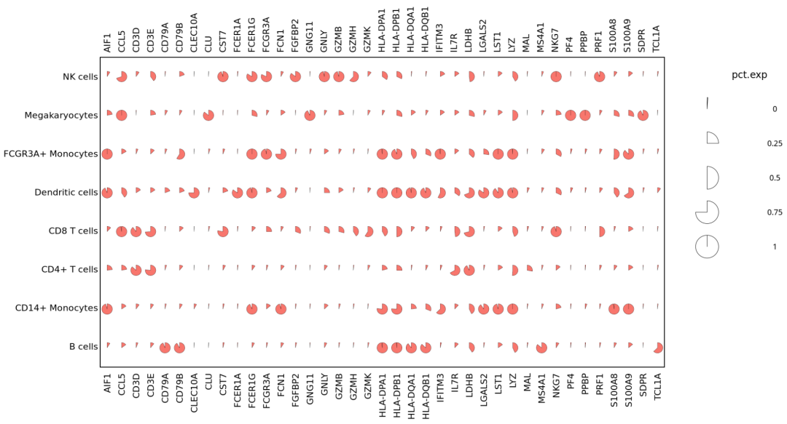

### 同时设置：Shape, size, colors

形状、大小、颜色和文本可以同时且独立地提供。

```r
dot_plot(data.to.plot = PBMC3K_example_data,
         size_var = "pct.exp", shape.scale = 25,
         shape_var= "pct.exp",
         col_var = "avg_logFC"
)
```

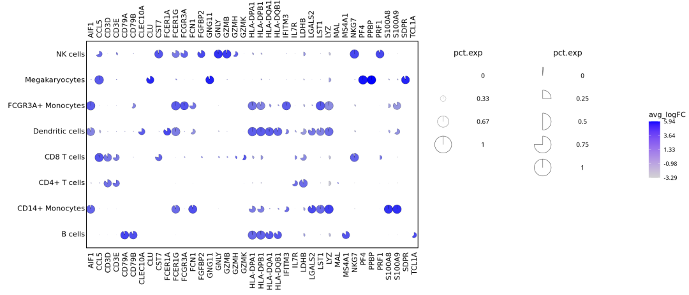

### 还可以进行聚类

可以在 dend_x_var 和 dend_y_var 参数中分别提供用于计算 x 和 y 轴树状图的变量。dist_method 和 hclust_method 参数分别控制距离方法（默认值为欧几里得距离）和层次聚类方法（默认值为 Ward.D）。

```r
dot_plot(data.to.plot = PBMC3K_example_data,
         size_var = "pct.exp", shape.scale = 25,
         shape_var= "pct.exp",
         col_var = "avg_logFC",
         dend_x_var = c("pct.exp","avg_logFC"),
         dist_method="euclidean", hclust_method="ward.D"
)
```

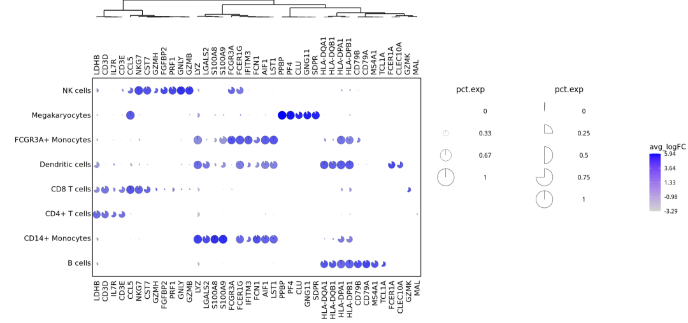

如果是x,y轴同时聚类：

```r
dot_plot(data.to.plot = PBMC3K_example_data,
         size_var = "pct.exp", shape.scale = 25,
         shape_var= "pct.exp",
         col_var = "avg_logFC",
         dend_x_var = c("pct.exp","avg_logFC"),
         dend_y_var = c("pct.exp","avg_logFC"),
         dist_method="euclidean", hclust_method="ward.D"
)
```

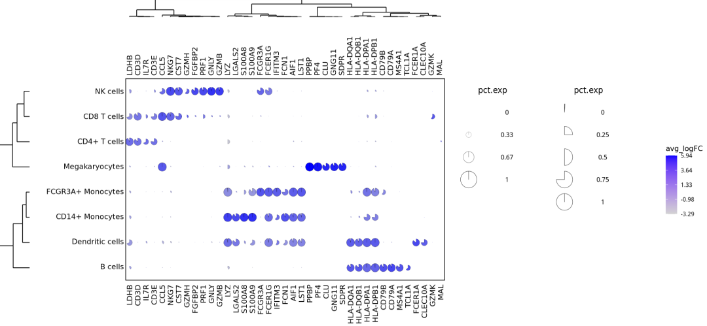

### 其他个性化修改

修改图例标题：

```r
dot_plot(data.to.plot = PBMC3K_example_data,
         size_var = "pct.exp", shape.scale = 8, size_legend="My size legend",
         shape_var= "pval_symb", shape_legend="My shape legend",
         col_var = "avg_logFC", col_legend="My col legend"
         )
```

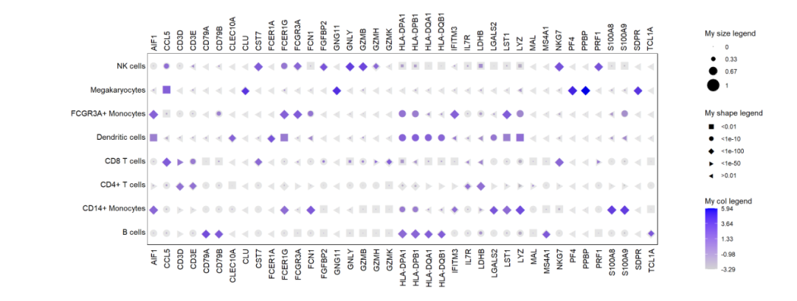

复杂一点的图：

```r
### Import data + create the exp.type column
data(CBMC8K_example_data)

### Dotplot
dotplot = dot_plot(
  data.to.plot=CBMC8K_example_data,
  size_var="RNA.avg.exp.scaled",col_var="ADT.avg.exp.scaled", text_var="ADT.pct.exp.sup.cutoff",
  shape_var="canonical_marker", shape_use = c("\u25CF","\u2737"),
  x.lab.pos="bottom",y.lab.pos="left",
  cols.use=c("lightgrey","orange","red", "darkred"),size_legend="RNA", col_legend="ADT", shape_legend="Canonical marker ?",
  shape.scale =12, text.size=3,
  plot.legend = TRUE,
  size.breaks.number=4, color.breaks.number=4, shape.breaks.number=5
  , dend_x_var=c("RNA.avg.exp.scaled","ADT.avg.exp.scaled"), dend_y_var=c("RNA.avg.exp.scaled","ADT.avg.exp.scaled"), dist_method="euclidean",
  hclust_method="ward.D", do.return = TRUE)
```

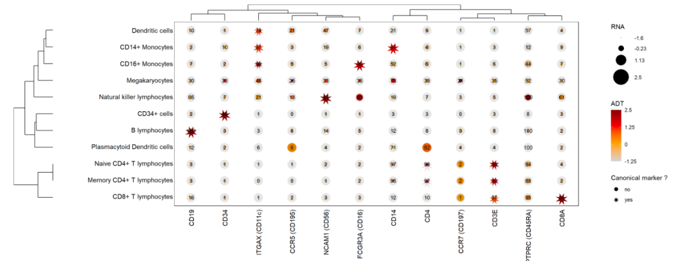

图示含义：

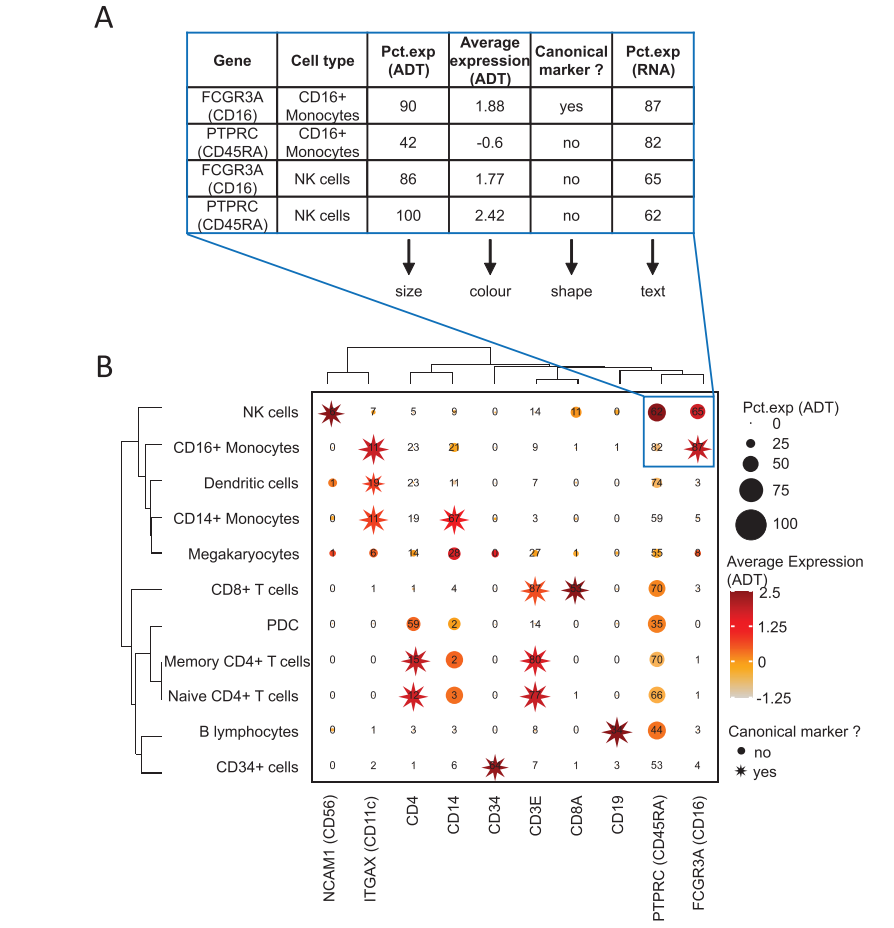

是不是又得到了一种新方法！

<!-- wechat-article-fetcher: complete -->
