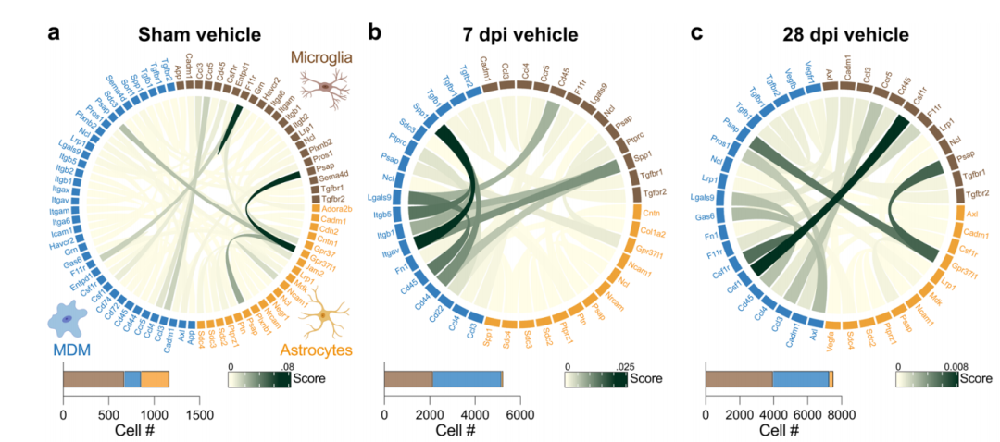
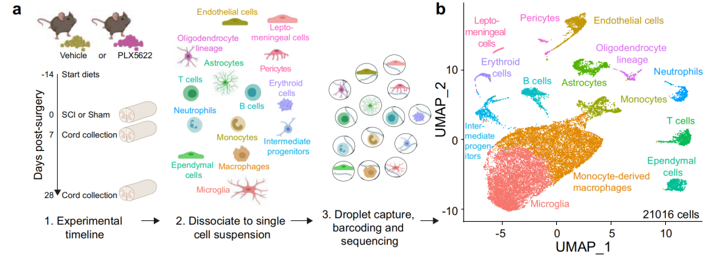
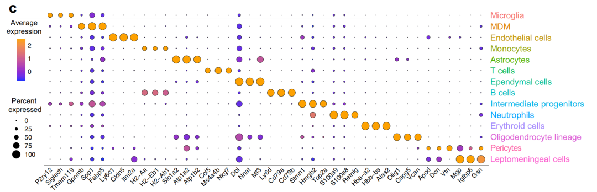
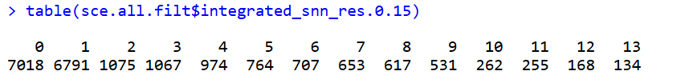
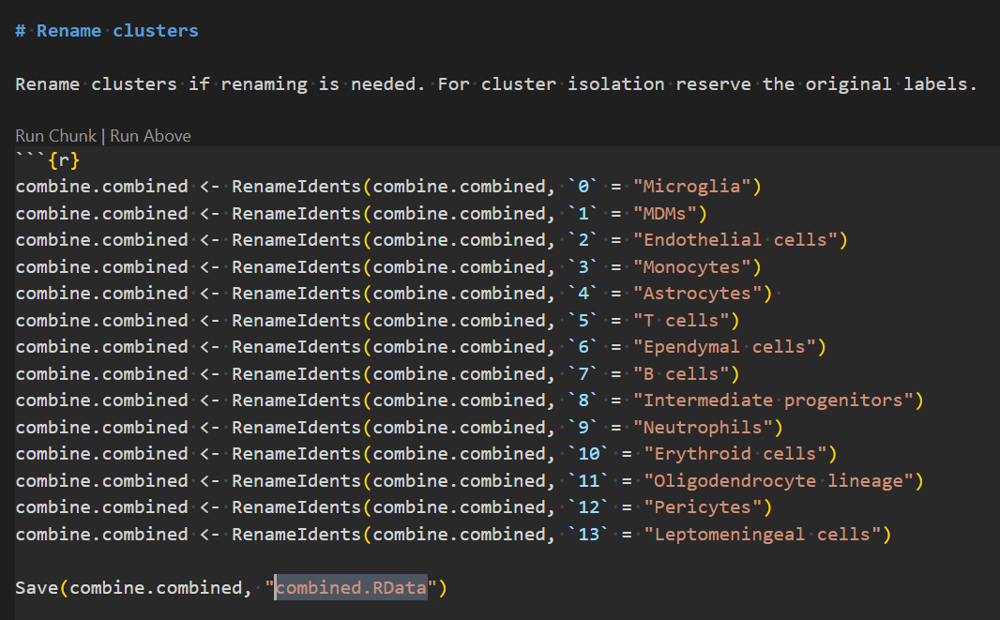
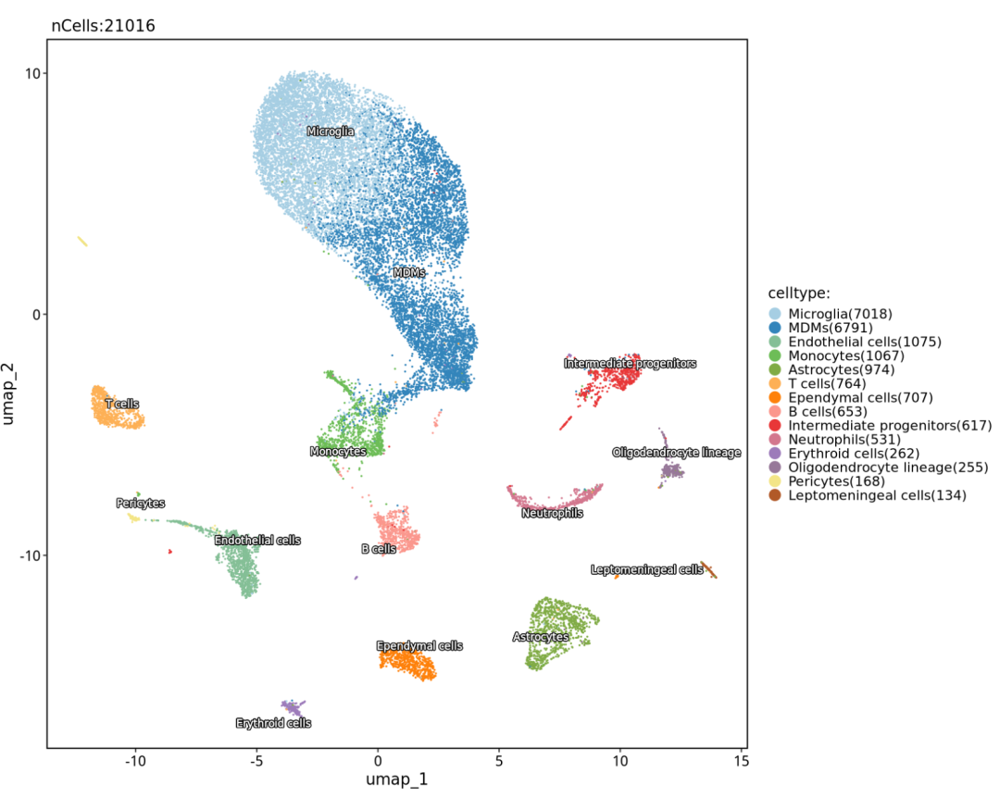
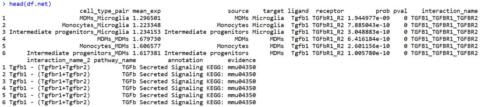

# NC高分杂志cellchat细胞通讯结果个性化绘制之弦图

- 专辑：绘图小技巧2025
- 公众号：生信技能树
- 发布时间：2025-08-11 22:37
- 原文：[微信公众平台](https://mp.weixin.qq.com/s?__biz=MzAxMDkxODM1Ng%3D%3D&mid=2247544913&idx=1&sn=fb5ab3ded41912c8019a81a54f76d685&chksm=9b4b70eaac3cf9fc22aff9e17ba158764fe7aa728a57684b5d107ce84be4f9476558029613c5)

---
前面，我们尝试了对单细胞或者空间转录组细胞通讯结果进行可视化，相关的准备的帖子有：

- [cellchat细胞通讯绘制弦图函数的参数这么难搞定吗？](https://mp.weixin.qq.com/s?__biz=MzAxMDkxODM1Ng%3D%3D&mid=2247542658&idx=1&sn=adabcd404adc4cd33d3991909888ec76#wechat_redirect)

- [基本功修炼：Chord diagram 和弦图的基础函数](https://mp.weixin.qq.com/s?__biz=MzAxMDkxODM1Ng%3D%3D&mid=2247544490&idx=1&sn=9a3e5918921f89126470514d7516094e#wechat_redirect)

今天就开干！学习的弦图个性化图来自文献《Microglia coordinate cellular interactions during spinal cord repair in mice》，于2022年7月14号发表在 Nature Communications 杂志上，弦图如下。

含义：**弦图显示了假手术（sham）、7天（7 dpi）和28天（28 dpi）脊髓中，小胶质细胞（棕色）、MDMs（蓝色）和星形胶质细胞（橙色）之间的相互作用，这些相互作用来自载体（vehicle）处理的小鼠（a–c）和小胶质细胞耗竭的小鼠（d–f）。**



## 数据背景

创伤性脊髓损伤（SCI）会引发一种以驻留组织的小胶质细胞microglia和单核细胞衍生的巨噬细胞（MDMs）为主导的神经炎症反应。由于激活的microglia和MDMs在体内具有相同的形态特征，并且表达相似的表型标记，因此历史上一直难以识别由microglia特异性协调的损伤反应。在此，作者通过药物耗竭小microglia，并利用解剖学、组织病理学、神经纤维示踪、bulk RNA-seq和scRNA-seq揭示了由microglia控制的SCI的细胞和分子反应。

结果发现，microglia 对于SCI的恢复至关重要，并在中枢神经系统驻留的胶质细胞和浸润性白细胞中协调损伤反应。耗竭microglia会加剧组织损伤并恶化功能恢复。相反，通过测序数据识别出的microglia依赖性信号轴在microglia耗竭的小鼠中得以恢复，可以防止继发性损伤并促进恢复。进一步的生物信息学分析揭示，通过利用microglia、astrocytes和MDMs之间的关键配体-受体相互作用，可能会实现SCI后的最佳修复。

### 实验设计

小鼠在手术前2周开始接受载体（vehicle）或PLX5622处理，持续至术后7天或28天。在终点时，通过解剖一段1厘米的新鲜组织（T4–T13），包括硬膜，以椎板切除术为中心，对新鲜（未灌注）小鼠脊髓进行单细胞RNA测序。



top3亚群差异基因：



### 样本如下：

Bulk RNAseq of spinal cords：sham Vehicle (n=4), sham PLX5622 (n=4), 7dpi Vehicle (n=3), and 7dpi PLX5622 mice (n=3)

Single cell RNAseq of spinal cords：sham, 7 dpi and 28 dpi Vehicle mice and sham, 7 dpi and 28 dpi PLX5622 mice

GSE196928：https://www.ncbi.nlm.nih.gov/geo/query/acc.cgi?acc=GSE196928

```r
GSM5904811 A.1_S23
GSM5904812 A.25_S2
GSM5904813 A.27_S3
GSM5904814 A.3_S1
GSM5904815 B.2_S24
GSM5904816 B.26_S25
GSM5904817 B.4_S4
GSM5904818 C.29_S6
GSM5904819 C.31_S27
GSM5904820 C.5_S26
GSM5904821 C.7_S5
GSM5904822 D.30_S8
GSM5904823 D.32_S29
GSM5904824 D.6_S7
GSM5904825 B1
GSM5904826 B2
GSM5904827 B3
GSM5904828 B4
GSM5904829 B7
GSM5904830 B8
```

R代码放了两个地方：

- https://github.com/OSU-BMBL/Spinal-cord-scRNAseq

- https://doi.org/10.5281/zenodo.6590552

## 单细胞注释

先把数据下载下来，进行预处理：

```r
###
### Create: Jianming Zeng
### Date:  2023-12-31
### Email: jmzeng1314@163.com
### Blog: http://www.bio-info-trainee.com/
### Forum:  http://www.biotrainee.com/thread-1376-1-1.html
### CAFS/SUSTC/Eli Lilly/University of Macau
### Update Log: 2023-12-31   First version
### Update Log: 2024-12-09   by juan zhang (492482942@qq.com)
###
rm(list=ls())
options(stringsAsFactors = F)
library(ggsci)
library(dplyr)
library(future)
library(Seurat)
library(clustree)
library(cowplot)
library(data.table)
library(ggplot2)
library(patchwork)
library(stringr)
library(qs)
library(Matrix)

# 创建目录
getwd()
gse <- "GSE196928"
dir.create(gse)

###### step1: 导入数据 ######
ct <- data.table::fread("GSE196928/GSE196928_counts.csv.gz",data.table = F)
ct[1:5, 1:5]
dim(ct)
rownames(ct) <- ct[,1]
ct <- ct[,-1]
ct[1:5, 1:5]
head(colnames(ct))
# 去掉前面的X
colnames(ct) <- substring(colnames(ct), 2)

phe <- data.table::fread('GSE196928/GSE196928_metadata.csv.gz',data.table = F)
head(phe)
tail(phe)
table(phe$orig.ident)
rownames(phe) <- phe[,1]
phe <- phe[,-1]
rownames(phe) <- gsub(" ", ".", rownames(phe))
rownames(phe) <- gsub("-", ".", rownames(phe))
identical(rownames(phe),colnames(ct))

# 创建对象
sce.all <- CreateSeuratObject(counts = ct, meta.data = phe, min.cells = 3)
sce.all

# 查看特征
as.data.frame(sce.all@assays$RNA$counts[1:10, 1:2])
head(sce.all@meta.data, 10)
table(sce.all$orig.ident)
table(sce.all$integrated_snn_res.0.15)
table(sce.all$seurat_clusters)

library(qs)
qsave(sce.all, file="GSE196928/sce.all.qs")
```

作者这里有直接分好的类别，



接下来经过数据标准化、降维聚类，harmony去批次，然后根据文献的代码注释：



最终注释结果如下，于文献中一致：



## 单细胞cellchat分析

这里作者按照样本分组进行分细胞通讯分析，我们只分析其中一组来学习上面的弦图绘制：选择 net.ctrl.00d 组别

```r
library(CellChat)
packageVersion("CellChat")
# [1] ‘2.2.0’
library(patchwork)
library(Hmisc)
# library(hash)
library(tidyverse)
library(circlize)
library(ggsci)
library(igraph)
library(gtools)
library(ComplexHeatmap)

# counts : the gene expression matrix
# meta   : the meta data matched with the gene expression matrix
load(file = "2-harmony/sce.all.filt.RData")
sce.all.filt
head(sce.all.filt@meta.data)
table(sce.all.filt$orig.ident)

sce.all.filt <- subset(sce.all.filt, orig.ident=="00 d Control")
sce.all.filt
```

### 细胞通讯：

前面也做了细胞通讯结果可视化：[高分杂志同款cellchat细胞通讯结果气泡图绘制（IF=25.083）](https://mp.weixin.qq.com/s?__biz=MzAxMDkxODM1Ng%3D%3D&mid=2247544734&idx=1&sn=afb7ead473e91445b695efea54807327#wechat_redirect)

```r
counts <- sce.all.filt@assays$RNA$counts
counts <- as.matrix(counts) # transform data frame into matrix
counts[1:4,1:4]

meta <- sce.all.filt@meta.data
meta$samples <- meta$orig.ident
head(meta)

# 创建对象
cellchat <- createCellChat(object = counts, meta = meta, group.by = "celltype") # create a CellChat object
levels(cellchat@idents) # check the cell types
CellChatDB <- CellChatDB.mouse # set the database according to the organism
dplyr::glimpse(CellChatDB$interaction) # show the structure of the database
unique(CellChatDB$interaction$annotation) # check the annotation of interactions
CellChatDB.use <- CellChatDB # use all databases
cellchat@DB <- CellChatDB.use # set the used database in the object
cellchat <- subsetData(cellchat) # subset the expression data of signaling genes for saving computation cost
cellchat <- identifyOverExpressedGenes(cellchat)
cellchat <- identifyOverExpressedInteractions(cellchat)
# cellchat <- projectData(cellchat, PPI.mouse)
cellchat <- computeCommunProb(cellchat, raw.use = T, nboot = 1, population.size = T)
cellchat <- filterCommunication(cellchat, min.cells = 10)
save(cellchat, file = "cellchat.RData")

#load("cellchat.RData")
df.net <- subsetCommunication(cellchat) # get the pairs of cell types or ligand receptors in the interactions
head(df.net)
cell_type_pair <- paste0(df.net$source, '_', df.net$target) # build the pairs of interaction cell types
cell_type_pair

mean_exp <- sapply(1:nrow(df.net), function(x) {
#x <- 1
print(x)
  ct1 <- df.net$source[x] # source cell type
  ct2 <- df.net$target[x] # target cell type
  cells1 <- rownames(meta[meta$celltype == ct1,]) # cells belonging to the source cell type
  cells2 <- rownames(meta[meta$celltype == ct2,])# cells belonging to the target cell type
  gene_pair1 <- df.net$ligand[x] # genes corresponding to the ligand
  genes1 <- capitalize(tolower(strsplit(gene_pair1, split = '_')[[1]]))
  gene_pair2 <- df.net$receptor[x] # genes corresponding to the receptor
  genes2 <- capitalize(tolower(strsplit(gene_pair2, split = '_')[[1]]))
if (length(genes2) > 1 & genes2[2] == 'R2') {
    genes2[2] <- gsub(pattern = '1', replacement = '2', genes2[1])
  }
#cat("Ligand genes: ", genes1, "
")
#cat("Receptor genes: ", genes2, "

")
#mean1 <- mean(counts[genes1, cells1]) # the mean expression value of the ligand within the source cell type
#mean2 <- mean(counts[genes2, cells2]) # the mean expression value of the receptor within the source cell type
  mean1 <- mean(counts[intersect(rownames(sce.all.filt), genes1), cells1 ]) # the mean expression value of the ligand within the source cell type
  mean2 <- mean(counts[intersect(rownames(sce.all.filt), genes2), cells2 ]) # the mean expression value of the receptor within the source cell type
  avg <- (mean1 + mean2) / 2 # the mean expression value of the ligands and receptors
return(avg)
})
df.net <- cbind(cell_type_pair, mean_exp, df.net) # add the mean expression and cell type pairs
head(df.net)
```



细胞通讯的结果就做好啦！

后面使用 基础函数绘制弦图的代码篇幅比较长，我们下次分享（待续~）

#### 文末友情宣传

强烈建议你推荐给身边的**博士后以及年轻生物学PI**，多一点数据认知，让他们的科研上一个台阶：

- [生信入门&数据挖掘线上直播课8月班](https://mp.weixin.qq.com/s?__biz=MzAxMDkxODM1Ng%3D%3D&mid=2247544311&idx=1&sn=d41b5838e799f52280e78703135bb603#wechat_redirect)，你的生物信息学入门课

- [时隔5年，我们的生信技能树VIP学徒继续招生啦](https://mp.weixin.qq.com/s?__biz=MzAxMDkxODM1Ng%3D%3D&mid=2247525079&idx=1&sn=0b997af16a58195b4192691373048fd5#wechat_redirect)

- [满足你生信分析计算需求的低价解决方案](https://mp.weixin.qq.com/s?__biz=MzUzMTEwODk0Ng%3D%3D&mid=2247530048&idx=1&sn=28aa7bbd5e00521f79e074496a5f5d66#wechat_redirect)

- [生信故事会](https://mp.weixin.qq.com/mp/appmsgalbum?__biz=MzAxMDkxODM1Ng%3D%3D&action=getalbum&album_id=1679199708449144836#wechat_redirect)，来看看他们的生信入门故事

- [生信马拉松答疑专辑](https://mp.weixin.qq.com/mp/appmsgalbum?__biz=MzAxMDkxODM1Ng%3D%3D&action=getalbum&album_id=3690970204957147140#wechat_redirect)，获取你的生信专属答疑

<!-- wechat-article-fetcher: complete -->
