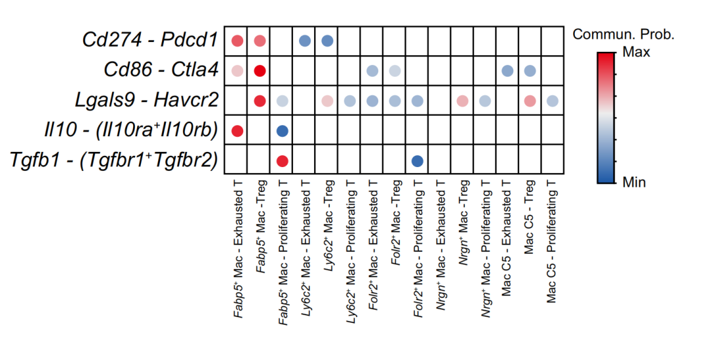
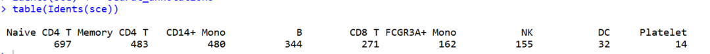
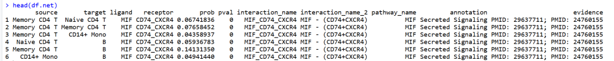
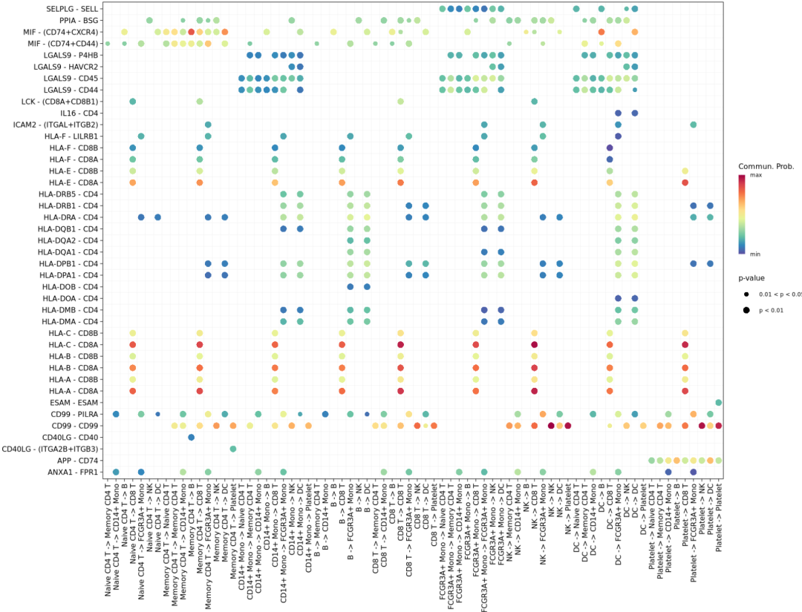
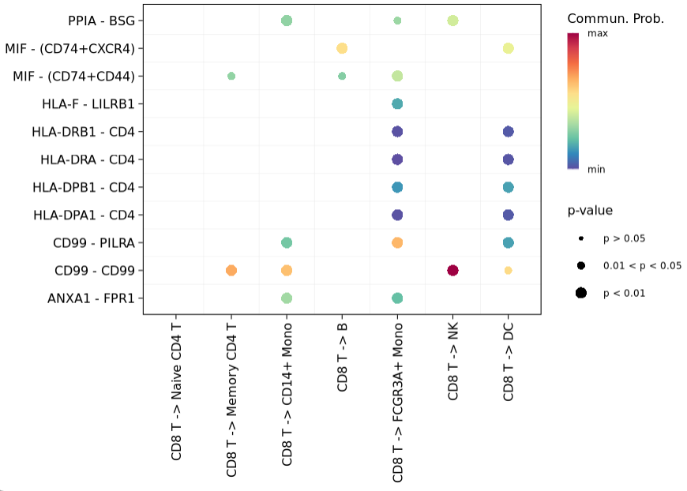
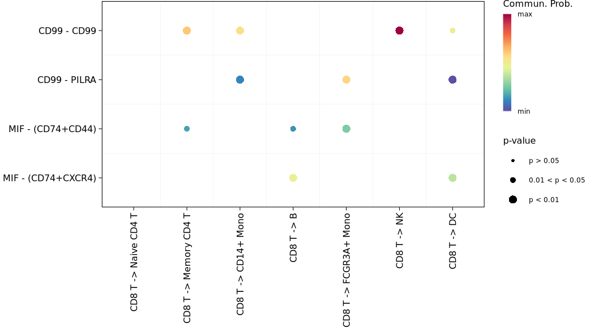
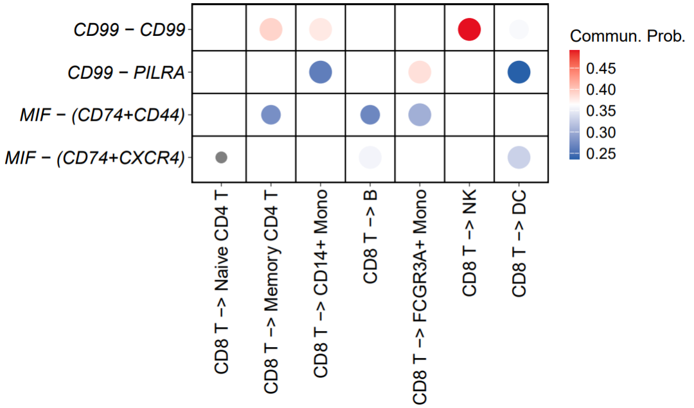

# 高分杂志同款cellchat细胞通讯结果气泡图绘制（IF=25.083）

- 专辑：绘图小技巧2025
- 公众号：生信技能树
- 发布时间：2025-08-04 22:30
- 原文：[微信公众平台](https://mp.weixin.qq.com/s?__biz=MzAxMDkxODM1Ng%3D%3D&mid=2247544734&idx=1&sn=afb7ead473e91445b695efea54807327&chksm=9b4b6f25ac3ce6335a42c14b3599bae6d64a5be405243e58e7261ce522980ac1b148a9d05ce3)

---
> 收到群里面一个学员问下面这个图怎么绘制，今天又是每周一次的绘图时间，来看看！如果你也想加入我们的绘图群，进群方式见：[绘图小技巧2025交流群](https://mp.weixin.qq.com/s?__biz=MzAxMDkxODM1Ng%3D%3D&mid=2247538699&idx=1&sn=871cb62f043fc30e1996066dc50430dd#wechat_redirect)

我们生信技能树**每个月都有一期带领初学者，0基础的生信入门培训，会有各种贴心的答疑，甚至是新叶老师给你的一对一专属答疑，远程代码演示，快来：最新一期在8月4号**，感兴趣的可以去看看呀：[生信入门&数据挖掘线上直播课8月班](https://mp.weixin.qq.com/s?__biz=MzAxMDkxODM1Ng%3D%3D&mid=2247544311&idx=1&sn=d41b5838e799f52280e78703135bb603#wechat_redirect)。

这幅图来自2025年4月发表在J Hepatol.杂志上的文献，标题为《FABP5+ lipid-loaded macrophages process tumour-derived unsaturated fatty acid signal to suppress T-cell antitumour immunity》。

图如下：展示的是单细胞的细胞通讯结果，Mac细胞亚群与T细胞亚群之间特定的 immunosuppressive signalling interactions 分子之间的通讯情况，点的颜色表示通讯强度Prob，关于Prob的含义见我们之前的稿子：[cellchat细胞通讯中 prob 与 pval 的含义是什么?](https://mp.weixin.qq.com/s?__biz=MzAxMDkxODM1Ng%3D%3D&mid=2247536318&idx=1&sn=cf0c131962bac2313a172952b91b1e1f#wechat_redirect)



> Fig. 2. Fabp5+ lipid-loaded TAMs correlate with blunted T-cell activation. Dot plot (H) showing immunosuppressive signalling interactions (rows) between FABP5+ TAMs and T-lymphocyte subsets (columns).  AMs, tumour-associated macrophages;

## 示例数据

这个数据呢作者放在了GEO上：https://www.ncbi.nlm.nih.gov/geo/query/acc.cgi?acc=GSE237823

我们之前有个预处理的帖子：[单细胞数据GSE237823有四个样本但是读进去没有样本分组怎么办？](https://mp.weixin.qq.com/s?__biz=MzAxMDkxODM1Ng%3D%3D&mid=2247538613&idx=1&sn=d47381d07bdef6e18d80f9a2a8cd2d35#wechat_redirect)，但是还没有做注释，所以这里就用经典的pbmc3k的数据作为示例绘图吧，仅考虑代码技巧。

数据读取：

```r
rm(list=ls())
getOption('timeout')
options(timeout=10000)
library(SeuratData) #加载seurat数据集
library(Seurat)
library(tidyverse)
library(CellChat)
library(patchwork)
packageVersion("CellChat")

# InstallData("pbmc3k")
data("pbmc3k")
sce <- UpdateSeuratObject(pbmc3k)
table(sce$seurat_annotations)
colnames(sce@meta.data)
dim(sce)
# 去掉没有注释信息的细胞
sce <- sce[ , which(!is.na(sce@meta.data$seurat_annotations))]
sce <- sce %>%
  NormalizeData %>%
  FindVariableFeatures %>%
  ScaleData

sce
table(Idents(sce))
Idents(sce) <- "seurat_annotations"
```



## 运行cellchat

cellchat的详细原理看：[cellchat细胞通讯中 prob 与 pval 的含义是什么?](https://mp.weixin.qq.com/s?__biz=MzAxMDkxODM1Ng%3D%3D&mid=2247536318&idx=1&sn=cf0c131962bac2313a172952b91b1e1f#wechat_redirect)

### 创建cellchat对象

先从seurat里面提取对应的数据并创建cellchat对象：

```r
## 1.输入数据
# For the gene expression data matrix, genes should be in rows with rownames and cells in columns with colnames.
# Normalized data (e.g., library-size normalization and then log-transformed with a pseudocount of 1) is required
# as input for CellChat analysis
data.input = sce@assays$RNA@data # normalized data matrix
data.input[1:4,1:4]
meta = sce@meta.data[, "seurat_annotations",drop=F] # a dataframe with rownames containing cell mata data
colnames(meta) <- "labels"
head(meta)
table(meta)

## 2.创建对象
cellchat <- createCellChat(object = data.input, meta = meta, group.by = "labels")
cellchat
levels(cellchat@idents) # show factor levels of the cell labels
groupSize <- as.numeric(table(cellchat@idents)) # number of cells in each cell group
groupSize
```

### 指定使用数据库

除了 "Non-protein Signaling" ：

```r
## 3.数据库
CellChatDB <- CellChatDB.human # use CellChatDB.mouse if running on mouse data
showDatabaseCategory(CellChatDB)

# use all CellChatDB except for "Non-protein Signaling" for cell-cell communication analysis
CellChatDB.use <- subsetDB(CellChatDB)
# set the used database in the object
cellchat@DB <- CellChatDB.use
cellchat
```

### 得到通讯网络

```r
## 4.鉴定亚群高表达基因
# subset the expression data of signaling genes for saving computation cost
cellchat <- subsetData(cellchat) # This step is necessary even if using the whole database
future::plan("multisession", workers = 20) # do parallel
# CellChat identifies over-expressed ligands or receptors in one cell group
cellchat <- identifyOverExpressedGenes(cellchat)
cellchat <- identifyOverExpressedInteractions(cellchat)
cellchat

## 5.计算probability
cellchat <- computeCommunProb(cellchat, type = "triMean")
#> triMean is used for calculating the average gene expression per cell group.

## 6.通路水平的通讯
cellchat <- computeCommunProbPathway(cellchat)

## 7.计算汇总的通讯网络
cellchat <- aggregateNet(cellchat)

## 8.提取细胞通讯结果
# returns a data frame consisting of all the inferred cell-cell communications at the level of ligands/receptors
# 默认 thresh ：threshold of the p-value for determining significant interaction
df.net <- subsetCommunication(cellchat, thresh = 0.05)
head(df.net)
```

得到的这个表格 df.net 就是细胞的详细通讯结果啦，可以保存出去详细查看结果以及挑选一些有意义的结果：



## 可视化绘图

绘制上面的气泡图很简单，使用 cellchat自带的 netVisual_bubble() 函数就可以了：

默认绘制所有细胞亚群间所有配受体(pvalue\<0.05)的结果：

```r
netVisual_bubble(cellchat,remove.isolate = F)
```



### 指定特定亚群：

使用sources.use 与 targets.use 参数：绘制 CD8+T cell与其他亚群的通讯结果

```r
# 这里的数字为注释水平的顺序，从1开始，比如 5表示 "CD8 T"
levels(cellchat@idents) # show factor levels of the cell labels
# [1] "Naive CD4 T"  "Memory CD4 T" "CD14+ Mono"   "B"            "CD8 T"        "FCGR3A+ Mono" "NK"           "DC"           "Platelet"

netVisual_bubble(cellchat, sources.use = 5, targets.use = c(1,2,3,4,6,7,8), remove.isolate = FALSE)
```



### 再指定特定的通讯通路：

使用 pairLR.use 参数：

```r
# 指定通路
unique(df.net$pathway_name)
pairLR.use <- extractEnrichedLR(cellchat, signaling = c("MIF","CD40","CD99"))
pairLR.use
netVisual_bubble(cellchat, sources.use = 5, targets.use = c(1,2,3,4,6,7,8), remove.isolate = FALSE,pairLR.use = pairLR.use)
```



## 美化

上面基本上就是绘制的过程了，现在简单修饰一下。

这里图中的格子线 函数中写死了，根据 netVisual_bubble 函数的源码，修改了格子线的粗细：

```r
## 美化
p <- netVisual_bubble(cellchat, sources.use = 5, targets.use = c(1,2,3,4,6,7,8), remove.isolate = FALSE,pairLR.use = pairLR.use, grid.on=T,color.grid = "black")

# 看颜色范围
range(p$data$prob,na.rm = T)
summary(p$data$prob,na.rm = T)

p1 <- p + scale_size_continuous(range = c(4, 8), guide = "none") +   # 调整气泡大小范围
  scale_color_gradientn(
    colours = c("#2760a9", "white", "#e50f20"),  # 定义颜色向量
    values = scales::rescale(c(0.2, 0.35, 0.5)),  # 定义颜色映射的范围
    name = "Commun. Prob." ) +  # 图例标题
  xlab(label = NULL) +
  ylab(label = NULL) +
  geom_vline(xintercept = seq(1.5, length(unique(df.net$source)) - 0.5, 1)[1:6],lwd = 0.5) + ## 根据 netVisual_bubble 函数的源码，修改格子线的粗细
  geom_hline(yintercept = seq(1.5, length(unique(df.net$interaction_name_2)) - 0.5, 1)[1:3], lwd = 0.5) +
  theme(axis.title.x = element_text(size = 16),  # 设置 x 轴标题字体大小
    axis.title.y = element_text(size = 16),  # 设置 y 轴标题字体大小
    axis.text.x = element_text(size = 14),  # 设置 x 轴刻度标签字体大小
    axis.text.y = element_text(size = 14, face = "italic"),   # 设置 y 轴刻度标签字体大小
    panel.border = element_rect(color = "black", fill=NA, size=1),  # 设置四周边框的颜色和粗细
    legend.key.size = unit(0.6, 'cm'),  # 设置图例键的大小
    legend.text = element_text(size = 12),  # 设置图例文本的大小
    legend.title = element_text(size = 13)
  )
p1

# 保存
ggsave(filename = "cellchat_bubble.pdf", width = 7.6, height = 4.5,plot = p1)
```



完美，今天分享到这~

#### 文末友情宣传

强烈建议你推荐给身边的**博士后以及年轻生物学PI**，多一点数据认知，让他们的科研上一个台阶：

- [生信入门&数据挖掘线上直播课8月班](https://mp.weixin.qq.com/s?__biz=MzAxMDkxODM1Ng%3D%3D&mid=2247544311&idx=1&sn=d41b5838e799f52280e78703135bb603#wechat_redirect)，你的生物信息学入门课

- [时隔5年，我们的生信技能树VIP学徒继续招生啦](https://mp.weixin.qq.com/s?__biz=MzAxMDkxODM1Ng%3D%3D&mid=2247525079&idx=1&sn=0b997af16a58195b4192691373048fd5#wechat_redirect)

- [满足你生信分析计算需求的低价解决方案](https://mp.weixin.qq.com/s?__biz=MzUzMTEwODk0Ng%3D%3D&mid=2247530048&idx=1&sn=28aa7bbd5e00521f79e074496a5f5d66#wechat_redirect)

- [生信故事会](https://mp.weixin.qq.com/mp/appmsgalbum?__biz=MzAxMDkxODM1Ng%3D%3D&action=getalbum&album_id=1679199708449144836#wechat_redirect)，来看看他们的生信入门故事

- [生信马拉松答疑专辑](https://mp.weixin.qq.com/mp/appmsgalbum?__biz=MzAxMDkxODM1Ng%3D%3D&action=getalbum&album_id=3690970204957147140#wechat_redirect)，获取你的生信专属答疑

<!-- wechat-article-fetcher: complete -->
