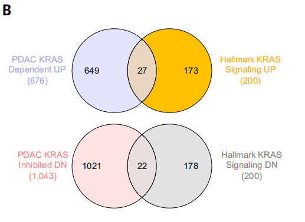
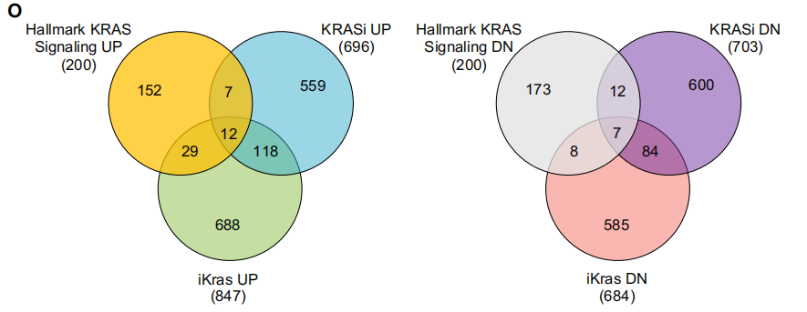
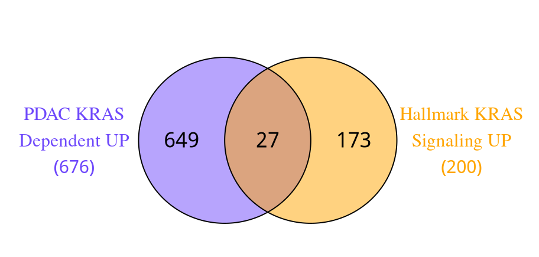
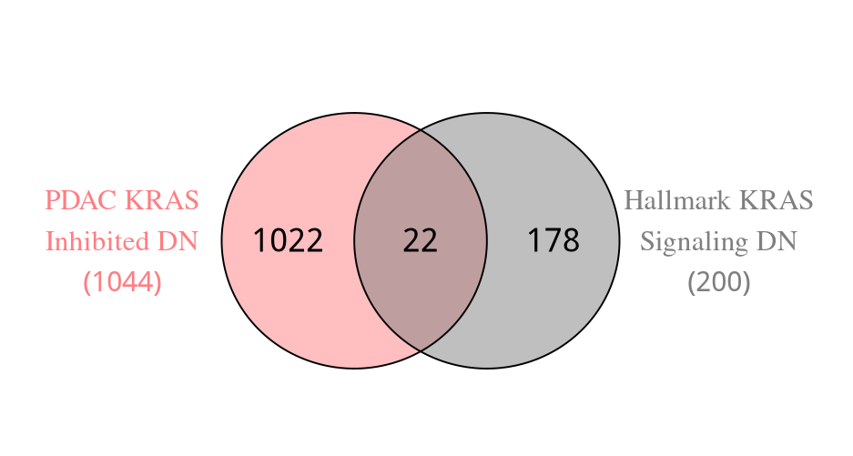
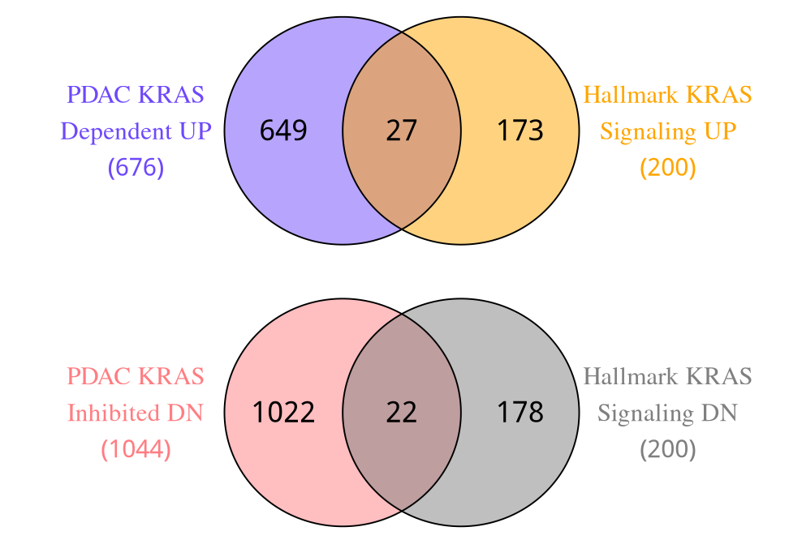

# Science杂志同款：高颜值韦恩图绘制细节调整

- 专辑：绘图小技巧2025
- 公众号：生信技能树
- 发布时间：2025-07-14 22:28
- 原文：[微信公众平台](https://mp.weixin.qq.com/s?__biz=MzAxMDkxODM1Ng%3D%3D&mid=2247544065&idx=1&sn=e527a5b3b9c4db0c9730439ebbaad57a&chksm=9b4b6dbaac3ce4aceada82fdf41814af7d5ec12cbe3a5c98cf7cb469e57c86c1495e79a113a0)

---
> 自从我们的专辑[《绘图小技巧2025》](https://mp.weixin.qq.com/mp/appmsgalbum?__biz=MzAxMDkxODM1Ng%3D%3D&action=getalbum&album_id=3792985494804332545#wechat_redirect)开始以来，已经分享了非常多好看的图啦，直到昨天有个学员问题，没有韦恩图吗？那必须得有啊，马上更新上！今天就来画一下~

我找了一篇大家应该很熟悉的顶刊杂志文献，这个文献里面的图我们已经绘制了非常多啦，今天就画里面的韦恩图， 来自 2024 年 6 月份发表在 顶刊 science 杂志上的文献《**Defining the KRAS- and ERK-dependent transcriptome in KRAS-mutant cancers**》：

两个横着的，图注：

> (B) Venn diagram indicates the overlap of differentially expressed genes (with unique Entrez gene IDs) upon KRAS siRNA treatment (refer to blue/red shading in (A)) compared to Hallmark KRAS signaling genes. N = 8 (cell lines as biological replicates) for each treatment and control.



还有三个交集的：



且这几个图的配色都很好看！

这个图不是很好绘制的地方在于韦恩图两边的文字标签 与 圈的距离，以及显示完全的问题！

这里我们借助 VennDiagram 包绘制，以及 grid 包调整 和 拼图！绘制2个圈的，3个圈的大家可以实践看看~

## 读取数据

数据的详细背景见：[Science杂志：比火山图多一点信息的火山图](https://mp.weixin.qq.com/s?__biz=MzAxMDkxODM1Ng%3D%3D&mid=2247539963&idx=1&sn=35a7f9aa1a032dab77ab3fd859a9834e#wechat_redirect)

### 先读取差异基因

```r
###
### Create: juan zhang
### Date:   2025-01-16
### Email:  492482942@qq.com
### Blog:   http://www.bio-info-trainee.com/
### Forum:  http://www.biotrainee.com/thread-1376-1-1.html
### Update Log: 2025-01-16   First version
###

rm(list=ls())
# 加载R包
library(ggplot2)
library(tibble)
library(ggrepel)
library(tidyverse)
library(dplyr)
library(patchwork)
library(ggplot2)

##### 01、加载数据
# 加载：KRAS vs NS siRNA（log2FC）
diff <- read.csv("./data/science.adk0775_data_s1.csv" )
head(diff)

# 提取基因ID,基因Symbol,FDR值和FC值
diff <- diff[,c("X","external_gene_name","logFC","FDR" )]

# 增加一列上下调，阈值 log2FC > 0.5, adj. p < 0.05
diff$g <- "normal"
diff$g[diff$logFC >0.5 & diff$FDR < 0.05 ] <- "up"
diff$g[diff$logFC < -0.5 & diff$FDR < 0.05 ] <- "down"
table(diff$g)
# down normal     up
# 677  13071   1051

# 显著差异基因
diff_up <- diff[diff$g=="up", ]
diff_down <- diff[diff$g=="down", ]
```

### 两个 Hallmark基因集

去 GSEA 的 MSigDB 数据库去下载Hallmark基因集 gmt 格式：https://www.gsea-msigdb.org/gsea/msigdb/download_file.jsp?filePath=/msigdb/release/2024.1.Hs/h.all.v2024.1.Hs.symbols.gmt

```r
# 读取 hallmark基因集
library(clusterProfiler)
geneset <- read.gmt("data/h.all.v2024.1.Hs.symbols.gmt")
HALLMARK_KRAS_SIGNALING_DN <- geneset[geneset$term=="HALLMARK_KRAS_SIGNALING_DN", 2]
HALLMARK_KRAS_SIGNALING_UP <- geneset[geneset$term=="HALLMARK_KRAS_SIGNALING_UP", 2]
HALLMARK_KRAS_SIGNALING_UP
HALLMARK_KRAS_SIGNALING_DN
```

## 绘图

图B上面的韦恩图：

```r
## 两个交集
library(VennDiagram)

## 图1
gene_list <- list(UP = diff_down$external_gene_name, Hallmark_UP = HALLMARK_KRAS_SIGNALING_UP)
p1 <- venn.diagram(
  x = gene_list, # 向量集合
  scaled = F, # 根据比例显示大小
  category.names = c("PDAC KRAS
Dependent UP
(676)" , "Hallmark KRAS
Signaling UP
(200)"),
  fill = c("#6e48fb", "#ffa500"),
  cat.col = c("#6e48fb", "#ffa500" ),  # 设置类别标签的颜色
  alpha=0.5,  # 着色透明度
  col="black",
  output = FALSE ,
  disable.logging = F,
  lwd = 1.3, # 外圈的颜色和粗细
  lty = 1,
  cex = 1.5, # 圈内字体大小
  cat.cex = 1.3, # 外圈标签字体大小
  cat.default.pos = "outer",
  cat.dist = 0.15,        # 圈的半径
  cat.pos = c(-90, 90),  # 调整标签位置,顺时钟360度
  output=F,
  filename=NULL,
  imagetype="pdf" ,
  height = 180 ,
  width = 180 ,
  resolution = 200,
  margin  = 0.25 # 圈外标签与图形边距的距离
)

grid.newpage()
grid.draw(p1)
```



第二个韦恩图：

```r
## 图2
gene_list <- list(UP = diff_up$external_gene_name, Hallmark_DOWN = HALLMARK_KRAS_SIGNALING_DN)
p2 <- venn.diagram(
  x = gene_list, # 向量集合
  scaled = F, # 根据比例显示大小
  category.names = c("PDAC KRAS
Inhibited DN
(1044)" , "Hallmark KRAS
Signaling DN
(200)"),
  fill = c("#ff7d82", "#7f7f7f"),
  cat.col = c("#ff7d82", "#7f7f7f"),   # 设置类别标签的颜色
  alpha=0.5,  # 着色透明度
  col="black",
  output = FALSE ,
  disable.logging = F,
  lwd = 1.3, # 外圈的颜色和粗细
  lty = 1,
  cex = 1.5, # 圈内字体大小
  cat.cex = 1.3, # 外圈标签字体大小
  cat.default.pos = "outer",
  cat.dist = 0.15,        # 圈的半径
  cat.pos = c(-90, 90),  # 调整标签位置,顺时钟360度
  output=F,
  filename=NULL,
  imagetype="pdf" ,
  height = 180 ,
  width = 180 ,
  resolution = 200,
  margin  = 0.25 # 圈外标签与图形边距的距离
)
grid.newpage()
grid.draw(p2)
```



将两个图保存在一起：

这里用到了视图窗口

```r
# 加载 grid 包
library(grid)

# 保存两个图在一个pdf上
pdf(file = "Fig1B_Venn.pdf", width = 6, height = 6)
grid.newpage()
# 创建一个新的视图窗口，增加边距
# x，y指定绘图的位置，0.5,0.5绘制在视图的中心位置
# width = 0.6, height = 0.6 表示绘图的高和宽，都是以1为单位
vp <- viewport(x = 0.5, y = 0.75, width = 1, height = 1, just = c("center", "center"))
pushViewport(vp)
grid.draw(p1)
vp <- viewport(x = 0.5, y = 0.15, width = 1, height = 1, just = c("center", "center"))
pushViewport(vp)
grid.draw(p2)
dev.off()
```

结果如下：



完美~

#### 文末友情宣传

强烈建议你推荐给身边的**博士后以及年轻生物学PI**，多一点数据认知，让他们的科研上一个台阶：

- [生信入门&数据挖掘线上直播课7月班](https://mp.weixin.qq.com/s?__biz=MzAxMDkxODM1Ng%3D%3D&mid=2247543316&idx=1&sn=c8569d0d202077108063c17964e8c128#wechat_redirect)，你的生物信息学入门课

- [时隔5年，我们的生信技能树VIP学徒继续招生啦](https://mp.weixin.qq.com/s?__biz=MzAxMDkxODM1Ng%3D%3D&mid=2247525079&idx=1&sn=0b997af16a58195b4192691373048fd5#wechat_redirect)

- [满足你生信分析计算需求的低价解决方案](https://mp.weixin.qq.com/s?__biz=MzUzMTEwODk0Ng%3D%3D&mid=2247530048&idx=1&sn=28aa7bbd5e00521f79e074496a5f5d66#wechat_redirect)

- [生信故事会](https://mp.weixin.qq.com/mp/appmsgalbum?__biz=MzAxMDkxODM1Ng%3D%3D&action=getalbum&album_id=1679199708449144836#wechat_redirect)，来看看他们的生信入门故事

- [生信马拉松答疑专辑](https://mp.weixin.qq.com/mp/appmsgalbum?__biz=MzAxMDkxODM1Ng%3D%3D&action=getalbum&album_id=3690970204957147140#wechat_redirect)，获取你的生信专属答疑

<!-- wechat-article-fetcher: complete -->
