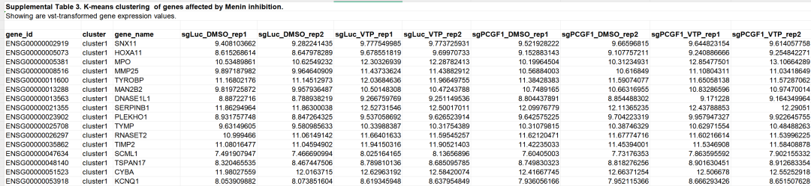
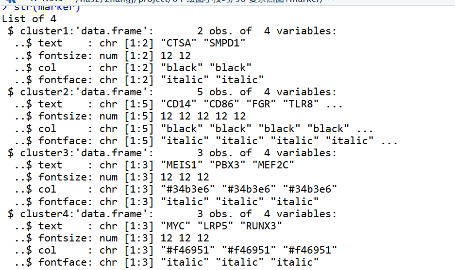
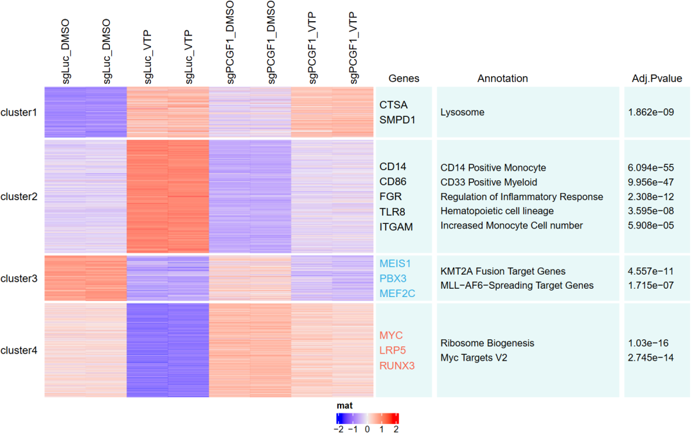

# 顶刊杂志同款高颜值热图+文字注释框（IF=25.476）

- 专辑：绘图小技巧2025
- 公众号：生信技能树
- 发布时间：2025-07-08 17:48
- 原文：[微信公众平台](https://mp.weixin.qq.com/s?__biz=MzAxMDkxODM1Ng%3D%3D&mid=2247543969&idx=1&sn=88deac17e38be5cdb45eb36885e6b2c8&chksm=9b4b6c1aac3ce50c713de579498d1807840631e0705e8dda8dc9cdf1d9f85dcc6956aa9639bf)

---
> 我们的《绘图小技巧2025》交流群里收到了一个学员给的漂亮的热图：来自2024年11月7日发表在高分杂志Blood（IF=25.476）上的文献，标题为《Epigenetic Regulation of Non-canonical Menin Targets Modulates Menin Inhibitor Response in Acute Myeloid Leukemia》，Fig4a。问能不能复现看看那，下面就来画画看！

图的含义：为了研究 PRC1.1 缺失的白血病细胞的耐药机制，用DMSO或VTP50469处理的PCGF1野生型和敲除型OCI-AML2细胞中进行转录组测序分析。差异基因表达分析发现，在野生型细胞中，menin 抑制后有1117个基因上调、950个基因下调（fold change \>1.5; adjusted P value \<.01）（图4A）。K-means 聚类分析确定了4个具有不同基因表达模式的簇（图4A；补充表3）：

- cluster 2基因：与造血系发育和髓系分化相关，在PCGF1敲除后VTP50469对其激活作用减弱；

- cluster 3基因：富含MLL融合癌蛋白靶标，如MEIS1、PBX3和MEF2C，在PCGF1野生型和敲除型细胞中均被VTP50469抑制（图4A-B）；

- cluster 4基因：包括MYC、LRP5和RUNX3，与MYC基因特征和核糖体生物合成相关，在野生型细胞中被抑制，但在PCGF1缺失细胞中未被抑制（图4A）。


图注：

> Loss of PRC1.1 leads to epigenetic reactivation of a unique group of noncanonical menin targets upon menin inhibition. (A) K-means clustering of differentially expressed genes in OCI-AML2 cells treated with DMSO or 1 μM VTP50469 for 6 days. Two replicates were used for each group. 

前面在学习绘制这个热图时，专门去学习了热图旁边的文字框绘制：[一文了解热图如何添加文本框注释](https://mp.weixin.qq.com/s?__biz=MzAxMDkxODM1Ng%3D%3D&mid=2247543783&idx=1&sn=b6e1fce6f549e2c7f16707478d2035dd#wechat_redirect)

## 数据

热图的数据，文献提供了在supplemental Table 3中，下载链接：https://pmc.ncbi.nlm.nih.gov/articles/PMC11561541/#appsec1



读取进来，跳过前三行：

```r
rm(list=ls())
## 加载R包
library(ComplexHeatmap)
library(shinipsum)
library(ggplot2)
library(ggstatsplot)
library(patchwork)
library(reshape2)
library(stringr)
library(limma)
library(tidyverse)
getOption('timeout')
options(timeout=10000)

# 导入数据
data <- readxl::read_excel("BLOOD_BLD-2023-023644-mmc3.xlsx",skip = 3)
dim(data)
data[1:6,1:6]
```

制作第一个注释框标记基因的信息：

```r
# 标记的基因
marker <- list(cluster1=c("CTSA", "SMPD1"), cluster2=c("CD14", "CD86", "FGR", "TLR8", "ITGAM"),
               cluster3=c("MEIS1", "PBX3", "MEF2C"),
               cluster4=c("MYC", "LRP5", "RUNX3"))
marker

## 修饰每一个文字注释条的参数
tcol <- c("black","black","#34b3e6","#f46951")
bg <- c("#e8f8f8", "#fdefe9", "#e9f6fb", "#fde8e9")

for(i in 1:length(marker)) {
#i <- 1
  marker[[i]] <- data.frame(text=marker[[i]],fontsize=12,col=tcol[i],
                            fontface="italic")
}
marker
str(marker)
```

marker 是一个list对象，每一个list为一个数据框，里面包含了文字的大小，颜色，字体类型



注释通路文字框：

```r
# 注释通路
annotation <- list(cluster1=c("Lysosome"),
                   cluster2=c("CD14 Positive Monocyte", "CD33 Positive Myeloid", "Regulation of Inflammatory Response",
                              "Hematopoietic cell lineage", "Increased Monocyte Cell number"),
                   cluster3=c("KMT2A Fusion Target Genes", "MLL-AF6-Spreading Target Genes"),
                   cluster4=c("Ribosome Biogenesis", "Myc Targets V2"))

annotation
for(i in 1:length(annotation)) {
  #i <- 1
  annotation[[i]] <- data.frame(text=annotation[[i]],fontsize=11.3,col="black")
}
annotation
```

注释pvalue文字框：

```r
# 注释pvalue
adj_p_values <- list(cluster1=c(1.862e-9),
                     cluster2=c(6.094e-55, 9.956e-47, 2.308e-12, 3.595e-8, 5.908e-5),
                     cluster3=c(4.557e-11, 1.715e-7),
                     cluster4=c(1.030e-16, 2.745e-14))

adj_p_values
for(i in 1:length(adj_p_values )) {
  #i <- 1
  adj_p_values [[i]] <- data.frame(text=as.character(adj_p_values[[i]]),fontsize=11.3,col="black")
}
adj_p_values
```

## 绘图

使用 ComplexHeatmap 包，需要先对 表达矩阵进行行归一化：

```r
## 绘图
## 热图与文本框链接
mat <- as.matrix(data[,-c(1:3)])
rownames(mat) <- data$gene_id
dim(mat)
head(mat)
# 表达值归一化
mat <- t(scale(t(mat)))
colnames(mat) <- str_split(colnames(mat), "_rep",simplify = T)[,1]


# 行分割
split <- data$cluster
split

ha <- rowAnnotation(textbox1 = anno_textbox(split, marker, # split 与 text的名字对应
                                     add_new_line = TRUE, # 每一个word一行
                                     word_wrap = TRUE, # 控制单词换行和新行：
                                     line_space = unit(3, "mm"),
                                     background_gp = gpar( fill=bg,col = NA), #：设置文本框的背景和边框颜色
                                     by = "anno_block"
))


#
ha1 <- rowAnnotation(textbox2 = anno_textbox(split, annotation, # split 与 text的名字对应
                                           add_new_line = TRUE, # 每一个word一行
                                           word_wrap = TRUE, # 控制单词换行和新行：
                                           line_space = unit(3, "mm"),
                                           background_gp = gpar( fill=bg,col = NA), #：设置文本框的背景和边框颜色
                                           by = "anno_block"
))

#
ha2 <- rowAnnotation(textbox3 = anno_textbox(split, adj_p_values, # split 与 text的名字对应
                                            add_new_line = TRUE, # 每一个word一行
                                            word_wrap = TRUE, # 控制单词换行和新行：
                                            line_space = unit(3, "mm"),
                                            background_gp = gpar( fill=bg,col = NA), #：设置文本框的背景和边框颜色
                                            by = "anno_block",
))
```

绘制并保存：

```r
# 文本框注释条在右边
pdf(file = "Fig4a.pdf",height = 7,width = 11)
ht_list = Heatmap(mat, name = "mat", cluster_rows = FALSE, row_split = split,
        show_row_names = F,  # 去掉行名
        cluster_columns = F, # 列不聚类
        row_title_rot = 0,   # 右边的标题水平放着
        row_title_gp = gpar(fontsize = 12),
        heatmap_legend_param = list(direction = "horizontal",nrow = 1), # 图例水平放置
        column_names_side = c("top"),
        right_annotation =  ha
        ) +
  ha1 + ha2

draw(ht_list,heatmap_legend_side = "bottom") # 图例放在底部

# 给三个文本注释框添加标题
decorate_annotation("textbox1",{
  grid.text("Genes", y = unit(1, "npc") + unit(2, "mm"), just = "bottom")
})
decorate_annotation("textbox2",  {
  grid.text("Annotation", y = unit(1, "npc") + unit(2, "mm"), just =c("right","bottom"))
})
decorate_annotation("textbox3",  {
  grid.text("Adj.Pvalue", y = unit(1, "npc") + unit(2, "mm"), just = "bottom")
})
dev.off()
```

结果如下：



完美！本次分享到这~

#### 文末友情宣传

强烈建议你推荐给身边的**博士后以及年轻生物学PI**，多一点数据认知，让他们的科研上一个台阶：

- [生信入门&数据挖掘线上直播课7月班](https://mp.weixin.qq.com/s?__biz=MzAxMDkxODM1Ng%3D%3D&mid=2247543316&idx=1&sn=c8569d0d202077108063c17964e8c128#wechat_redirect)，你的生物信息学入门课

- [时隔5年，我们的生信技能树VIP学徒继续招生啦](https://mp.weixin.qq.com/s?__biz=MzAxMDkxODM1Ng%3D%3D&mid=2247525079&idx=1&sn=0b997af16a58195b4192691373048fd5#wechat_redirect)

- [满足你生信分析计算需求的低价解决方案](https://mp.weixin.qq.com/s?__biz=MzUzMTEwODk0Ng%3D%3D&mid=2247530048&idx=1&sn=28aa7bbd5e00521f79e074496a5f5d66#wechat_redirect)

- [生信故事会](https://mp.weixin.qq.com/mp/appmsgalbum?__biz=MzAxMDkxODM1Ng%3D%3D&action=getalbum&album_id=1679199708449144836#wechat_redirect)，来看看他们的生信入门故事

- [生信马拉松答疑专辑](https://mp.weixin.qq.com/mp/appmsgalbum?__biz=MzAxMDkxODM1Ng%3D%3D&action=getalbum&album_id=3690970204957147140#wechat_redirect)，获取你的生信专属答疑

<!-- wechat-article-fetcher: complete -->
