# 一文了解热图如何添加文本框注释

- 专辑：绘图小技巧2025
- 公众号：生信技能树
- 发布时间：2025-06-30 22:36
- 原文：[微信公众平台](https://mp.weixin.qq.com/s?__biz=MzAxMDkxODM1Ng%3D%3D&mid=2247543783&idx=1&sn=b6e1fce6f549e2c7f16707478d2035dd&chksm=9b4b6b5cac3ce24a9038f3867ad8c65aba9620307134c6b1c156001e1111418345a0b05972fe)

---
> 在群里看到了多次有人提问，如何绘制下面这种热图，即在热图的左边或者右边加上文字如基因或者通路的注释框框~
>
> 下面先来学习一下基础函数以及对应的用法~

插播：我们生信技能树**每个月都有一期带领初学者，0基础的生信入门培训，会有各种贴心的答疑，最新一期在7月3号**，感兴趣的可以去看看呀：[7月3日开课：生信入门&数据挖掘线上直播课7月班](https://mp.weixin.qq.com/s?__biz=MzAxMDkxODM1Ng%3D%3D&mid=2247543525&idx=1&sn=14058118935bd7393156b1d292dca8f9#wechat_redirect)

学员给的漂亮的热图：

来自文献《Epigenetic Regulation of Non-canonical Menin Targets Modulates Menin Inhibitor Response in Acute Myeloid Leukemia》，Fig4a。

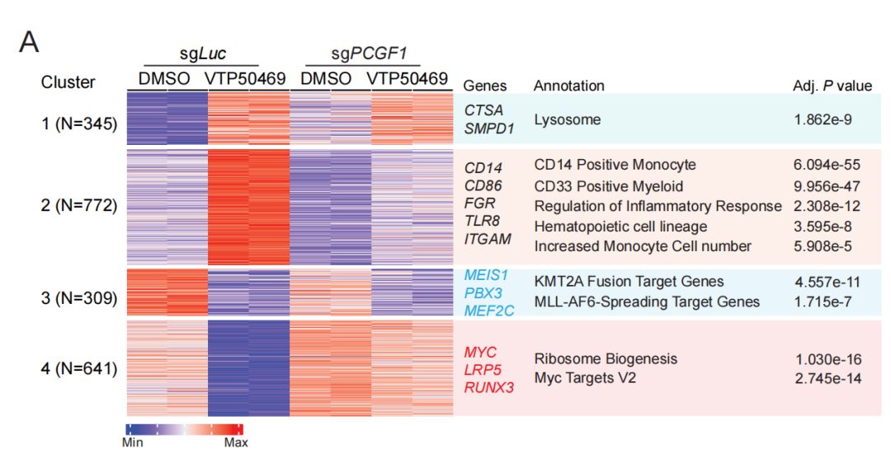

学习资料：https://jokergoo.github.io/ComplexHeatmap-reference/book/heatmap-annotations.html

## 首先是绘制一个基本的文本框

这里主要用的是`grid`包学习。`grid`是R语言中的一个基础图形包，用于创建和操作图形对象（`grob`，即图形对象）。它提供了低层次的图形绘制功能，允许用户以高度灵活的方式构建复杂的图形。`grid`包是`lattice`、`ggplot2`等高级图形包的基础，这些包在内部使用`grid`来实现它们的绘图功能。

前面我们学习了一下这个包的总体用法：[一文解锁随心所欲绘图：不要被ggplot2洗脑了，我们只要grid！！！](https://mp.weixin.qq.com/s?__biz=MzAxMDkxODM1Ng%3D%3D&mid=2247542460&idx=1&sn=2737659a888a75eebf27c76956c8a557#wechat_redirect)

现在来看看具体的函数用法：textbox_grob。

textbox_grob函数里面的参数解释：

- words应该是一个字符向量，包含了要显示的文本。

- gp = gpar(col = 1:10)：是grid包中的一个参数，用于设置图形参数（gpar，即图形参数）

- gp = gpar(fontsize = runif(10, 5, 20))：设置字体大小

- background_gp = gpar(fill = "#CCCCCC", col = "#808080")：设置文本框的背景和边框颜色

- round_corners = TRUE：款的边角为圆形

- padding = unit(10, "mm")：设置文本框的内边距

- line_space = unit(15, "mm")：两行字之间的宽度

- text_space = unit(5, "mm")：字与字之间的宽度

- max_width = unit(40, "cm")：设置文本框的宽度

- first_text_from = "bottom"：文本从底部开始，第二行在上面

如果最长的句子长度超过了`max_width`，那么最长句子的宽度将成为文本框的宽度。设置`word_wrap = TRUE`可以根据文本框的宽度调整文本。

- word_wrap = TRUE：根据文本框的宽度调整文本

- add_new_line = TRUE：每一个sentences一行

- gb = textbox_grob(words)，grobWidth(gb)，grobHeight(gb)：获取文本框的高和宽

基础文字框：

```r
rm(list=ls())
## 加载R包
library(ComplexHeatmap)

random_text = function(n, n_words = 1) {
  sapply(1:n, function(i) {
    w = replicate(sample(n_words, 1),
                  paste0(sample(letters, sample(4:10, 1)), collapse = ""))
    if(n_words > 1) {
      paste(w, collapse = " ")
    } else {
      w
    }
  })
}

set.seed(123)
words = random_text(10)
words

# [1] "sncjrkeyti" "hgjisd"     "kgul"       "mgixj"      "ugzfbe"     "mrafuoi"    "ptfkh"      "gpqvrxbdm"  "sytvnchpl"  "nczg"
## 示例数据
grid.newpage()
gb = textbox_grob(words)
grid.draw(gb)
```


设置文本颜色：

```r
grid.newpage()
gb = textbox_grob(words, gp = gpar(col = 1:10))
grid.draw(gb)
```

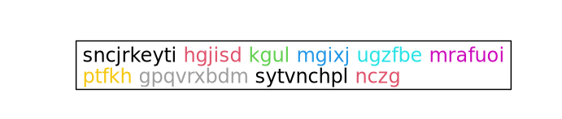

设置字体大小：

```r
grid.newpage()
gb = textbox_grob(words, gp = gpar(fontsize = runif(10, 5, 20)))
grid.draw(gb)
```

设置文本框背景色和边框色：

```r
grid.newpage()
gb = textbox_grob(words,
                  background_gp = gpar(fill = "#CCCCCC", col = NA),
                  round_corners = TRUE) # 四个角角为圆角
grid.draw(gb)
```


设置文本框的内边距：

```r
grid.newpage()
gb = textbox_grob(words,
                  background_gp = gpar(fill = "#CCCCCC", col = "#808080"),
                  padding = unit(20, "mm"),
                  gp = gpar(fontsize = 30)
                  )
grid.draw(gb)
```

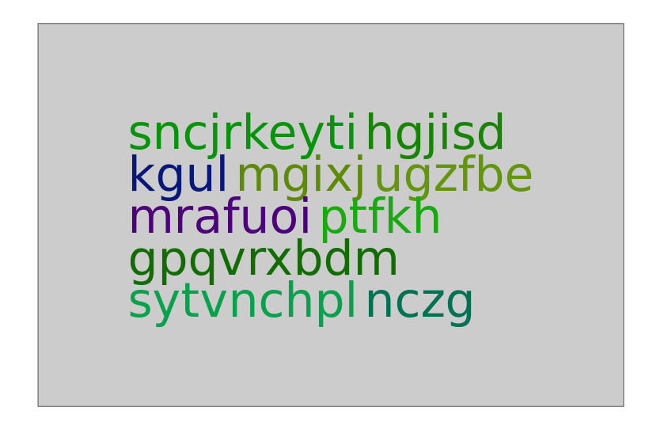

设置两行之间的距离：

```r
grid.newpage()
gb = textbox_grob(words, line_space = unit(15, "mm"))
grid.draw(gb)
```

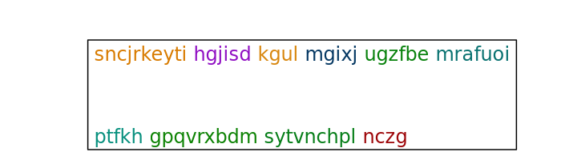

设置单词之间的距离：

```r
grid.newpage()
gb = textbox_grob(words, text_space = unit(5, "mm"))
grid.draw(gb)
```

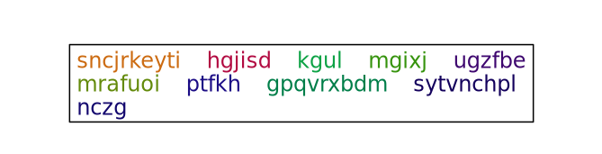

设置文本框的最大宽度：

```r
grid.newpage()
gb = textbox_grob(words, max_width = unit(40, "cm"))
grid.draw(gb)
```

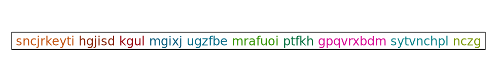

上面都是调整的一个单词即word的属性，下面来看看一个句子：

textbox_grob 支出出入一个向量：

```r
sentences = random_text(5, 8)
sentences

fontsize = runif(5, 5, 20)
fontsize
grid.newpage()
gb = textbox_grob(sentences, gp = gpar(col = 1:5, fontsize = fontsize))
grid.draw(gb)
```

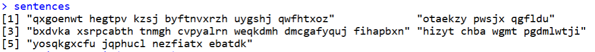

这个句子有5个单词

word_wrap = TRUE：根据文本框的宽度调整文本

```r
grid.newpage()
gb = textbox_grob(sentences, gp = gpar(col = 1:5, fontsize = fontsize),
                  word_wrap = TRUE)
grid.draw(gb)
```

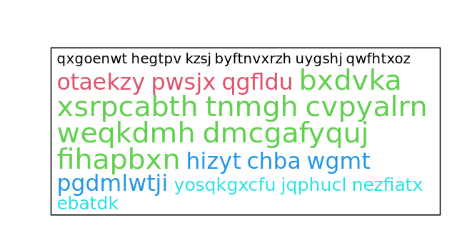

每一个句子里面的单词都是同一个颜色。

每个句子单独一行：add_new_line = TRUE

```r
grid.newpage()
gb = textbox_grob(sentences, gp = gpar(col = 1:5, fontsize = fontsize),
                  add_new_line = TRUE)
grid.draw(gb)
```

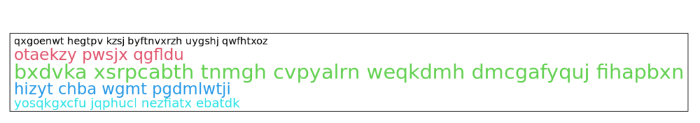

## 接下来学习热图与文本框连接

先绘制一个基础的，anno_textbox()函数：

用于在热图旁边绘制文本框，并将文本框与热图的行切片关联起来。`anno_textbox()`中的一些参数会传递给`textbox_grob()`以控制文本框的显示，文本框注释主要通过`anno_link()`和`anno_block()`实现，其中`anno_link()`是默认方式。

- 第一个参数是一个分类变量，用于分割热图的行；

- 第二个参数text是一个命名的字符向量列表，其名称应与分类变量的水平相对应。

```r
## 热图与文本框链接
mat = matrix(rnorm(100*10), nrow = 100)
mat
dim(mat)

split = sample(letters[1:10], 100, replace = TRUE)
split
length(split)

text = lapply(unique(split), function(x) {
  random_text(10)
})
names(text) = unique(split)
text
str(text)

# 文本框注释条在右边
pdf(file = "mat1.pdf",height = 7,width = 8)
Heatmap(mat, name = "mat", cluster_rows = FALSE, row_split = split,
        right_annotation = rowAnnotation(textbox = anno_textbox(split, text)) # split 与 text的名字对应
)
dev.off()
```

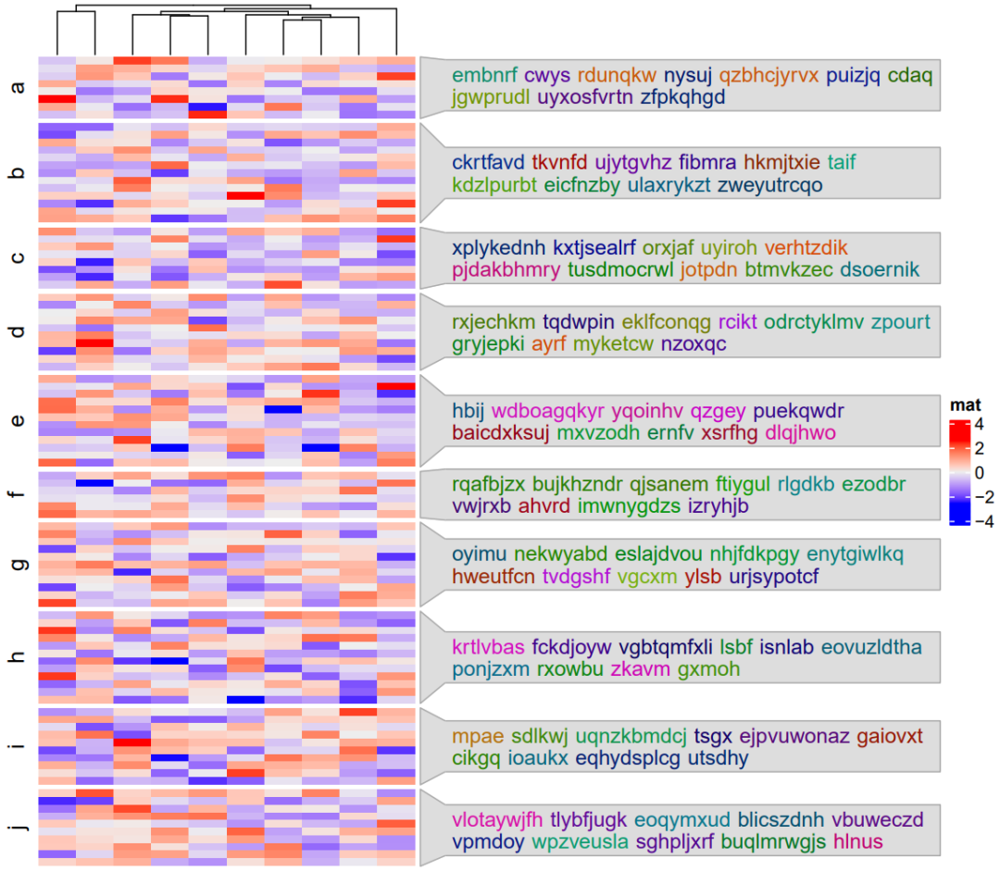

使用刚刚学习的 textbox_grob 的参数传递给 anno_textbox。例如，当文本是句子时，为了控制单词换行和新行：

```r
split = sample(letters[1:5], 100, replace = TRUE)
sentences = lapply(unique(split), function(x) {
  random_text(3, 8)
})
names(sentences) = unique(split)

## 控制每一个文本框里面单词的宽度和每个单词为一行
pdf(file = "mat2.pdf",height = 6,width = 8)
Heatmap(mat, name = "mat", row_split = split,
        right_annotation = rowAnnotation(
          textbox = anno_textbox(
            split, sentences,
            word_wrap = TRUE, # 控制单词换行和新行：
            add_new_line = TRUE)
        )
)
dev.off()
```

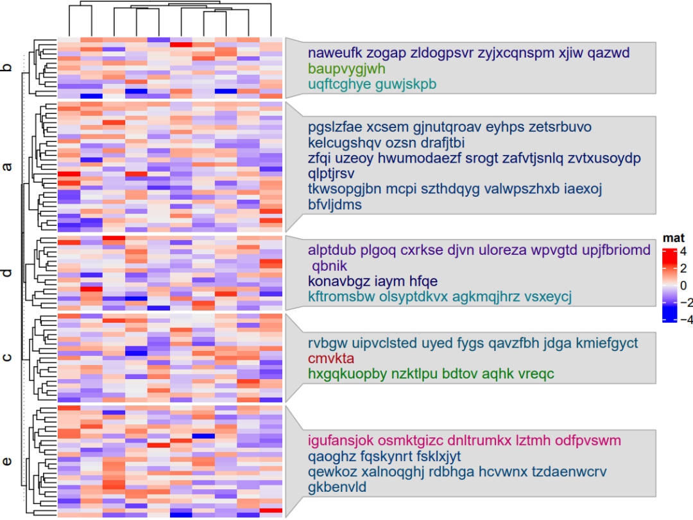

只显示1-2个注释文本框：

```r
## 只显示一两个
align_to = split(seq_along(split), split)
align_to # list对象
align_to[c("a", "b")]
sentences[c("a", "b")]

pdf(file = "mat3.pdf",height = 6,width = 8)
Heatmap(mat, name = "mat", row_split = split,
        right_annotation = rowAnnotation(
          textbox = anno_textbox(
            align_to[c("a", "b")],
            sentences[c("a", "b")], # names should match
            word_wrap = TRUE,
            add_new_line = TRUE)
        )
)
dev.off()
```

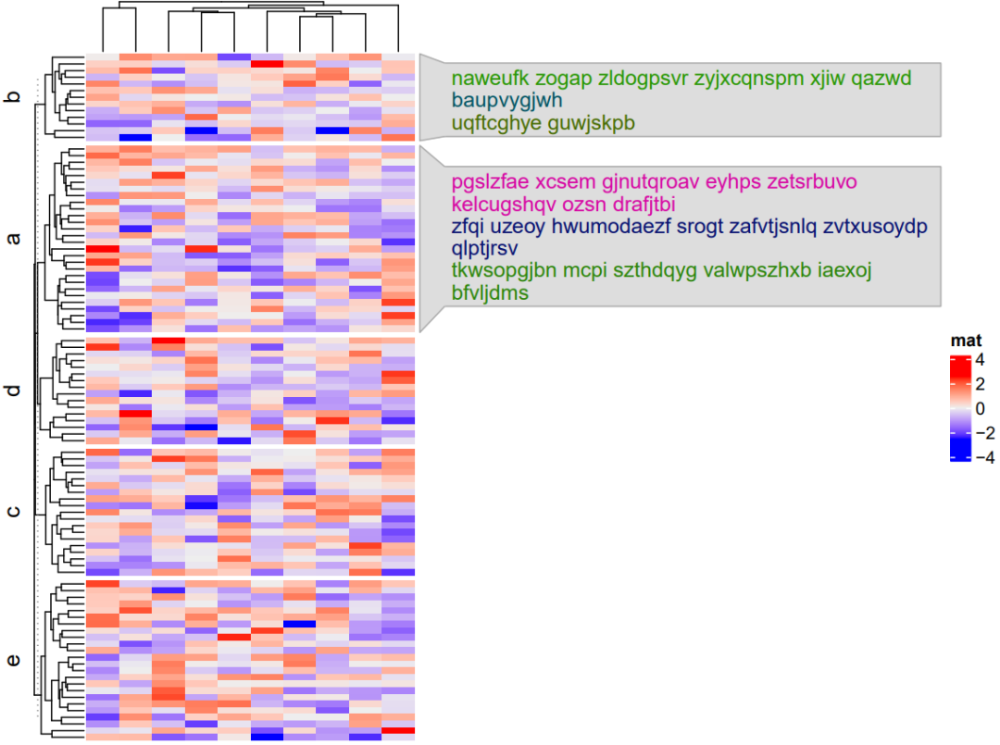

如果希望将文本框精确地放置在相应热图切片的位置上。在这种情况下，应该将`by`参数设置为`"anno_block"`：

```r
## anno_block
split = rep(letters[1:10], 10)
split
text = lapply(unique(split), function(x) {
  random_text(10)
})
names(text) = unique(split)
str(text)

pdf(file = "mat4.pdf",height = 6,width = 8)
Heatmap(mat, name = "mat", row_split = split,
        right_annotation = rowAnnotation(
          textbox = anno_textbox(split, text, by = "anno_block")
        )
)
dev.off()
```

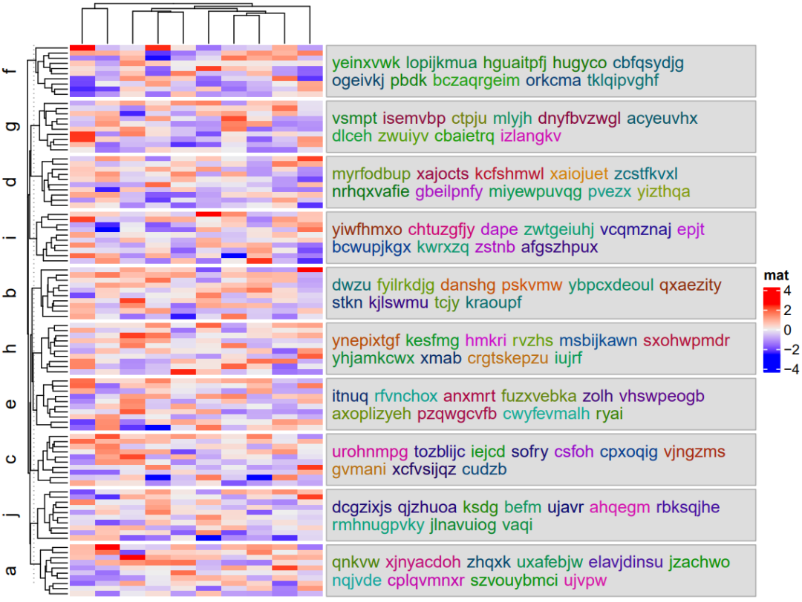

精准控制文本参数：

将文本设置为数据框列表，可以将图形参数整合到文本中。在每个数据框中，第一列包含将被放入框中的文本。数据框还可以包含以下四列（"col"、"fontsize"、"fontfamily" 和 "fontface"），以精确控制相应的文本。

```r
### 精准控制文本参数
library(circlize)
split = rep(letters[1:5], 20)
split
text = lapply(unique(split), function(x) {
  df = data.frame(text = random_text(10))
  df$fontsize = runif(10, 6, 20)
if(runif(1) > 0.5) {
    df$col = rep(rand_color(1), 10)
  } else {
    df$col = 1:10
  }
  df
})
names(text) = unique(split)
head(text[[1]])
str(text)
```

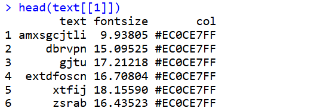

```r
pdf(file = "mat5.pdf",height = 6,width = 8)
Heatmap(mat, name = "mat", cluster_rows = FALSE, row_split = split,
        right_annotation = rowAnnotation(textbox = anno_textbox(split, text))
)
dev.off()
```

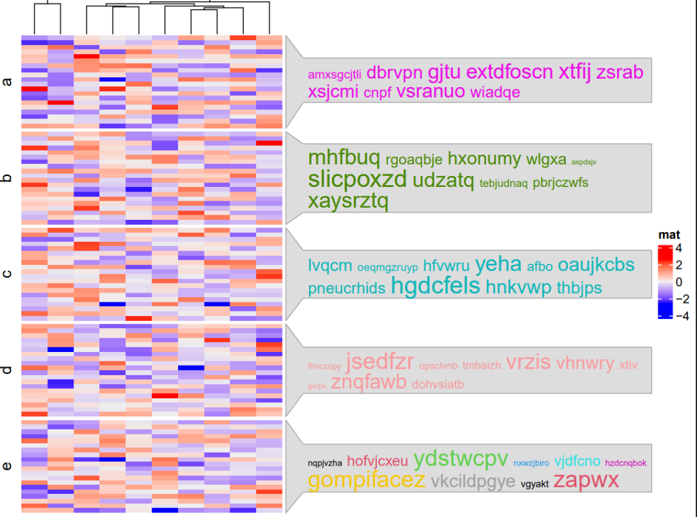

今天分享到这~

下一期绘制上面那个热图！

#### 文末友情宣传

强烈建议你推荐给身边的**博士后以及年轻生物学PI**，多一点数据认知，让他们的科研上一个台阶：

- [生信入门&数据挖掘线上直播课7月班](https://mp.weixin.qq.com/s?__biz=MzAxMDkxODM1Ng%3D%3D&mid=2247543316&idx=1&sn=c8569d0d202077108063c17964e8c128#wechat_redirect)，你的生物信息学入门课

- [时隔5年，我们的生信技能树VIP学徒继续招生啦](https://mp.weixin.qq.com/s?__biz=MzAxMDkxODM1Ng%3D%3D&mid=2247525079&idx=1&sn=0b997af16a58195b4192691373048fd5#wechat_redirect)

- [满足你生信分析计算需求的低价解决方案](https://mp.weixin.qq.com/s?__biz=MzUzMTEwODk0Ng%3D%3D&mid=2247530048&idx=1&sn=28aa7bbd5e00521f79e074496a5f5d66#wechat_redirect)

- [生信故事会](https://mp.weixin.qq.com/mp/appmsgalbum?__biz=MzAxMDkxODM1Ng%3D%3D&action=getalbum&album_id=1679199708449144836#wechat_redirect)，来看看他们的生信入门故事

- [生信马拉松答疑专辑](https://mp.weixin.qq.com/mp/appmsgalbum?__biz=MzAxMDkxODM1Ng%3D%3D&action=getalbum&album_id=3690970204957147140#wechat_redirect)，获取你的生信专属答疑

<!-- wechat-article-fetcher: complete -->
