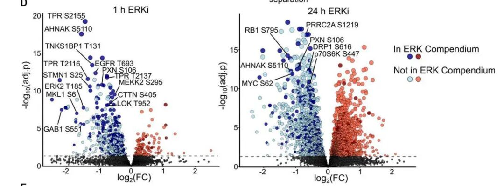
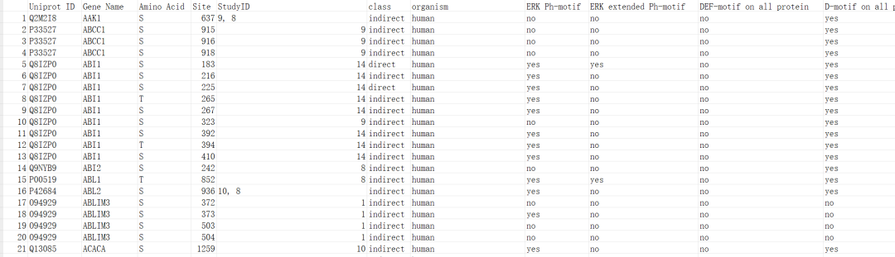
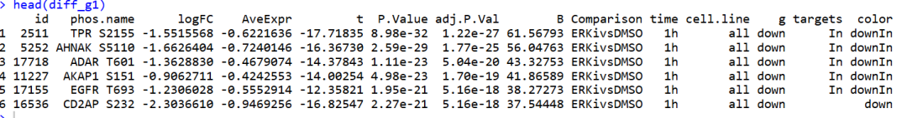
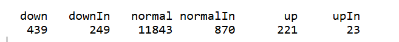
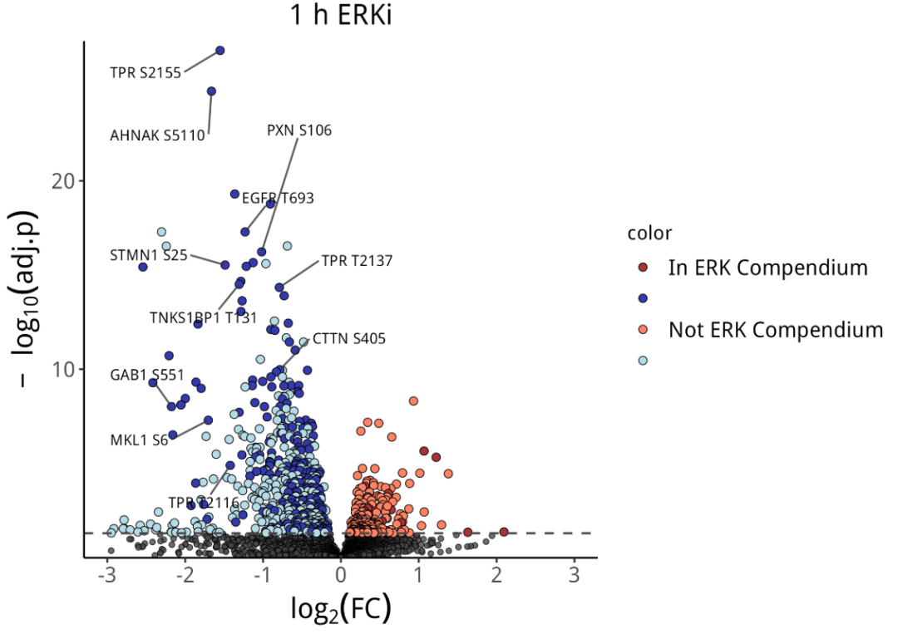

# Science杂志同款：又一款好看的火山图

- 专辑：绘图小技巧2025
- 公众号：生信技能树
- 发布时间：2025-06-10 13:10
- 原文：[微信公众平台](https://mp.weixin.qq.com/s?__biz=MzAxMDkxODM1Ng%3D%3D&mid=2247543292&idx=1&sn=0ca40d5f5d3a15c30ef7812a92c68774&chksm=9b4b6947ac3ce051095abbd9e7a010ec3d6d21ac6e38ca9bf113702abd5f09fe40035991605e)

---
> 今天学习这篇 2024 年 6 月7号发表在 顶刊 science 杂志上的文献《**「Determining the ERK-regulated phosphoproteome driving KRAS-mutant cancer」**》，里面的图片都很美观，我们可以借来放在自己的科研文章中以提升档次。今天学习里面的火山图~

前面给大家介绍过火山图有：

- [基础绘图函数绘制高颜值火山图](https://mp.weixin.qq.com/s?__biz=MzAxMDkxODM1Ng%3D%3D&mid=2247540112&idx=1&sn=f0875ae81923d38d86145991361ec551#wechat_redirect)

- [Science杂志：比火山图多一点信息的火山图](https://mp.weixin.qq.com/s?__biz=MzAxMDkxODM1Ng%3D%3D&mid=2247539963&idx=1&sn=35a7f9aa1a032dab77ab3fd859a9834e#wechat_redirect)

- [带有疾病进展的多分组差异结果如何展示？](https://mp.weixin.qq.com/s?__biz=MzAxMDkxODM1Ng%3D%3D&mid=2247536217&idx=1&sn=3f1893e79b3474230cd3993c37d2aa34#wechat_redirect)

今天的这篇文献《**「Determining the ERK-regulated phosphoproteome driving KRAS-mutant cancer」**》的火山图如下：展示了多个层次信息，点的颜色有五种，还有标记基因展示。



图注：

> Fig. 2. Phosphoproteomic determination of the ERK regulated phosphoproteome in KRAS mutant PDAC.
>
> (D) Differentially expressed phosphosites following 1 and 24 hours ERK inhibition in the same six PDAC cell lines as in (A and B). 

## 数据背景

文献通过定量磷酸化蛋白质组学技术，对同一组六种KRAS突变的胰腺导管腺癌（PDAC）细胞系进行了定量磷酸化蛋白质组学分析（图2C）。分析了KRAS突变的胰腺导管腺癌细胞系中的ERK依赖性磷酸化蛋白质组。实验设计包括：

- 1小时的急性处理以优化对直接ERK底物的检测

- 24小时的长期ERK抑制剂处理，以捕捉ERK抑制的直接和间接效应。24小时的时间是因为此时由于ERK负反馈调节的丧失，补偿性活动开始出现。

差异结果：

在六种KRAS突变的胰腺导管腺癌细胞系中，研究人员共检测到13,646个独特的磷酸化位点。在1小时的ERK抑制剂处理下，932个磷酸化位点发生差异性调节，且主要表现为下调；而在24小时的处理后，4,288个磷酸化位点发生差异性调节，其中相当一部分表现为上调。这表明ERK抑制剂在短期和长期处理下对磷酸化位点的调节作用存在显著差异。

就是上面火山图设计的数据相关信息啦，作者将这个图的数据放在文献的附表中：data S3，下载地址为：https://www.science.org/doi/10.1126/science.adk0850?url_ver=Z39.88-2003&rfr_id=ori:rid:crossref.org&rfr_dat=cr_pub%20%200pubmed#supplementary-materials

## a compendium of ERK substrates：

火山图中颜色比较深的除了是显著差异磷酸化位点之外，还表示这个位点在不在 the ERK Compendium，查看文献信息得到这个Compendium的资源在这里：

> Ünal EB, Uhlitz F, Blüthgen N, A compendium of ERK targets. FEBS Lett. 591, 2607–2615  (2017). \[PubMed: 28675784

去这个数据库把这些信息下载下来：https://sys-bio.net/erk_targets/targets_all.html#，得到文件 A Compendium of ERK targets.csv。

总共有2507个targets：



## 开始绘图

### 1.读取数据

首先把差异结果读取进来，我们这里就绘制左边的火山图好了，右边的是一样的，选择1h，all cell：

```r
###
### Create: juan zhang
### Date:   2025-01-16
### Email:  492482942@qq.com
### Blog:   http://www.bio-info-trainee.com/
### Forum:  http://www.biotrainee.com/thread-1376-1-1.html
### Update Log: 2025-01-16   First version
###
rm(list=ls())
# 加载R包
library(ggplot2)
library(tibble)
library(ggrepel)
library(tidyverse)
library(dplyr)
library(patchwork)
library(ggplot2)
library(xlsx)

##### 01、加载数据
# 加载：差异结果
#diff <- read.xlsx("./adk0850_data_s3.xlsx",sheetName = "table_S3_Phospho_DE" )
diff <- read.table("./adk0850_data_s3.txt",header = T,sep = "	")
head(diff)
table(diff$Comparison)
table(diff$time)
table(diff$cell.line)
table(diff$time,diff$cell.line)

# 提取 all的细胞系& 1h vs ERKivsDMSO 差异分组的结果
diff_g1 <- diff[diff$time=="1h" & diff$cell.line=="all",]
table(diff_g1$cell.line)
table(diff_g1$time,diff_g1$cell.line)
head(diff_g1)
```



### 2.添加各种信息

添加基因显著与否信息：

```r
# 增加一列上下调，阈值 |log2FC| > 0, adj. p < 0.05
diff_g1$g <- "normal"
diff_g1$g[diff_g1$logFC > 0 & diff_g1$adj.P.Val < 0.05 ] <- "up"
diff_g1$g[diff_g1$logFC < 0 & diff_g1$adj.P.Val < 0.05 ] <- "down"
head(diff_g1)
table(diff_g1$g)
# down normal     up
# 688  12713    244
```

添加是否为 Compendium ERK targets：

```r
# Compendium ERK targets
Compendium <- read.csv("A Compendium of ERK targets.csv")
head(Compendium)
Compendium$targets <- paste0(Compendium$Gene.Name, " ", Compendium$Amino.Acid, Compendium$Site)
head(intersect(Compendium$targets, diff_g1$phos.name))

# 添加到差异结果中
diff_g1$targets <- ""
diff_g1$targets[ diff_g1$phos.name %in% Compendium$targets ] <-  "In"
table(diff_g1$targets)
# In
# 12503  1142
```

添加点的颜色：五种颜色

```r
# 点的五类颜色
diff_g1$color <- paste0(diff_g1$g, diff_g1$targets)
table(diff_g1$color)
```



提取显著和不显著数据，以及标记基因数据：

```r
# 提取不显著和显著的点
data_bg <- diff_g1[diff_g1$g=="normal", ]
data_sig <- diff_g1[diff_g1$g!="normal", ]
data_sig$color <- factor(data_sig$color, levels = c("upIn","downIn","up","down"))

# 添加label的top基因
# 显著差异基因
top_genes <- c("TPR S2155", "AHNAK S5110", "TNKS1BP1 T131", "TPR T2116", "STMN1 S25",
               "ERK2 T185", "MKL1 S6", "EGFR T693", "PXN S106", "TPR T2137",
               "MEKK2 S295", "CTTN S405", "LOK T952", "GAB1 S551")
length(top_genes)
data_label <- diff_g1[diff_g1$phos.name %in% top_genes, ]
```

### 3.ggplot2绘图

下面的代码一次成功，注意看里面设置的各种细节哦：

```r
## ggplot2 绘图

# 颜色设置
colors <- c("upIn"="#a73336","up"="#fe8264","downIn"="#333aab","down"="#b5dbe6","normal"="#474747","normalIn"="#474747")
colors

# 看一眼数据
head(diff_g1)

p <- ggplot(diff_g1, aes(x = logFC, y = -log10(adj.P.Val)))  +
  geom_point(data = data_bg, shape = 21, fill="#474747",color ="black" , alpha = 0.8, size = 1.3, stroke = 0.3) +  # 不显著的灰色点：shape=21带边框的圆形，stroke点的边框宽度
  geom_point(data = data_sig, aes(fill = color), shape = 21, color = "black", size = 2, stroke = 0.3) +  # 显著的点
  scale_fill_manual(values = colors,  # 点的颜色
                    labels = c("upIn" = "In ERK Compendium", "downIn" = "",
                               "up" = "Not ERK Compendium", "down" = "")  # 自定义图例标签
                    ) +
  geom_text_repel(data= data_label, aes(x = logFC, y = -log10(adj.P.Val),label = phos.name), size = 3,
                  force_pull=0,         # 设置标签吸引力为 0，标签不会被强制拉回到数据点
                  point.padding = 0,     # 设置文本标签与对应点之间的最小距离
                  box.padding = 1,       # 设置标签与数据点之间的最小距离,值：0.5
                  min.segment.length = 0,  # 长度大于0就可以添加引线
                  vjust = 0.5,            # 文本标签的右侧与指定位置对齐
                  segment.color="grey20",
                  segment.size=0.5,        # 设置引导线的粗细
                  segment.alpha=0.8,       # 文本标签中连接线段的透明度
                  max.overlaps = Inf,
                  seed = 123, max.time = 1, max.iter = Inf,
                  nudge_y=0.5,nudge_x=-0.3 )  +       # 在y轴方向上微调标签位置
  geom_hline(yintercept = -log10(0.05), color = "#474747", linewidth = 0.6, linetype = "dashed") + # 添加显著性虚水平线
  scale_x_continuous(limits = c(-3, 3), breaks = seq(-3, 3, 1)) +
  scale_y_continuous(expand = c(0, 0)) + # 点的y轴起点紧贴x轴线
  labs(title = "1 h ERKi", x = expression(log[2](FC)), y = expression(-log[10](adj.p))) +
  theme_classic() +
  theme (legend.position = "right",
         legend.text = element_text(size = 12),
         plot.title = element_text(size = 16, face = "bold",hjust = 0.5),
         axis.title.x = element_text(size = 16),
         axis.title.y = element_text(size = 16),
         axis.text.x = element_text(size = 12),
         axis.text.y = element_text(size = 12))

p
ggsave(filename = "Fig.2D.png",width = 7,height = 5, plot = p, bg="white")
```

结果如下：



#### 你学会了吗~

Note：标签与点之间的调整细节见 https://ggrepel.slowkow.com/articles/examples

#### 文末友情宣传

强烈建议你推荐给身边的**博士后以及年轻生物学PI**，多一点数据认知，让他们的科研上一个台阶：

- [生信入门&数据挖掘线上直播课6月班](https://mp.weixin.qq.com/s?__biz=MzAxMDkxODM1Ng%3D%3D&mid=2247542582&idx=1&sn=ff782faea2bf72a56ed3f058e1cda526#wechat_redirect)，你的生物信息学入门课

- [时隔5年，我们的生信技能树VIP学徒继续招生啦](https://mp.weixin.qq.com/s?__biz=MzAxMDkxODM1Ng%3D%3D&mid=2247525079&idx=1&sn=0b997af16a58195b4192691373048fd5#wechat_redirect)

- [满足你生信分析计算需求的低价解决方案](https://mp.weixin.qq.com/s?__biz=MzUzMTEwODk0Ng%3D%3D&mid=2247530048&idx=1&sn=28aa7bbd5e00521f79e074496a5f5d66#wechat_redirect)

- [生信故事会](https://mp.weixin.qq.com/mp/appmsgalbum?__biz=MzAxMDkxODM1Ng%3D%3D&action=getalbum&album_id=1679199708449144836#wechat_redirect)，来看看他们的生信入门故事

- [生信马拉松答疑专辑](https://mp.weixin.qq.com/mp/appmsgalbum?__biz=MzAxMDkxODM1Ng%3D%3D&action=getalbum&album_id=3690970204957147140#wechat_redirect)，获取你的生信专属答疑

<!-- wechat-article-fetcher: complete -->
