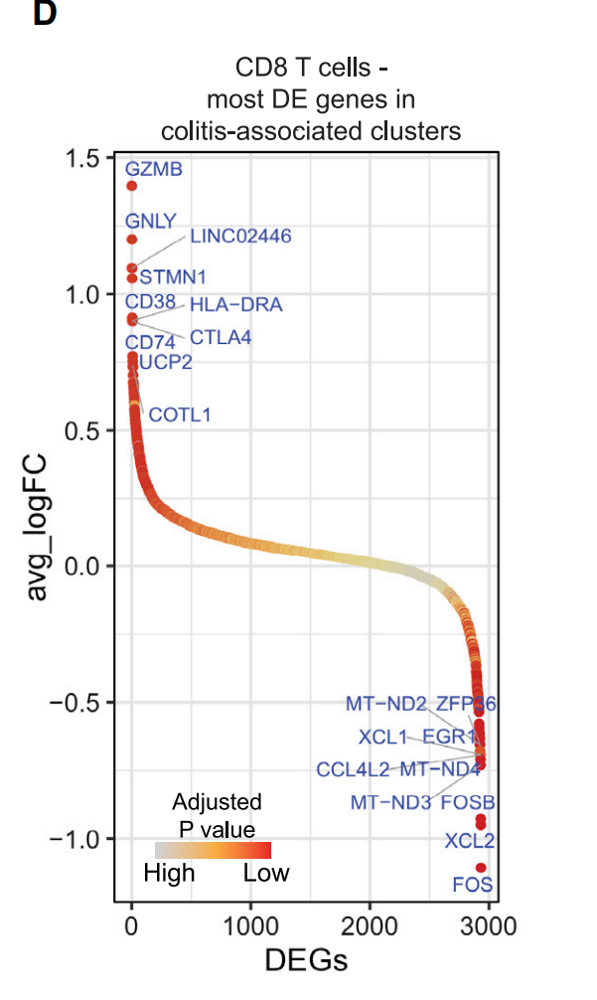
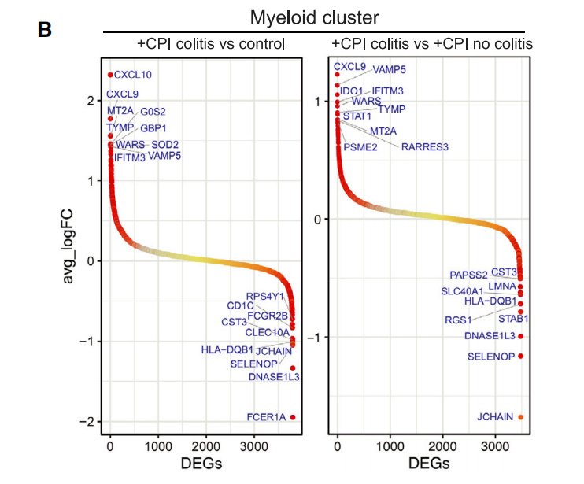
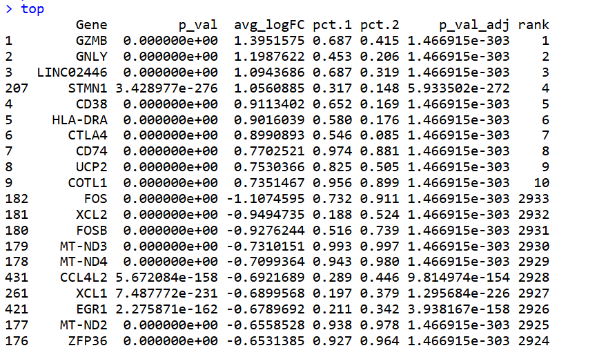
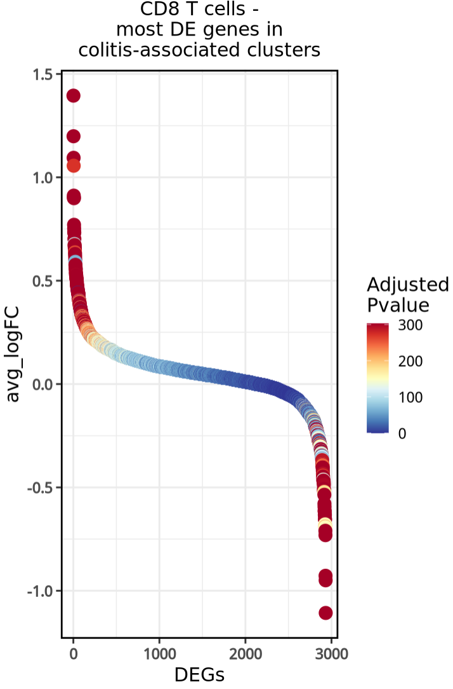
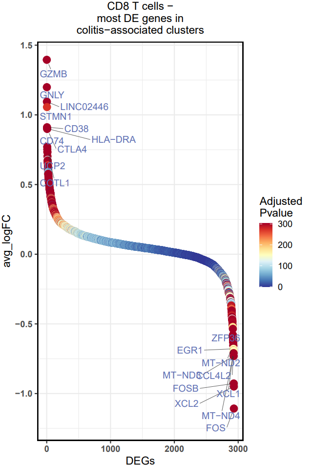

# Cell杂志同款：单细胞亚群组间差异基因排序气泡图

- 专辑：绘图小技巧2025
- 公众号：生信技能树
- 发布时间：2025-06-03 23:59
- 原文：[微信公众平台](https://mp.weixin.qq.com/s?__biz=MzAxMDkxODM1Ng%3D%3D&mid=2247543160&idx=1&sn=59624ddd01df59b482d410c3b7a0a6a0&chksm=9b4b69c3ac3ce0d52c418c97dde635b31fe8a43cc98b6e9d307b8e8882fd320deb75e151f43a)

---
> 今天学习的单细胞组间差异基因结果的一种展示方法，图来自文献：《Molecular Pathways of Colon Inflammation Induced by Cancer Immunotherapy》，于 2020年8月份发表在顶刊Cell上。

图的含义如下：

该部分展示了结肠炎相关细胞簇（5-8cluster）与非结肠炎相关细胞簇（1-4cluster）之间显著差异表达基因的排名。研究者对这些基因进行了筛选，标注了前top10上调和下调差异表达的基因，以帮助识别与结肠炎发生和发展可能相关的基因。



图注：

> Figure 5. Analysis of T Cell Checkpoints and Colitis-Associated Genes
>
> (D) Ranking of significantly differentially expressed genes in colitis-associated clusters (5–8) compared with other clusters (1–4). 

还有两个拼在一起的效果如下：



## 数据背景

这个图的数据作者直接提供了，在补充材料的表S7中：https://www.cell.com/cms/10.1016/j.cell.2020.06.001/attachment/b3655739-fad8-4fbb-8bc8-1df95c45a954/mmc4.xlsx

读取进来并简单处理：

```r
rm(list=ls())
## 使用西湖大学的 Bioconductor镜像
options(BioC_mirror="https://mirrors.westlake.edu.cn/bioconductor")
options("repos"=c(CRAN="https://mirrors.westlake.edu.cn/CRAN/"))
options(scipen = 200)
library(tidyverse)
library(Seurat)
library(data.table)
library(qs)
library(ggridges)
library(ggplot2)
library(xlsx)
library(ggrepel)

deg <- read.xlsx("mmc4.xlsx",sheetName = "Fig 5D CD8+ DE genes")
head(deg)
dim(deg)

## 按照 FC排个序得到横坐标轴
deg <- deg[order(deg$avg_logFC,decreasing = T), ]
deg$rank <- 1:nrow(deg)
## 处理adj pvalue为0的
max(deg$p_val_adj)
min(deg$p_val_adj)
min(deg$p_val_adj[deg$p_val_adj!=0])
deg$p_val_adj[which(deg$p_val_adj==0)] <- min(deg$p_val_adj[deg$p_val_adj!=0])
summary(-log10(deg$p_val_adj))
deg$adj <- -log10(deg$p_val_adj)

# 按照avg_logFC 分别取上调和下调的top10基因
top_pos <- deg[order(deg$avg_logFC,decreasing = T)[1:10], ]
top_pos

top_neg <- deg[order(deg$avg_logFC,decreasing = F)[1:10], ]
top_neg

top <- rbind(top_pos,top_neg)
top
```

选取的top标记基因如下：



## 绘图

使用ggplot2绘图：

```r
library(ggprism)
library(RColorBrewer)
library(circlize)
colors <- colorRampPalette(rev(brewer.pal(n = 11, name = "RdYlBu")))(100)
values <- seq(0, 303, length.out = 101)[-101]
col_fun <- colorRamp2(values, colors)
col_fun


p <- ggplot(data = deg, aes(x = rank, y = avg_logFC,color = -log10(p_val_adj) )) +
  geom_point(aes(size = 6)) +
  xlab(label = "DEGs") +
  ylab(label = "avg_logFC") +
  labs(title = "CD8 T cells -
most DE genes in
colitis-associated clusters") +
#scale_color_gradient2(low = "black",mid="blue",high = "#ed382b", midpoint = 43,limit = c(0, 303))  + # 更改填充颜色
  scale_color_gradientn(colors = col_fun(values)) +
  theme_bw(base_size = 15) +
  scale_x_continuous(breaks = seq(0, 3000, by = 1000), labels = seq(0, 3000, by = 1000) ) + # 设置x轴的刻度线和刻度标签
  guides(size = "none", color = guide_colourbar(title = "Adjusted
Pvalue") ) +  # 修改图例标题，guide_colourbar图例使用长方形显示
  theme(
    #axis.line = element_line(color = "black", size = 0.6), # 加粗x轴和y轴的线条
    plot.title = element_text(hjust = 0.5, size = 15, color = "black"),
    panel.border = element_rect(color = "black", size = 1.3, fill = NA),
    axis.text = element_text(face = "bold"), # 加粗x轴和y轴的标签
    axis.title = element_text( size = 15)    # 加粗x轴和y轴的标题
  )

p
```

结果如下：



添加上标记基因label：

```r
# 添加label：vjust（垂直调整）或hjust（水平调整）
p3 <- p +
  geom_text_repel(data= top, aes(x =rank, y = avg_logFC,label = Gene), size = 4.5, color = "#5f70b3",
                  force=20,                # 将重叠的文本标签相互推开的强度。force 参数的值越大，标签之间的排斥力度也越大，这会导致标签在图中更分散地排列
                  point.padding = 0.5,     # 设置文本标签与对应点之间的最小距离
                  min.segment.length = 0,  # 长度大于0就可以添加引线
                  hjust = 1.2,             # 文本标签的右侧与指定位置对齐
                  segment.color="grey20",
                  segment.size=0.3,        # 设置引导线的粗细
                  segment.alpha=0.8,       # 文本标签中连接线段的透明度
                  nudge_y=-0.1             # 在y轴方向上微调标签位置
  )
p3

# 保存
ggsave(filename = "Figure5D.pdf", plot = p3, width = 6, height = 9)
```



#### 学会了吗？

#### 文末友情宣传

强烈建议你推荐给身边的**博士后以及年轻生物学PI**，多一点数据认知，让他们的科研上一个台阶：

- [生信入门&数据挖掘线上直播课6月班](https://mp.weixin.qq.com/s?__biz=MzAxMDkxODM1Ng%3D%3D&mid=2247542582&idx=1&sn=ff782faea2bf72a56ed3f058e1cda526#wechat_redirect)，你的生物信息学入门课

- [时隔5年，我们的生信技能树VIP学徒继续招生啦](https://mp.weixin.qq.com/s?__biz=MzAxMDkxODM1Ng%3D%3D&mid=2247525079&idx=1&sn=0b997af16a58195b4192691373048fd5#wechat_redirect)

- [满足你生信分析计算需求的低价解决方案](https://mp.weixin.qq.com/s?__biz=MzUzMTEwODk0Ng%3D%3D&mid=2247530048&idx=1&sn=28aa7bbd5e00521f79e074496a5f5d66#wechat_redirect)

- [生信故事会](https://mp.weixin.qq.com/mp/appmsgalbum?__biz=MzAxMDkxODM1Ng%3D%3D&action=getalbum&album_id=1679199708449144836#wechat_redirect)，来看看他们的生信入门故事

- [生信马拉松答疑专辑](https://mp.weixin.qq.com/mp/appmsgalbum?__biz=MzAxMDkxODM1Ng%3D%3D&action=getalbum&album_id=3690970204957147140#wechat_redirect)，获取你的生信专属答疑

<!-- wechat-article-fetcher: complete -->
