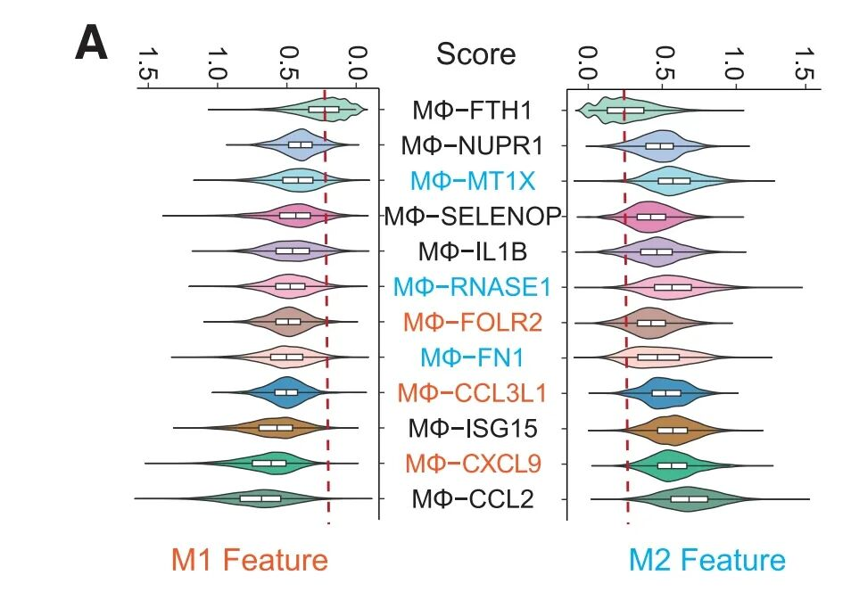
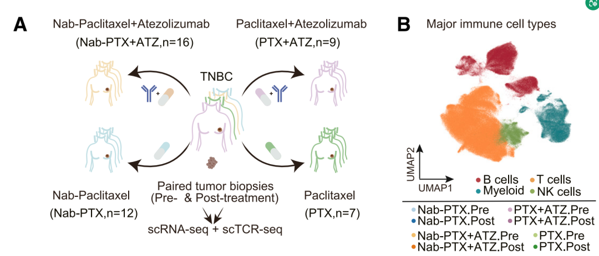
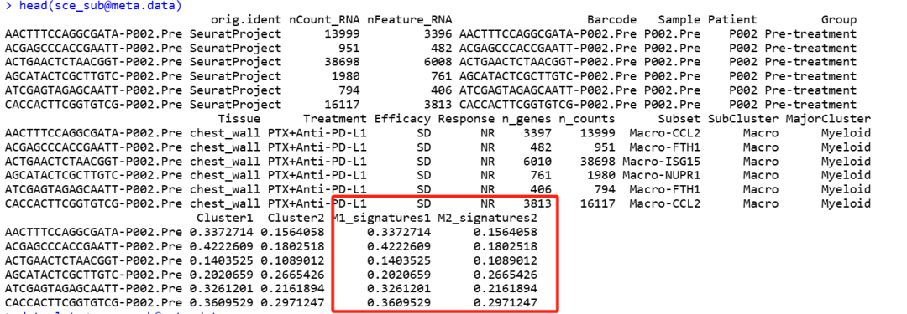
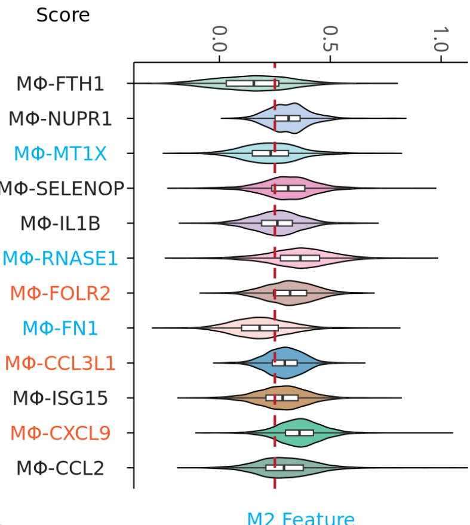
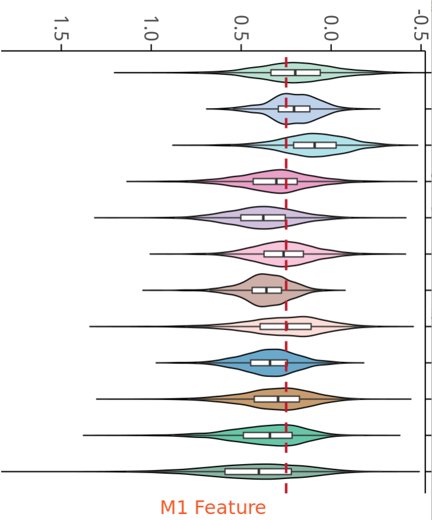
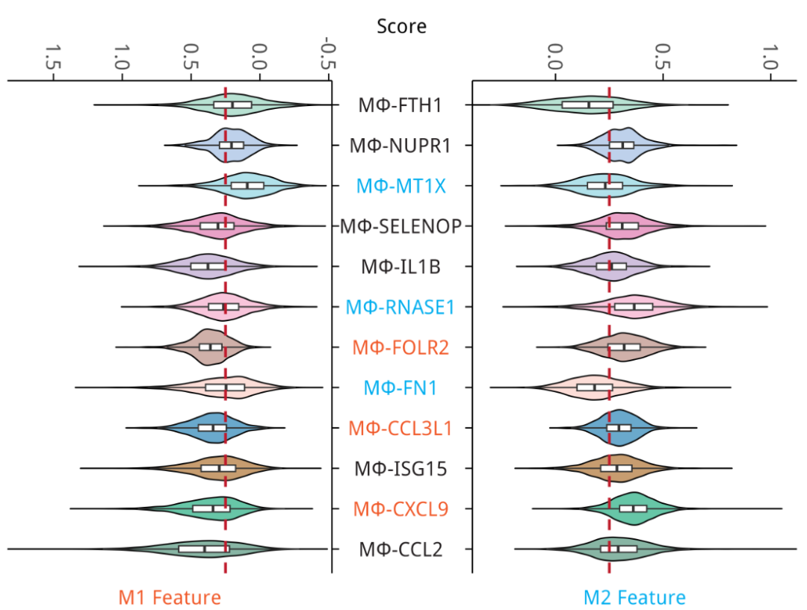

# 张泽民院士顶刊杂志的同款背靠背双向小提琴图

- 专辑：绘图小技巧2025
- 公众号：生信技能树
- 发布时间：2025-05-27 22:13
- 原文：[微信公众平台](https://mp.weixin.qq.com/s?__biz=MzAxMDkxODM1Ng%3D%3D&mid=2247542979&idx=1&sn=f91e828c191248714e385c633b49012b&chksm=9b4b6878ac3ce16e9209d535c3d81146604b332606b870918fcab0cb193d2de48f4afe0328b3)

---
> 今天分享一个好看的背靠背双向小提琴图，来自张泽民院士团队的新文章，于2025 年 3 月 10 日发表在 Cancer Cell 杂志，文献标题为《Distinct cellular mechanisms underlie chemotherapies and PD-L1 blockade combinations in triple-negative breast cancer》。

此图使用小提琴图展示了不同巨噬细胞亚群的 M1 和 M2 特征的分布情况。通过比较不同亚群的M1和M2评分，可以了解哪些亚群倾向于表现出M1或M2特征。



图注：

> Figure 7. Characteristics of monocytes/macrophages and their connections with mast cells. (A) Violin plots illustrating the M1 and M2 features of macrophage subsets. M1 and M2 scores were calculated as the mean expression of M1 and M2 signatures.

## 数据背景

从44名三阴性乳腺癌（TNBC）患者身上获取了78份肿瘤活检样本。其中，

- 16名患者接受了白蛋白结合型紫杉醇（Nab-PTX）联合阿特珠单抗（ATZ）治疗；

- 12名患者仅接受白蛋白结合型紫杉醇治疗（Nab-PTX）；

- 9名患者接受紫杉醇（PTX）联合阿特珠单抗治疗（ATZ）；

- 7名患者仅接受紫杉醇（PTX）治疗。

根据可用性，收集了包括原发乳腺肿瘤和转移性病变在内的肿瘤样本，并将这些样本分为 responders（R）和 non-responders 者（NR）（图1A）：



数据链接：https://www.ncbi.nlm.nih.gov/geo/query/acc.cgi?acc=GSE266919

```r
GSE266919_Bcell.rds.gz 277.2 Mb (ftp)(http) RDS
GSE266919_CD4Tcell.rds.gz 425.9 Mb (ftp)(http) RDS
GSE266919_CD8Tcell.rds.gz 346.4 Mb (ftp)(http) RDS
GSE266919_Mm_bulk.counts.xls.gz 6.9 Mb (ftp)(http) XLS
GSE266919_Myeloid.rds.gz 243.5 Mb (ftp)(http) RDS
GSE266919_NKcell.rds.gz 49.0 Mb (ftp)(http) RDS
```

下载链接规律：

```r
gse <- "GSE266919"
s <- gsub("(\w{3}$)", "", gse, perl = TRUE)
s
file <- paste0(gse,"_RAW.tar") # 这个根据文件名字更改
file
url <- paste0("https://ftp.ncbi.nlm.nih.gov/geo/series/",s,"nnn/",gse,"/suppl/",file)
url
```

得到的下载链接如下：

```r
https://ftp.ncbi.nlm.nih.gov/geo/series/GSE266nnn/GSE266919/suppl/GSE266919_Bcell.rds.gz
https://ftp.ncbi.nlm.nih.gov/geo/series/GSE266nnn/GSE266919/suppl/GSE266919_CD4Tcell.rds.gz
https://ftp.ncbi.nlm.nih.gov/geo/series/GSE266nnn/GSE266919/suppl/GSE266919_CD8Tcell.rds.gz
https://ftp.ncbi.nlm.nih.gov/geo/series/GSE266nnn/GSE266919/suppl/GSE266919_Mm_bulk.counts.xls.gz
https://ftp.ncbi.nlm.nih.gov/geo/series/GSE266nnn/GSE266919/suppl/GSE266919_Myeloid.rds.gz
https://ftp.ncbi.nlm.nih.gov/geo/series/GSE266nnn/GSE266919/suppl/GSE266919_NKcell.rds.gz
```

数据处理过程见：[GEO数据提供的rds是一个SingleCellExperiment对象就不会操作了吗？](https://mp.weixin.qq.com/s?__biz=MzAxMDkxODM1Ng%3D%3D&mid=2247542961&idx=1&sn=8c77d69e251cc28571c1732d498df545#wechat_redirect)

读取进来这个教程中处理好的对象：

```r
rm(list=ls())
library(Seurat)
library(qs)
library(ggplot2)

###### step4:  看标记基因库 ######
# 原则上分辨率是需要自己肉眼判断，取决于个人经验
# 为了省力，我们直接看  0.1和0.8即可
sce <- qread("GSE266919/sce.qs")
sce

# 走标准流程
sce <- NormalizeData(sce)
sce <- FindVariableFeatures(sce, nfeatures = 2000)
sce <- ScaleData(sce)
sce <- RunPCA(sce, features = VariableFeatures(object = sce))
```

## M1 和 M2 signatures

文章中没有很明确的提到 M1 和 M2 signatures是怎么来的，然后我就网上找，找的过程见：[套娃似的找了四个文献才找到的巨噬细胞 M1 和 M2 signatures，不来看一下吗？](https://mp.weixin.qq.com/s?__biz=MzAxMDkxODM1Ng%3D%3D&mid=2247542942&idx=1&sn=5f5653fa17eefda2bc76bd3f14513883#wechat_redirect)

最后确定这个 signature 来自参考文献《Single-Cell Map of Diverse Immune Phenotypes in the Breast Tumor Microenvironment》的 Table S4，去下载看看有惊喜！

```r
M1_signatures <- c("IL12", "IL23", "IL12", "TNF", "IL6", "CD86", "MHCII", "IL1B", "MARCO", "iNOS", "IL12", "CD64", "CD80", "CXCR10", "IL23", "CXCL9", "CXCL10", "CXCL11", "CD86", "IL1A", "IL1B", "IL6", "TNFa", "MHCII", "CCL5", "IRF5", "IRF1", "CD40", "IDO1", "KYNU", "CCR7", "CD45", "CD68", "CD115", "HLA-DR", "CD205", "CD14")

M2_signatures <- c("ARG1", "ARG2", "IL10", "CD32", "CD163", "CD23", "CD200R1", "PD-L2", "PDL1", "MARCO", "CSF1R", "CD206", "IL1RN", "IL1R2", "IL4R", "CCL4", "CCL13", "CCL20", "CCL17", "CCL18", "CCL22", "CCL24", "LYVE1", "VEGFA", "VEGFB", "VEGFC", "VEGFD", "EGF", "CTSA", "CTSB", "CSTC", "CTSD", "TGFB1", "TGFB2", "TGFB3", "MMP14", "MMP19", "MMP9", "CLEC7A", "WNT7B", "FASL", "TNFSF12", "TNFSF8", "CD276", "VTCN1", "MSR1", "FN1", "IRF4", "CD45", "CD68", "CD115", "HLA-DR", "CD205", "CD14")
```

这个在用起来的时候，里面有一些名字是蛋白名字：

以下是这些蛋白对应的基因名称：

[TABLE]

## 计算M1/M2 signature打分

这里我就直接用 AddModuleScore 函数计算了，算出来的会与文章有一点不一样：

```r
# 提取巨噬细胞亚群
table(sce@meta.data$SubCluster)
sce_sub <- subset(sce, SubCluster=="Macro")
sce_sub

# M1/M2 signatures
M1_signatures <- c("IL12A", "IL12B", "TNF", "IL6", "CD86", "HLA-DRA","HLA-DRB1", "IL1B", "MARCO", "NOS2",
                   "IL12A", "IL12B","FCGR3A", "CD80", "CXCR10", "IL23A","IL12B", "CXCL9", "CXCL10", "CXCL11", "CD86",
                   "IL1A", "IL1B", "IL6", "TNF", "CCL5", "IRF5", "IRF1", "CD40", "IDO1",
                   "KYNU", "CCR7", "PTPRC", "CD68", "CSF1R", "HLA-DRA","HLA-DRB1", "CLEC10A", "CD14")
M1_signatures <- unique(M1_signatures)

M2_signatures <- c("ARG1", "ARG2", "IL10", "FCGR2A","FCGR2B","FCGR2C", "CD163", "FCER2", "CD200R1", "PDCD1LG2",
                   "CD274", "MARCO", "CSF1R", "MRC1", "IL1RN", "IL1R2", "IL4R", "CCL4", "CCL13", "CCL20", "CCL17", "CCL18",
                   "CCL22", "CCL24", "LYVE1", "VEGFA", "VEGFB", "VEGFC", "VEGFD", "EGF", "CTSA", "CTSB",
                   "CSTC", "CTSD", "TGFB1", "TGFB2", "TGFB3", "MMP14", "MMP19", "MMP9", "CLEC7A", "WNT7B",
                   "FASLG", "TNFSF12", "TNFSF8", "CD276", "VTCN1", "MSR1", "FN1", "IRF4", "PTPRC", "CD68",
                   "CSF1R", "HLA-DRA", "HLA-DRB1","CLEC10A", "CD14")
M2_signatures <- unique(M2_signatures)


# 计算每个细胞中两个集合的基因的平均值
gset <- list(M1_signatures=M1_signatures, M2_signatures=M2_signatures)

sce_sub <- AddModuleScore(sce_sub, features = gset,name = c("M1_signatures","M2_signatures"))
head(sce_sub@meta.data)
dat_plot <- sce_sub@meta.data
dat_plot$Subset <- gsub("Macro","MΦ",dat_plot$Subset)
dat_plot$Subset
table(dat_plot$Subset)
dat_plot$Subset <- factor(dat_plot$Subset, levels =
                            rev(c("MΦ-FTH1", "MΦ-NUPR1", "MΦ-MT1X", "MΦ-SELENOP", "MΦ-IL1B", "MΦ-RNASE1",
                              "MΦ-FOLR2", "MΦ-FN1", "MΦ-CCL3L1", "MΦ-ISG15", "MΦ-CXCL9", "MΦ-CCL2")) )
dat_plot$Subset
```



## 绘图

双向背靠背的图，我们前面有一个：[Nature杂志：独特的背靠背双向间隔条形图](https://mp.weixin.qq.com/s?__biz=MzAxMDkxODM1Ng%3D%3D&mid=2247541907&idx=1&sn=ab0a814a33465f1aece748df47415bc6#wechat_redirect)

这里绘图思路类似，变成小提琴分布即可！

颜色设置：从文章里面抠出来，扣颜色的技巧见：独家私藏秘技：如何获取高分文章中的图片配色？

```r
## 颜色设置
# 小提琴的颜色
mycol <- c("#a6d9c7","#aec6e6","#9edae5","#e38ab9","#c4b0d4","#f6b6d2",
           "#c39c94","#fbd4cd","#4593bf","#b9844c","#41b891","#6aa38d")
names(mycol) <- c("MΦ-FTH1", "MΦ-NUPR1", "MΦ-MT1X", "MΦ-SELENOP", "MΦ-IL1B", "MΦ-RNASE1",
                  "MΦ-FOLR2", "MΦ-FN1", "MΦ-CCL3L1", "MΦ-ISG15", "MΦ-CXCL9", "MΦ-CCL2")
mycol

# y轴坐标的标签颜色
y_text <- rev(c("#231f20", "#231f20", "#00aeef","#231f20", "#231f20", "#00aeef", "#f15929",
            "#00aeef", "#f15929", "#231f20", "#f15929", "#231f20"))
```

### 先绘制右边

提取 M2 的打分：

```r
# 右侧
df1 <- dat_plot[,c("Subset", "M2_signatures2") ]

p1 <- ggplot(df1, aes(x = M2_signatures2, y = Subset, fill = Subset)) +
  geom_violin( alpha = 0.8,color="black",trim = F) +
  geom_boxplot(width = 0.16, fill = "white", outliers = FALSE) + #小提琴中的箱线图
  labs(title = "M2 Feature", x = "Score") + # 添加顶部的文字
  scale_fill_manual(values = mycol) + # 修改配色
  scale_x_continuous(expand = c(0,0),position = "top",
                     guide = guide_axis(angle = -90), # x轴标签旋转90度，竖着
                     breaks = seq(-0.5, 1.5, by = 0.5),  # 设置刻度线的位置，每隔0.5个单位一个刻度
                     ) + # 柱子贴坐标轴,横坐标放在顶部
  geom_vline(xintercept = 0.25, linetype = "dashed", color = "#be1d2c", size = 1) + # 添加竖着的虚线
  theme_classic() +
  theme(legend.position = "none", # 去掉图例
        plot.margin = margin(r = 10, b = 30,unit = "pt"),  # t：顶部边距的大小,b：底部边距的大小
        plot.title = element_text(size=16,hjust = 0.5, vjust = -123, color = "#00aeef"),
        axis.line = element_line(color = "black", linewidth = 0.5),  # 设置坐标轴线的颜色和粗细
        axis.title.y = element_blank(),# 去掉y轴标题
        axis.title.x = element_text(hjust = -0.35, size = 16),
        axis.text.x = element_text(size=16),   # x轴刻度标签加粗
        axis.text.y = element_text(size=16,hjust = 0.5,color=y_text),   # y轴刻度标签加粗
        axis.ticks = element_line(color = "black", size = 0.5),  # 设置刻度线的颜色和粗细
        axis.ticks.length = unit(0.2, "cm")          # 设置刻度线长度
        )
p1
```



### 接着绘制左侧：

```r
## 左边
df2 <- dat_plot[,c("Subset", "M1_signatures1") ]

p2 <- ggplot(df2, aes(x = -M1_signatures1, y = Subset, fill = Subset)) +
  geom_violin( alpha = 0.8,color="black",trim = F) +
  geom_boxplot(width = 0.16, fill = "white", outliers = FALSE) + #小提琴中的箱线图
  labs(title = "M1 Feature") + # 添加顶部的文字
  scale_fill_manual(values = mycol) + # 修改配色
  scale_x_continuous(expand = c(0,0),position = "top",
                     #breaks = seq(-0.5, 1.5, by = 0.5),  # 设置刻度线的位置，每隔0.5个单位一个刻度
                     #labels = seq(-0.5, 1.5, by = 0.5),        # 设置刻度标签的格式，这里使用千位分隔符
                     guide = guide_axis(angle = -90), # x轴标签旋转90度，竖着
                     labels = function(x) format(-(x), nsmall = 1)
                     ) + # 柱子贴坐标轴,横坐标放在顶部
  geom_vline(xintercept = -0.25, linetype = "dashed", color = "#bf1a2c", size = 1) +
  scale_y_discrete(position = "right") +
  theme_classic() +
  theme(legend.position = "none", # 去掉图例
        plot.margin = margin(l = 5, b = 30,unit = "pt"),  # l：左侧边距的大小, b：底部边距的大小
        plot.title = element_text(size=16,hjust = 0.5, vjust = -123, color = "#f15929"),
        axis.line = element_line(color = "black", linewidth = 0.5),  # 设置坐标轴线的颜色和粗细
        axis.title.y = element_blank(),# 去掉y轴标题
        axis.title.x = element_blank(),# 去掉x轴标题
        axis.text.x = element_text(size=16),   # x轴刻度标签加粗
        axis.text.y = element_blank(),   # y轴刻度标签去除
        axis.ticks = element_line(color = "black", size = 0.5),  # 设置刻度线的颜色和粗细
        axis.ticks.length = unit(0.2, "cm")
        )
p2
```



### 合并在一起：

```r
# 合并
p <- p2 + p1
ggsave(filename = "bioviolin_plot.png", width = 9,height = 7, bg="white",plot = p)
```

最终结果如下：



处理到这里，我突然觉得这个图有点华而不实！

如果想比较同一个组别的两种不同的属性，应该用组间差异的小提琴图或者箱线图更直观吧，还能标记统计学显著性！并列放在一起，数据范围坐标等都能直接比较！

#### 文末友情宣传

强烈建议你推荐给身边的**博士后以及年轻生物学PI**，多一点数据认知，让他们的科研上一个台阶：

- [生信入门&数据挖掘线上直播课6月班](https://mp.weixin.qq.com/s?__biz=MzAxMDkxODM1Ng%3D%3D&mid=2247542582&idx=1&sn=ff782faea2bf72a56ed3f058e1cda526#wechat_redirect)，你的生物信息学入门课

- [时隔5年，我们的生信技能树VIP学徒继续招生啦](https://mp.weixin.qq.com/s?__biz=MzAxMDkxODM1Ng%3D%3D&mid=2247525079&idx=1&sn=0b997af16a58195b4192691373048fd5#wechat_redirect)

- [满足你生信分析计算需求的低价解决方案](https://mp.weixin.qq.com/s?__biz=MzUzMTEwODk0Ng%3D%3D&mid=2247530048&idx=1&sn=28aa7bbd5e00521f79e074496a5f5d66#wechat_redirect)

- [生信故事会](https://mp.weixin.qq.com/mp/appmsgalbum?__biz=MzAxMDkxODM1Ng%3D%3D&action=getalbum&album_id=1679199708449144836#wechat_redirect)，来看看他们的生信入门故事

- [生信马拉松答疑专辑](https://mp.weixin.qq.com/mp/appmsgalbum?__biz=MzAxMDkxODM1Ng%3D%3D&action=getalbum&album_id=3690970204957147140#wechat_redirect)，获取你的生信专属答疑

<!-- wechat-article-fetcher: complete -->
