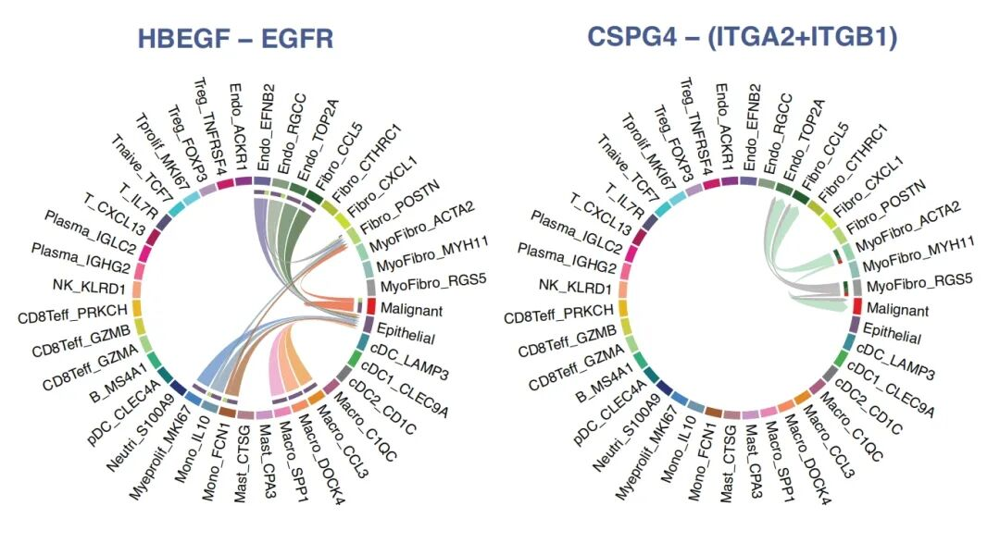
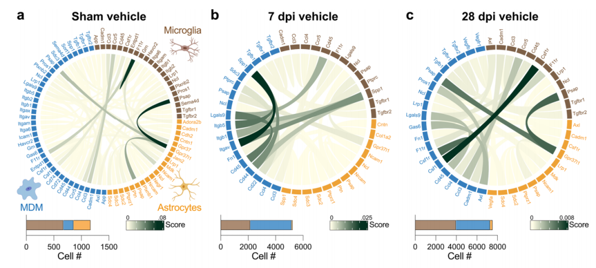
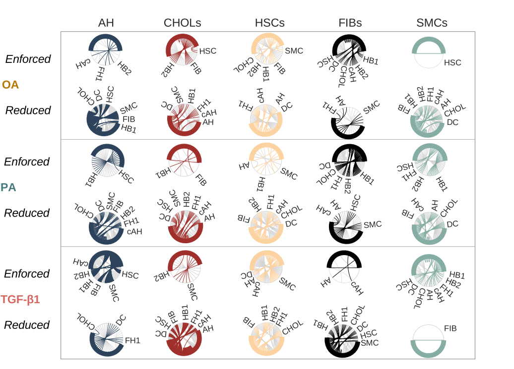
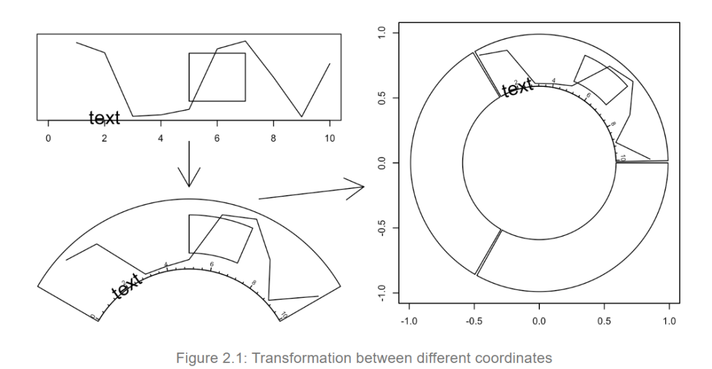
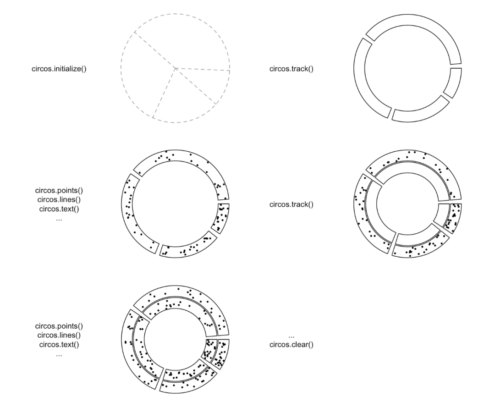
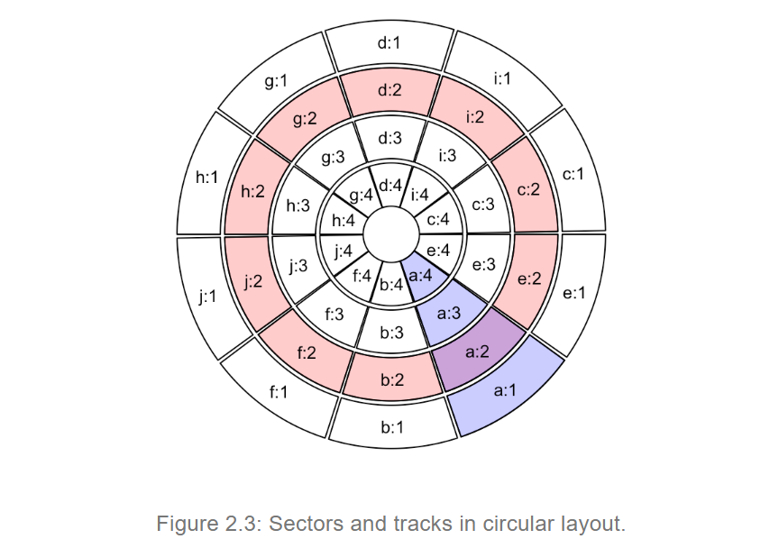
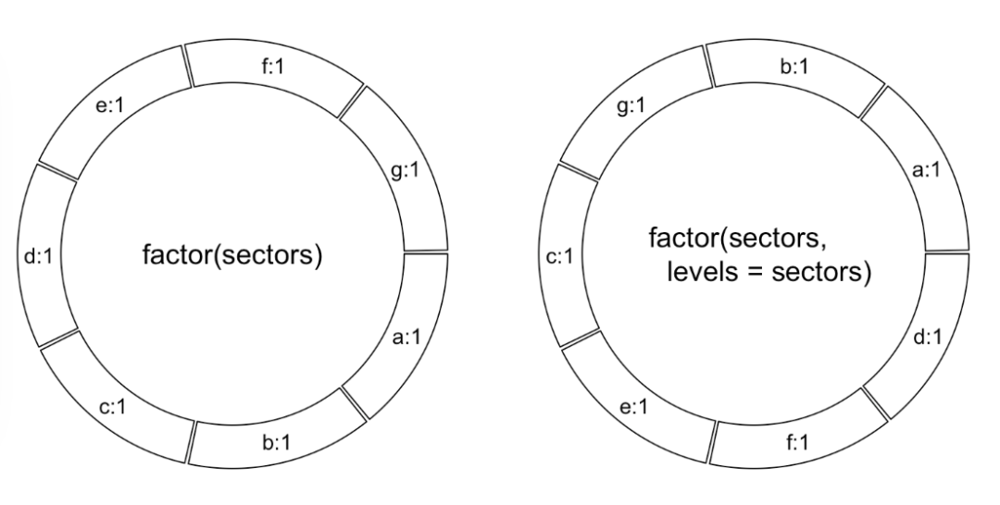
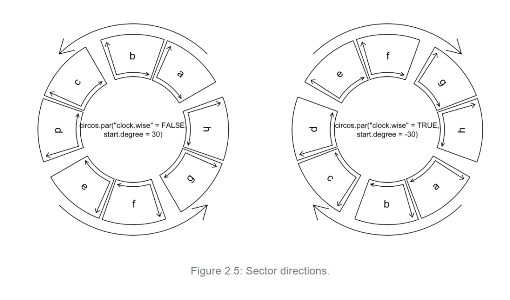
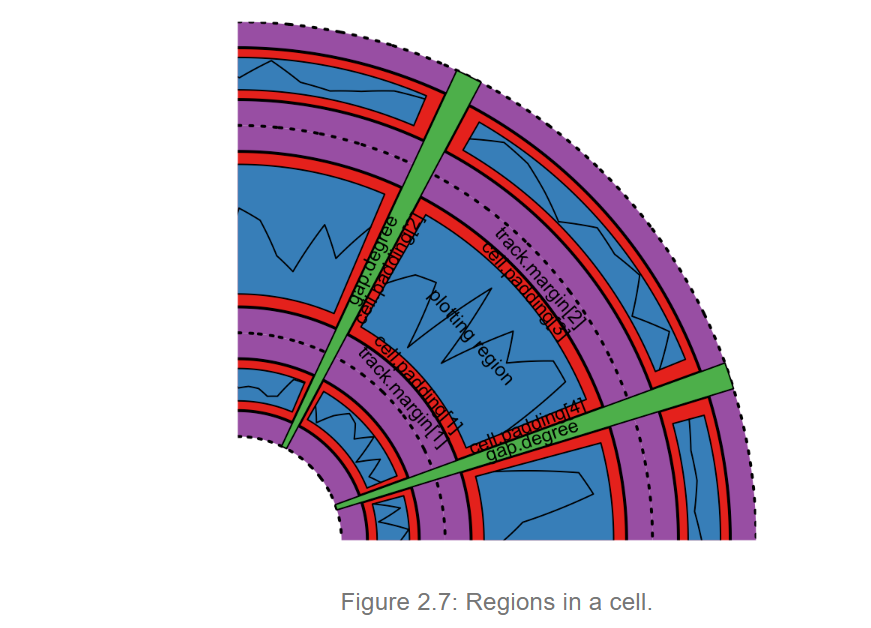
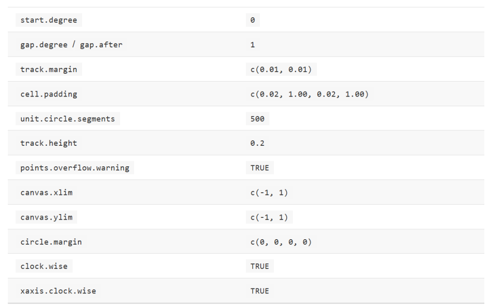

# cellchat细胞通讯绘制弦图函数的参数这么难搞定吗？

- 专辑：绘图小技巧2025
- 公众号：生信技能树
- 发布时间：2025-05-20 23:35
- 原文：[微信公众平台](https://mp.weixin.qq.com/s?__biz=MzAxMDkxODM1Ng%3D%3D&mid=2247542658&idx=1&sn=adabcd404adc4cd33d3991909888ec76&chksm=9b4b6739ac3cee2f68ecdbd68b69a41b74828d4eaf48c60a80966419217f870f6b429ef665df)

---
> 在做这个专辑的时候[《绘图小技巧2025》](https://mp.weixin.qq.com/mp/appmsgalbum?__biz=MzAxMDkxODM1Ng%3D%3D&action=getalbum&album_id=3792985494804332545#wechat_redirect)，我陆陆续续收录了一些文献中展示细胞通讯结果的弦图，本来以为搞定它是分分钟的事情，但是做起来的时候发现事情没有那么简单啊！

当我想用 cellchat包中的函数绘制调整一些参数的时候，发现好多参数调整对结果没有任何影响，标题加粗的参数都没找到！

```r
png(filename = "test_chord.png",width = 1200,height = 1200,res = 120)
# par("lwd"=0.1)
netVisual_individual(cellchat, signaling = pathways.show, pairLR.use = LR.show,
                     layout = "chord",
                     graphics.init=T,
                     cell.order = rev(c("Naive CD4 T","Memory CD4 T","CD8 T","NK","DC",
                                    "CD14+ Mono","FCGR3A+ Mono","B","Platelet")),
                     sources.use = c("Naive CD4 T","Memory CD4 T","CD8 T"),
                     targets.use = c("CD14+ Mono","FCGR3A+ Mono"),
                     edge.width.max = 1,
                     edge.weight.max=3,
                     weight.scale = F,
                     vertex.label.cex = 1.5, # 调整标签字体大小
                     vertex.weight = 10,
                     height = 15,
                     alpha.image = 0.3,
                     point.size = 10,
                     big.gap = 10,
                     small.gap = 35,
                     scale = F,
                     reduce = -1,
                     show.legend = T,
                     legend.pos.x = 8,
                     directional = 2,
                     link.lwd = 3,
                     link.arr.type = "big.arrow",
                     link.arr.lwd=0.3,
                     link.arr.lty =0.1
                     )
dev.off()
```

我随后搜了一些教程，发现基本上都是 cellchat 出来的那个没有那么好看的丑图，根本没有个性化的！我还是学一下 弦图的包circle然后来画！

## 先欣赏我收录的美图！

2024年12月19号发表在 Communications Biology 杂志上的文献，标题为《Single-cell dissection of multifocal bladder cancer reveals malignant and immune cells variation between primary and recurrent tumor lesions》。

这幅图展示的是恶性细胞与非恶性细胞之间特定的配体-受体：**HBEGF-EGFR** 与 **CSPG4 − (ITGA2+ITGB1)** 之间的细胞通讯情况。



2022年7月14号发表在 Nature Communications 杂志，文献标题《Microglia coordinate cellular interactions during spinal cord repair in mice》，这个图展示了在假手术（sham）、7天（7 dpi）和28天（28 dpi）脊髓中，小胶质细胞（棕色）、MDM（蓝色）和星形胶质细胞（橙色）之间的相互作用。



2023年12月11号发表在EMBO J.杂志上的文献：《Single-cell transcriptomics stratifies organoid models of metabolic dysfunction-associated steatotic liver disease》，这个图显示了在OA、PA和TGF-β1处理的HLOs（人肝类器官）中，每个来源细胞与其相应靶细胞之间的总相互作用的比例，相对于它们的对照组。



还有一些我就不放出来了，留个神秘~

## 学习 circlize 包

这个包是圈内的大佬做的，大家应该都认识：Zuguang Gu

包的官网给到你，网址：https://jokergoo.github.io/circlize_book/book/

包的大概：

- **环形布局**：由扇区和轨道组成，扇区用于分类，轨道用于堆叠数据。

- **低级图形函数**：如 `circos.points()`、`circos.lines()` 等，用于在环形布局中绘制基本图形。

- **高级图形函数**：如 `circos.barplot()`、`circos.heatmap()` 等，用于绘制复杂图形。

- **布局函数**：如 `circos.initialize()` 和 `circos.track()`，用于设置环形布局。

- **通用性**：通过低级图形函数的组合，可以实现多种环形图形。

- **工具和资源**：circlize 提供了丰富的函数和工具，适合从基础到高级的环形图绘制需求。

## 软件安装

安装代码很简单：

```r
## 使用西湖大学的 Bioconductor镜像
options(BioC_mirror="https://mirrors.westlake.edu.cn/bioconductor")
options("repos"=c(CRAN="https://mirrors.westlake.edu.cn/CRAN/"))
install.packages("circlize")
```

## 环形布局了解

### 坐标系统

这里介绍了如何将图形映射到圆形上，涉及三种坐标系统：数据坐标系统、极坐标系统和画布坐标系统。

- **data coordinate systems**：数据坐标系统，基于原始数据的范围，有x/y轴；

- **polar coordinate system**：极坐标系统，将数据映射到圆形上；

- **canvas coordinate system**：画布坐标系统，用于在图形设备上实际绘制图形。

不同系统之间的转换：



### 圆形图表制作规则

制作圆形图表的规则相当简单。它遵循以下顺序：initialize layout -\> create track -\> add graphics -\> create track -\> add graphics - ... -\> clear。只要创建了轨道，就可以随时添加图形。详细信息如下：



**1.使用 circos.initialize() 初始化布局：**

由于圆形布局实际上可视化的是分类数据，因此至少必须有一个分类变量。每个类别的 x 值范围可以指定为一个向量或范围本身；

**2.为新轨道创建绘图区域并添加图形：**

新轨道创建在之前创建的轨道内部。只有在创建轨道之后，才能在其上添加其他图形。有三种方法在单元格中添加图形。

- 在创建轨道之后，使用低级图形函数，如circos.points()、circos.lines()等，逐个单元格添加图形。这通常涉及一个for循环，并且需要手动根据分类变量对数据进行子集划分。

- 使用circos.trackPoints()、circos.trackLines()等，同时为所有单元格添加简单图形。

- 在circos.track()中使用panel.fun参数，在创建某个单元格后立即添加图形。panel.fun需要两个参数x和y，它们是当前单元格中的x值和y值。

**3.重复步骤2以在圆圈上添加更多轨道**，除非它达到圆圈的中心。

**4.调用 circos.clear() 来清理。**

### Sectors扇区 and tracks轨道

圆形布局由扇区和轨道组成。如下图所示，红色圆圈代表一个轨道 tracks ，蓝色代表一个扇区 Sectors。扇区和轨道的交集称为单元格Cell，可以将其视为数据点的虚拟绘图区域。



#### 扇区

扇区首先通过 circos.initialize() 在圆上分配：

- 必须有一个分类变量（例如扇区），在圆上，每个扇区对应一个类别；

- 扇区的宽度（以度数衡量）与扇区在 x 方向（或圆形方向）上的数据范围成比例；

- 数据范围可以指定为一个与扇区长度相同的数值向量 x，然后 x 被扇区分割，并为每个扇区内部计算数据范围。

- 也可以通过 xlim 参数直接指定数据范围。xlim 的有效值是一个两列矩阵，其行数与扇区数量相同，xlim 中的每一行对应一个扇区。

布局初始化后，会看不到任何绘制的内容，或者只打开了一个空的图形设备。这是因为尚未创建任何轨迹，但是布局已经被内部记录。

在初始化步骤中，不仅分配了每个扇区的宽度，还确定了圆上扇区的顺序。扇区的顺序由输入因子的级别顺序决定。

扇区顺序调整：

```r
library(circlize)
sectors = c("d", "f", "e", "c", "g", "b", "a")
s1 = factor(sectors)
s1
circos.initialize(s1, xlim = c(0, 1))
s2 = factor(sectors, levels = sectors)
s2
circos.initialize(s2, xlim = c(0, 1))
```



#### 轨道

在不同的轨道上，同一区域内的细胞在x轴上共享相同的数据范围，我们只需要指定细胞在y方向（或根本方向）上的数据范围。与circos.initialize()类似，circos.track() 也接受y或ylim参数来指定y值的范围。由于同一轨道上的所有细胞共享相同的y范围，如果指定了ylim，它就是一个长度为两个的向量。

```r
circos.track(sectors, y = y)
circos.track(sectors, ylim = c(0, 1))
circos.track(sectors, x = x, y = y)
```

#### 单元格

单元格是圆形图的基本单位，彼此独立。单元格创建后，它们具有自包含的元值x-lim和y-lim（以数据坐标测量的数据范围）。

#### 图形参数

`circos.par()` 可以设置一些基本的圆形布局参数。这些参数如下。注意，某些参数只能在圆形布局初始化之前进行修改。

- **参数限制**：部分参数（如 `start.degree`、`gap.degree`）需在布局初始化前设置

- **角度与间隔**：

`start.degree`：第一个扇区的起始角度，逆时针方向。

注意，这个角度是按照标准极坐标系统测量的，即总是逆时针方向。例如，如果设置为90度，扇区将从圆的顶部中心开始。见图：



`gap.degree` 和 `gap.after`：控制相邻扇区之间的间隔，可以是一个单一的值，这意味着所有间隔的角度相同，也可以是一个向量，其数量与扇区相同。注意第一个间隔位于第一个扇区之后



**边距与填充**：

- `track.margin`：轨道的上下边距，单位为单位圆半径的百分比。

类似于层叠样式表（CSS）中的边距，它是绘图区域外的空白区域，也在边框之外。由于左、右边距由 `gap.after` 控制，因此只需要设置上、下边距。`track.margin` 的值是单位圆半径的百分比。该值也可以通过 `mm_h()`、`cm_h()` 或 `inches_h()` 函数以绝对单位设置。见图2.7。

- `cell.padding`：单元格的填充，包括上下左右四个方向，单位为百分比或角度。

它是绘图区域周围的空白区域，但在边框之内。该参数有四个值，分别控制底部、左部、顶部和右部的填充。第一和第三个填充值是单位圆半径的百分比，第二和第四个值是角度。第一和第三个值也可以通过 `mm_h()`、`cm_h()` 或 `inches_h()` 以绝对单位设置。见图2.7。

**曲线与轨道**：

- `nit.circle.segments`：控制曲线的线段数量，影响曲线的平滑度和文件大小。

由于曲线是由一系列直线模拟的，这个参数控制表示曲线的线段数量。线段的最小长度是单位圆的周长（2π）除以 `unit.circle.segments`。更多的线段意味着对曲线的近似更好，但如果图形是PDF格式，文件大小会更大。

- `track.height`：轨道的默认高度，包括填充但不包括边距。

轨道的默认高度。它是单位圆半径的百分比。高度包括顶部和底部的单元格填充，但不包括边距。该值也可以通过 `mm_h()`、`cm_h()` 或 `inches_h()` 以绝对单位设置。

**警告与范围**：

- `points.overflow.warning`：控制是否对超出绘图区域的点发出警告。

由于每个单元格实际上并不是一个真正的绘图区域，而只是一个普通的矩形（或者更准确地说，是一个圆形矩形），因此它不会移除绘制在区域外的点。因此，如果有些点（或线、文本）超出了绘图区域，按默认设置，该软件包会继续绘制这些点，但会发出警告信息。然而，在某些情况下，在绘图区域外绘制一些内容是有用的，例如添加一些文本注释（如图1.2中的第一个轨道）。将此值设置为 `FALSE` 可以关闭警告。

- `canvas.xlim` 和 `canvas.ylim`：控制画布坐标范围，可自定义圆的显示部分。

`circlize` 强制将所有内容放置在单位圆内，因此默认情况下 `canvas.xlim` 和 `canvas.ylim` 是 c(-1, 1)。然而，如果你希望在圆外留出更多空间，可以将其设置为更宽的区间。通过选择合适的 `canvas.xlim` 和 `canvas.ylim`，实际上你可以自定义圆。例如，将 `canvas.xlim` 设置为 c(0, 1) 和 `canvas.ylim` 设置为 c(0, 1)，将只绘制圆的1/4。

**边距与方向**：

- `circle.margin`：控制圆的水平和垂直边距，可为1、2或4个值。

水平和垂直方向的边距。该值应为正数向量，其长度应为1、2或4。当长度为1时，它控制圆的四边的边距。当长度为2时，第一个值控制左、右边距，第二个值控制底、顶部边距。当长度为4时，四个值分别控制圆的左、右、底、顶部边距。因此，一个值为 c(x1, x2, y1, y2) 的设置意味着 `circos.par(canvas.xlim = c(-(1+x1), 1+x2), canvas.ylim = c(-(1+y1), 1+y2))`

- `clock.wise` 和 `xaxis.clock.wise`：分别控制扇区绘制顺序和x轴方向，后者从版本0.4.11开始可用。

`clock.wise`绘制扇区的顺序。默认值为 `TRUE`，即顺时针方向（见图2.5）。

这些参数的默认值如下：



今天学习到这，了解了一些基本概念之后，对这个弦图的认知更清晰明了了~

等我下周一（每周的绘图主题）的时候，就可以出上面那个细胞通讯结果的弦图了~

#### 文末友情宣传

强烈建议你推荐给身边的**博士后以及年轻生物学PI**，多一点数据认知，让他们的科研上一个台阶：

- [生信入门&数据挖掘线上直播课5月班](https://mp.weixin.qq.com/s?__biz=MzAxMDkxODM1Ng%3D%3D&mid=2247541231&idx=1&sn=6704a3ae8233d19ca94fd4929b5e1f63#wechat_redirect)，你的生物信息学入门课

- [时隔5年，我们的生信技能树VIP学徒继续招生啦](https://mp.weixin.qq.com/s?__biz=MzAxMDkxODM1Ng%3D%3D&mid=2247525079&idx=1&sn=0b997af16a58195b4192691373048fd5#wechat_redirect)

- [满足你生信分析计算需求的低价解决方案](https://mp.weixin.qq.com/s?__biz=MzUzMTEwODk0Ng%3D%3D&mid=2247530048&idx=1&sn=28aa7bbd5e00521f79e074496a5f5d66#wechat_redirect)

- [生信故事会](https://mp.weixin.qq.com/mp/appmsgalbum?__biz=MzAxMDkxODM1Ng%3D%3D&action=getalbum&album_id=1679199708449144836#wechat_redirect)，来看看他们的生信入门故事

- [生信马拉松答疑专辑](https://mp.weixin.qq.com/mp/appmsgalbum?__biz=MzAxMDkxODM1Ng%3D%3D&action=getalbum&album_id=3690970204957147140#wechat_redirect)，获取你的生信专属答疑

<!-- wechat-article-fetcher: complete -->
