# 一文解锁随心所欲绘图：不要被ggplot2洗脑了，我们只要grid！！！

- 专辑：绘图小技巧2025
- 公众号：生信技能树
- 发布时间：2025-05-13 21:41
- 原文：[微信公众平台](https://mp.weixin.qq.com/s?__biz=MzAxMDkxODM1Ng%3D%3D&mid=2247542460&idx=1&sn=2737659a888a75eebf27c76956c8a557&chksm=9b4b6607ac3cef11e38cf42858ad39e82fe35aa63387ede8a0266fe87cbe6a004c5da7e219c3)

---
> 由于最近绘图，遇到一些地方**怎么都不能随心所欲的去调整**，我查了一下资料，如果绘图技能需要更进一层，那必须了解R语言绘图系统中的低级绘图系统：Grid绘图系统。我的那本书买回来翻了一遍后已经吃灰了，再从书堆里面翻出来看看好了...

简略版网页资源：https://bookdown.org/rdpeng/RProgDA/the-grid-package.html

在本节中，将讨论可用于扩展 ggplot2 的 grid 包的关键元素。

**grid包提供了一套函数和类，这些函数和类代表图形对象或 grobs，可以像其他 R 对象一样进行操作。使用 grobs ，我们可以使用标准的 R 函数来操作图形元素（“编辑”它们）。**

下面的总结来自：https://mp.weixin.qq.com/s/sTcnw-mH7hjWEWn-WdLfnA

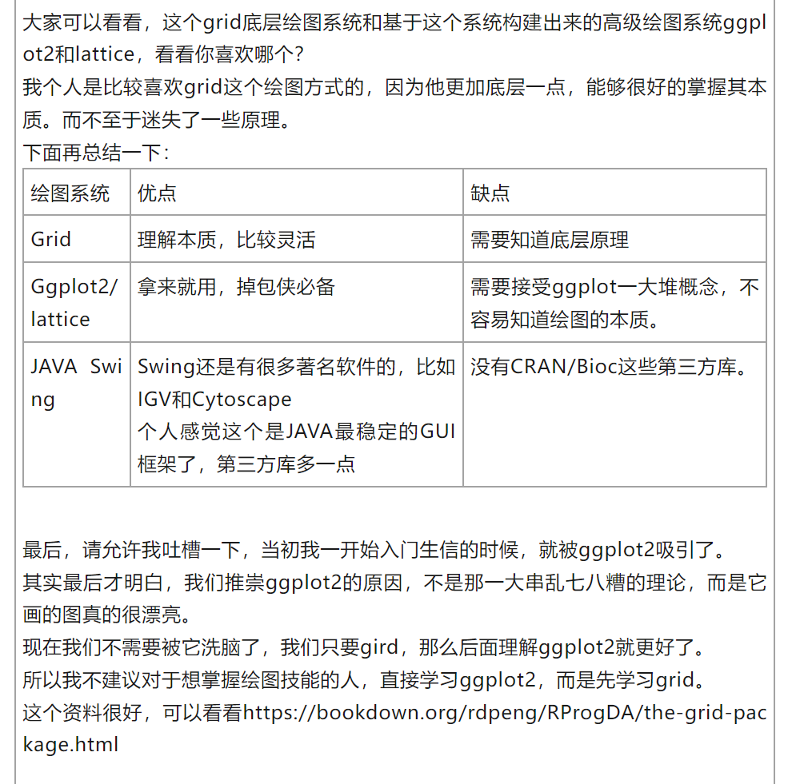

#### 我们只要grid！！！

## Grid图形概述

网格图形是R中的一种低级绘图系统，并且与基础R图形系统是分开的。这里的“低级”意味着网格图形函数通常用于修改绘图中的非常具体的元素，而不是用于单行绘图调用的函数。例如，如果你想快速绘制数据的散点图，你应该使用ggplot2，但如果你想创建一个带有倾斜轴标签的内嵌绘图，那么你可能需要转向网格图形。

网格图形和R的基础图形是两个独立的系统。您无法轻松地使用网格图形函数编辑使用基础图形创建的图形。如果您必须整合这两个系统的输出，您可能可以使用gridBase包，但这不会像编辑使用网格图形（包括ggplot对象）构建的对象那样简单。

## Grobs

要扩展 ggplot2，最需要理解的网格图形（grid graphics）的核心概念是“图形对象（grobs）”。图形对象是可以使用网格图形函数创建和修改的对象。

例如，你可以创建一个圆形图形对象或点图形对象。一旦你创建了一个或多个这样的图形对象，你可以将它们添加到更大的网格图形对象中，包括ggplot对象。

**Grob函数家族**：grid 包提供了一组用于创建和修改图形对象（grobs）的函数。包括下面这些，用于绘制不同的图形元素，如圆形、矩形、点、线、多边形、曲线、坐标轴、栅格、线段和绘图框架。

- `circleGrob`

- `linesGrob`

- `polygonGrob`

- `rasterGrob`

- `rectGrob`

- `segmentsGrob`

- `legendGrob`

- `xaxisGrob`

- `yaxisGrob`

除了`grid`包，其他包（如`gridExtra`）也提供了额外的函数来创建图形对象（grobs）。例如，`gridExtra`包中的`tableGrob`函数可以创建表格图形对象并将其添加到网格图形中。

创建 grobs 的函数通常包含指定 grobs 放置位置的参数：

- `pointsGrob`函数有`x`和`y`参数；

- `segmentsGrob`函数有`x0`、`x1`、`y0`、`y1`参数，分别表示线段的起始和结束位置；

- `gp`参数，用于设置grobs的图形参数，如颜色、填充、线型、线宽等：

  - color (`col`),

  - fill (`fill`),

  - transparency (`alpha`),

  - line type (`lty`),

  - line width (`lwd`),

  - ine end and join styles (`lineend` and `linejoin`, respectively)

  - font elements (`fontsize`, `fontface`, `fontfamily`)

```r
rm(list=ls())
library(grid)
my_circle <- circleGrob(x = 0.5, y = 0.5, r = 0.5,
                        gp = gpar(col = "gray", lty = 3))

?gpar
grid.draw(my_circle)
```


下面来个例子：

在绘制一个图形对象之后，你可以使用`grid.edit`函数来编辑它。

例如，以下代码创建了一个圆形图形对象，绘制了它，创建并绘制了一个矩形图形对象，然后返回并编辑绘图区域中的圆形图形对象，以改变线型和颜色（在你的R会话中逐行运行此代码，以查看变化）。注意，图形对象被赋予了一个名称，以便在`grid.edit`调用中引用它。

```r
###################
grid.newpage()
# 创建了一个圆形图形对象
my_circle <- circleGrob(name = "my_circle",
                        x = 0.5, y = 0.5, r = 0.3,
                        gp = gpar(col = "gray", lty = 3))
# 绘制了它
grid.draw(my_circle)
# 创建并绘制了一个矩形图形对象
my_rect <- rectGrob(x = 0.5, y = 0.5, width = 0.8, height = 0.15)
grid.draw(my_rect)
# 然后返回并编辑绘图区域中的圆形图形对象，以改变线型和颜色（在你的R会话中逐行运行此代码，以查看变化）
grid.edit("my_circle", gp = gpar(col = "red", lty = 1))
```

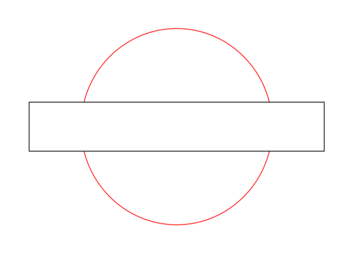

`ggplot2`是基于网格系统（grid system）构建的，这意味着`ggplot`对象通常可以很好地集成到网格图形（grid graphics）中。在很多方面，`ggplot`对象可以被当作网格图形的图形对象（grobs）来处理。

例如，你可以使用`grid`包中的`grid.draw`函数将`ggplot`对象绘制到当前的图形设备上：

```r
###################
library(ggplot2)
# 加载包
library(faraway)
data(worldcup)
head(worldcup)

wc_plot <- ggplot(worldcup, aes(x = Time, y = Passes)) +
  geom_point()

grid.draw(wc_plot)
grid.draw(my_circle)
```

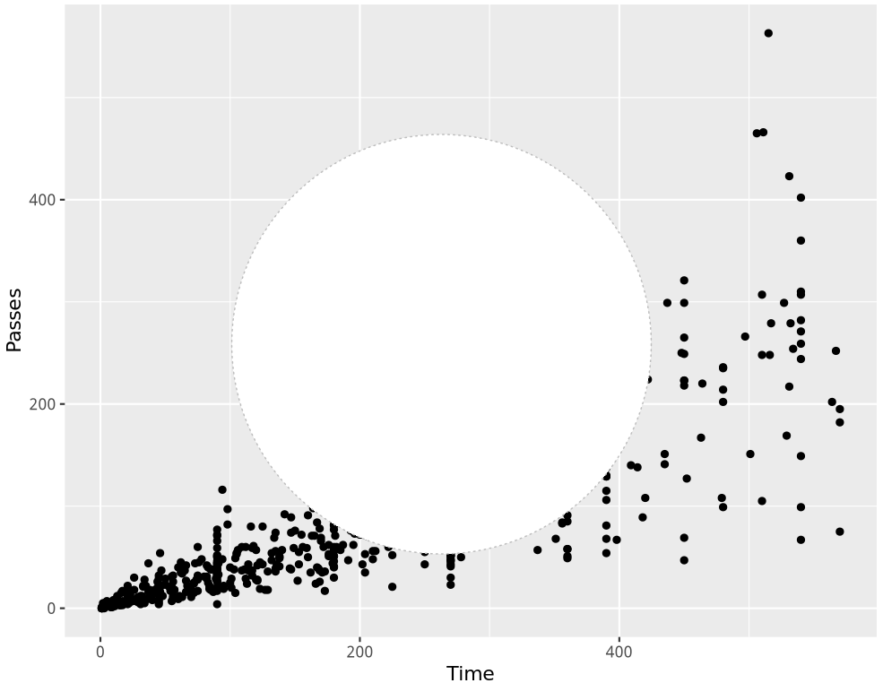

当前生成的图形可能并不实用，但通过使用视图窗口（viewports）和坐标系统，可以使其更具功能性。

**编辑`ggplot`对象**：可以使用`grid`图形函数来编辑`ggplot`对象中的元素。

步骤如下：

- 列出`ggplot`对象中的所有图形元素，找到要更改的元素的名称。

- 使用`grid.edit`函数来编辑该元素。

**查找元素名称**：

- 将`ggplot`对象绘制到RStudio的图形设备上。

- 运行`grid.force()`来强制解析图形布局。

- 运行`grid.ls()`来列出所有图形元素的名称。

- 根据`grid.ls()`的结果，使用`grid.edit()`来更改特定元素。

- 注意：每次打印图形时，元素的名称可能会改变，因此需要根据`grid.ls()`的结果动态调整`grid.edit`的调用。

```r
#############
wc_plot
grid.force()
grid.ls()
```

可编辑的元素列表如下：

```r
layout
  background.1-13-16-1
    plot.background..rect.48
  panel.9-7-9-7
    panel-1.gTree.27
      grill.gTree.25
        panel.background..rect.16
        panel.grid.minor.y..polyline.18
        panel.grid.minor.x..polyline.20
        panel.grid.major.y..polyline.22
        panel.grid.major.x..polyline.24
      NULL
      geom_point.points.12
      NULL
      panel.border..zeroGrob.13
  spacer.10-8-10-8
    NULL
  spacer.10-6-10-6
    NULL
  spacer.8-8-8-8
    NULL
  spacer.8-6-8-6
    NULL
  axis-t.8-7-8-7
    NULL
  axis-l.9-6-9-6
    GRID.absoluteGrob.36
      NULL
      axis
        axis.1-2-1-2
          GRID.titleGrob.35
            GRID.text.34
        axis.1-4-1-4
          GRID.polyline.33
        axis.1-1-1-1
          NULL
  axis-r.9-8-9-8
    NULL
  axis-b.10-7-10-7
    GRID.absoluteGrob.32
      NULL
      axis
        axis.1-1-1-1
          GRID.polyline.28
        axis.3-1-3-1
          GRID.titleGrob.31
            GRID.text.29
        axis.4-1-4-1
          NULL
  xlab-t.7-7-7-7
    NULL
  xlab-b.11-7-11-7
    axis.title.x.bottom..titleGrob.40
      GRID.text.37
  ylab-l.9-5-9-5
    axis.title.y.left..titleGrob.43
      GRID.text.41
  ylab-r.9-9-9-9
    NULL
  guide-box-right.9-11-9-11
    NULL
  guide-box-left.9-3-9-3
    NULL
  guide-box-bottom.13-7-13-7
    NULL
  guide-box-top.5-7-5-7
    NULL
  guide-box-inside.9-7-9-7
    NULL
  subtitle.4-7-4-7
    plot.subtitle..zeroGrob.45
  title.3-7-3-7
    plot.title..zeroGrob.44
  caption.14-7-14-7
    plot.caption..zeroGrob.46
```

然后，可以通过在这些元素上使用`grid.edit`来将点的颜色改为红色并将y轴标签设置为粗体（注意，如果你自己运行这段代码，你需要从你的设备上的`grid.ls`输出中获取确切的名称）。

```r
#############
wc_plot
grid.force()
grid.ls()

# "geom_point.points.12" 这些就是grid.ls()列出来的元素
grid.edit("geom_point.points.12", gp = gpar(col = "red"))
grid.edit("GRID.text.37", gp = gpar(fontface = "bold"))
grid.edit("GRID.text.41", gp = gpar(fontface = "bold"))
```

这个感觉好爽啊：

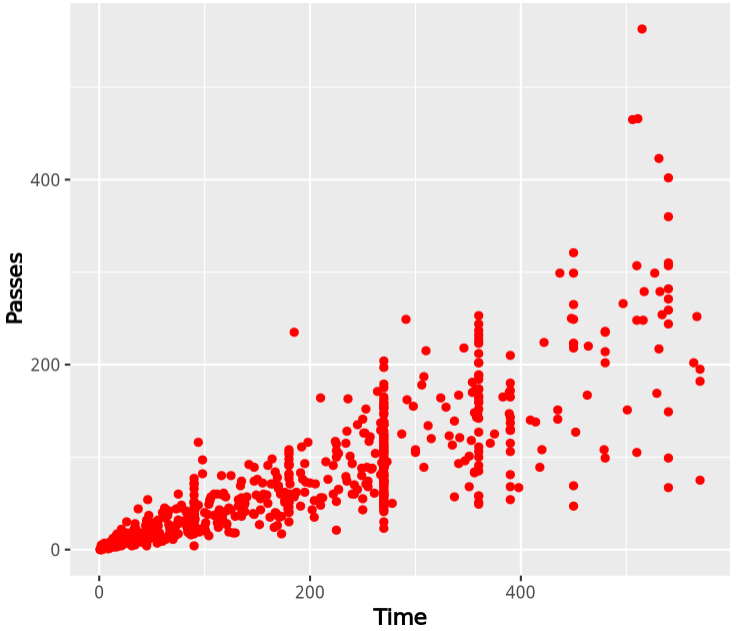

**`ggplotGrob`函数**：`ggplot2`包中的`ggplotGrob`函数可以将`ggplot`对象显式转换为图形对象（grob），这使得`ggplot`对象可以更灵活地与其他网格图形（grid graphics）元素进行组合和操作。

**`gTree`图形对象**：

`gTree`是一种特殊的图形对象，可以包含一个或多个子图形对象（“children” grobs）。这种结构对于创建需要组合多个图形元素的复杂图形对象非常有用，例如：

- **箱线图（boxplot）**：包含矩形（箱体）、线条（须线）和点（异常值）。

- **标签图形对象**：包含文本和矩形边框。

**创建复杂图形对象的示例**：例如，创建一个看起来像棒棒糖的图形对象，可以通过组合多个基本图形对象（如圆形和线条）来实现。

```r
###############
grid.newpage()
candy <- circleGrob(r = 0.1, x = 0.5, y = 0.6)
stick <- segmentsGrob(x0 = 0.5, x1 = 0.5, y0 = 0, y1 = 0.5)
lollipop <- gTree(children = gList(candy, stick))
grid.draw(lollipop)
```

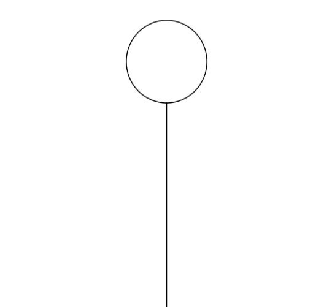

**可以使用 grid.ls 函数列出 gTree 中的所有子 grobs：**

```r
grid.ls(lollipop)
# GRID.gTree.56
# GRID.circle.54
# GRID.segments.55
```

在后面的章节中，将展示如何从 grid grobs 开始制作自己的 geom，并将其添加到 ggplot 中。Bob Rudis 在他的 ggalt 包中创建了一个geom_lollipop，这允许你创建“棒棒糖图”，作为条形图的替代品。更多内容，请参阅 https://github.com/hrbrmstr/ggalt 和 https://rud.is/b/2016/04/07/geom_lollipop-by-the-chartettes/

## Viewports

**网格图形的灵活性**：

> 网格图形的强大功能之一是能够在整个绘图区域周围的工作空间中自由移动，这种功能特别适用于需要在绘图的不同位置添加复杂图形元素的场景。

**视图窗口（Viewports）**：

- 视图窗口是网格图形中的一个关键概念，表示绘图中的较小工作空间；

- 通过视图窗口，用户可以在绘图的不同子空间中进行导航和绘图操作。

### 1.创建视图窗口

**创建和使用视图窗口**：使用`viewport`函数创建新的视图窗口，进入视图窗口后，可以绘制图形对象（grobs），然后返回到主绘图区域或进入另一个视图窗口继续绘图。

```r
###################
# 1.在整个绘图区域的右上角创建一个视图窗口。
# 2.在该视图窗口中绘制一个圆角矩形和一个棒棒糖图形对象

grid.draw(rectGrob())
sample_vp <- viewport(x = 0.5, y = 0.5, width = 0.5, height = 0.5,just = c("left", "bottom"))
pushViewport(sample_vp)
grid.draw(roundrectGrob())
grid.draw(lollipop)
popViewport()
```

此代码：

- 使用 viewport 函数创建一个视口，

- 使用 pushViewport 导航进入该视口，

- 使用grid.draw函数写入grobs，

- 然后使用popViewport导航出视口。

在这段代码中，viewport函数的x和y参数指定了视口的位置，而just参数指定了视口相对于该位置的对齐方式。默认情况下，这些位置是基于绘图区域每侧的0到1的范围来指定的，因此x = 0.5和y = 0.5指定了绘图区域的中心，而just = c("left", "bottom") 将视图窗口的左下角对齐到指定位置

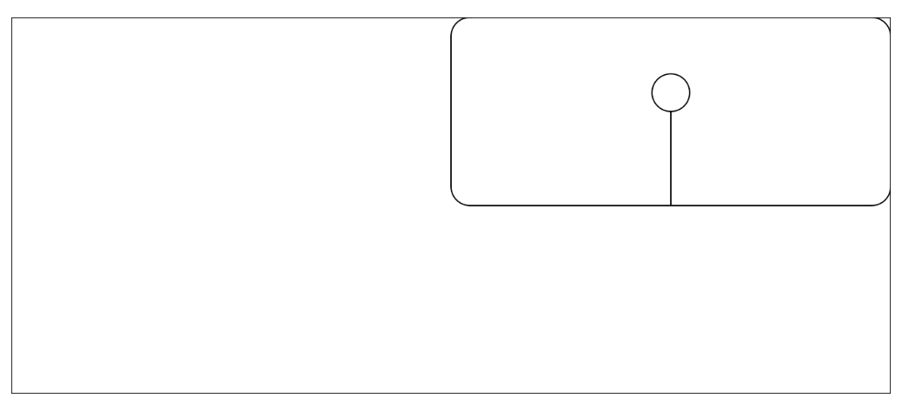

### 2.调整视图窗口位置

如果要将视图窗口放置在绘图区域的中心，可以将`just`设置为`c("center", "center")`：

```r
# 调整视图窗口位置
grid.draw(rectGrob())
sample_vp <- viewport(x = 0.5, y = 0.5, width = 0.5, height = 0.5,just = c("center", "center"))
pushViewport(sample_vp)
grid.draw(roundrectGrob())
grid.draw(lollipop)
popViewport()
```

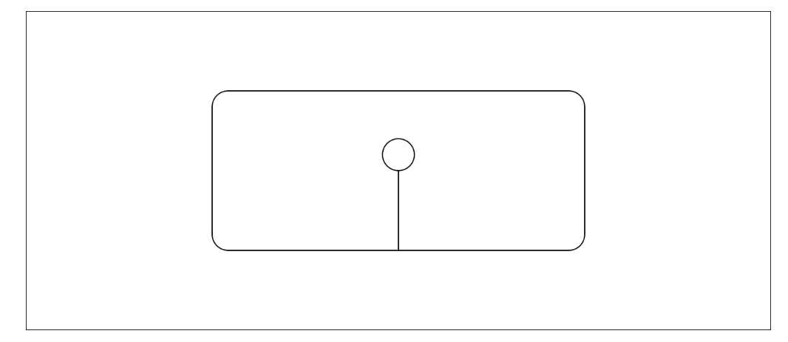

### 3.调整窗口的大小

`width`和`height`参数指定了视图窗口的大小，同样基于默认的单位，其中1表示绘图区域一边的完整宽度（在本节后面，我们将讨论如何使用不同的坐标系统）。例如，如果你想让视图窗口变得更小，你可以运行：

```r
# 调整窗口的大小
grid.draw(rectGrob())
sample_vp <- viewport(x = 0.75, y = 0.75, width = 0.25, height = 0.25,just = c("left", "bottom"))
pushViewport(sample_vp)
grid.draw(roundrectGrob())
grid.draw(lollipop)
popViewport()
```

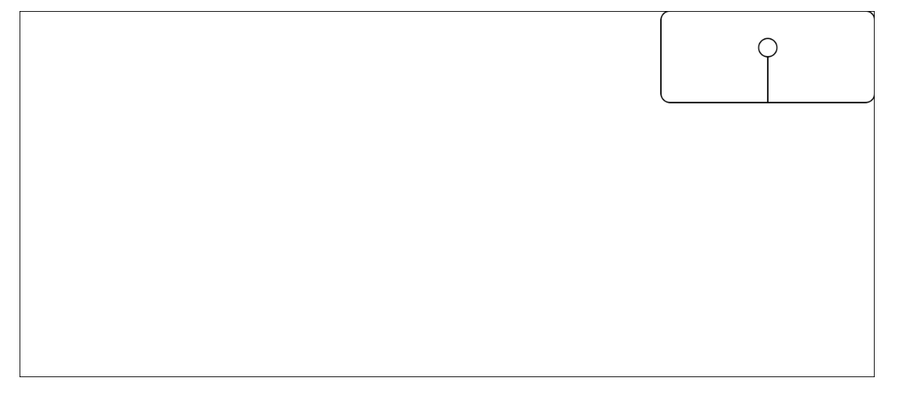

### 4.创建两个视图窗口

**视图窗口的操作限制**：

- 一次只能在一个视图窗口中操作。

- 在一个视图窗口中绘制图形对象（grobs）后，需要退出该视图窗口才能在其他视图窗口中进行操作。

创建两个视图窗口：

```r
# 创建两个视图窗口
grid.draw(rectGrob())
# 第一个视图窗口
sample_vp_1 <- viewport(x = 0.75, y = 0.75, width = 0.25, height = 0.25,just = c("left", "bottom"))
pushViewport(sample_vp_1)
grid.draw(roundrectGrob())
grid.draw(lollipop)
popViewport()

# 第二个视图窗口
sample_vp_2 <- viewport(x = 0, y = 0, width = 0.5, height = 0.5,just = c("left", "bottom"))
pushViewport(sample_vp_2)
grid.draw(roundrectGrob())
grid.draw(lollipop)
popViewport()
```

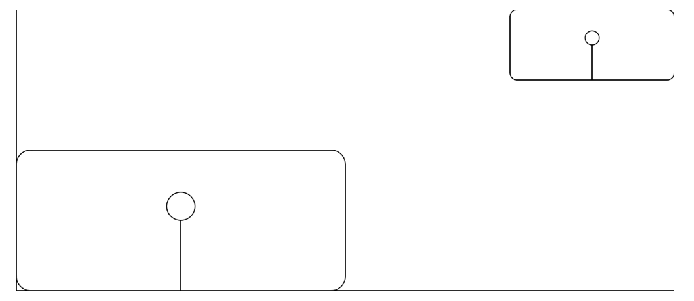

### 5.视图窗口嵌套

你也可以将视图窗口嵌套在彼此内部。在这种情况下，新的视图窗口是相对于当前视图窗口定义的。例如，如果你处于一个视图窗口中，并且在`x = 0.5`和`y = 0.5`的位置放置一个新的视图窗口，那么这个新的视图窗口将位于当前视图窗口的中心，而不是整个绘图区域的中心。

```r
## 视图窗口嵌套
grid.draw(rectGrob())

sample_vp_1 <- viewport(x = 0.5, y = 0.5,  width = 0.5, height = 0.5,just = c("left", "bottom"))
sample_vp_2 <- viewport(x = 0.1, y = 0.1,  width = 0.4, height = 0.4,just = c("left", "bottom"))

pushViewport(sample_vp_1)
grid.draw(roundrectGrob(gp = gpar(col = "red")))
pushViewport(sample_vp_2)
grid.draw(roundrectGrob())
grid.draw(lollipop)
# pop up two levels to get out of the viewports
popViewport(2)
```

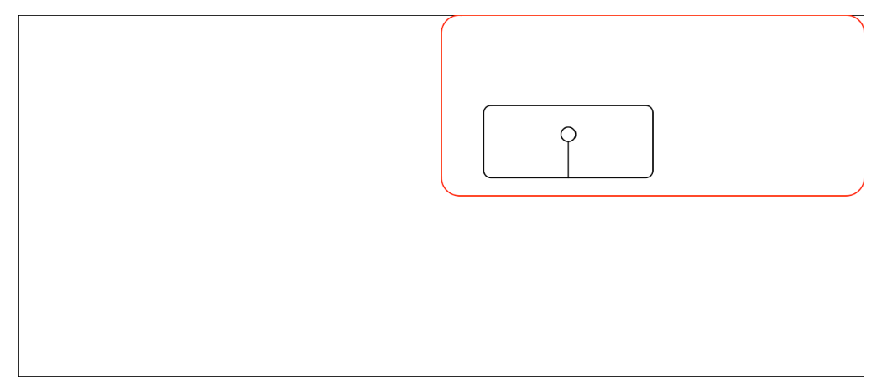

由于视图窗口可以嵌套，网格图形对象可能会形成一个复杂的视图窗口和图形对象（grobs）的树形结构，可以使用`grid.ls`函数列出当前图形设备中绘图的所有元素。

```r
## 列出元素
grid.draw(rectGrob())
sample_vp_1 <- viewport(x = 0.5, y = 0.5, width = 0.5, height = 0.5, just = c("left", "bottom"))
pushViewport(sample_vp_1)
grid.draw(roundrectGrob())
grid.draw(lollipop)
popViewport()

grid.ls()


## ggplot2对象grid.force() 进行转换后列出
worldcup %>%
  ggplot(aes(x = Time, y = Passes)) +
  geom_point()
grid.force()
grid.ls()
```

## 网格图形坐标系

在视图窗口中绘制图形对象时，需要指定其在视图窗口中的位置，用于指定位置的数值取决于所使用的坐标系统。

**网格图形中的单位选择**：

网格图形提供了多种单位选项，选择合适的单位可以简化绘图过程。常用的单位包括：

- **原生单位（native units）**：基于当前绘图区域的x和y尺度，适合在特定尺度下放置对象；

- **归一化父坐标单位（npc units）**：x和y的范围从0到1，适合将对象放置在视图窗口的特定比例位置；

- **绝对值单位**：如英寸（inches）、厘米（cm）和毫米（mm），用于指定绝对尺寸。

### 1.**使用`unit`函数指定坐标系统**：

使用`unit`函数可以指定在放置对象时使用的坐标系统，例如，创建一个具有特定x和y尺度的视图窗口时，可以使用`native`单位来基于这些尺度值确定图形对象的位置。

```r
###############################
grid.newpage()
# 创建一个具有特定x和y尺度的视图窗口
# xscale = c(0, 100),
# yscale = c(0, 10)
ex_vp <- viewport(x = 0.5, y = 0.5, just = c("center", "center"),height = 0.8, width = 0.8,
                  xscale = c(0, 100), yscale = c(0, 10))
pushViewport(ex_vp)
grid.draw(rectGrob())
# native 单位
grid.draw(circleGrob(x = unit(20, "native"),
                     y = unit(5, "native"),
                     r = 0.1,
                     gp = gpar(fill = "lightblue")))

# native 单位
grid.draw(circleGrob(x = unit(85, "native"),
                     y = unit(8, "native"),
                     r = 0.1,
                     gp = gpar(fill = "darkred")))
popViewport()
```

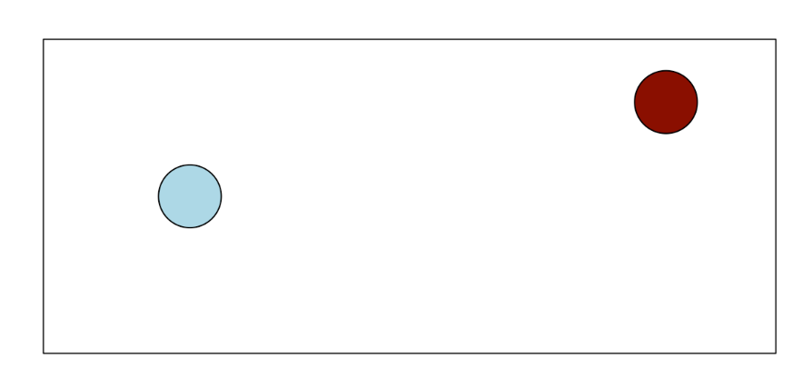

### 2.gridExtra包

**`gridExtra` 包的功能**：`gridExtra` 包提供了对网格系统（grid system）的有用扩展，重点在于提供高级函数来处理网格图形对象（grobs），而不是 `grid` 包中的低级工具，后者用于创建和编辑绘图的特定低级元素。

**高级函数的优势**：

- 特别有用的函数允许用户将多个图形对象（grobs）排列并写入到一个图形设备中；

- 支持在网格图形对象中包含表格。

**`grid.arrange` 函数**：`grid.arrange` 函数使得创建一个包含多个网格对象的绘图变得容易，可以使用它将一个或多个图形对象（grobs）写入到一个图形设备中。

```r
######################
# 排列之前创建并保存到R对象中的图形对象（grobs）
library(gridExtra)
grid.arrange(lollipop, circleGrob(),
             rectGrob(), lollipop,
             ncol = 2)
```

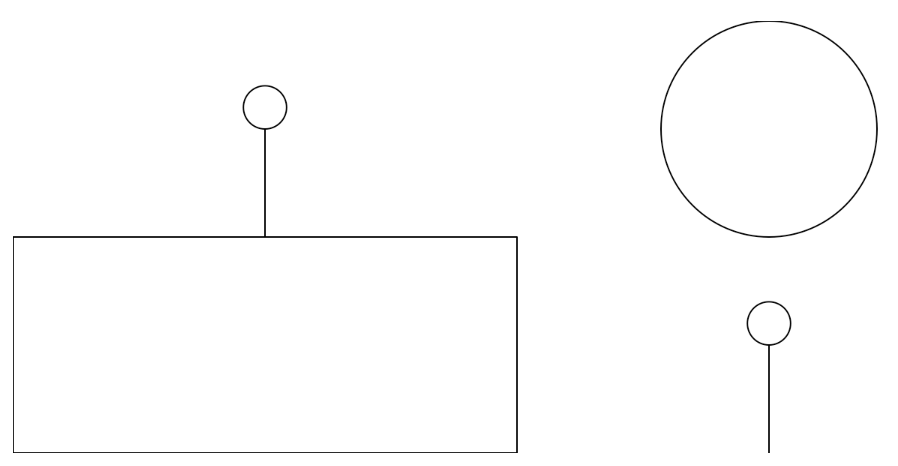

也可以对ggplot2对象进行排列：

由于`ggplot2`是基于网格图形构建的，`grid.arrange`函数也可以用于将多个`ggplot`对象绘制到一个图形设备上，这使得用户可以轻松地创建包含多个`ggplot`图形的复杂布局。

```r
######################
# 排列ggplot2对象
time_vs_shots <- ggplot(worldcup, aes(x = Time, y = Shots)) +
  geom_point()
player_positions <- ggplot(worldcup, aes(x = Position)) +
  geom_bar()

grid.arrange(time_vs_shots, player_positions, ncol = 2)
```

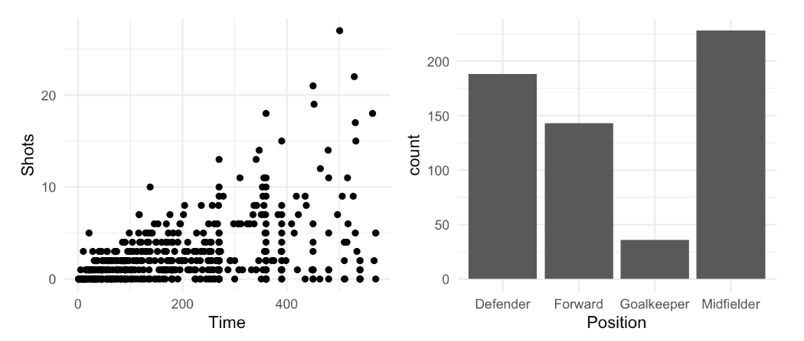

使用 layout_matrix 函数调整布局：

```r
grid.arrange(time_vs_shots, player_positions,
             layout_matrix = matrix(c(1, 2, 2), ncol = 3))
```

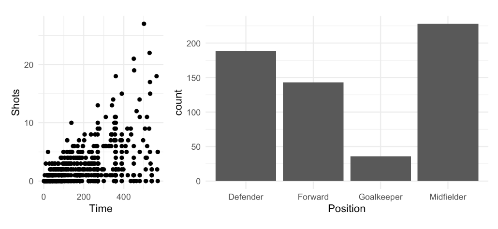

巧妙使用NA填充空白：

```r
# NA
matrix(c(1, NA, NA, NA, 2, 2), byrow = TRUE, ncol = 3)
grid.arrange(time_vs_shots, player_positions,
             layout_matrix = matrix(c(1, NA, NA, NA, 2, 2),
                                    byrow = TRUE, ncol = 3))
```

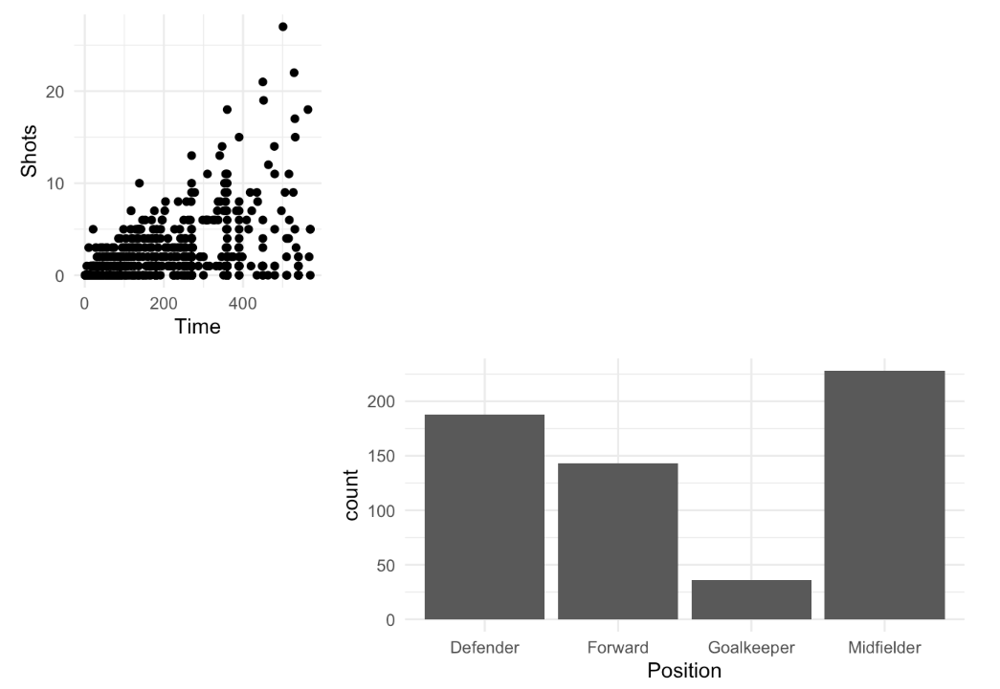

添加表格：

`gridExtra` 包中的 `tableGrob` 函数用于创建表格图形对象（grobs），便于将表格数据添加到网格图形中。这使得用户可以将表格与图形组合在一起，实现更丰富的可视化效果。

更多细节：ftp://cran.r-project.org/pub/R/web/packages/gridExtra/vignettes/tableGrob.html

**示例应用**：

- 创建一个表格，显示2010年世界杯排名前四的球队中球员的平均时间和射门次数。

- 使用 `tableGrob` 创建表格图形对象，然后将其添加到使用网格图形创建的更大绘图中。

```r
# 表格
worldcup_table <- worldcup %>%
  filter(Team %in% c("Germany", "Spain", "Netherlands", "Uruguay")) %>%
  group_by(Team) %>%
  dplyr::summarize(`Average time` = round(mean(Time), 1),
                   `Average shots` = round(mean(Shots), 1))
worldcup_table
# tableGrob()
worldcup_table <- worldcup_table %>%
  tableGrob()
worldcup_table

grid.draw(ggplotGrob(time_vs_shots))

wc_table_vp <- viewport(x = 0.22, y = 0.85, just = c("left", "top"), height = 0.1, width = 0.2)
pushViewport(wc_table_vp)
grid.draw(worldcup_table)
popViewport()
```

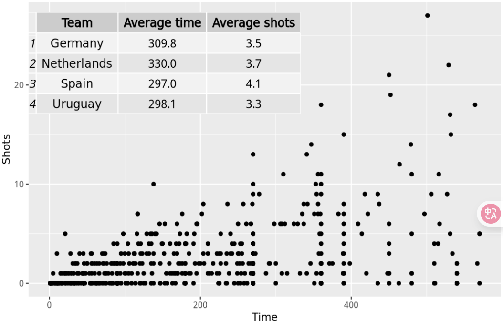

## 更多grid graphics

网格图形（grid graphics）提供了一个广泛的图形系统，它几乎可以让你在R中创建出你能想象到的任何图形。在本节中，我们只是触及了网格图形系统的表面，因此如果你经常需要创建非常定制化、不寻常的图形，你可能需要更深入地研究网格图形。

最全面的是由网格图形的创建者Paul Murrell撰写的《R Graphics》一书：我有电子版（我的纸质版有两本，已经翻出来放床头边上了，电脑旁边也放了一本），加微信可发 Biotree123。强烈推荐！！！！！！！！

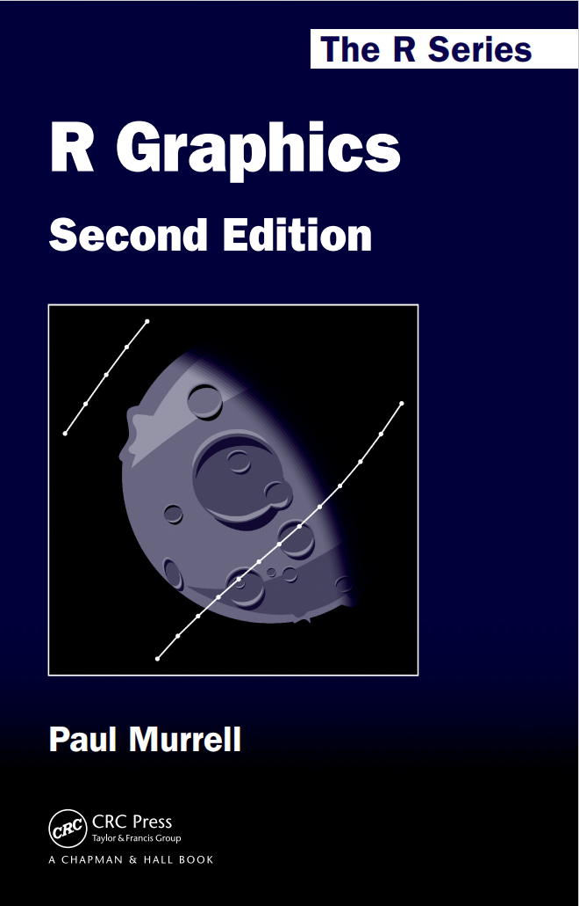

网格图形包附录的PDF链接可在以下网址找到：https://stat.ethz.ch/R-manual/R-devel/library/grid/doc/index.html

`gridExtra`包附录的PDF链接可在该包的CRAN页面上找到：https://cran.r-project.org/web/packages/gridExtra/index.html

本次分享到这~


#### 文末友情宣传

强烈建议你推荐给身边的**博士后以及年轻生物学PI**，多一点数据认知，让他们的科研上一个台阶：

- [生信入门&数据挖掘线上直播课5月班](https://mp.weixin.qq.com/s?__biz=MzAxMDkxODM1Ng%3D%3D&mid=2247541231&idx=1&sn=6704a3ae8233d19ca94fd4929b5e1f63#wechat_redirect)，你的生物信息学入门课

- [时隔5年，我们的生信技能树VIP学徒继续招生啦](https://mp.weixin.qq.com/s?__biz=MzAxMDkxODM1Ng%3D%3D&mid=2247525079&idx=1&sn=0b997af16a58195b4192691373048fd5#wechat_redirect)

- [满足你生信分析计算需求的低价解决方案](https://mp.weixin.qq.com/s?__biz=MzUzMTEwODk0Ng%3D%3D&mid=2247530048&idx=1&sn=28aa7bbd5e00521f79e074496a5f5d66#wechat_redirect)

- [生信故事会](https://mp.weixin.qq.com/mp/appmsgalbum?__biz=MzAxMDkxODM1Ng%3D%3D&action=getalbum&album_id=1679199708449144836#wechat_redirect)，来看看他们的生信入门故事

- [生信马拉松答疑专辑](https://mp.weixin.qq.com/mp/appmsgalbum?__biz=MzAxMDkxODM1Ng%3D%3D&action=getalbum&album_id=3690970204957147140#wechat_redirect)，获取你的生信专属答疑

- **[马拉松授课互动答疑](https://mp.weixin.qq.com/mp/appmsgalbum?__biz=MzAxMDkxODM1Ng%3D%3D&action=getalbum&album_id=3398473750701146113#wechat_redirect)，里面包含了我们整理的每一期超详细的答疑**

<!-- wechat-article-fetcher: complete -->
