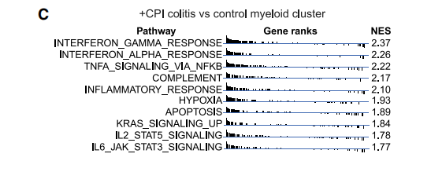
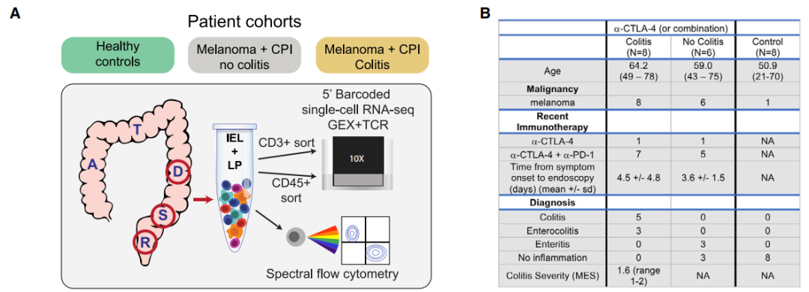
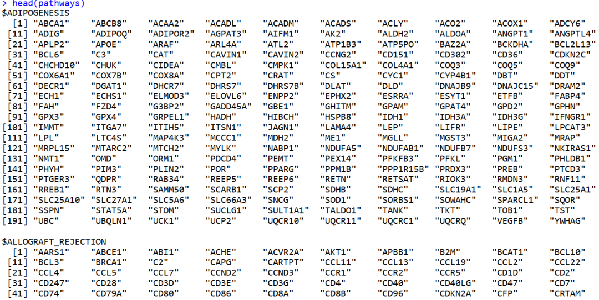
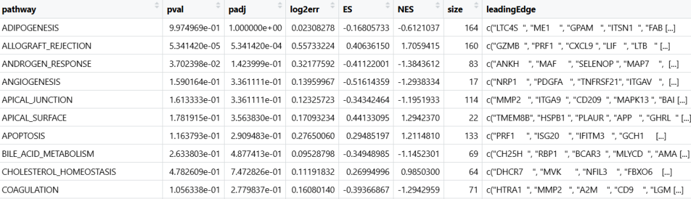
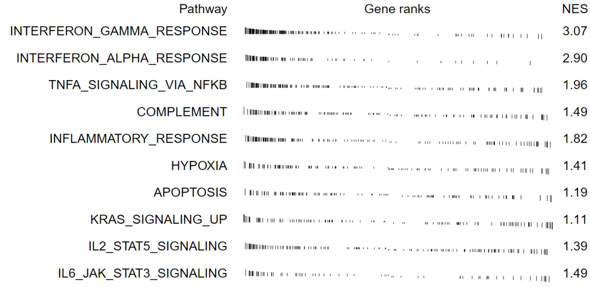
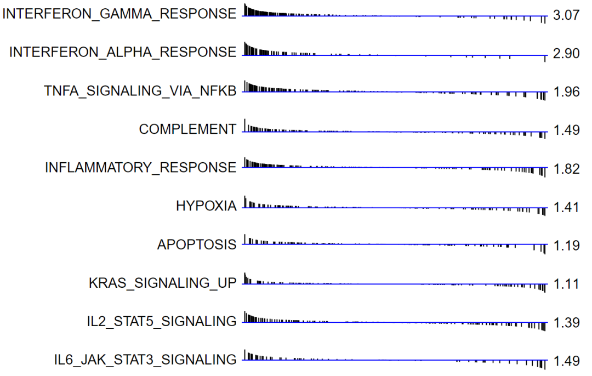

# Cell杂志同款：多条GSEA结果基因rank排序图

- 专辑：绘图小技巧2025
- 公众号：生信技能树
- 发布时间：2025-05-05 23:45
- 原文：[微信公众平台](https://mp.weixin.qq.com/s?__biz=MzAxMDkxODM1Ng%3D%3D&mid=2247542120&idx=1&sn=665be506fec6d3529c73d99a89163626&chksm=9b4b65d3ac3cecc589f463f8c06c11ddd3e1e4bcf9ab8f3f2a0bbb86ca456273f83397dc0d71)

---
GSEA多条通路结果展示图我们前面分享过一个漂亮的气泡图：[Science杂志高颜值GSEA打分排序图](https://mp.weixin.qq.com/s?__biz=MzAxMDkxODM1Ng==&mid=2247537935&idx=1&sn=494eae3c7b11b4afca650ab1f82d1350&scene=21#wechat_redirect)

今天学习的GSEA多条通路结果是另外一种展示方法，图来自文献：《Molecular Pathways of Colon Inflammation Induced by Cancer Immunotherapy》，于 2020年8月份发表在顶刊Cell上。图的含义：

图 6 的 (C) 部分通过功能富集分析，比较了 +CPI 结肠炎患者和健康对照患者的髓系细胞中的基因表达差异。分析结果显示了哪些基因集在炎症状态下显著富集，NES 值用于量化这些基因集的富集程度。

结果分析显示：在 +CPI 结肠炎患者中，髓系细胞与 IFNγ（干扰素γ）反应和 TNFα（肿瘤坏死因子α）信号传导相关的基因集相对于对照患者呈现出上调（图 6C）：



图注：图中为所有的CD45+ 免疫细胞

> Figure 6. Inflammatory Gene Expression Signatures in Myeloid Cells
>
> (C) Functional enrichment analysis of significant hallmark gene sets comparing myeloid cells from +CPI colitis patients with healthy control patients. NES, normalized enrichment score.

## 数据背景：三个分组

+CPI colitis全称：Check point inhibitor-induced colitis

**(1) +CPI colitis**：经免疫检查点抑制剂（CPI）治疗且经组织学确诊为结肠炎的黑色素瘤患者（n = 8，+CPI结肠炎）；

**(2) Normal control**：接受筛查性肠镜检查的健康成年人，其年龄与上述患者相近（n = 8，对照组）；

**(3) +CPI no colitis**：经免疫检查点抑制剂（CPI）治疗的黑色素瘤患者，这些患者因疑似+CPI结肠炎接受了内镜检查，但内镜和组织学检查均显示其结肠黏膜正常（n = 6，+CPI无结肠炎）（图1B）

这个研究设计能够区分由药物暴露引起的分子变化与实际的疾病过程。除每组中有1例患者接受抗CTLA-4单药治疗外，所有接受CPI治疗的患者最近都接受了CTLA-4和PD-1抗体的治疗。

作者通过荧光激活细胞分选（FACS）技术，依次分离出活的**CD45⁺单个核细胞**以及**CD3⁺T细胞**，并使用10X Genomics 5‘端技术进行单细胞RNA测序（scRNA-seq）。



## 数据可下载：

GEO: GSE144469：https://www.ncbi.nlm.nih.gov/geo/query/acc.cgi?acc=GSE144469

> Samples from 22 patients from 3 different cohorts (Normal control, +CPI no colitis, +CPI colitis)

```r
GSE144469_RAW.tar
GSE144469_TCR_filtered_contig_annotations_all.csv.gz
```

GSE144469_RAW.tar：这个包中包括了 CD45+、CD3+细胞。此次我们使用图片中的 CD45+ 进行分析。

数据下载下来后，整理成如下格式：每个样本下面三个标准文件

```r
├── outputs
│   ├── C1-CD45
│   │   ├── barcodes.tsv.gz
│   │   ├── features.tsv.gz
│   │   └── matrix.mtx.gz
│   ├── C2-CD45
│   │   ├── barcodes.tsv.gz
│   │   ├── features.tsv.gz
│   │   └── matrix.mtx.gz
│   ├── C3-CD45
│   │   ├── barcodes.tsv.gz
│   │   ├── features.tsv.gz
│   │   └── matrix.mtx.gz
...........................
```

在上一篇帖子中，我们已经做好了注释：[给你的单细胞umap图加个cell杂志同款的圈](https://mp.weixin.qq.com/s?__biz=MzAxMDkxODM1Ng==&mid=2247537290&idx=1&sn=ad76831349df67bb5236370dab088536&scene=21#wechat_redirect)

可以在这里下载：

通过网盘分享的文件：2020-GSE144469-81-3分组22人的40个10X样品

链接: https://pan.baidu.com/s/1IJDilr8UwQCxO2NIoeQTWg?pwd=ywgi 

## 组间差异分析

样本分组信息，提取其中的 +CPI colitis C1-C6， Normal control CT1-CT6：

```r
GSM4288848 +CPI colitis C1 sample CD45 RNA-seq
GSM4288849 +CPI colitis C2 sample CD45 RNA-seq
GSM4288850 +CPI colitis C3 sample CD45 RNA-seq
GSM4288851 +CPI colitis C4 sample CD45 RNA-seq
GSM4288852 +CPI colitis C5 sample CD45 RNA-seq
GSM4288853 +CPI colitis C6 sample CD45 RNA-seq
GSM4288854 +CPI no colitis NC1 sample CD45 RNA-seq
GSM4288855 +CPI no colitis NC2 sample CD45 RNA-seq
GSM4288856 +CPI no colitis NC3 sample CD45 RNA-seq
GSM4288857 +CPI no colitis NC4 sample CD45 RNA-seq
GSM4288858 +CPI no colitis NC6 sample CD45 RNA-seq
GSM4288859 Normal control CT1 sample CD45 RNA-seq
GSM4288860 Normal control CT2 sample CD45 RNA-seq
GSM4288861 Normal control CT3 sample CD45 RNA-seq
GSM4288862 Normal control CT4 sample CD45 RNA-seq
GSM4288863 Normal control CT6 sample CD45 RNA-seq
```

加载数据， 并进行差异分析：

```r
rm(list=ls())
library(Seurat)
library(tidyverse)
library(Seurat)
library(data.table)
library(qs)
library(ggplot2)

## Seurat对象
sce.all.filt <- readRDS("sce.all.filt.rds")
sce.all.filt
table(Idents(sce.all.filt))
head(sce.all.filt@meta.data)
# 提取髓系细胞
sce_sub <- subset(sce.all.filt, celltype=="Myeloid cells")
sce_sub

########################################
# 髓系细胞组间差异：+CPI colitis vs control myeloid cluster
table(sce_sub$orig.ident)
sce_sub$group <- gsub("\\d-CD45","",sce_sub$orig.ident)
table(sce_sub$group)
Idents(sce_sub) <- "group"

sub_markers <- FindMarkers(sce_sub, ident.1 = "C", ident.2 = "NC")
dim(sub_markers)
head(sub_markers)

# 拿到排序指标
ranks <- sub_markers$avg_log2FC
names(ranks) <- rownames(sub_markers)
ranks <- sort(ranks, decreasing = T)
head(ranks)
# TCL1A IGKV1-27     DRD4   ZBTB16 IGHV1-58     KRT5
# 8.838587 6.969963 5.312110 5.030059 4.941003 4.929564
```

## 获取基因集

从msigdb数据库下载 the hallmark gene sets：https://www.gsea-msigdb.org/gsea/msigdb/index.jsp

读取：

```r
############################### 通路
pathways <- gmtPathways("h.all.v2024.1.Hs.symbols.gmt")
str(head(pathways))
names(pathways) <- gsub("HALLMARK_","", names(pathways))
head(pathways)
```



## 运行fgsea

```r
############################### fgsea
library(data.table)
library(fgsea)
library(ggplot2)

# 运行fgsea
fgseaRes <- fgsea(pathways=pathways, stats=ranks, minSize=1,  maxSize = 10000)
head(fgseaRes)
```

结果如下：



## 绘图

可以直接使用 fgsea软件的包进行绘制：

```r
## 绘图
# 图片中的通路
path_select <- c("INTERFERON_GAMMA_RESPONSE", "INTERFERON_ALPHA_RESPONSE", "TNFA_SIGNALING_VIA_NFKB",
              "COMPLEMENT", "INFLAMMATORY_RESPONSE", "HYPOXIA", "APOPTOSIS",
              "KRAS_SIGNALING_UP", "IL2_STAT5_SIGNALING", "IL6_JAK_STAT3_SIGNALING")

p <- plotGseaTable(pathways[path_select], ranks, fgseaRes, gseaParam=0.5,
                   colwidths=c(5, 6, 0.8, 0, 0),
                   headerLabelStyle = list(size=12, color="black") )
p
ggsave(filename = "fgsea.pdf",width = 8,height = 4.2,plot = p,bg="white")
```

结果如下，与原图相比，少一根蓝色的线条：



### 用ggplot2绘图

每个通路单独绘制，然后拼在一起：

```r
p_merge <- list()
for(i in path_select) {
# i <- "INTERFERON_GAMMA_RESPONSE"
print(i)
# 创建数据框
  temp <- pathways[i]
  temp <- intersect(temp[[1]],names(ranks))
  df <- data.frame(x=match(temp,names(ranks)), y=ranks[temp])
  df

## 绘制图形
# x：线段的起始 x 坐标。
# xend：线段的结束 x 坐标。
# y：线段的起始 y 坐标。
# yend：线段的结束 y 坐标。

  label = sprintf("%.2f",fgseaRes[fgseaRes$pathway==i,"NES"])

  p_merge[[i]] <- ggplot(df, aes(x = x,y=y)) +
    geom_segment(aes(x = x, xend = x, y = 0, yend = y), color = "black") +
    geom_hline(yintercept = 0,color="blue") +
    scale_x_continuous(expand = c(0.01,0)) +
    scale_y_continuous(sec.axis = sec_axis(trans = ~.*5, name = label)) + # 第二个y轴
    labs(title = "", x = "", y = i) +
    theme_bw() +
    theme( panel.border = element_blank(),  # 去掉图形内部的边框
      plot.background = element_blank(),  # 去掉整个图形的背景边框
      panel.grid.major = element_blank(),  # 去掉主网格线
      panel.grid.minor = element_blank(),  # 去掉次网格线
      axis.text = element_blank(),
      axis.ticks = element_blank(),  # 去掉 y 轴刻度线
      plot.margin = unit(c(0,0,0.5,0), "npc"),
      panel.spacing = unit(c(0,0,0,0), "npc"),
      axis.title.y  = element_text(angle = 0, vjust = 0.5,hjust =1 ,size = 15),     # 旋转 y 轴标签
      axis.title.y.right = element_text(angle = 0, vjust = 0.4,hjust =0,size = 15) # 右侧坐标轴注释的名称
    )
}

p <-  wrap_plots(p_merge, ncol = 1, axes="collect") &
  theme(plot.margin = unit(c(0, 0.3, 0, 0.1), "cm"))  # 设置整个图形的边距
ggsave(filename = "ranks.pdf",width =9,height = 6,plot = p,bg="white")
```

结果如下：



#### 学会了吗？


#### 文末友情宣传

强烈建议你推荐给身边的**博士后以及年轻生物学PI**，多一点数据认知，让他们的科研上一个台阶：

- [生信入门&数据挖掘线上直播课5月班](https://mp.weixin.qq.com/s?__biz=MzAxMDkxODM1Ng==&mid=2247541231&idx=1&sn=6704a3ae8233d19ca94fd4929b5e1f63&scene=21#wechat_redirect)，你的生物信息学入门课

- [时隔5年，我们的生信技能树VIP学徒继续招生啦](https://mp.weixin.qq.com/s?__biz=MzAxMDkxODM1Ng==&mid=2247525079&idx=1&sn=0b997af16a58195b4192691373048fd5&scene=21#wechat_redirect)

- [满足你生信分析计算需求的低价解决方案](https://mp.weixin.qq.com/s?__biz=MzUzMTEwODk0Ng==&mid=2247530048&idx=1&sn=28aa7bbd5e00521f79e074496a5f5d66&scene=21#wechat_redirect)

####

<!-- wechat-article-fetcher: complete -->
