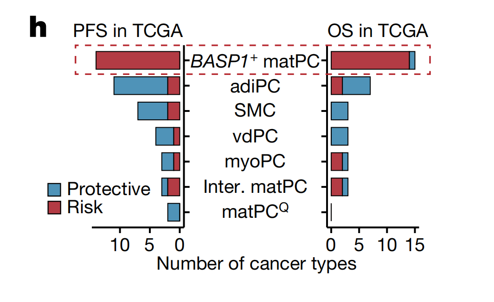
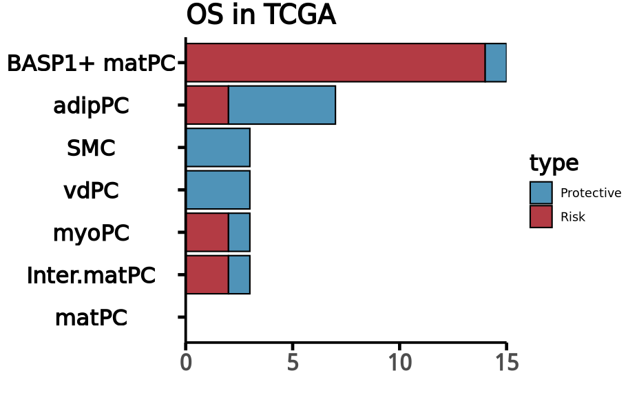
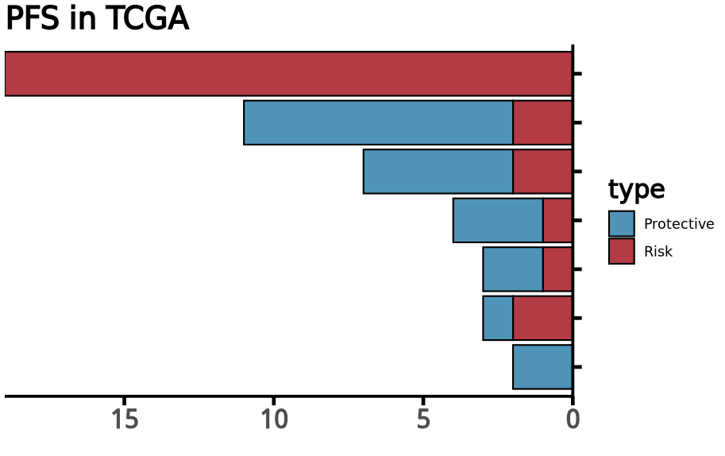
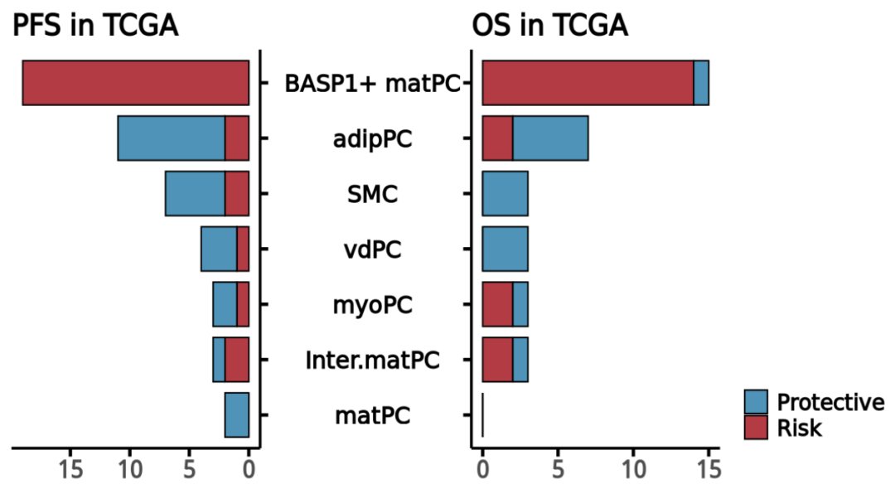

# Nature杂志：独特的背靠背双向间隔条形图

- 专辑：绘图小技巧2025
- 公众号：生信技能树
- 发布时间：2025-04-29 23:19
- 原文：[微信公众平台](https://mp.weixin.qq.com/s?__biz=MzAxMDkxODM1Ng%3D%3D&mid=2247541907&idx=1&sn=ab0a814a33465f1aece748df47415bc6&chksm=9b4b6428ac3ced3e4aaae1cc2f3111352b5e7eec68f57861435a3b1fe86ffd154542861f3eb5)

---
前面我们分享过两个双向条形图的应用，见：

- [突出你的新发现：高亮富集结果中的关键通路绘制](https://mp.weixin.qq.com/s?__biz=MzAxMDkxODM1Ng==&mid=2247538234&idx=1&sn=f262f1933ebd7902c5a72d87249053d5&scene=21#wechat_redirect)

- [顶刊杂志Nat Med.(IF=58.7)同款GSVA打分结果可视化](https://mp.weixin.qq.com/s?__biz=MzAxMDkxODM1Ng==&mid=2247540344&idx=1&sn=747fd12b9392a30263f9b4dcca84fc28&scene=21#wechat_redirect)

但是今天学习的双向条形图，是背靠背，中间共享同一个Y轴的坐标轴标签！图来自的文献于2024年7月10号发表在Nature杂志，标题为《Tumour vasculature at single-cell resolution》。

> 图中描述了不同血管壁细胞（MCs）亚群在不同癌症类型中与患者的生存率（包括总生存期和无进展生存期）之间的相关性。具体来说，它统计了在TCGA数据库中，有多少种癌症类型显示出血管壁细胞与这些生存指标之间存在明显的相关性。这表明血管壁细胞可能在多种癌症的进展和患者预后中扮演重要角色。



图注：

> Fig. 4 \| Characterization of pan-tumour MCs. h, The number of cancer types in which MCs exhibited a clear correlation with overall survival and progression-free survival in the TCGA cohorts.

## 示例数据

我这里根据图片展示的结果构造了一个数据，在这里下载：链接: https://pan.baidu.com/s/1ohZhtShTJEbM6OV-WH46jQ?pwd=xfe3

```r
rm(list=ls())
library(ggplot2)
library(reshape2)

data <- read.csv("data.csv")
head(data)

## 宽变长
# id.vars：指定不需要被转换的列，这里是 "细胞类型"。
# variable.name：指定新生成的列名，用于存储原始列名，这里是 "指标"。
# value.name：指定新生成的列名，用于存储原始列的值，这里是 "值"。
df <- melt(data, id.vars = c("celltype","type"), variable.name = "time", value.name = "count")
head(df)

# celltype       type          time count
# 1 BASP1+ matPC       Risk PFS_cancerNum    19
# 2 BASP1+ matPC Protective PFS_cancerNum     0
# 3       adipPC       Risk PFS_cancerNum     2
# 4       adipPC Protective PFS_cancerNum     9
# 5          SMC       Risk PFS_cancerNum     2
# 6          SMC Protective PFS_cancerNum     5

# 转换为因子固定绘图顺序：
unique(df$celltype)
df$type <- factor(df$type, levels = c("Protective","Risk"))
df$celltype <- factor(df$celltype, levels = rev(c("BASP1+ matPC","adipPC","SMC","vdPC","myoPC","Inter.matPC","matPC")))
str(df)

# 抠出来文章中的配色
mycol <- c("Risk"="#b33b44", "Protective"="#4f93b8")
mycol
```

数据都准备好了，现在开始绘图！

## 绘图

这个图是左右两部分拼接而成，拆成下面三部分的过程。

### 1.先绘制右边：

```r
## 绘图
# 右侧堆积柱状图
df1 <- df[df$time=="OS_cancerNum", ]
p1 <- ggplot(df1, aes(x = count, y = celltype, fill = type)) +
  geom_bar(position = "stack", stat="identity", alpha = 1,color="black") +
  xlab("") +
  scale_fill_manual(values = mycol) + # 修改配色
  scale_x_continuous(expand = c(0,0)) + # 柱子贴坐标轴
  ggtitle("OS in TCGA") +
  theme_classic() +
  theme( # legend.position = "none", # 去掉图例
        title = element_text(face = "bold",size=16),
        axis.line = element_line(color = "black", linewidth = 0.9),  # 设置坐标轴线的颜色和粗细
        axis.title.y = element_blank(),,# 去掉y轴标题
        axis.text.x = element_text(face = "bold",size=16),   # x轴刻度标签加粗
        axis.text.y = element_text(face = "bold",size=16,hjust = 0.5,color="black"),   # y轴刻度标签加粗
        axis.ticks = element_line(color = "black", size = 1.1),  # 设置刻度线的颜色和粗细
        axis.ticks.length = unit(0.2, "cm")          # 设置刻度线长度
        )
p1
```

结果如下：



### 2.画左边

接着是左边，不需要y轴坐标标签，并且旋转坐标轴：

```r
# 左侧堆积柱状图
df2 <- df[df$time=="PFS_cancerNum", ]
p2 <- ggplot(df2, aes(x = count, y = celltype, fill = type)) +
  geom_bar(position = "stack", stat="identity", alpha = 1,color="black") +
  scale_y_discrete(position = "right") + # 将Y轴放到左侧
  scale_x_reverse(expand = c(0,0)) + # 数值也需要同时逆转
  xlab("") +
  scale_fill_manual(values = mycol) + # 修改配色
  ggtitle("PFS in TCGA") +
  theme_classic() +
  theme( # legend.position = "none", # 去掉图例
        title = element_text(face = "bold",size=16,hjust = 0),
        axis.line = element_line(color = "black", linewidth = 0.9),  # 设置坐标轴线的颜色和粗细
        axis.title.y = element_blank(),
        axis.text.x = element_text(face = "bold",size=16),   # x轴刻度标签加粗
        axis.text.y = element_blank(),   # 去掉y轴标签
        axis.ticks = element_line(color = "black", size = 1.1),  # 设置刻度线的颜色和粗细
        axis.ticks.length = unit(0.2, "cm")          # 设置刻度线长度
  )
p2
```

结果如下：



### 3.拼接

然后将两部分拼接在一起，并共用一个图例：

```r
## #拼图：
library(patchwork)
p <-  (p2 | p1) + plot_layout(guides = 'collect') &
  theme( legend.justification = c("right", "bottom"),
         legend.text = element_text(face = "bold",size=15),  # 图例标签加粗
         legend.title = element_blank() # 移除图例标题
         )
p
```

结果如下：



#### 每周一画，勤修苦练~

### 文末友情宣传

- **[生信入门&数据挖掘线上直播课5月班](https://mp.weixin.qq.com/s?__biz=MzAxMDkxODM1Ng==&mid=2247541231&idx=1&sn=6704a3ae8233d19ca94fd4929b5e1f63&scene=21#wechat_redirect)**

- **[时隔5年，我们的生信技能树VIP学徒继续招生啦](https://mp.weixin.qq.com/s?__biz=MzAxMDkxODM1Ng==&mid=2247525079&idx=1&sn=0b997af16a58195b4192691373048fd5&scene=21#wechat_redirect)**

- **[满足你生信分析计算需求的低价解决方案](https://mp.weixin.qq.com/s?__biz=MzAxMDkxODM1Ng==&mid=2247535760&idx=2&sn=1e02a2e982a046ecf6389231e6768d5b&scene=21#wechat_redirect)**

<!-- wechat-article-fetcher: complete -->
