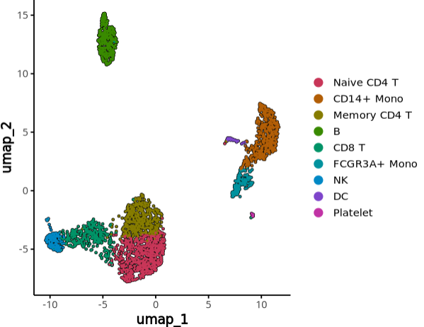
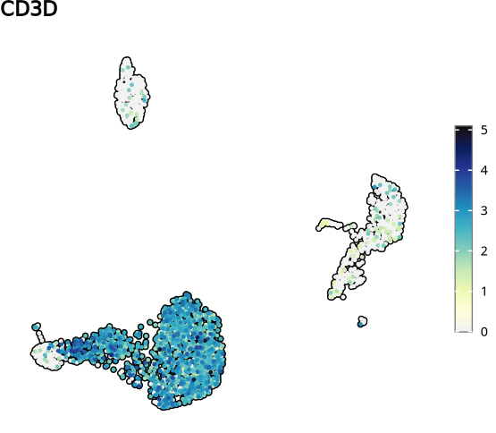
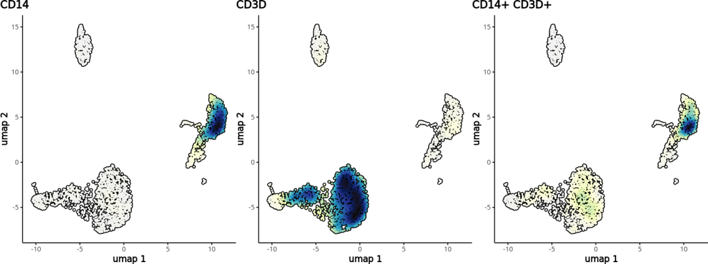
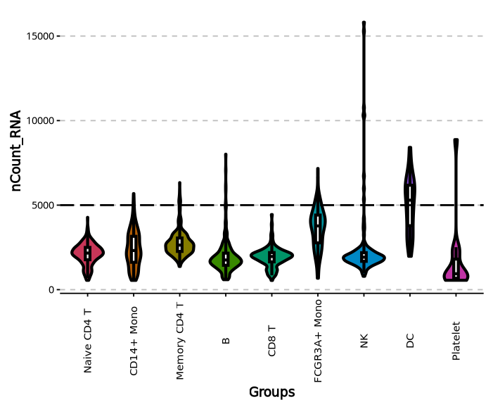
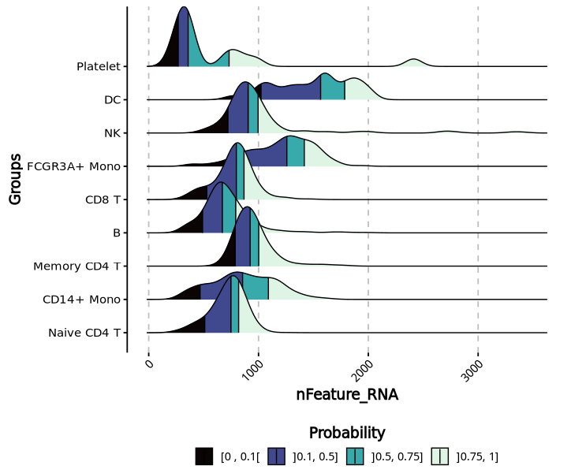
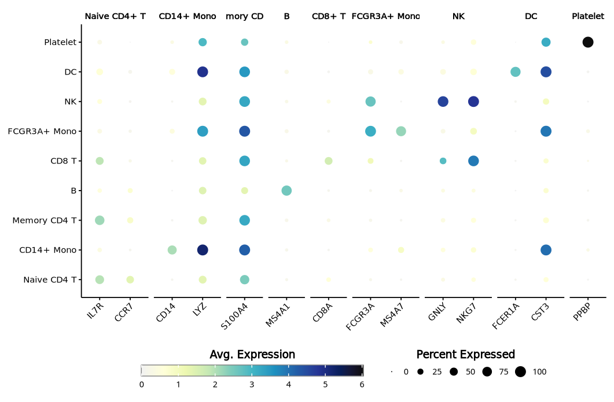
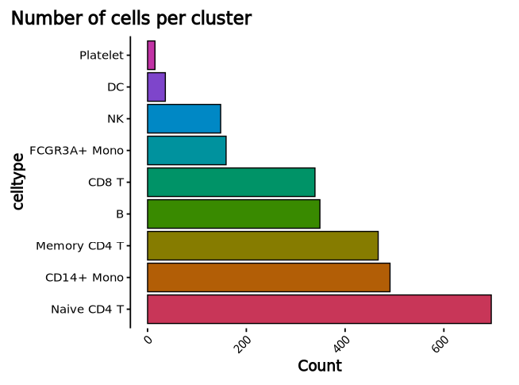
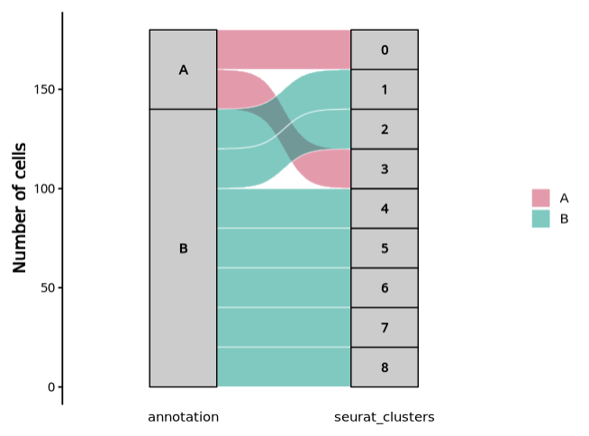
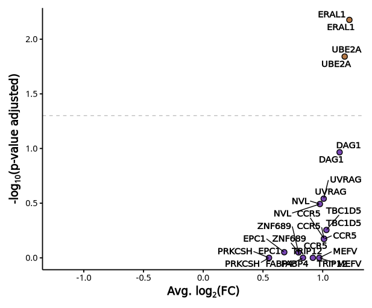

# SCpubr：一个单细胞数据绘图大全的R包

- 专辑：绘图小技巧2025
- 公众号：生信技能树
- 发布时间：2025-04-17 23:13
- 原文：[微信公众平台](https://mp.weixin.qq.com/s?__biz=MzAxMDkxODM1Ng%3D%3D&mid=2247541132&idx=1&sn=6970dc607e9b6b391fba8572f465b9c8&chksm=9b4b6137ac3ce821e21f6192613f6454cc674e862fa97c4e9319d7d8303817e8d5a3bb47ba59)

---
>
>
> 今天给大家介绍一个可以对单细胞数据绘制各种各样图片的R包：Scpubr！这个包宣称：以最小的努力生成尽可能的高质量的图表，这些图表可以直接用于或仅需进行最小修改即可用于研究文章。

学习网址：https://enblacar.github.io/SCpubr-book-v1/


## 0.安装

```r
## 使用西湖大学的 Bioconductor镜像
options(BioC_mirror="https://mirrors.westlake.edu.cn/bioconductor")
options("repos"=c(CRAN="https://mirrors.westlake.edu.cn/CRAN/"))
install.packages("SCpubr")

# 检测安装包是否都安装上了
library(SCpubr)
```

## 1.示例数据

这里就用经典的pbmc3k吧，下载地址：https://github.com/zhangj1115/example_data

```r
rm(list=ls())
library(Seurat)
library(SCpubr)

# 加载数据
load("pbmc3k.final.Rdata")
pbmc3k.final

# An object of class Seurat
# 13714 features across 2700 samples within 1 assay
# Active assay: RNA (13714 features, 2000 variable features)
# 3 layers present: counts, data, scale.data
# 3 dimensional reductions calculated: pca, umap, tsne
```

## 2.绘图

这个包有非常多的可视化方法，一一看下！

### 2.1 umap/tsne散点图

https://enblacar.github.io/SCpubr-book-v1/03-DimPlots.html

- plot.axes = TRUE：加不加坐标轴

- legend.nrow = 3：设置图例显示的行数

- label = TRUE：加不加细胞类型标签

- label.box = FALSE：细胞类型标签加不加方框

- legend.position = "none"：需不需要图例

- legend.position = "right"：图例的位置

```r
# 散点图
# SCpubr's DimPlot.
p2 <- do_DimPlot(sample = pbmc3k.final, plot.axes = TRUE,legend.ncol = 1,pt.size = 0.5,
                 label = F,label.box = FALSE,legend.position = "right")
p2
```

这个地方有非常多的参数可以调整，我尝试了一些参数，结果如下：



### 2.2 FeaturePlot

这个地方的图可以绘制连续值的任何特征如基因，metadata中的某列：

- plot.title = "CD3D"：添加标题

- legend.length = 12：调整图例的长和宽

- legend.width = 1：调整图例的长和宽

- legend.position = "right"：图例的位置

```r
# 特征图
# SCpubr's Feature Plot.
p2 <- do_FeaturePlot(sample = pbmc3k.final, features = "CD3D",plot.title = "CD3D",
                    legend.position = "right",order =T,legend.length = 12,
                    legend.width = 1)
p2
```

这里也是一些常规参数，我选了一些如下：



### 2.3 密度图

这个包还封装了 Nebulosa 包的功能，Nebulosa 我们之前介绍过：[5种方式美化你的单细胞umap散点图](https://mp.weixin.qq.com/s?__biz=MzAxMDkxODM1Ng==&mid=2247536822&idx=1&sn=5f695d4ee6d8ba00a0961c02c4cf83bd&scene=21#wechat_redirect)

绘制 一些marker基因 的核密度估计图：

```r
# 单个基因
p <- do_NebulosaPlot(sample =pbmc3k.final, features = "CD14",legend.position = "right")
p

# 两个基因
p <- do_NebulosaPlot(sample =pbmc3k.final, features = c("CD14","CD3D"),legend.position = "right")
p

# 两个基因共表达
p <- do_NebulosaPlot(sample =pbmc3k.final, features = c("CD14","CD3D"),joint = T,return_only_joint = F,plot.axes = T,
                     legend.position = "none")
p
```



### 2.4 小提琴图

- plot_boxplot = FALSE：不绘制象限图

- axis.text.x.angle = 90：坐标轴标签旋转

- y_cut = 25000：添加一条阈值线

- line_width = 2：小提琴框线的宽度

- boxplot_width = 0.1：箱线图的宽度

```r
p <- do_ViolinPlot(sample = pbmc3k.final, features = "nCount_RNA", y_cut = 5000,
                   plot_boxplot =T,axis.text.x.angle = 90,
                   line_width = 1.5,boxplot_width = 0.1,legend.position = "none")
p
```



### 2.5 山峦图

关于山峦图，我们介绍过两篇个性化定制：

- [Nat Commun同款山脊图：千里江山图](https://mp.weixin.qq.com/s?__biz=MzAxMDkxODM1Ng==&mid=2247540687&idx=1&sn=315b1f5757a97375a6425c3e751f7304&scene=21#wechat_redirect)

- [raincloud云雨图：一图囊括小提琴+箱线图+散点图](https://mp.weixin.qq.com/s?__biz=MzUzMTEwODk0Ng==&mid=2247532833&idx=1&sn=93306119fd1f259df1a1745b41389246&scene=21#wechat_redirect)

参数修改：

- continuous_scale = TRUE：颜色映射改为连续值

- viridis_direction = 1：设置颜色渐变的方向，由大到小对应的颜色

- compute_custom_quantiles = TRUE：绘制四分位数

- quantiles = c(0.1, 0.5, 0.75)：添加分位数具体的位置

```r
# Compute the most basic ridge plot.
DefaultAssay(pbmc3k.final)
p <- do_RidgePlot(sample = pbmc3k.final,feature = "nFeature_RNA",continuous_scale = T,sequential.direction = 1,
                  compute_quantiles = TRUE,compute_custom_quantiles = TRUE,
                  quantiles = c(0.1, 0.5, 0.75))
p
```

选了一个调整各个参数的结果：



### 2.5 气泡图

关于特征基因气泡图，我们前面也分享过啦：[顶刊Cell杂志单细胞特征基因气泡图](https://mp.weixin.qq.com/s?__biz=MzAxMDkxODM1Ng==&mid=2247540219&idx=1&sn=99fddc26ccbd5ffe6640c09d94e987dd&scene=21#wechat_redirect)

可以接受基因向量和基因list对象：

- dot_border = F：气泡图是否加边圈

```r
genes <- list("Naive CD4+ T" = c("IL7R", "CCR7"),
              "CD14+ Mono" = c("CD14", "LYZ"),
              "Memory CD4+" = c("S100A4"),
              "B" = c("MS4A1"),
              "CD8+ T" = c("CD8A"),
              "FCGR3A+ Mono" = c("FCGR3A", "MS4A7"),
              "NK" = c("GNLY", "NKG7"),
              "DC" = c("FCER1A", "CST3"),
              "Platelet" = c("PPBP"))

p <- do_DotPlot(sample =pbmc3k.final, features = genes,dot_border = F)
p
```



### 2.6 barplot

这里可以对细胞数做各种统计：

- flip = TRUE：坐标轴交换

```r
head(pbmc3k.final)
p2 <- do_BarPlot(sample = pbmc3k.final, position = "stack",
                         group.by = "celltype",
                         legend.position = "none",
                         plot.title = "Number of cells per cluster",
                         flip = T)
p2
```



### 2.7 冲击图

这个图可以展示不同层次注释之间的复杂关系：

```r
# Use viridis scales.
sample <- readRDS(system.file("extdata/seurat_dataset_example.rds", package = "SCpubr"))
sample
head(sample)
# Generate a more fine-grained clustering.
sample$annotation <- ifelse(sample$seurat_clusters %in% c("0", "3"), "A", "B")
table(sample$annotation, sample$seurat_clusters)
p <- do_AlluvialPlot(sample = sample, first_group = "annotation",last_group = "seurat_clusters",
                     fill.by = "annotation",stratum.fill = "grey80")
p
```



### 2.8 火山图

这个示例数据只有14个基因，将就看吧：

```r
# 火山图
# Modify number of gene tags.
# Retrieve DE genes.
de_genes <- readRDS(system.file("extdata/de_genes_example.rds", package = "SCpubr"))
head(de_genes)
de_genes

p <- do_VolcanoPlot(sample = sample,de_genes = de_genes,n_genes = 15)
p
```



### Note

这个包还有很多其他的有意思的图，快去看看吧~

此外，需要注意的是这个包的版本，教程中为v1.1.2，我这里安装后的版本如下，参数发生了一些变化：

```r
packageVersion("SCpubr")
[1] ‘2.0.2’
```

### **文末友情宣传**

- [生信入门&数据挖掘线上直播课4月班](https://mp.weixin.qq.com/s?__biz=MzAxMDkxODM1Ng==&mid=2247539788&idx=1&sn=62a09c7af6373658bf81c149eb0b4026&scene=21#wechat_redirect)

- [时隔5年，我们的生信技能树VIP学徒继续招生啦](http://mp.weixin.qq.com/s?__biz=MzAxMDkxODM1Ng==&mid=2247524148&idx=1&sn=7806da6feb41a36493c519c1cfc1d3ac&chksm=9b4bdf8fac3c569960369602f1ef26639cb366b250f233b2297d1f059471c0458335bfc0b829&scene=21#wechat_redirect)

- [满足你生信分析计算需求的低价解决方案](https://mp.weixin.qq.com/s?__biz=MzAxMDkxODM1Ng==&mid=2247535760&idx=2&sn=1e02a2e982a046ecf6389231e6768d5b&scene=21#wechat_redirect)

<!-- wechat-article-fetcher: complete -->
