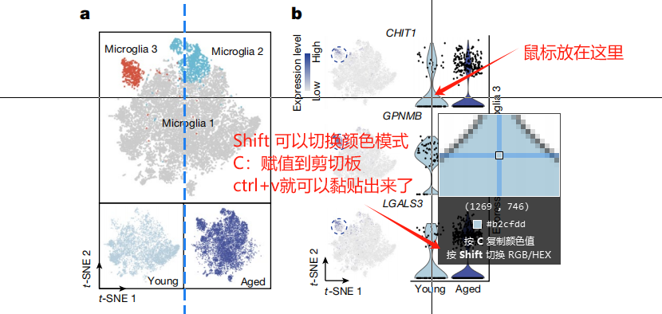
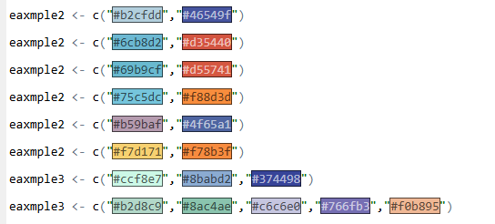
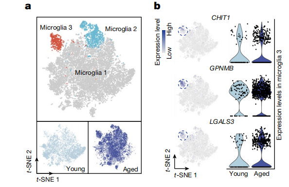
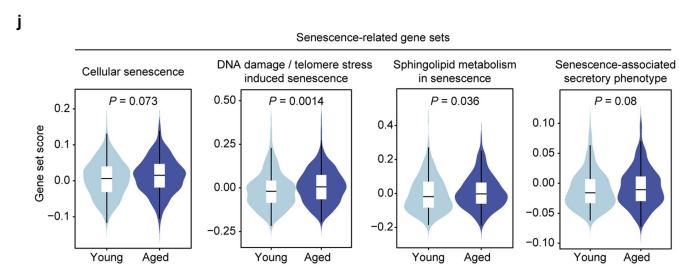
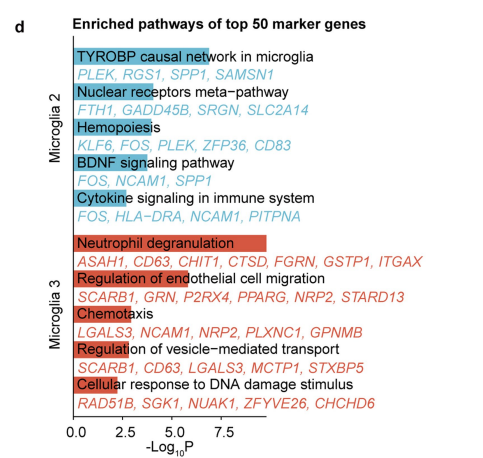
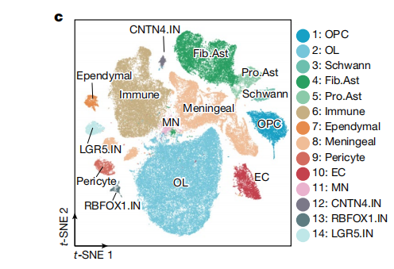
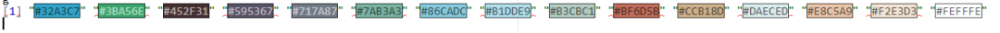
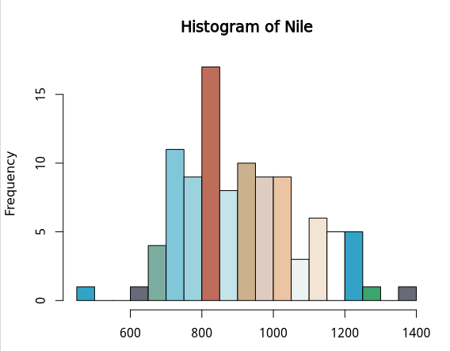
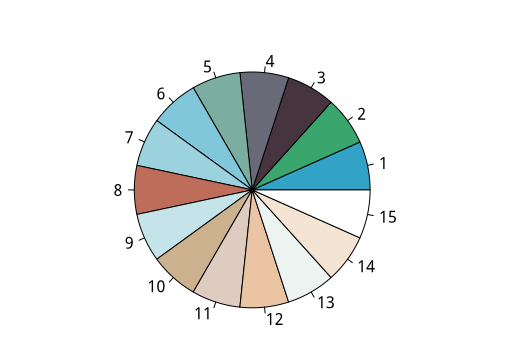

# 独家私藏秘技：如何获取高分文章中的图片配色？

- 专辑：绘图小技巧2025
- 公众号：生信技能树
- 发布时间：2025-04-14 20:39
- 原文：[微信公众平台](https://mp.weixin.qq.com/s?__biz=MzAxMDkxODM1Ng%3D%3D&mid=2247540968&idx=1&sn=e6d61914bf98a2e5044c5fc5429039b5&chksm=9b4b6053ac3ce945c16dc9f52946fd0861e1a04d777113086d17e84be85386a335bdf3021df0)

---
>
>
> 我们的[《绘图小技巧2025》](https://mp.weixin.qq.com/mp/appmsgalbum?__biz=MzAxMDkxODM1Ng%3D%3D&action=getalbum&album_id=3792985494804332545#wechat_redirect)已经给大家分享了很多期高颜值的图片了，这次给大家拿出私藏的小技巧，怎么快速获取你看到的心仪图片的配色~
>
> 绘图小专辑有个微信交流群，还想进群的小伙伴在这里找进入的方式：[绘图小技巧2025交流群](https://mp.weixin.qq.com/s?__biz=MzAxMDkxODM1Ng%3D%3D&mid=2247538699&idx=1&sn=871cb62f043fc30e1996066dc50430dd#wechat_redirect)

## 第一种：Snipaste软件快速获取

Snipaste软件是一款非常优秀的截图，粘贴工具，小巧灵活：https://zh.snipaste.com/

### 使用方法：

>
>
> step1.按F1截图后光标变成十字，会显示出来数字，格式如（233,52,66），是RGB颜色
>
> step2.按下shift就会变成十六进制颜色编码，格式如#FFFFFF，就可以用进R语言代码里

搞一个文章来练练：《CHIT1-positive microglia drive motor neuron ageing in the primate spinal cord》里面的配色都非常高级。

### 双色配图



使用方法

使用此方法，可以快速得到文章中颜色比较少的配图，这篇文章里面提取的配色代码版给到你：

```r
eaxmple2 <- c("#b2cfdd","#46549f")

eaxmple2 <- c("#6cb8d2","#d35440")

eaxmple2 <- c("#69b9cf","#d55741")

eaxmple2 <- c("#75c5dc","#f88d3d")

eaxmple2 <- c("#b59baf","#4f65a1")

eaxmple2 <- c("#f7d171","#f78b3f")

eaxmple3 <- c("#ccf8e7","#8babd2","#374498")

eaxmple3 <- c("#b2d8c9","#8ac4ae","#c6c6e0","#766fb3","#f0b895")
```



Rstudio中显示的结果

文章中的颜色应用：



eaxmple2



example-5



example-7

## 第二种：代码提取多个

上面的方法简洁便利，但是如果颜色比较多呢，比如十几个颜色，那么上面的方法就会取色取到手软。不用担心，这里给你第二私藏的独家技巧！

提取这个图片：



eaxmple-1

我之前写了一个传参脚本，鉴于很多人不会用传参脚本，还是用交互式的吧，运行代码：

```r
options(BioC_mirror="https://mirrors.westlake.edu.cn/bioconductor")
options("repos"=c(CRAN="https://mirrors.westlake.edu.cn/CRAN/"))

#BiocManager::install('EBImage')
#library(devtools)
#install_github("ramnathv/rblocks")
#install_github("woobe/rPlotter")
library(rPlotter)

# image (can be PNG, JPG, JPEG, TIFF)
pal_r <- extract_colours("eaxmple-1.png",num_col = 15)
pal_r

[1] "#32A3C7""#3BA56E""#46353F""#686A78""#7BAEA0""#81C7DA""#9BD2DE""#BF6D5B""#C4E4E9""#CBB18E""#DFCCC1""#EAC4A3""#EDF3F1""#F3E4D3""#FFFFFF"

pie(rep(1, 15), col = pal_r)
hist(Nile, breaks = 15, col = pal_r)
```







#### 就问你这是不是私藏的好方法！

### **文末友情宣传**

- [生信入门&数据挖掘线上直播课4月班](https://mp.weixin.qq.com/s?__biz=MzAxMDkxODM1Ng%3D%3D&mid=2247539788&idx=1&sn=62a09c7af6373658bf81c149eb0b4026#wechat_redirect)

- [时隔5年，我们的生信技能树VIP学徒继续招生啦](https://mp.weixin.qq.com/s?__biz=MzAxMDkxODM1Ng%3D%3D&mid=2247524148&idx=1&sn=7806da6feb41a36493c519c1cfc1d3ac&chksm=9b4bdf8fac3c569960369602f1ef26639cb366b250f233b2297d1f059471c0458335bfc0b829#wechat_redirect)

- [满足你生信分析计算需求的低价解决方案](https://mp.weixin.qq.com/s?__biz=MzAxMDkxODM1Ng%3D%3D&mid=2247535760&idx=2&sn=1e02a2e982a046ecf6389231e6768d5b#wechat_redirect)

<!-- wechat-article-fetcher: complete -->
