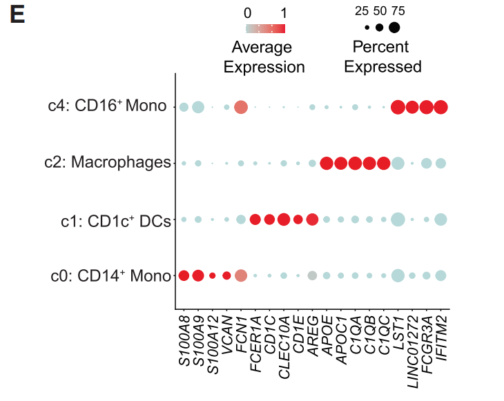
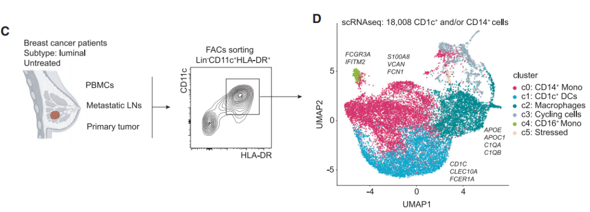
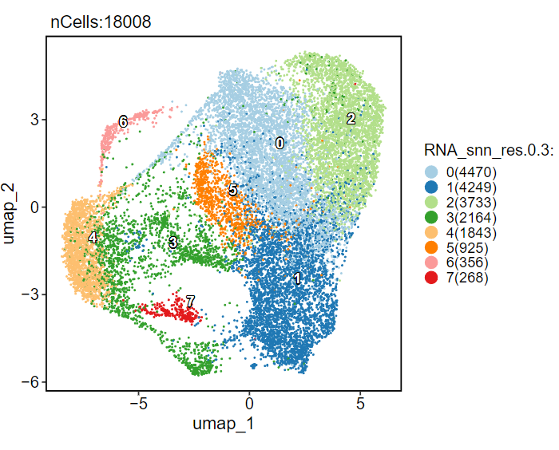
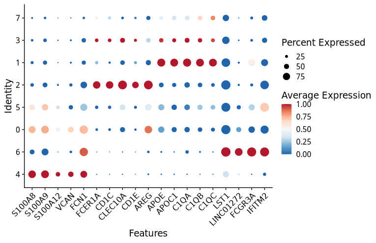
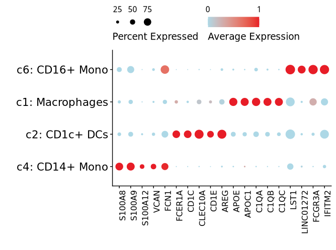

# 除了SPP1+Macro，还有其他亚型可分析吗？看看Cell杂志分析组织驻留FOLR2+巨噬细胞

- 专辑：绘图小技巧2025
- 公众号：生信技能树
- 发布时间：2025-03-27 17:08
- 原文：[微信公众平台](https://mp.weixin.qq.com/s?__biz=MzAxMDkxODM1Ng%3D%3D&mid=2247540219&idx=1&sn=99fddc26ccbd5ffe6640c09d94e987dd&chksm=9b4b1d40ac3c9456d96a9e188e85c89ae230768b3d00bf0281b48e1840997e2db52e1af31ff4)

---
>
>
> 今天来学习一篇2022年3月31号发表在顶刊Cell杂志上的文献，标题为《Tissue-resident FOLR2+ macrophages associate with CD8+ T cell infiltration in human breast cancer》，这篇文献中的图也都很好看，今天来看看单细胞数据分析中最常见的特征基因气泡图吧，以此来了解文献背景~

这个气泡图展示了一些常见的细胞marker基因在四个亚群中的表达模式特征，也是单细胞数据分析中常用的图：



## 数据背景

关于巨噬细胞的前世今生，可看：[巨噬细胞异质性及肿瘤微环境（上）](https://mp.weixin.qq.com/s?__biz=MzI1Njk4ODE0MQ==&mid=2247528626&idx=1&sn=b1d89df7815070fea7bda6bc98eead88&scene=21#wechat_redirect)，下篇在本周六发。

这篇文献作者需要研究了健康乳腺和乳腺癌原发肿瘤中的一个独立群体：`FOLR2+`组织驻留巨噬细胞，这群细胞的特点如下：

- `FOLR2+`巨噬细胞定位于肿瘤基质中的血管周围区域，在那里它们与`CD8+ T`细胞相互作用。

- `FOLR2+`噬巨细胞在体外有效地激活效应`CD8+ T`细胞。

- 肿瘤中`FOLR2+`巨噬细胞的密度与患者较好的生存率正相关。

这项研究强调了肿瘤相关巨噬细胞亚群的特定作用，并为基于巨噬细胞的癌症治疗中针对亚群的治疗干预铺平了道路。作者的样本收集如下，最后得到18008个髓系细胞，数据上传到了GEO数据库：https://www.ncbi.nlm.nih.gov/geo/query/acc.cgi?acc=GSE192935



## 了解一下CD1c+和/或CD14+细胞的关系

### CD1c+细胞

- **分类与特征**：`CD1c+`细胞通常指的是`CD1c`阳性的树突状细胞（DCs），属于髓系树突状细胞（mDCs）的一种。在人类血液中，`CD1c+ DCs`是最大的树突状细胞亚群。它们能够向CD4+和CD8+ T细胞呈递抗原。

- **亚群差异**：`CD1c+ DCs`可以进一步分为`CD14+`和`CD14−`两个亚群。`CD14+`亚群表达更高水平的单核细胞相关标志物，如CD64、CD115、CD163和S100A8/9。在功能上，`CD1c+CD14+`细胞在抗原呈递能力上较弱，但在细胞因子产生方面表现更强。例如，在LPS刺激下，`CD1c+CD14+`细胞倾向于产生更多TNF和IL-10，但诱导T细胞增殖的能力较弱。

- **临床意义**：在黑色素瘤患者中，`CD1c+CD14+`细胞的比例显著增加，并且这些细胞表现出抑制T细胞增殖和分化的特性。因此，在癌症疫苗研究中，有研究建议从`CD1c+ DCs`中去除`CD14+`亚群，以提高疫苗的免疫原性。

### CD14+细胞

- **分类与特征**：`CD14+`通常指的是`CD14`阳性的细胞，`CD14`是单核细胞和巨噬细胞的标志物。在树突状细胞中，`CD14`也可以作为某些特定亚群的标记，例如`CD1c+CD14+ DCs`。

- **功能与作用**：`CD14+`细胞（如单核细胞）在免疫系统中具有多种功能，包括吞噬作用、抗原呈递和细胞因子分泌。在树突状细胞中，`CD14+`亚群表现出与单核细胞相似的特征，例如在抗原呈递能力上相对较弱，但在细胞因子产生方面表现更强。

- **临床意义**：`CD14+`细胞在炎症和感染反应中发挥重要作用。此外，在某些疾病状态下，`CD14+`细胞的比例或功能可能会发生变化，例如在黑色素瘤患者中，`CD1c+CD14+ DCs`的比例增加，且表现出抑制T细胞反应的特性。

### CD1c+和/或CD14+细胞的关系

- **共表达与功能差异**：在树突状细胞中，`CD1c`和`CD14`可以共表达，形成`CD1c+CD14+`亚群。这些细胞在功能上与`CD1c+CD14−`亚群有显著差异，例如在抗原呈递和T细胞激活方面表现较弱，但在细胞因子产生方面表现更强。

- **临床应用**：在疫苗研究中，`CD1c+CD14+`细胞的存在可能会影响疫苗的免疫效果。因此，有研究建议在制备树突状细胞疫苗时去除`CD14+`亚群，以提高疫苗的免疫原性。

## 数据预处理

https://www.ncbi.nlm.nih.gov/geo/query/acc.cgi?acc=GSE192935，下载其中的`GSE192935_Raw_Counts_Human_SC_RNAseq_Fig1_and_2.csv.gz`

```r
GSE192935_Metadata_Human_SC_RNAseq_Fig1_and_2.csv.gz 392.1 Kb (ftp)(http) CSV
GSE192935_Metadata_SC_Mouse_Fcgr1pos_FigS3.csv.gz 94.0 Kb (ftp)(http) CSV
GSE192935_Metadata_SC_Mouse_TAMs_Fig3.csv.gz 49.8 Kb (ftp)(http) CSV
GSE192935_Raw_Counts_Bulk_Mouse_TAMs_Fig7.csv.gz 535.8 Kb (ftp)(http) CSV
GSE192935_Raw_Counts_Human_Bulk_RNAseq_Fig2.csv.gz 1.1 Mb (ftp)(http) CSV
GSE192935_Raw_Counts_Human_SC_RNAseq_Fig1_and_2.csv.gz 44.0 Mb (ftp)(http) CSV
GSE192935_Raw_Counts_SC_Mouse_Fcgr1pos_FigS3.csv.gz 21.3 Mb (ftp)(http) CSV
GSE192935_Raw_Counts_SC_Mouse_TAMs_Fig3.csv.gz 12.4 Mb (ftp)(http) CSV
```

读取一下：

```r
###
### Create: Jianming Zeng
### Date:  2023-12-31
### Email: jmzeng1314@163.com
### Blog: http://www.bio-info-trainee.com/
### Forum:  http://www.biotrainee.com/thread-1376-1-1.html
### CAFS/SUSTC/Eli Lilly/University of Macau
### Update Log: 2023-12-31   First version
### Update Log: 2024-12-09   by juan zhang (492482942@qq.com)
###

rm(list=ls())
library(dplyr)
library(Seurat)
library(clustree)
library(data.table)
library(ggplot2)
library(patchwork)
library(stringr)
library(Matrix)
getwd()

# 创建目录
gse <- "GSE192935"
dir.create(gse)
###### step1: 导入数据 ######
ct <- data.table::fread("GSE192935/GSE192935_Raw_Counts_Human_SC_RNAseq_Fig1_and_2.csv.gz",data.table = F)
ct[1:5, 1:5]
dim(ct)
rownames(ct) <- ct[,1]
ct <- ct[,-1]
ct[1:5, 1:5]
meta <- data.frame(Sample=str_split(colnames(ct),pattern = "_",n = 2,simplify = T)[,2])
rownames(meta) <- colnames(ct)
head(meta)
table(meta)

# 创建对象
sce.all <- CreateSeuratObject(counts = ct, meta.data = meta, min.cells = 3)
sce.all
# 查看特征
as.data.frame(sce.all@assays$RNA$counts[1:10, 1:2])
table(sce.all$orig.ident)
sce.all$orig.ident <- sce.all$Sample
head(sce.all@meta.data, 10)

library(qs)
qsave(sce.all, file="GSE192935/sce.all.qs")
```

细胞数正好是文章的数量，这里就不做细胞过滤了。

### Seurat的CCA整合

现在进行数据整合，来看看最新代码版本Seurat的CCA整合： https://satijalab.org/seurat/articles/integration_introduction

```r
rm(list=ls())
library(harmony)
library(qs)
library(Seurat)
library(clustree)
###### step3: Seurat CCA整合多个单细胞样品 ######
dir.create("2-CCA")
getwd()

# 读取数据
sce.all.filt <- qread("GSE192935/sce.all.qs")
# 默认 ScaleData 没有添加"nCount_RNA", "nFeature_RNA"
sce.all.filt
print(dim(sce.all.filt))
head(sce.all.filt@meta.data)

# split
sce.all.filt[["RNA"]] <- split(sce.all.filt[["RNA"]], f = sce.all.filt$orig.ident)
sce.all.filt

# 走标准流程
sce.all.filt <- NormalizeData(sce.all.filt, normalization.method = "LogNormalize",scale.factor = 1e4)
sce.all.filt <- FindVariableFeatures(sce.all.filt, nfeatures = 2000)
sce.all.filt <- ScaleData(sce.all.filt)
sce.all.filt <- RunPCA(sce.all.filt, features = VariableFeatures(object = sce.all.filt))

# 降维聚类，UMAP降维
sce.all.filt <- FindNeighbors(sce.all.filt, dims = 1:20)
sce.all.filt <- FindClusters(sce.all.filt, resolution = 0.5,cluster.name = "unintegrated_clusters")
head(Idents(sce.all.filt), 5)
head(sce.all.filt@meta.data)
table(sce.all.filt$seurat_clusters)

sce.all.filt <- RunUMAP(sce.all.filt,  dims = 1:20, reduction = "pca",reduction.name = "umap.unintegrated")
p <- DimPlot(sce.all.filt, label=T,reduction = "umap.unintegrated", group.by = c("orig.ident", "seurat_clusters"))
p
ggsave(filename='2-CCA/umap-by-orig.ident-before-cca.png',plot = p, width = 11,height = 5.5)


# 运行CCA
sce.all.filt <- IntegrateLayers(object = sce.all.filt,
                                method = CCAIntegration,
                                orig.reduction = "pca",
                                new.reduction = "integrated.cca",
                                verbose = FALSE)

# re-join layers after integration
sce.all.filt[["RNA"]] <- JoinLayers(sce.all.filt[["RNA"]])
sce.all.filt <- FindNeighbors(sce.all.filt, reduction = "integrated.cca", dims = 1:20)
sce.all.filt <- FindClusters(sce.all.filt, resolution = 0.5)
sce.all.filt <- RunUMAP(sce.all.filt, dims = 1:20, reduction = "integrated.cca") # UMAP & TSNE 降维
# Visualization
p <- DimPlot(sce.all.filt, reduction = "umap", group.by = c("orig.ident", "seurat_clusters"))
p
ggsave(filename='2-CCA/umap-by-orig.ident-after-cca.png',plot = p, width = 11,height = 5.5)

# 聚类
# 设置不同的分辨率，观察分群效果(选择哪一个？)
for (res in c(0.01, 0.05, 0.1, 0.2, 0.3, 0.5,0.8,1,1.2,1.5)) {
# graph.name = "CCA_snn",
# sce.all.filt <- FindClusters(sce.all.filt, resolution = res, algorithm = 1)
  sce.all.filt <- FindClusters(sce.all.filt, resolution = res)
}
# save
p_tree <- clustree(sce.all.filt@meta.data, prefix = "RNA_snn_res.")
ggsave(plot=p_tree, filename="2-CCA/Tree_diff_resolution.pdf", width = 7, height = 10)

p <- DimPlot(sce.all.filt, reduction = "umap", group.by = "RNA_snn_res.0.3",label = T) +
  ggtitle("louvain_0.3")
ggsave(plot=p, filename="2-CCA/Dimplot_resolution_0.3.pdf",width = 6, height = 6)

table(sce.all.filt@active.ident)
library(qs)
qsave(sce.all.filt, file="2-CCA/sce.all_int.qs")
```

聚类结果如下：



## 细胞注释

根据文章中的气泡图中的基因，看一下：

```r
# 文献中的基因
genes <- c("S100A8", "S100A9", "S100A12", "VCAN", "FCN1", "FCER1A", "CD1C", "CLEC10A",
           "CD1E", "AREG", "APOE", "APOC1", "C1QA", "C1QB", "C1QC", "LST1", "LINC01272", "FCGR3A", "IFITM2")

DotPlot(sce.all.int, features = genes,cols = "RdBu",col.min = 0, col.max = 1,cluster.idents = T,scale = T) +
  RotatedAxis()  # 旋转坐标轴
```

根据这个图，我们可以看到这里个亚群跟文献中的一致：cluster1,2,4,6



## 绘制气泡图

挑选出cluster1,2,4,6，并绘制美化版本的气泡图：

```r
sce.sub <- subset(sce.all.int, idents = c(1,2,4,6) )
# 简单注释一下
levels(sce.sub)

new.cluster.ids <- c("c1: Macrophages", "c2: CD1c+ DCs", "c4: CD14+ Mono", "c6: CD16+ Mono")
names(new.cluster.ids) <- levels(sce.sub)
sce.sub <- RenameIdents(sce.sub, new.cluster.ids)
levels(sce.sub) <- c("c4: CD14+ Mono", "c2: CD1c+ DCs", "c1: Macrophages", "c6: CD16+ Mono")

p <- DotPlot(sce.sub, features = genes,cols = c("lightblue","#e71d27"), col.min = 0,col.max = 1,cluster.idents = F,scale = T) +
  scale_color_gradientn(colors = c("lightblue","#e71d27"), values = scales::rescale(c(0, 1)),
                        breaks = c(0,  1), labels = c(0, 1))  +
  xlab(label = "") +
  ylab(label = "") +
  theme(axis.text.x = element_text(angle = 90, hjust = 1),  # 旋转x轴标签90度
        axis.text.y = element_text(size = 16),
        legend.position = "top",
        legend.text.position = "top",
        legend.title.position = "bottom")
p
```

结果如下：



#### 学废了吗~

#### 更多关于 Tissue-resident FOLR2+ macrophages 的分析，可以看看这篇Cell~

### **文末友情宣传**

- [生信入门&数据挖掘线上直播课4月班](https://mp.weixin.qq.com/s?__biz=MzAxMDkxODM1Ng==&mid=2247539788&idx=1&sn=62a09c7af6373658bf81c149eb0b4026&scene=21#wechat_redirect)

- [时隔5年，我们的生信技能树VIP学徒继续招生啦](http://mp.weixin.qq.com/s?__biz=MzAxMDkxODM1Ng==&mid=2247524148&idx=1&sn=7806da6feb41a36493c519c1cfc1d3ac&chksm=9b4bdf8fac3c569960369602f1ef26639cb366b250f233b2297d1f059471c0458335bfc0b829&scene=21#wechat_redirect)

- [满足你生信分析计算需求的低价解决方案](https://mp.weixin.qq.com/s?__biz=MzAxMDkxODM1Ng==&mid=2247535760&idx=2&sn=1e02a2e982a046ecf6389231e6768d5b&scene=21#wechat_redirect)

<!-- wechat-article-fetcher: complete -->
