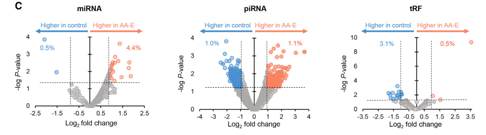
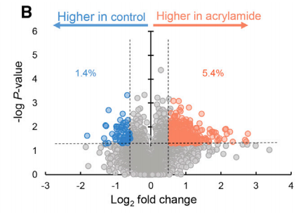
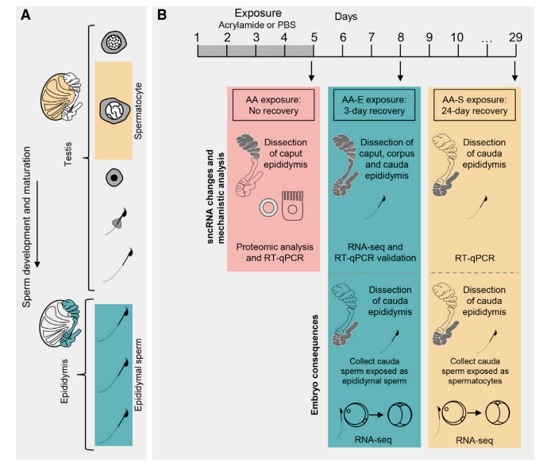
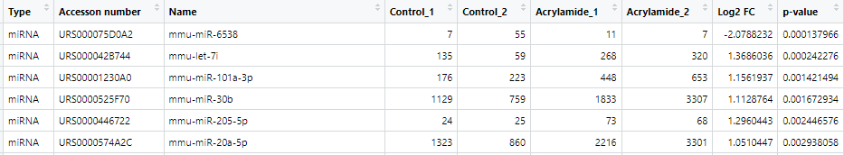
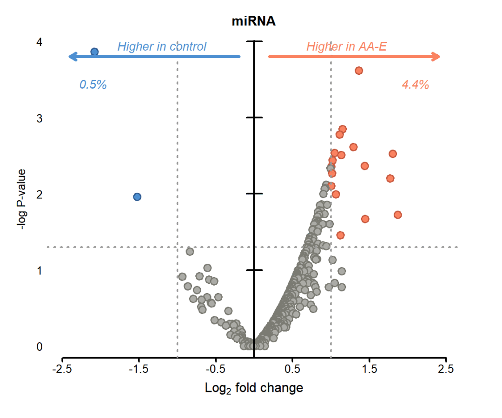
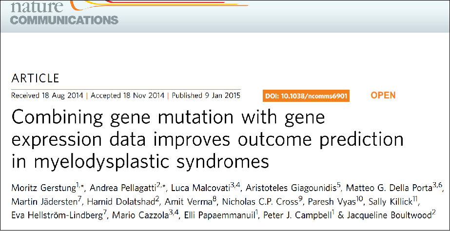

# 基础绘图函数绘制高颜值火山图

- 专辑：绘图小技巧2025
- 公众号：生信技能树
- 发布时间：2025-03-25 23:59
- 原文：[微信公众平台](https://mp.weixin.qq.com/s?__biz=MzAxMDkxODM1Ng%3D%3D&mid=2247540112&idx=1&sn=f0875ae81923d38d86145991361ec551&chksm=9b4b1d2bac3c943dca21cfb50e7f4a06d9c14072f890b0f9515c4b02efe80e1137b014c4fbdb)

---
今天学习一篇文献中的火山图以及配色，这个火山图主要是使用基础函数进行绘制，ggplot2虽然很厉害，但是我们的基础函数也要学！

文章是2021 年10月发表在 Cell Reports杂志 ，标题为：《Acrylamide modulates the mouse epididymal proteome to drive alterations in the sperm small non-coding RNA profile and dysregulate embryo development》。

火山图如下，特点：

- **带有左右两个箭头，并且左右两边标有差异分子占比**：

- 火山图分别展示了 **差异miRNA、piRNA、tRF 以及 蛋白Protein**的分析结果：



蛋白 Protein 差异分析结果火山图：



## 数据介绍

父亲的环境压力暴露会引起精子中sncRNA表达的明显变化，这些变化对受精后有显著的影响。在这篇文献中，作者报告了精子sncRNA对生殖毒素丙烯酰胺 acrylamide 的急性敏感性。数据保存到了 GEO 数据库：https://www.ncbi.nlm.nih.gov/geo/query/acc.cgi?acc=GSE162527、质谱数据为  PXD022865, PXD022876（http://www.ebi.ac.uk/pride, 可下载质谱原始数据与搜库结果）。

实验设计如下：

对由三组不同精子（**对照组**、\*\*附睾丙烯酰胺暴露组 \*\*和 **精母细胞丙烯酰胺暴露组**）受精形成的2细胞胚胎的转录组进行检查，每组均进行了三次重复实验



## 数据预处理

首先去GEO将数据下载下来并解压，sncRNA差异分析结果见GEO的文件：`GSE162527_sperm_sncRNA_analysis.xlsx`



image-20241009122742705

读取进来，我们这里就绘制 差异 miRNA 火山图看看

```r
rm(list = ls())
library(tidyverse)
library(readxl)

# 读取差异分析结果
# sperm_sncRNA 差异分析结果
sncRNA <- read_excel(path = "data/GSE162527_sperm_sncRNA_analysis.xlsx", sheet = "Sheet1")
head(sncRNA)

## 提取 miRNA 差异结果
data_miRNA <- sncRNA %>%
  as.data.frame() %>%
  filter(Type=="miRNA")

colnames(data_miRNA)[8:9] <- c("Log2FC", "pvalue")

data_miRNA$regulated <- "Normal"
data_miRNA$regulated[data_miRNA$Log2FC > 1 & data_miRNA$pvalue < 0.05 ] <- "Up"
data_miRNA$regulated[data_miRNA$Log2FC < -1 & data_miRNA$pvalue < 0.05 ] <- "Down"
table(data_miRNA$regulated)

## 颜色设置：使用的微信截图获取的文章图片配色，当然也有一些包可以根据输入的图片提取其中的颜色
## 这里颜色比较少就用了微信截图获取，方便
# 设置点图的内圈填充色
data_miRNA$color <- ""
data_miRNA$color[data_miRNA$regulated=="Normal"] <- "#ABABA6"
data_miRNA$color[data_miRNA$regulated=="Up"] <- "#FA8260"
data_miRNA$color[data_miRNA$regulated=="Down"] <- "#4D8FD1"
table(data_miRNA$color)

# 设置点的边圈颜色，比内部填充色颜色深一些
data_miRNA$color1 <- ""
data_miRNA$color1[data_miRNA$regulated=="Normal"] <- "#7B7B73"
data_miRNA$color1[data_miRNA$regulated=="Up"] <- "#C85A40"
data_miRNA$color1[data_miRNA$regulated=="Down"] <- "#315E94"
```

## 使用基础函数绘图

基础函数修炼的好，可以入无境~

```r
## 基础函数绘图
png(filename = "miRNA_volvano.png", width = 1200, height = 1000, res = 160)
par(bty="n", mgp = c(1.5,.33,0), mar=c(4.5,3.5,3,3)+.1, las=1, tcl=-.3)

plot(data_miRNA$Log2FC, y=-log10(data_miRNA$pvalue), xlab="",
     ylab="-log P-value", col=data_miRNA$color1, pch=21, bg=data_miRNA$color,
     cex = 1.5, lwd = 2.2, yaxt = "n",xaxt = "n", xlim=c(-2.5,2.5))

axis(side = 2, at = seq(0, 4, by = 1),labels = 0:4, las = 1, lwd=0)
axis(side = 1, at = seq(-2.5, 2.5, by = 1), las = 1, lwd = 2.5)

# 添加x轴标题，使用下标表示log2
mtext( expression(paste(Log[2]," fold ","change")), cex = 1.2, col = "black",side = 1, line = 2)

abline(h = -log10(0.05), col = "grey60", lwd = 2.5, lty=3)
abline(v = -1, col = "grey60", lwd = 2.5, lty=3)
abline(v = 1, col = "grey60", lwd = 2.5, lty=3)
abline(v = 0, col = "black", lwd = 2.5, lty=1)

# 使用segments函数添加线段
segments(-0.1, 1, 0.1, 1, col = "black", lwd = 2.5)
segments(-0.1, 2, 0.1, 2, col = "black", lwd = 2.5)
segments(-0.1, 3, 0.1, 3, col = "black", lwd = 2.5)
segments(-0.1, 4, 0.1, 4, col = "black", lwd = 2.5)

# 添加向右的箭头
arrows(x0 = 0.2, y0 = 3.8, x1 = 2.4, y1 = 3.8, length = 0.1, col = "#FA8260", lwd=4.5)
arrows(x0 = -0.2, y0 = 3.8, x1 = -2.4, y1 = 3.8, length = 0.1, col = "#4D8FD1", lwd=4.5)

# 添加文本
text(1.2, 3.8, "Higher in AA-E", font=3, pos=3, adj = 1, col = "#FA8260", cex = 1.1)
text(-1.2, 3.8, "Higher in control", font=3, pos=3, adj = 1, col = "#4D8FD1", cex = 1.1)
# 百分比
text(2.1, 3.3, "4.4%", font=3, pos=3, adj = 1, col = "#FA8260", cex = 1.1)
text(-2.1, 3.3, "0.5%", font=3, pos=3, adj = 1, col = "#4D8FD1", cex = 1.1)

# 添加标题
title(main = "miRNA")

dev.off()
```

结果如下：



#### 本次绘图充分灵活使用的基础绘图函数，基础绘图相对于ggplot2绘图系统来说也有很多可取之地

#### 此外还有一个全是基础绘图的高分文章，并且给出了全部代码与图片：

https://www.ncbi.nlm.nih.gov/pmc/articles/PMC4338540/



每天一画，勤修苦练~

### 文末友情宣传

- [生信入门&数据挖掘线上直播课4月班](https://mp.weixin.qq.com/s?__biz=MzAxMDkxODM1Ng==&mid=2247539788&idx=1&sn=62a09c7af6373658bf81c149eb0b4026&scene=21#wechat_redirect)

- [时隔5年，我们的生信技能树VIP学徒继续招生啦](http://mp.weixin.qq.com/s?__biz=MzAxMDkxODM1Ng==&mid=2247524148&idx=1&sn=7806da6feb41a36493c519c1cfc1d3ac&chksm=9b4bdf8fac3c569960369602f1ef26639cb366b250f233b2297d1f059471c0458335bfc0b829&scene=21#wechat_redirect)

- [满足你生信分析计算需求的低价解决方案](https://mp.weixin.qq.com/s?__biz=MzAxMDkxODM1Ng==&mid=2247535760&idx=2&sn=1e02a2e982a046ecf6389231e6768d5b&scene=21#wechat_redirect)

<!-- wechat-article-fetcher: complete -->
