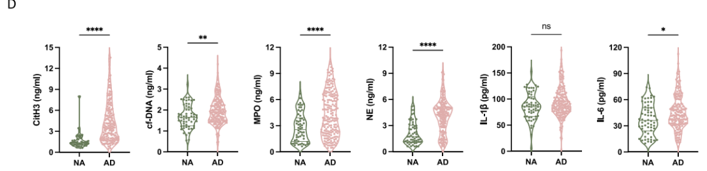
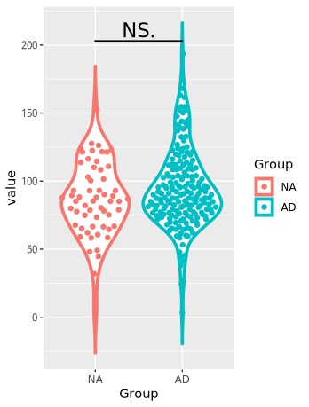
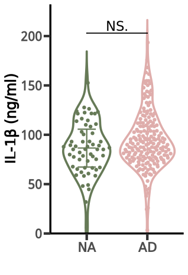
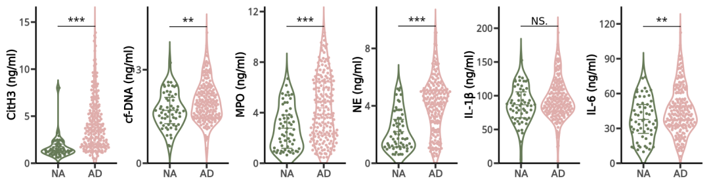

# NC杂志同款秀气小提琴图

- 专辑：绘图小技巧2025
- 公众号：生信技能树
- 发布时间：2025-03-24 15:58
- 原文：[微信公众平台](https://mp.weixin.qq.com/s?__biz=MzAxMDkxODM1Ng%3D%3D&mid=2247540058&idx=1&sn=6e8522a6adb58b1291ca9df7089bc133&chksm=9b4b1de1ac3c94f77d40a853e0791c54263b097e56c626e87884d055029c45f22493fad6813c)

---
>
>
> 今天来学习一篇于2024年12月30日发表在Nature Communications上的文献中的小提琴图绘制，标题为：《Integrated multi-omics profiling reveals neutrophil extracellular traps potentiate Aortic dissection progression》。

关于文章的背景，我们前面分析了三个文章：

- 单细胞数据注释：[突出你的新发现：高亮富集结果中的关键通路绘制](https://mp.weixin.qq.com/s?__biz=MzAxMDkxODM1Ng==&mid=2247538234&idx=1&sn=f262f1933ebd7902c5a72d87249053d5&scene=21#wechat_redirect)

- bulk RNA-Seq数据的处理：[使用Scissor算法鉴定与急性主动脉夹层相关的细胞亚群：波折的前奏](https://mp.weixin.qq.com/s?__biz=MzAxMDkxODM1Ng==&mid=2247538596&idx=1&sn=6685bb3d36e09eb947da1ac06abdcb4e&scene=21#wechat_redirect)

- [使用 Scissor算法鉴定与 急性主动脉夹层相关的细胞亚群：最终后续来了](https://mp.weixin.qq.com/s?__biz=MzAxMDkxODM1Ng==&mid=2247538683&idx=1&sn=39fbcb0ef0e26333b5cdd8fd13ab9fb6&scene=21#wechat_redirect)

小提琴在这里展示了：通过ELISA在阿尔茨海默病（AD）患者（n = 187）和健康个体（n = 59）的血浆中检测到的D型中性粒细胞外陷阱（D NETs）相关标记物在两组之间的差异，并标注了显著性。标记物有：CitH3、cfDNA、MPO、NE、IL-1β、IL-6

图的元素：

- 图中包含统计线（Q1-Q3）

- 用散点图展示原始数据分布，通过水平抖动（jitter）避免点重叠

- 外围还有一个小提琴的轮廓

- 顶部有显著性



>
>
> Fig. 3 \| Elevated NETosis occurs in aortic lesions and peripheral blood from patients with AD.

## 标记物含义

这些血浆检测指标与炎症、免疫反应以及细胞损伤等病理过程密切相关，以下是它们的详细解释：

#### CitH3（瓜氨酸化组蛋白H3）

>
>
> CitH3是组蛋白H3的一种修饰形式，其中精氨酸残基被瓜氨酸化。这种修饰通常与中性粒细胞外陷阱（NETs）的形成有关。NETs是由中性粒细胞释放的细胞外陷阱，用于捕捉和杀死病原体。CitH3是NETs的重要组成部分，其在血浆中的水平可以反映NETs的释放程度。
>
> CitH3水平升高通常与炎症性疾病（如败血症、自身免疫性疾病）和某些感染性疾病有关。在阿尔茨海默病（AD）中，其升高可能提示存在慢性炎症反应。

#### cf-DNA（细胞外游离DNA）

>
>
> cf-DNA是指在细胞外环境中存在的DNA片段，这些DNA片段可能来源于细胞凋亡、坏死或NETs的释放。cf-DNA可以作为炎症和组织损伤的标志物。它还可以激活免疫系统，促进炎症反应。

#### MPO（髓过氧化物酶）

>
>
> MPO是一种存在于中性粒细胞和单核细胞中的酶，参与氧化应激反应。MPO水平升高通常提示中性粒细胞的活化和炎症反应。

#### NE（中性粒细胞弹性蛋白酶）

>
>
> NE是一种丝氨酸蛋白酶，主要存在于中性粒细胞的颗粒中。NE能够分解多种蛋白质，包括弹性蛋白、胶原蛋白和细胞外基质成分，参与炎症反应和组织重塑。

#### IL-1β（白细胞介素-1β）

>
>
> IL-1β是一种促炎细胞因子，由多种细胞（如单核细胞、巨噬细胞和树突状细胞）分泌。：IL-1β在炎症反应中起关键作用，能够激活免疫细胞、诱导炎症介质的释放，并促进细胞凋亡。

#### IL-6（白细胞介素-6）

>
>
> IL-6是一种多功能细胞因子，由多种细胞（如单核细胞、巨噬细胞、T细胞和内皮细胞）分泌。IL-6在炎症反应、免疫调节和细胞增殖中发挥重要作用。它能够促进急性期反应蛋白的合成，激活免疫细胞，并参与组织修复。

## 数据读取

小提琴图的相关数据在文献的附件中：`41467_2024_55038_MOESM4_ESM.xls`

这里需要注意的是：表格中有一个分组的名字为NA，这在R中是个特殊字符，可以在读取的时候设置`na.strings = NULL`，将NA字符串保留为普通字符

```r
rm(list=ls())
library(ggplot2)
library(ggbeeswarm)
library(ggpubr)

# 读取数据
# Note：将NA字符串保留为普通字符，na.strings = NULL
data <- read.csv("GSE254132/41467_2024_55038_MOESM4_ESM.csv",na.strings = NULL)
colnames(data)
data$Group

# 选择图片中相应指标的列
data <- data[, c("Group","CitH3","cfDNA","MPO","NE","IL.1B","IL.6")]
# 设置x轴绘制的分组顺序，NA组在前
data$Group <- factor(data$Group, levels = c("NA", "AD"))
head(data)
data$Group
```

## 开始绘图

使用ggplot2，先绘制一个看看：

```r
# 先绘制一个看看，选IL-1β的试试看
colnames(data) <- c("Group","CitH3","cf-DNA","MPO","NE","IL-1β","IL-6")
head(data)
label <- "IL-1β"
temp <- data[,c("Group",label)]
colnames(temp)[2] <- "value"
range(temp$value)

p <- ggplot(data = temp, aes(x=Group,y=value,color = Group)) +
  geom_violin(size=1.3,trim = FALSE,position = position_dodge(0.9)) +  # size：加粗小提琴的边框,trim = FALSE：确保小提琴图的尾部不会被裁剪
  geom_quasirandom(aes(color=Group),size=1.6) +  # 添加点
  geom_signif(comparisons = list(c("NA", "AD")), # 添加显著性，y_position控制标记的y轴位置，textsize控制文本大小，size控制线的粗细
              test = "t.test",colour = "black",
              test.args = list(var.equal = TRUE, alternative = "two.sided"),
              map_signif_level = TRUE, textsize = 6, tip_length = c(0, 0), size = 0.6,
              y_position = max(temp[,2]),
              vjust=0
              )

p
```

结果如下：



#### 然后添加统计Q1-Q3并美化一下

```r
# 添加统计线（Q1-Q3）
p1 <- p +
  stat_summary(aes(group = Group,color = Group), position = position_dodge(0.9),
               width = 0.3, size = 0.8, fun = mean, geom = "errorbar",
               fun.min = function(x) quantile(x, 0.25),
               fun.max = function(x) quantile(x, 0.75)) +
  stat_summary( aes(group = Group,color = Group), position = position_dodge(0.9),
                width = 0.3,  size = 0.3,  show.legend = FALSE,
                fun = mean, geom = "crossbar")  # 使用横杠样式
p1


# 美化
p2 <- p1 +
  scale_color_manual(values = c("NA"="#667a57","AD"="#dfadab")) +
  scale_y_continuous(limits = c(0, max(temp[,2])*1.1),
                     breaks = seq(0, max(temp[,2])*1.1, ceiling(ceiling(max(temp[,2])) / 4)+1 ), expand = c(0, 0)) +
  xlab(label = "") +
  ylab(label = paste0(label," (ng/ml)") ) +
  theme_classic() +
  theme (legend.position = "none",
         axis.line = element_line(color = "black", size = 1.2),
         axis.ticks.length = unit(0.3, "cm"),
         axis.ticks = element_line(size = 1.5),  # 加粗x轴刻度线
         axis.title = element_text(size = 18,,face = "bold"),
         axis.text = element_text(size = 16,face = "bold") )
p2
```

结果如下：



#### 绘制多个并拼图：

```r
# 绘制多个图并合并
p_merge <- list()
labels <-  c("CitH3","cf-DNA","MPO","NE","IL-1β","IL-6")
for(label in labels) {
#label <- "IL-1β"
  temp <- data[,c("Group",label)]
  colnames(temp)[2] <- "value"
  range(temp$value)

  p <- ggplot(data = temp, aes(x=Group,y=value,color = Group)) +
    geom_violin(size=1.3,trim = FALSE,position = position_dodge(0.9)) +  # size：加粗小提琴的边框,trim = FALSE：确保小提琴图的尾部不会被裁剪
    geom_quasirandom(aes(color=Group),size=1.6) +  # 添加点
    geom_signif(comparisons = list(c("NA", "AD")), # 添加显著性，y_position控制标记的y轴位置，textsize控制文本大小，size控制线的粗细
                test = "t.test",colour = "black",
                test.args = list(var.equal = TRUE, alternative = "two.sided"),
                map_signif_level = TRUE, textsize = 6, tip_length = c(0, 0), size = 0.6,
                y_position = max(temp[,2]),
                vjust=0 )

  p

# 添加统计线（Q1-Q3）
  p1 <- p +
    stat_summary(aes(group = Group,color = Group), position = position_dodge(0.9),
                 width = 0.3, size = 0.8, fun = mean, geom = "errorbar",
                 fun.min = function(x) quantile(x, 0.25),
                 fun.max = function(x) quantile(x, 0.75)) +
    stat_summary( aes(group = Group,color = Group), position = position_dodge(0.9),
                  width = 0.3,  size = 0.3,  show.legend = FALSE,
                  fun = mean, geom = "crossbar")  # 使用横杠样式
  p1


# 美化
  p2 <- p1 +
    scale_color_manual(values = c("NA"="#667a57","AD"="#dfadab")) +
    scale_y_continuous(limits = c(0, max(temp[,2])*1.2),
                       breaks = seq(0, max(temp[,2])*1.2, ceiling(ceiling(max(temp[,2])) / 4)+1 ), expand = c(0, 0)) +
    xlab(label = "") +
    ylab(label = paste0(label," (ng/ml)") ) +
    theme_classic() +
    theme (legend.position = "none",
           axis.line = element_line(color = "black", size = 1.2),
           axis.ticks.length = unit(0.3, "cm"),
           axis.ticks = element_line(size = 1.5),  # 加粗x轴刻度线
           axis.title = element_text(size = 18,,face = "bold"),
           axis.text = element_text(size = 16,face = "bold") )

  p_merge[[label]] <- p2

}

# 拼图
library(patchwork)
p_all <- wrap_plots(p_merge, nrow = 1)
p_all
```



#### 怎么肥四，感觉比原文的好看呢！

### 文末友情宣传

[生信入门&数据挖掘线上直播课2025年4月班](https://mp.weixin.qq.com/s?__biz=MzAxMDkxODM1Ng==&mid=2247539788&idx=1&sn=62a09c7af6373658bf81c149eb0b4026&scene=21#wechat_redirect)

[时隔5年，我们的生信技能树VIP学徒继续招生啦](http://mp.weixin.qq.com/s?__biz=MzAxMDkxODM1Ng==&mid=2247524148&idx=1&sn=7806da6feb41a36493c519c1cfc1d3ac&chksm=9b4bdf8fac3c569960369602f1ef26639cb366b250f233b2297d1f059471c0458335bfc0b829&scene=21#wechat_redirect)

[满足你生信分析计算需求的低价解决方案](https://mp.weixin.qq.com/s?__biz=MzAxMDkxODM1Ng==&mid=2247535760&idx=2&sn=1e02a2e982a046ecf6389231e6768d5b&scene=21#wechat_redirect)

<!-- wechat-article-fetcher: complete -->
