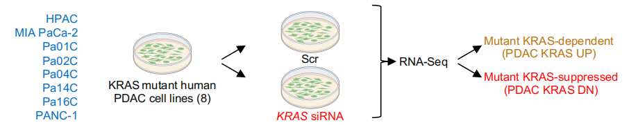
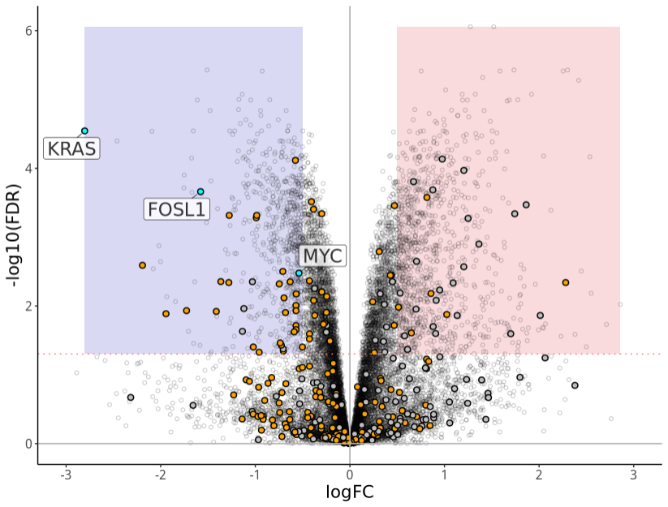
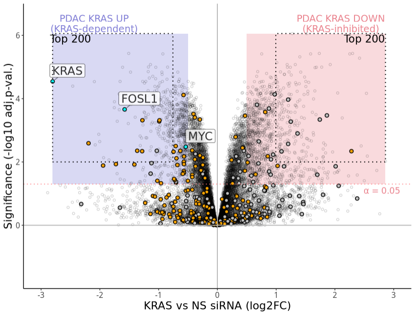
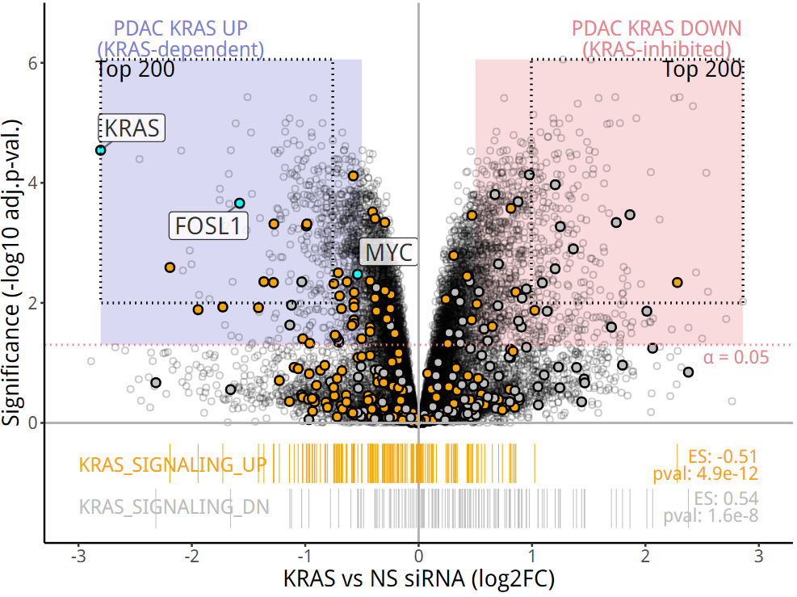

# Science杂志：比火山图多一点信息的火山图

- 专辑：绘图小技巧2025
- 公众号：生信技能树
- 发布时间：2025-03-22 08:08
- 原文：[微信公众平台](https://mp.weixin.qq.com/s?__biz=MzAxMDkxODM1Ng%3D%3D&mid=2247539963&idx=1&sn=35a7f9aa1a032dab77ab3fd859a9834e&chksm=9b4b1c40ac3c95568df614b5c1a741bc1e4eb6b17e22e0fcfb1b8d7b22682197f7b12feed257)

---
>
>
> 前面我们在学习这篇 2024 年 6 月份发表在 顶刊 science 杂志上的文献《**Defining the KRAS- and ERK-dependent transcriptome in KRAS-mutant cancers**》时，发现里面的图片都很美观，我们可以借来放在自己的科研文章中以提升档次。

前面给大家介绍过的已有：

- [一种很新的功能富集结果展示方法](https://mp.weixin.qq.com/s?__biz=MzAxMDkxODM1Ng==&mid=2247537055&idx=1&sn=26544d5687fbe6001391e869ea84e692&scene=21#wechat_redirect)。

- [Science杂志高颜值GSEA打分排序图](https://mp.weixin.qq.com/s?__biz=MzAxMDkxODM1Ng==&mid=2247537935&idx=1&sn=494eae3c7b11b4afca650ab1f82d1350&scene=21#wechat_redirect)

- [Science杂志：富集结果条形图还可以聚类吗？](https://mp.weixin.qq.com/s?__biz=MzAxMDkxODM1Ng==&mid=2247539059&idx=1&sn=4fc44a010cf87ecc0cad48258b9157c6&scene=21#wechat_redirect)

今天再来学习文章中的一幅不同寻常的火山图，**相比于常规的火山图，这个图在底部展示了两个`Hallmark KRAS signaling gene sets`基因集的富集结果，竖线表示基因集中的基因在横轴即所有基因按照 FC 值排序的基因中的位置**，就是GSEA结果中的那种排序竖线。图片如下：


>
>
> 图注：Fig. 1. Establishment and evaluation of a KRAS dependent gene expression program in KRAS-mutant PDAC.

图中的元素：

- **全部的点**：(A) KRAS-dependent gene expression changes upon acute (24 hours) KRAS suppression in eight KRAS mutant PDAC cell lines transiently transfected with KRAS or control nonspecific (NS) siRNA.

  - `淡蓝色的实心点`：展示三个key基因（KRAS, FOSL1, MYC）

  - `橙色的实心点`：KRAS_SIGNALING_UP 基因集中的基因

  - `灰色的实心点`：KRAS_SIGNALING_DN 基因集中的基因

- **底部的两个hallmark基因集，使用竖线表示**：The enrichment of Hallmark KRAS signaling gene sets is shown at the bottom.

- **差异上调和下调基因，使用浅蓝色和浅红色的框框框起来了**：The 677 KRAS-dependent (UP) and 1051 KRAS-inhibited (DN) genes (log2FC \> 0.5, adj. p \< 0.05) are indicated by the light blue– and light red–shaded rectangles underlaid on plot, respectively.

- **虚线框框，选取的 top200 差异基因**：The top 200 KRAS dependent (UP) and KRAS inhibited (DN) genes that make up the PDAC KRAS UP/DN signatures are indicated by the dotted outlines. 选择的标准：FDR\<0.01的时候，按照 FC 从大到小排序取top200

## 火山图背景

#### PDAC细胞系KRAS siRNA RNA测序

为了确定 KRAS 依赖性转录组，作者对一组八个人类 KRAS 突变型胰腺导管腺癌 PDAC 的细胞系在经过 24 小时 KRAS siRNA 处理后的基因转录变化（图 S1A 和 B）进行了 RNA-seq 测序。fq数据可在这里下载：**PRJNA980201** https://www.ebi.ac.uk/ena/browser/view/PRJNA980201?show=related-records。Note：

- `NS缩写`：control non-specific ("NS") siRNA；

- `KRAS siRNA`：是一种小干扰RNA（siRNA），通过特异性靶向KRAS基因的mRNA，从而抑制其表达，达到治疗KRAS突变肿瘤的目的。



差异分析结果如下：The 677 KRAS-dependent (UP) and 1051 KRAS-inhibited (DN) genes (\|log2FC\| \> 0.5, adj. p \< 0.05) are indicated by the light blue– and light red–shaded rectangles underlaid on plot, respectively。

差异结果在表格S1：**Data S1.** Differential expression statistics for genes in KRAS versus NS siRNA treated PDAC cells, using RNA-sequencing。

## 差异结果读取

读取表格：附表表格S1，并预处理数据

```r
###
### Create: juan zhang
### Date:   2025-01-16
### Email:  492482942@qq.com
### Blog:   http://www.bio-info-trainee.com/
### Forum:  http://www.biotrainee.com/thread-1376-1-1.html
### Update Log: 2025-01-16   First version
###

rm(list=ls())
# 加载R包
library(ggplot2)
library(tibble)
library(ggrepel)
library(tidyverse)
library(dplyr)
library(patchwork)
library(ggplot2)

##### 01、加载数据
# 加载：KRAS vs NS siRNA（log2FC）
diff <- read.csv("./data/science.adk0775_data_s1.csv" )
head(diff)

# 提取基因ID,基因Symbol,FDR值和FC值
diff <- diff[,c("X","external_gene_name","logFC","FDR" )]

# 增加一列上下调，阈值 log2FC > 0.5, adj. p < 0.05
diff$g <- "normal"
diff$g[diff$logFC >0.5 & diff$FDR < 0.05 ] <- "up"
diff$g[diff$logFC < -0.5 & diff$FDR < 0.05 ] <- "down"
table(diff$g)
# down normal     up
# 677  13071   1051

# 显著差异基因
diff_up <- diff[diff$g=="up", ]
diff_down <- diff[diff$g=="down", ]

# 增加 top200, 筛选条件：FDR<0.01的时候，按照 FC 从大到小排序取top200
top200 <- diff[ diff$FDR<0.01 , ]
top200_up <- top200[order(top200$logFC, decreasing = T)[1:200], ]
top200_down <- top200[order(top200$logFC, decreasing = F)[1:200], ]
```

## 两个 Hallmark基因集

去 GSEA 的 MSigDB 数据库去下载Hallmark基因集 gmt 格式：https://www.gsea-msigdb.org/gsea/msigdb/download_file.jsp?filePath=/msigdb/release/2024.1.Hs/h.all.v2024.1.Hs.symbols.gmt

```r
# 读取 hallmark基因集
library(clusterProfiler)
geneset <- read.gmt("data/h.all.v2024.1.Hs.symbols.gmt")
HALLMARK_KRAS_SIGNALING_DN <- geneset[geneset$term=="HALLMARK_KRAS_SIGNALING_DN", 2]
HALLMARK_KRAS_SIGNALING_UP <- geneset[geneset$term=="HALLMARK_KRAS_SIGNALING_UP", 2]
HALLMARK_KRAS_SIGNALING_UP
HALLMARK_KRAS_SIGNALING_DN

diff$gene_col <- "all"
diff$gene_col[diff$external_gene_name %in% c("KRAS", "FOSL1", "MYC") ] <- "key"
diff$gene_col[diff$external_gene_name %in% HALLMARK_KRAS_SIGNALING_UP ] <- "KRAS_UP"
diff$gene_col[diff$external_gene_name %in% HALLMARK_KRAS_SIGNALING_DN ] <- "KRAS_DN"
table(diff$gene_col)

# 三类点
data_bg <- diff[diff$gene_col=="all", ]
data_geneset <- diff[grepl("KRAS",diff$gene_col), ]
data_KRAS_UP <- diff[grepl("KRAS_UP",diff$gene_col), ]
data_KRAS_DN <- diff[grepl("KRAS_DN",diff$gene_col), ]
data_key <- diff[diff$gene_col=="key", ]
```

## ggplot2绘图

### 先画基本点

我这里在画图的时候，发现 如果先画点，后面画阴影区域，阴影就会把点的图层覆盖，这是因为 ggplot2 中绘图图层的绘制顺序是从下到上的，需要注意这一点：

```r
## ggplot2 绘图
# 先画添加阴影区，在画点的图层

p <- ggplot(diff, aes(x = logFC, y = -log10(FDR)))  +
  annotate(geom = "rect",fill = "#ea838e", alpha = 0.3, xmin = min(diff_up$logFC), xmax = max(diff_up$logFC),      # 显著上调阴影
           ymin = -log10(0.05), ymax = max(-log10(diff$FDR)) ) +
  annotate(geom = "rect",fill = "#827fd6", alpha = 0.3, xmin = min(diff_down$logFC), xmax = max(diff_down$logFC),  # 显著下调阴影
           ymin = -log10(0.05), ymax = max(-log10(diff$FDR)) ) +
  geom_point(data = data_bg, shape = 21, color = "black", alpha = 0.2, size = 1.3, stroke = 0.6) +  # 背景灰色点：shape=21带边框的圆形，stroke点的边框宽度
  geom_point(data = rbind(data_geneset,data_key), aes(fill = gene_col), shape = 21, color = "black", size = 2, stroke = 0.8) +  # 通路中的点
  scale_fill_manual(values = c("KRAS_UP" = "#faa400", "KRAS_DN" = "#bebebe","key"="#0afdfe")) +     # 通路和关键基因的点的颜色
  geom_label_repel(data = data_key, aes(label = external_gene_name),size = 6,  fill = "white",      # 三个关键基因
                   box.padding=unit(0.35, "lines"), alpha = 0.8,  # 更高的透明度
                   point.padding = 0.5,     # 设置文本标签与对应点之间的最小距离
                   segment.colour = "#4c4b5e",
                   segment.size=0.5,        # 设置引导线的粗细
                   min.segment.length = 0) +  # 长度大于0就可以添加引线
  geom_vline(xintercept = 0, color = "#b2b2b2", linewidth = 0.6) + # 添加一条竖线
  geom_hline(yintercept = 0, color = "#b2b2b2", linewidth = 0.6) + # 添加 水平线
  geom_hline(yintercept = -log10(0.05), color = "#ff7d82", linewidth = 0.6, linetype = "dotted") + # 添加显著性虚水平线
  scale_x_continuous(limits = c(-3, 3), breaks = seq(-3, 3, 1)) +
  theme_classic() +
  theme (legend.position = "none",
         axis.title.x = element_text(size = 16),
         axis.title.y = element_text(size = 16),
         axis.text.x = element_text(size = 12),
         axis.text.y = element_text(size = 12))

p
```

结果如下：



### 添加top200的虚线框框 和 文字标签：

```r
# 添加top200的虚线框框 和 文字标签
p1 <- p +
  annotate("rect", fill = "transparent", linetype = "dotted", color = "black", linewidth = 0.7, xmin = min(top200_up$logFC), xmax = max(top200_up$logFC),
           ymin = -log10(0.01), ymax = max(-log10(diff$FDR))) +
  annotate("rect",  fill = "transparent", linetype = "dotted", color = "black", linewidth = 0.7,xmin = min(top200_down$logFC), xmax = max(top200_down$logFC),
           ymin = -log10(0.01), ymax = max(-log10(diff$FDR))) +
  annotate("text", x = -2.1, y = 6.1, label = "PDAC KRAS UP\n(KRAS-dependent)", color = "#827fd6", size = 5, lineheight = 0.9, vjust = 0) +
  annotate("text", x = 2.1, y = 6.1, label = "PDAC KRAS DOWN\n(KRAS-inhibited)", color = "#ea838e", size = 5, lineheight = 0.9, vjust = 0) +
  annotate("text", x = -2.5, y = 5.9, label = "Top 200", color = "black", size = 5.5) +
  annotate("text", x = 2.5, y = 5.9, label = "Top 200", color = "black", size = 5.5) +
  annotate("text", x = 2.8, y = 1.1, label = "α = 0.05", color = "#ea838e", size = 4.5) +
  xlab(label = "KRAS vs NS siRNA (log2FC)") +
  ylab(label =  "Significance (-log10 adj.p-val.)") +
  scale_y_continuous(limits = c(-2, 7), breaks = seq(0, 6.5, 2), expand = c(0, 0))

p1
```

到这里上半部分就画好了：



### 添加hallmak通路

下半部分：

```r
# 添加hallmak通路
p2 <- p1 +
  geom_linerange(data = data_KRAS_UP, aes(x = logFC, ymin = -1, ymax = -0.35), color = "#faa400", size = 0.5, linewidth = 0.1) +
  geom_linerange(data = data_KRAS_DN, aes(x = logFC, ymin = -1.75, ymax = -1.1), color = "#bebebe", size = 0.5, linewidth = 0.1) +
  annotate("text", x=-3, y = -0.7, label = "KRAS_SIGNALING_UP", color = "#faa400", size = 4.8, hjust = 0) + # 左对齐
  annotate("text", x=-3, y = -1.4, label = "KRAS_SIGNALING_DN", color = "#bebebe", size = 4.8, hjust = 0) +
  annotate("text", x=3.0, y = -0.7, label = "ES: -0.51\npval: 4.9e-12", color = "#faa400", size = 4.5, lineheight = 0.8, hjust = 1) + # 右对齐
  annotate("text", x=3.0, y = -1.4, label = "ES: 0.54\npval: 1.6e-8", color = "#bebebe", size = 4.5, lineheight = 0.8, hjust = 1)
p2
```



### 最后是保存

有个希腊字母 α：

```r
# 保存,有个希腊字母 α
library(extrafont)
font_import()
loadfonts()
library(Cairo)
CairoPDF("Fig.1A.pdf", width = 8, height = 6)
print(p2)
dev.off()
```

#### 完美~

### **文末友情宣传**

- [生信入门&数据挖掘线上直播课3月班](https://mp.weixin.qq.com/s?__biz=MzAxMDkxODM1Ng==&mid=2247538467&idx=1&sn=aa5500b24a92b86355c242d02e742f1b&scene=21#wechat_redirect)

- [时隔5年，我们的生信技能树VIP学徒继续招生啦](http://mp.weixin.qq.com/s?__biz=MzAxMDkxODM1Ng==&mid=2247524148&idx=1&sn=7806da6feb41a36493c519c1cfc1d3ac&chksm=9b4bdf8fac3c569960369602f1ef26639cb366b250f233b2297d1f059471c0458335bfc0b829&scene=21#wechat_redirect)

- [满足你生信分析计算需求的低价解决方案](https://mp.weixin.qq.com/s?__biz=MzAxMDkxODM1Ng==&mid=2247535760&idx=2&sn=1e02a2e982a046ecf6389231e6768d5b&scene=21#wechat_redirect)

<!-- wechat-article-fetcher: complete -->
