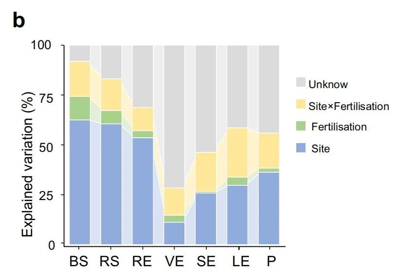
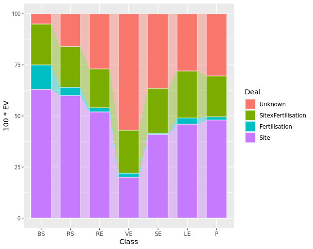
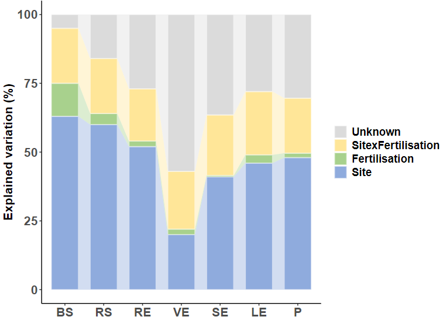

# NC杂志同款高颜值连线堆积柱状图

- 专辑：绘图小技巧2025
- 公众号：生信技能树
- 发布时间：2025-03-17 14:45
- 原文：[微信公众平台](https://mp.weixin.qq.com/s?__biz=MzAxMDkxODM1Ng%3D%3D&mid=2247539767&idx=1&sn=ed0c3b0eb2a8b4414a5d40d620605444&chksm=9b4b1c8cac3c959a35b8ad126017a21d4fbc9df217669ae381a97953cee39ca905c9daa14b22)

---
>
>
> 今天来学习一篇2022年6月发表在 nature communicattions  杂志中的带有连线的堆积柱状图，文献为《A highly conserved core bacterial microbiota with nitrogen-fixation capacity inhabits the xylem sap in maize plants》。图片如下：

这个图展示了不同的土染分类即横坐标：团聚土（BS）、根际土（RS）、根内圈（RE）、木质部汁液（VE）、茎内圈（SE）、叶内圈（LE）和叶表面（P）中 四种填充色：不同地点 Site、施肥处理 Fertilisation 、地点与施肥交互作用 Site x Fertilisation、Unknown 的EV变化关系。

与一般的堆积柱状图相比，因为有这个连着的线引导，视觉上更清晰地展示了数据比例的变化。



图注：PerMANOVA检验进一步证实了土壤中场地和施肥对细菌群落的影响逐渐减弱（从BS的91.93%到VE的28.42%）。

>
>
> Fig. 1 Effects of soil type and fertilisation on the maize microbiome. b Effects of site, fertilisation treatments, and site × fertilisation on bacterial community structure in each compartment as tested by PerMANOVA

## 示例数据

我这里随便造了一个示例数据，放在了github上：https://github.com/zhangj1115/example_data，如果不方便下载也可以加我微信发给你：Biotree123。

## 绘图

这种图的绘制使用的是一个ggplot2的扩展包：`ggalluvial`。

关于ggplot2的各种扩展包，可以看我们之前的帖子：[探索ggplot2的无限可能：140+ggplot2扩展包让你的图表更出彩](https://mp.weixin.qq.com/s?__biz=MzUzMTEwODk0Ng==&mid=2247530039&idx=1&sn=6a15ad7c29ed6654d4669cc84f3602b3&scene=21#wechat_redirect)

```r
rm(list=ls())
library(ggplot2)
library(ggprism)
library(reshape2)
# 绘制连线
library(ggalluvial)


# 构造数据
data <- read.table("Fig1C_stackbar_data.txt", header = T,sep = "\t")
data
class(data)


# 变化数据，宽变长
# id.vars：除了这一列，其余所有的列名都会变成新数据中的单独一列
# variable.name：melt操作后，为新列变量取名
# value.name：新列对应值的变量名
df <- melt(data, id.vars = 'Class', variable.name="Deal", value.name="EV")
head(df)

# 设置横坐标的绘图顺序
df$Class <- factor(df$Class, levels = c("BS", "RS", "RE", "VE", "SE", "LE", "P"))

# 设置堆叠的柱子中的先后顺序
df$Deal <- factor(df$Deal, levels = c("Unknown", "SitexFertilisation", "Fertilisation", "Site"))


# 绘制堆积柱状图：ggalluvial
p <- ggplot(df, aes( x = Class, y=100 * EV, fill = Deal, stratum = Deal, alluvium = Deal)) +
  geom_stratum(width = 0.7, color='white', size=0.6) + # 添加柱子白色的边框
# 绘制冲击图中的流动部分
# width 需要与上面的width保持一致
# curve_type:柱子之间的连线的类型
  geom_alluvium(alpha = 0.4, width = 0.7, curve_type = "linear")
p
```

初步结果如下：



## 美化一下

```r
## 美化
# 设置颜色，使用chatgpt取颜色或者snipaste软件，非常方便
col <- c("Unknown"="#dbdbdb", "SitexFertilisation"="#ffe698", "Fertilisation"="#a8d18d", "Site"="#8fabdd")

p1 <- p +
  scale_fill_manual(values = col) +
  xlab(label = "" ) + # 添加x,y坐标轴标题
  ylab(label = "Explained variation (%)") +
  theme_classic()  + # 使用经典主题
  theme(legend.title = element_blank(), # 去掉图例标题
        legend.text = element_text(size=14,face = "bold"),  # 设置图例标签的字体
        axis.text = element_text(size=16,face = "bold"),    # 设置x,y轴刻度标签的字体
        axis.title.y = element_text(size=16,face = "bold")  # 设置y轴标题的字体
        )
p1

ggsave(filename = "Fig1B.pdf",width = 8, height = 6, plot = p1)
```

最终结果如下：



#### 这种图在单细胞分析的文章中也挺常见的，用于展示不同样本中不同细胞类型占比的比例变化~

### 文末友情宣传

- [生信入门&数据挖掘线上直播课3月班](https://mp.weixin.qq.com/s?__biz=MzAxMDkxODM1Ng==&mid=2247538467&idx=1&sn=aa5500b24a92b86355c242d02e742f1b&scene=21#wechat_redirect)

- [时隔5年，我们的生信技能树VIP学徒继续招生啦](http://mp.weixin.qq.com/s?__biz=MzAxMDkxODM1Ng==&mid=2247524148&idx=1&sn=7806da6feb41a36493c519c1cfc1d3ac&chksm=9b4bdf8fac3c569960369602f1ef26639cb366b250f233b2297d1f059471c0458335bfc0b829&scene=21#wechat_redirect)

- [满足你生信分析计算需求的低价解决方案](https://mp.weixin.qq.com/s?__biz=MzAxMDkxODM1Ng==&mid=2247535760&idx=2&sn=1e02a2e982a046ecf6389231e6768d5b&scene=21#wechat_redirect)

<!-- wechat-article-fetcher: complete -->
