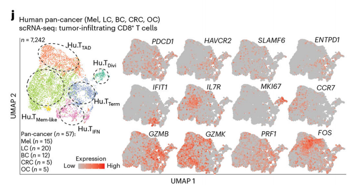
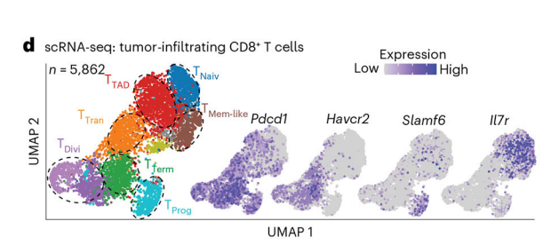
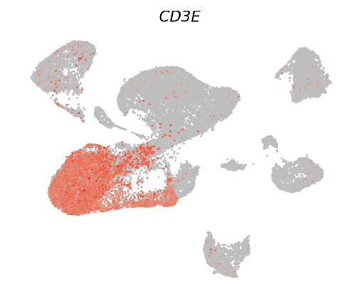
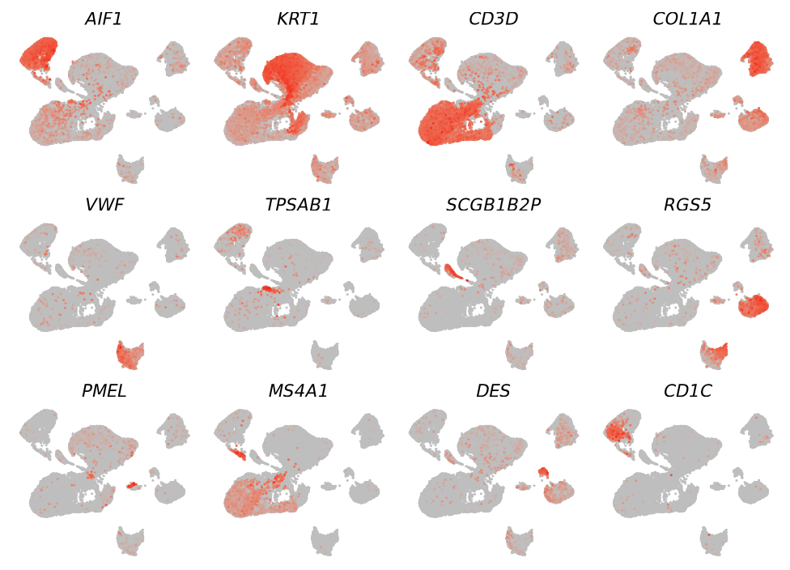
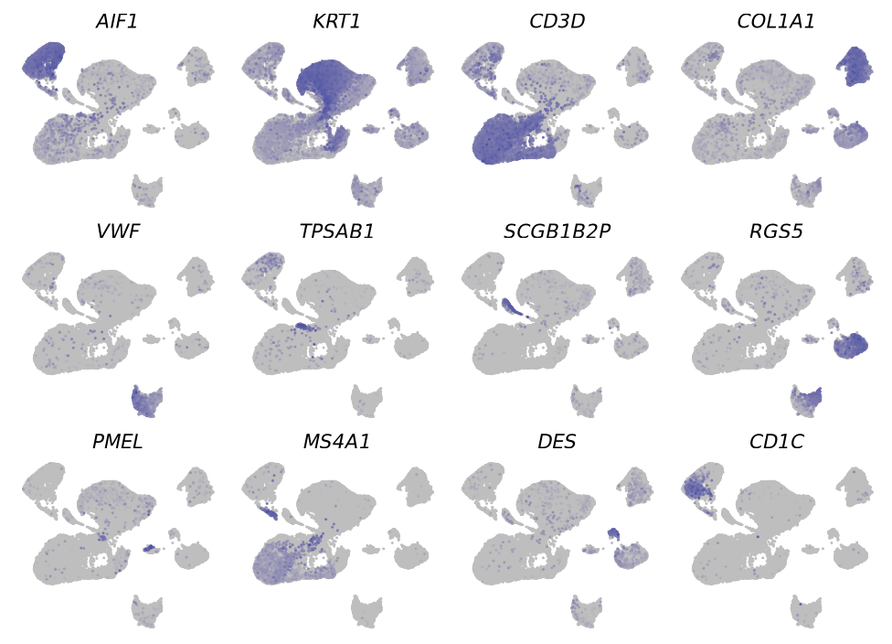

# 展示你的特征基因：带"辣椒粉"的markers基因umap图

- 专辑：绘图小技巧2025
- 公众号：生信技能树
- 发布时间：2025-03-10 22:00
- 原文：[微信公众平台](https://mp.weixin.qq.com/s?__biz=MzAxMDkxODM1Ng%3D%3D&mid=2247539400&idx=1&sn=ffa29d61d95453199ad6157d743403d7&chksm=9b4b1a73ac3c936515b43e5ffbce10dc703538b0de9f37bd341b9156fc6250da5432249b1145)

---
关于UMAP的展示方式，我们[《绘图小技巧2025》](https://mp.weixin.qq.com/mp/appmsgalbum?__biz=MzAxMDkxODM1Ng%3D%3D&action=getalbum&album_id=3792985494804332545#wechat_redirect)专题系列已经给大家分享了3个：

- [给你的单细胞umap图加个cell杂志同款的圈](https://mp.weixin.qq.com/s?__biz=MzAxMDkxODM1Ng%3D%3D&mid=2247537290&idx=1&sn=ad76831349df67bb5236370dab088536#wechat_redirect)

- [5种方式美化你的单细胞umap散点图](https://mp.weixin.qq.com/s?__biz=MzAxMDkxODM1Ng%3D%3D&mid=2247536822&idx=1&sn=5f695d4ee6d8ba00a0961c02c4cf83bd#wechat_redirect)

- [画个同款新奇的“Galaxy”星系UMAP图（Nat Immunol：IF27.8）](https://mp.weixin.qq.com/s?__biz=MzAxMDkxODM1Ng%3D%3D&mid=2247538773&idx=1&sn=094b2cef83702267589de13dd50a0b58#wechat_redirect)

今天来看看如何展示你的特征基因，这个需求在单细胞分析中非常常见。图来自文献《The aged tumor microenvironment limits T cell control of cancer》，于2024年6月25日发表在Nat Immunol杂志上（IF27.8）。如下：



图注：

>
>
> Fig. 4. Cell-extrinsic signals from the aged TME drive the TTAD subset state, which is distinct from CD8+ T cell exhaustion.  j, scRNA-seq UMAP projection of 7,242 tumor-infiltrating CD8+ T cells from human pan-cancer aggregated tumor biopsies  (n = 57) colored by cluster. 

文章中还有很多其他的这种UMAP展示，换一个色系的：



## 示例数据

使用的数据还是自 **GSE128531** 数据注释后的seurat对象，你自己用的时候可以使用任何一个经过了注释后的seurat对象。或者在这里下载链接: `https://pan.baidu.com/s/16ZzlZBp2_grEXEpX-ggPnw?pwd=2jdp 提取码: 2jdp`：

```r
###
### Create: Jianming Zeng
### Date:  2023-12-31
### Email: jmzeng1314@163.com
### Blog: http://www.bio-info-trainee.com/
### Forum:  http://www.biotrainee.com/thread-1376-1-1.html
### CAFS/SUSTC/Eli Lilly/University of Macau
### Update Log: 2023-12-31   First version
### Update Log: 2024-12-09   by juan zhang (492482942@qq.com)
###

rm(list=ls())
library(COSG)
library(harmony)
library(ggsci)
library(dplyr)
library(future)
library(Seurat)
library(clustree)
library(cowplot)
library(data.table)
library(dplyr)
library(ggplot2)
library(patchwork)
library(stringr)
library(qs)

# 导入数据
sce.all.int <- readRDS('2-harmony/sce.all_int.rds')
head(sce.all.int@meta.data)
load("phe.Rdata")
head(phe)
sce.all.int <- AddMetaData(sce.all.int, metadata = phe)

Idents(sce.all.int) <- "celltype"
```

## 确定展示的特征基因

我这里挑了12个基因，为每种细胞的已知marker基因，如下：

- macrophages: AIF1

- keratinocytes: KRT1

- T lymphocytes: CD3D

- fibroblasts: COL1A1

- endothelial cells: VWF

- mast cells: TPSAB1

- secretory (glandular) cells: SCGB1B2P

- pericytes: RGS5

- melanocytes: PMEL

- B cells: MS4A1

- smooth muscle cells: DES

- dendritic cells: CD1C

## 先绘制一个基因看看

使用 `scCustomize` 这个包：

```r
################## umap4：scCustomize
library(viridis)
library(Seurat)
library(scCustomize)

# 绘图
p <- FeaturePlot_scCustom(seurat_object = sce.all.int, features = "CD3E", order = T,pt.size = 0.4) +
  scale_color_gradient(low = "grey", high = "#f32a1f")  + # 更改填充颜色
  theme_void() +  # 使用空白主题
  theme( plot.title = element_text(hjust = 0.5, size = 16, face = "italic"), # 标题居中
         legend.position = "none", # 去除图例
         panel.border = element_blank(),
         panel.grid.major = element_blank(),
         panel.grid.minor = element_blank(),
         panel.background = element_blank(),
         plot.background = element_blank())
p
```

结果如下：



## 多个基因绘制在一个面板

接下来将多个基因绘制在一个图中，这里总共有12个基因，可以选择4X3的排列方式，比较美观，拼图使用patchwork包：

```r
# 确定特征基因
selected_genes <- list("macrophages"="AIF1",
                       "keratinocytes"="KRT1",
                       "T lymphocytes"="CD3D",
                       "fibroblasts"="COL1A1",
                       "endothelial cells"="VWF",
                       "mast cells"="TPSAB1",
                       "secretory (glandular) cells"="SCGB1B2P",
                       "pericytes"="RGS5",
                       "melanocytes"="PMEL",
                       "B cells"="MS4A1",
                       "smooth muscle cells"="DES",
                       "dendritic cells"="CD1C")
g <- unlist(selected_genes)
g

# 生成一个存储多个ggplot对象的list
p_merge <- list()

for(i in 1:length(g)) {
# 打印动态
print(g[i])
# 绘图
  p_merge[[i]] <- FeaturePlot_scCustom(seurat_object = sce.all.int, features = g[i], order = T,pt.size = 0.6) +
    scale_color_gradient(low = "grey", high = "#f32a1f")  + # 更改填充颜色
    theme_void() +  # 使用空白主题
    theme( plot.title = element_text(hjust = 0.5, size = 16, face = "bold"), # 标题居中
      legend.position = "none", # 去除图例
      panel.border = element_blank(),
      panel.grid.major = element_blank(),
      panel.grid.minor = element_blank(),
      panel.background = element_blank(),
      plot.background = element_blank())
}

# 拼图
library(patchwork)
# 有多少个基因，3行4咧
length(g)
# 使用 patchwork 的 wrap_plots() 函数组合图表
combined_plot <- wrap_plots(p_merge, ncol = 4)
combined_plot

# 保存
ggsave(filename = "Salt_UMAP.pdf", width = 11.5, height = 8, plot = combined_plot)
ggsave(filename = "Salt_UMAP.png", width = 11.5, height = 8, plot = combined_plot)
```

结果如下：



#### 完美~

## 换一个色系

改一下：scale_color_gradient(low = "grey", high = "#f32a1f")

```r
# 生成一个存储多个ggplot对象的list
p_merge <- list()

for(i in 1:length(g)) {
# 打印动态
print(g[i])
# 绘图
  p_merge[[i]] <- FeaturePlot_scCustom(seurat_object = sce.all.int, features = g[i], order = T,pt.size = 0.6) +
    scale_color_gradient(low = "grey", high = "#44579a")  + # 更改填充颜色
    theme_void() +  # 使用空白主题
    theme( plot.title = element_text(hjust = 0.5, size = 16, face = "bold"), # 标题居中
      legend.position = "none", # 去除图例
      panel.border = element_blank(),
      panel.grid.major = element_blank(),
      panel.grid.minor = element_blank(),
      panel.background = element_blank(),
      plot.background = element_blank())
}

# 拼图
library(patchwork)
# 有多少个基因，3行4咧
length(g)
# 使用 patchwork 的 wrap_plots() 函数组合图表
combined_plot <- wrap_plots(p_merge, ncol = 4)
combined_plot

# 保存
ggsave(filename = "Salt_UMAP.pdf", width = 11.5, height = 8, plot = combined_plot)
ggsave(filename = "Salt_UMAP.png", width = 11.5, height = 8, plot = combined_plot)
```



#### 你学会了吗~

### **文末友情宣传**

- [生信入门&数据挖掘线上直播课3月班](https://mp.weixin.qq.com/s?__biz=MzAxMDkxODM1Ng%3D%3D&mid=2247538467&idx=1&sn=aa5500b24a92b86355c242d02e742f1b#wechat_redirect)

- [时隔5年，我们的生信技能树VIP学徒继续招生啦](https://mp.weixin.qq.com/s?__biz=MzAxMDkxODM1Ng%3D%3D&mid=2247524148&idx=1&sn=7806da6feb41a36493c519c1cfc1d3ac&chksm=9b4bdf8fac3c569960369602f1ef26639cb366b250f233b2297d1f059471c0458335bfc0b829#wechat_redirect)

- [满足你生信分析计算需求的低价解决方案](https://mp.weixin.qq.com/s?__biz=MzAxMDkxODM1Ng%3D%3D&mid=2247535760&idx=2&sn=1e02a2e982a046ecf6389231e6768d5b#wechat_redirect)

- [掌握Python，解锁单细胞数据的无限可能](https://mp.weixin.qq.com/s?__biz=MzAxMDkxODM1Ng%3D%3D&mid=2247537192&idx=1&sn=f146eabfbd1faefe9d4c85fc68a7dca3#wechat_redirect)

<!-- wechat-article-fetcher: complete -->
