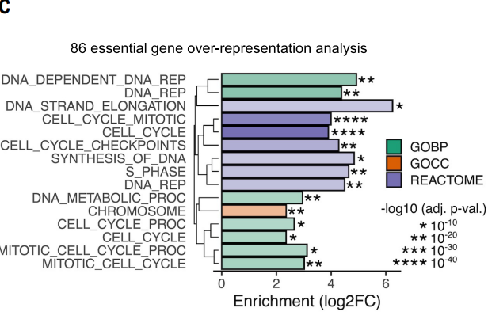
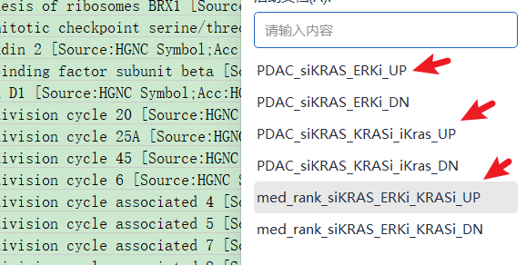
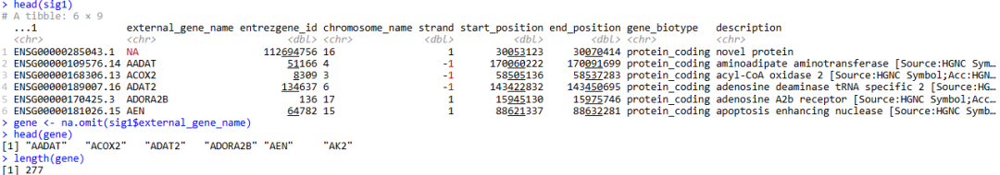
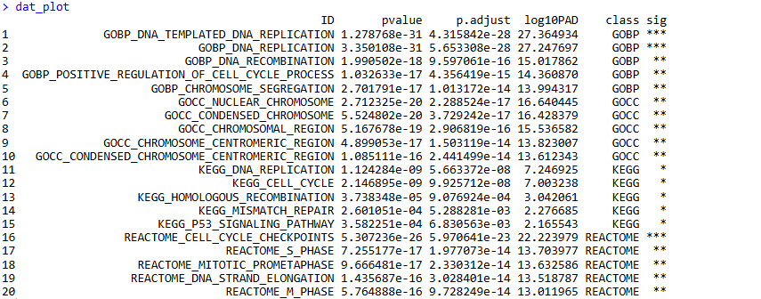
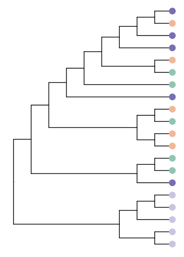
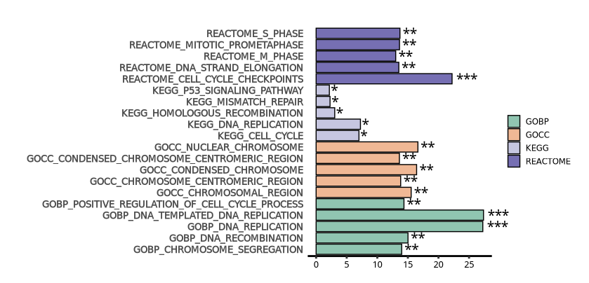
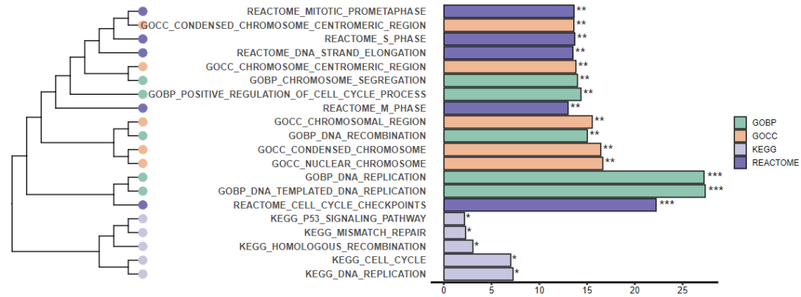
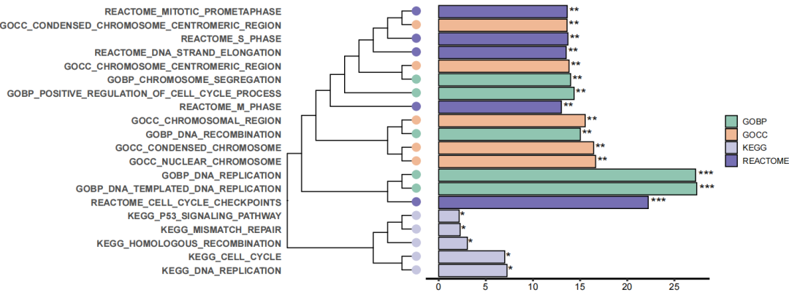

# Science杂志：富集结果条形图还可以聚类吗？

- 专辑：绘图小技巧2025
- 公众号：生信技能树
- 发布时间：2025-03-03 19:46
- 原文：[微信公众平台](https://mp.weixin.qq.com/s?__biz=MzAxMDkxODM1Ng%3D%3D&mid=2247539059&idx=1&sn=4fc44a010cf87ecc0cad48258b9157c6&chksm=9b4b19c8ac3c90de20022c15cf38f661255e0971137407d08af76adc5431f12d351b1fd84bea)

---
> 前面我们在学习这篇 2024 年 6 月份发表在 顶刊 science 杂志上的文献《**Defining the KRAS- and ERK-dependent transcriptome in KRAS-mutant cancers**》时，发现里面的图片都很美观，我们可以借来放在自己的科研文章中以提升档次。

前面给大家介绍过的：

- [一种很新的功能富集结果展示方法](https://mp.weixin.qq.com/s?__biz=MzAxMDkxODM1Ng==&mid=2247537055&idx=1&sn=26544d5687fbe6001391e869ea84e692&scene=21#wechat_redirect)。

- [Science杂志高颜值GSEA打分排序图](https://mp.weixin.qq.com/s?__biz=MzAxMDkxODM1Ng==&mid=2247537935&idx=1&sn=494eae3c7b11b4afca650ab1f82d1350&scene=21#wechat_redirect)

今天再来学习一下文章中对功能富集结果的条形图进行聚类，并且还展示显著性的图。

含义：作者对一组基因 `PDAC KRAS-ERK UP essential genes `进行KEGG，GOBP，GOCC 以及 REACTOME 进行 ORA 功能富集分析，根据富集的 pvalue 和 logFC 对通路进行聚类（ (? 这个聚类指标很迷惑，图中横坐标展示的是log2FC，但 ORA 富集结果没有这个指标，所以这里我用的-log10(adj. p-val),  故本次绘图的通路聚类在本文中没有特殊含义，纯代码技巧）。



图注：

>
>
> Fig. 4. KRAS-ERK–dependent genes are essential for cell proliferation in PDAC. (C) Overrepresentation analysis for PDAC KRAS-ERK UP essential genes using KEGG, GO, and Reactome. BP, biological process; CC, cellular component.

## 数据准备

### 1.86个 PDAC KRAS-ERK UP essential genes

PDAC KRAS-ERK UP 这个数据在文章的附件：science.adk0775_data_s4.xlsx中，关于86个 essential genes 基因的定义，我们这里就不做了，可以去看文献。我这里直接用全部的 PDAC_siKRAS_ERKi_ERKi_UP表格中的基因。



```r
###
### Create: juan zhang
### Date:   2025-01-16
### Email:  492482942@qq.com
### Blog:   http://www.bio-info-trainee.com/
### Forum:  http://www.biotrainee.com/thread-1376-1-1.html
### Update Log: 2025-01-16   First version
###

rm(list=ls())
library(ggplot2)
library(clusterProfiler)
library(org.Hs.eg.db)
library(GSEABase)
library(tidyverse)

# 读取数据 一列基因集合
# PDAC KRAS-ERK UP: 表格 PDAC_siKRAS_ERKi_UP
sig1 <- readxl::read_xlsx("data/science.adk0775_data_s4.xlsx", sheet = "PDAC_siKRAS_ERKi_UP")
head(sig1)
gene <- na.omit(sig1$external_gene_name)
head(gene)
length(gene)
```

这里共有 277个基因：



### 2.功能富集分析

作者用了四个基因集，KEGG，GOBP，GOCC 以及 REACTOME，我们这里都选择去 GSEA 的 MSigDB 数据库去下载 gmt 格式：https://www.gsea-msigdb.org/gsea/msigdb/human/collections.jsp

- REACTOME：https://www.gsea-msigdb.org/gsea/msigdb/download_file.jsp?filePath=/msigdb/release/2024.1.Hs/c2.cp.reactome.v2024.1.Hs.symbols.gmt

- KEGG：https://www.gsea-msigdb.org/gsea/msigdb/download_file.jsp?filePath=/msigdb/release/2024.1.Hs/c2.cp.kegg_legacy.v2024.1.Hs.symbols.gmt

- GOBP：https://www.gsea-msigdb.org/gsea/msigdb/download_file.jsp?filePath=/msigdb/release/2024.1.Hs/c5.go.bp.v2024.1.Hs.symbols.gmt

- GOCC：https://www.gsea-msigdb.org/gsea/msigdb/download_file.jsp?filePath=/msigdb/release/2024.1.Hs/c5.go.cc.v2024.1.Hs.symbols.gmt

富集：

```r
## 读取数据库通路并ORA富集
geneset1 <- read.gmt("./MSigDB/2024.1.Hs/c2.cp.reactome.v2024.1.Hs.symbols.gmt")
geneset2 <- read.gmt("./MSigDB/2024.1.Hs/c2.cp.kegg_legacy.v2024.1.Hs.symbols.gmt")
geneset3 <- read.gmt("./MSigDB/2024.1.Hs/c5.go.bp.v2024.1.Hs.symbols.gmt")
geneset4 <- read.gmt("./MSigDB/2024.1.Hs/c5.go.cc.v2024.1.Hs.symbols.gmt")
geneset <- rbind(geneset1, geneset2, geneset3, geneset4)
head(geneset)
tail(geneset)


######################## 富集
my_path <- enricher(gene=gene, pvalueCutoff = 1, qvalueCutoff = 1, TERM2GENE=geneset)
```

## 开始绘图

这里依然是使用 ggplot2 进行绘制，ggplot2拥有强大的绘图系统。

### 1.绘图前数据预处理

提取数据，并增加通路的类别以及显著性符号：

```r
# 按照fdr从小到大排序
dat <- my_path@result
dat <- dat[order(dat$p.adjust, decreasing = F), ]

# 增加一列class, 表示不同的基因集合
dat$class <- str_split(dat$ID,pattern = "_", n=2,simplify = T)[,1]

# 增加一列 -log10(p.adjust)
dat$log10PAD <- -log10(dat$p.adjust)
dat$log10PAD

# 增加一列显著性
dat$sig <- ""
dat$sig[ dat$log10PAD < 40 ] <- "****"
dat$sig[ dat$log10PAD < 30 ] <- "***"
dat$sig[ dat$log10PAD < 20 ] <- "**"
dat$sig[ dat$log10PAD < 10 ] <- "*"
dat$sig[ dat$log10PAD < 1 ] <- ""
table(dat$sig)


# 每个数据库按照 "p.adjust" 提取 top 5条用于绘图
dat_plot <- dat[,c("ID","pvalue","p.adjust","log10PAD","class","sig")] %>%
  group_by(class) %>%
  slice_head(n = 5) %>%
  ungroup() %>%
  as.data.frame()
dat_plot
```



### 2.先绘制通路聚类树

使用 ggtree：

```r
############################## 绘制聚类树
# 到这里的时候我感觉这个通路聚类的指标很迷惑，这里就当做单纯的绘图技巧了吧，数据没有意义
# 通路聚类至少要有两个特征
# 这里选择 pvalue, p.adjust 绘制通路聚类树
temp <- dat_plot[, c("p.adjust","log10PAD")]
rownames(temp) <- dat_plot$ID
temp

tree <-  hclust(dist(temp))
tree
plot(tree, hang=-1)

# 绘图颜色
colors <- c(GOBP="#90c5b1", KEGG="#c6c6e0", REACTOME="#766fb3", GOCC="#f0b895")
colors

# 使用ggtree
p1 <- ggtree(tree, branch.length="none") %<+% dat_plot +
  geom_tippoint(aes(fill=class, color=class),shape=21,size=4) +
  scale_fill_manual(values = colors) +
  scale_color_manual(values = colors) +
  theme(legend.position = "none")
p1
```

树的图如下，`plot(tree, hang=-1)`的时候可以看到对应的通路标签：



### 3.绘制富集条形图

ggplot 已经很熟悉了吧：

```r
## 绘制条形图
head(dat_plot)
p2 <- ggplot(data = dat_plot, aes(x = log10PAD,y = ID,fill=class),color="black")+
  geom_bar(stat="identity",position="stack",color="black") +
  geom_text(aes(label = sig), hjust = -0.2, size = 5) +  # 添加文本标签
  labs(x="Enrichment(-log10 adj.p-val)",y=NULL) +
  scale_x_continuous(expand=c(0,0)) +
  coord_cartesian(clip = 'off') +
  # scale_fill_brewer(palette="Paired") + # 这个色板挺好看的
  scale_fill_manual(values = colors) +
  scale_x_continuous(breaks = seq(0, 30, by = 5)) +  # 设置x轴的刻度间隔为2
  theme_classic() +
  theme(axis.title.x=element_blank(),
        axis.text.x=element_text(color="black",size=10),
        axis.ticks.x=element_line(size = 1  ),
        axis.line.x=element_line(size = 1),
        # y轴设置
        axis.ticks.y=element_blank(),
        axis.line.y = element_blank(), # 隐藏y轴的线
        axis.text.y=element_text(face = "bold",size = 10),
        legend.title=element_blank(),
        legend.spacing.x=unit(0.2,'cm'),
        legend.key=element_blank(),
        legend.key.width=unit(0.5,'cm'),
        legend.key.height=unit(0.5,'cm'),
        plot.margin = margin(1,0.5,0.5,1,unit="cm"))
p2
```

结果如下：



### 4.两个图拼在一起并保存

```r
# 拼图
p <- p2 %>%
  insert_left(p1,width=.5) %>%
  as.grob() %>%
  ggdraw()
p
ggsave(filename = "Fig.4C.pdf", width = 12, height = 4.5, plot = p)
```

结果如下：



### 5.AI优化

用 AI 将 树与通路名字换一下位置，最终效果如下：



**你学会了吗~（完）**

### **友情宣传：**

- [生信入门&数据挖掘线上直播课3月班](https://mp.weixin.qq.com/s?__biz=MzAxMDkxODM1Ng==&mid=2247538467&idx=1&sn=aa5500b24a92b86355c242d02e742f1b&scene=21#wechat_redirect)

- [时隔5年，我们的生信技能树VIP学徒继续招生啦](http://mp.weixin.qq.com/s?__biz=MzAxMDkxODM1Ng==&mid=2247524148&idx=1&sn=7806da6feb41a36493c519c1cfc1d3ac&chksm=9b4bdf8fac3c569960369602f1ef26639cb366b250f233b2297d1f059471c0458335bfc0b829&scene=21#wechat_redirect)

- [满足你生信分析计算需求的低价解决方案](https://mp.weixin.qq.com/s?__biz=MzAxMDkxODM1Ng==&mid=2247535760&idx=2&sn=1e02a2e982a046ecf6389231e6768d5b&scene=21#wechat_redirect)

<!-- wechat-article-fetcher: complete -->
