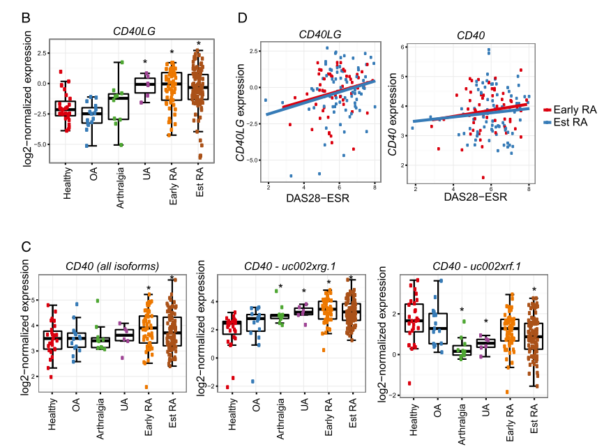
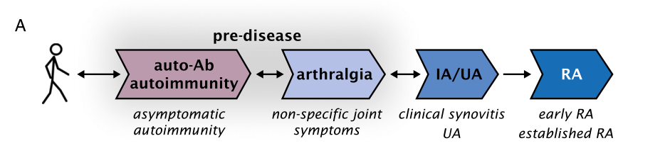
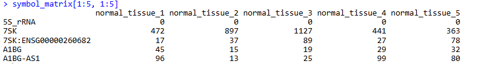
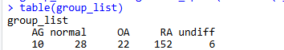
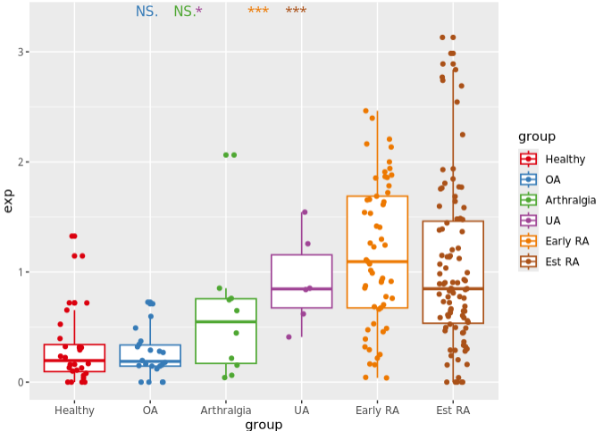
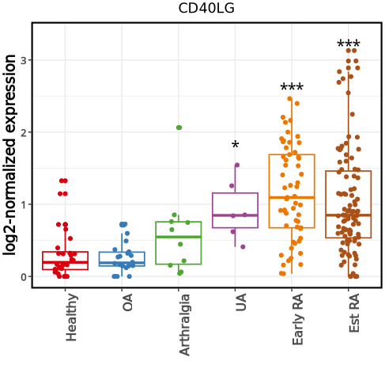

# 六分组疾病进展的关键基因差异箱线图绘制

- 专辑：绘图小技巧2025
- 公众号：生信技能树
- 发布时间：2025-02-19 20:25
- 原文：[微信公众平台](https://mp.weixin.qq.com/s?__biz=MzAxMDkxODM1Ng%3D%3D&mid=2247538634&idx=1&sn=e6e5ff43e3a9c48703089ca7058c6c0f&chksm=9b4b1771ac3c9e67b66f8df794f44dec9d4043f58cb3a6149a279914260487810fb1a265fb60)

---
>
>
> 技能树新开的专辑[《绘图小技巧2025》](https://mp.weixin.qq.com/mp/appmsgalbum?__biz=MzAxMDkxODM1Ng%3D%3D&action=getalbum&album_id=3792985494804332545#wechat_redirect)中的第一篇稿子：[带有疾病进展的多分组差异结果如何展示？](https://mp.weixin.qq.com/s?__biz=MzAxMDkxODM1Ng%3D%3D&mid=2247536217&idx=1&sn=3f1893e79b3474230cd3993c37d2aa34#wechat_redirect)学习了文献《**Triple DMARD treatment in early rheumatoid arthritis modulates synovial T cell activation and plasmablast/plasma cell differentiation pathways**》中一些 marker 基因在三个组别中的箱线图+抖动散点+显著性比较，**今天再来学习同样疾病的另外一文献中的图，我想你肯定也会喜欢，也是箱线图，但是有6个分组，还是疾病进展相关的分组。**

我们每一次的绘图不光光只有绘图的技巧，还带有对文章提供的原始数据处理小技巧，大家可不要忽略了这个呀！还有图和数据在这篇文章中的应用，都是可以学习的！

## 复现的图如下：

这个图来自文献：《**CD40L-Dependent Pathway Is Active at Various Stages of Rheumatoid Arthritis Disease Progression**》，于2017年7月1日发表在 J Immunol 杂志上。这个 `Fig1B` 图主要展示了 目标基因 CD40LG 在6个分组中的表达箱线图，以及与正常组相比，在其他五个组别中的显著性。

随着疾病的进展，目标基因 CD40LG 的表达逐渐升高，但是他的转录本有一个 `a dominant-negative CD40 isoform was decreased` 却是逐渐下降（图1C）。这种研究基因水平以及转录本水平的还挺有意思，CD40LG的基因高表达，但它的转录水平不同的转录本 isoform 却有一定的异质性。



example-multigroup

图注：

>
>
> **FIGURE 1. CD40 and CD40L expression is increased at different stages of disease progression to RA.** RNA-seq was performed on biopsies from healthy tissue, OA, arthralgia, UA/inflammatory arthritis (IA), early RA, and established RA (Est RA) patients. (A) Cartoon showing the progression of asymptomatic autoimmunity to arthralgia, UA, early RA, and Est RA. **(B) CD40LG expression in healthy, OA, arthralgia, UA, early RA, and Est RA synovial biopsies.** (C) Total CD40 transcript levels (left panel), full-length CD40 (uc002xrg.1), and the dominant-negative CD40 isoform (uc002xrf.1) were measured in synovial biopsies from healthy, OA, arthralgia, UA, early RA, and Est RA donors. \*Adjusted p , 0.05, compared with healthy tissue \[in (B and C)\]. (D) Correlation between synovial CD40LG mRNA and DAS28 ESR (left), and between CD40 mRNA and DAS28-ESR (right) in early RA (red) and established RA (blue) patients.

## 数据背景：

GSE89408：https://www.ncbi.nlm.nih.gov/geo/query/acc.cgi?acc=GSE89408

作者对来自 28 名健康供体、22 名骨关节炎（OA）、10名关节痛、6名未分化关节炎（UA）、57名早期类风湿性关节炎（RA）以及 95 名确诊类风湿性关节炎患者的滑膜活检样本进行了RNA测序分析：



- **healthy tissue**：健康组织（healthy tissue）通常指的是没有疾病或损伤的人体组织，可以作为疾病研究的对照组。

- **OA**：骨关节炎（OA）是一种常见的关节疾病，其特征是关节软骨的逐渐磨损，可能导致关节疼痛、肿胀和活动受限。

- **arthralgia**：关节痛（arthralgia）是一种症状，指的是关节的疼痛，可能由多种原因引起，如关节炎、感染或损伤等。

- \*\*UA/inflammatory arthritis (IA)\*\*：未分化关节炎（UA）或炎症性关节炎（IA）是一组早期关节炎症状，尚未明确具体类型的关节炎，其中一部分患者可能会发展为类风湿性关节炎（RA）。

- **early RA**：早期RA（early RA）是指症状持续时间少于六个月的RA

- **established RA**：确诊的RA（established RA，简称Est RA）是指症状持续时间超过六个月的RA。

如果不治疗，RA是一种进展性疾病，可导致残疾和增加死亡风险。

## 绘图

### 1、数据预处理

这里 GEO提供的 GSE89408_GEO_count_matrix_rename.txt.gz 为 RSEM v1.2.14 algorithm算法定量的结果，所以直接取整数了。在这里可以看到用的RSEM方法：https://www.ncbi.nlm.nih.gov/geo/query/acc.cgi?acc=GSM2370970

```r
rm(list = ls())#清空当前的工作环境
options(stringsAsFactors = F)#不以因子变量读取
options(scipen = 20)#不以科学计数法显示
library(data.table)
library(tinyarray)

# 创建目录
getwd()
gse <- "GSE89408"
dir.create(gse)

## 读取数据
data <- data.table::fread("GSE89408/GSE89408_GEO_count_matrix_rename.txt.gz", data.table = F)
data[1:5, 1:5]

# 第一列变成行名
data <- data[!duplicated(data$V1),]
mat <- data[,c( 2:ncol(data))]
rownames(mat) <- data[,1]
mat[1:5, 1:5]

# 过滤低表达
keep_feature <- rowSums (mat > 1) > 1 ;table(keep_feature)
symbol_matrix <- mat[keep_feature, ]
symbol_matrix[1:5, 1:5]

# RSEM v1.2.14 algorithm 对count值取整
symbol_matrix <- floor(symbol_matrix)
symbol_matrix[1:5, 1:5]
```



### 2、提取样本分组信息

样本的列名中有一些分组，但是没有早晚期的RA信息：

```r
# 获取样本分组信息
colnames(symbol_matrix)
group_list <- stringr::str_split(colnames(symbol_matrix), pattern = "_tissue_[1-9]", n = 2, simplify = T)[,1]
table(group_list)
# 这个分组没有 早晚期 RA 信息
# 去matrix文件中看看
```



matrix文件：处理并变为因子变量，可以定义因子水平，绘图的时候按照：`c("Healthy", "OA", "Arthralgia", "UA", "Early RA", "Est RA")`的顺序

```r
#################### matrix 文件
library(AnnoProbe)
library(GEOquery)
gse
gset <- getGEO(gse, destdir = './GSE89408/', getGPL = F)
a <- gset[[1]]
a
pd <- pData(a)
pd[1:4,1:5]
colnames(pd)
table(pd$characteristics_ch1.2)

pd$title
colnames(symbol_matrix)

pd_select <- pd[grepl("rheumatoid arthritis tissue",pd$title), ]
pd_select$title

group_list <- colnames(symbol_matrix)
group_list <- gsub("RA_tissue_","rheumatoid arthritis tissue ",group_list)
group_list[match(pd_select$title, group_list) ] <- pd_select$`disease:ch1`
group_list

group_list[grep("normal_tissue", group_list)] <- "Healthy"
group_list[grep("OA_tissue", group_list)] <- "OA"
group_list[grep("AG_tissue", group_list)] <- "Arthralgia"
group_list[grep("undiff_tissue", group_list)] <- "UA"
group_list[grep("early", group_list)] <- "Early RA"
group_list[grep("established", group_list)] <- "Est RA"

table(group_list)

group_list <- factor(group_list, levels = c("Healthy", "OA", "Arthralgia", "UA", "Early RA", "Est RA"))
group_list
table(group_list)
```


### 3、标准化并保存数据

这里使用简单的标准化方法cpm：

```r
dat <- log2(edgeR::cpm(symbol_matrix)+1)
save(symbol_matrix,dat,group_list,file = 'GSE89408/step1-output.Rdata')
```

### 4、ggplot2绘图

绘图当然可以参考上次的小技巧：[带有疾病进展的多分组差异结果如何展示？](https://mp.weixin.qq.com/s?__biz=MzAxMDkxODM1Ng%3D%3D&mid=2247536217&idx=1&sn=3f1893e79b3474230cd3993c37d2aa34#wechat_redirect)

```r
# 提取目标基因的表达矩阵
group_list
dt <- data.frame(exp=dat["CD40LG", ],group=group_list)
head(dt)
max_pos <- max(dt$exp)
max_pos

color <- c("Healthy"="#db000e", "OA"="#367bb7", "Arthralgia"="#4ea732", "UA"="#9f4495",
           "Early RA"="#ed7800",  "Est RA"="#aa5118")
color

# 组件比较
compara <- list(c("OA", "Healthy"),
                c("Arthralgia", "Healthy"),
                c("UA", "Healthy"),
                c("Early RA", "Healthy"),
                c("Est RA", "Healthy"))

# 绘制箱线
p <- ggplot(data=dt,aes(x=group,y=exp,colour = group)) +
  geom_boxplot(mapping=aes(x=group,y=exp,colour=group), size=0.6, width = 0.8) + # 箱线图，要宽一点
  geom_jitter(mapping=aes(x=group,y=exp,colour = group),size=1.5,width = 0.2) +  # 抖动散点，要窄一点
  scale_color_manual(values =color ) + # 颜色，使用人工智能kimi提取 非常方便
  geom_signif(mapping=aes(x=group,y=exp), # 不同组别的显著性
              comparisons =compara ,
              hjust = -1,
              map_signif_level=T, # T显示显著性，F显示p value
              tip_length=0, # 修改显著性线两端竖着的长短
              size=0, # 修改线的粗细
              textsize = 4, # 修改显著性标记的大小，变成0之前可以看一眼都要哪些显著，用于下面p1的修改
              test = "t.test")  # 检验的类型,可以更改

p
```

结果如下：



美化一下：textsize = 0 设置为0，添加新的图层

```r
# 绘制箱线
p <- ggplot(data=dt,aes(x=group,y=exp,colour = group)) +
  geom_boxplot(mapping=aes(x=group,y=exp,colour=group), size=0.6, width = 0.8) + # 箱线图，要宽一点
  geom_jitter(mapping=aes(x=group,y=exp,colour = group),size=1.5,width = 0.2) +  # 抖动散点，要窄一点
  scale_color_manual(values =color ) + # 颜色，使用人工智能kimi提取 非常方便
  geom_signif(mapping=aes(x=group,y=exp), # 不同组别的显著性
              comparisons =compara ,
              hjust = -1,
              map_signif_level=T, # T显示显著性，F显示p value
              tip_length=0, # 修改显著性线两端竖着的长短
              size=0, # 修改线的粗细
              textsize = 0, # 修改显著性标记的大小，变成0之前可以看一眼都要哪些显著，用于下面p1的修改
              test = "t.test")  # 检验的类型,可以更改

p1 <- p +
  # 手动添加显著性标记，具体根据个人数据进行调整
  annotate('text', label = c('*',"***","***"), x =c(4,5,6), y =c(1.8,2.6,3.2), size =5,color="black") +
  theme_bw() + # 设置白色背景
  labs(x="",y="log2-normalized expression")  + # 添加标题，x轴，y轴标签
  ggtitle(label = "CD40LG") +
  theme(plot.title = element_text(hjust = 0.5),
        #axis.line = element_line(linetype=1,color="black",size=0.9),
        panel.border = element_rect(color = "black", fill=NA, size=1.5),
        axis.title.y =element_text(size=14, face = "bold"),
        axis.text.x =element_text(size=12,angle = 90, face = "bold",hjust = 1),
        axis.text.y =element_text(size=10, face = "bold"),
        legend.position = "none" # 不要图例
        )
p1
```

结果如下：完美~



### 文末友情宣传

强烈建议你推荐给身边的**博士后以及年轻生物学PI**，多一点数据认知，让他们的科研上一个台阶：

- **[生信入门&数据挖掘线上直播课2025年3月班](https://mp.weixin.qq.com/s?__biz=MzAxMDkxODM1Ng%3D%3D&mid=2247538467&idx=1&sn=aa5500b24a92b86355c242d02e742f1b#wechat_redirect)**

- [**时隔5年，我们的生信技能树VIP学徒继续招生啦**](https://mp.weixin.qq.com/s?__biz=MzAxMDkxODM1Ng%3D%3D&mid=2247524148&idx=1&sn=7806da6feb41a36493c519c1cfc1d3ac&chksm=9b4bdf8fac3c569960369602f1ef26639cb366b250f233b2297d1f059471c0458335bfc0b829#wechat_redirect)

- [**满足你生信分析计算需求的低价解决方案**](https://mp.weixin.qq.com/s?__biz=MzUzMTEwODk0Ng%3D%3D&mid=2247530048&idx=1&sn=28aa7bbd5e00521f79e074496a5f5d66#wechat_redirect)

<!-- wechat-article-fetcher: complete -->
