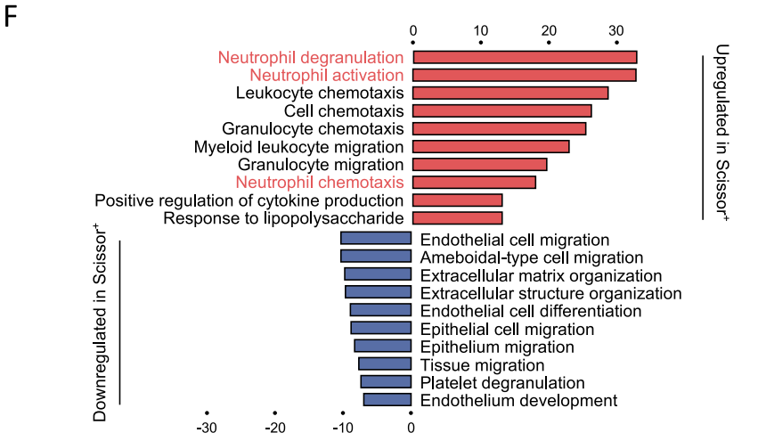
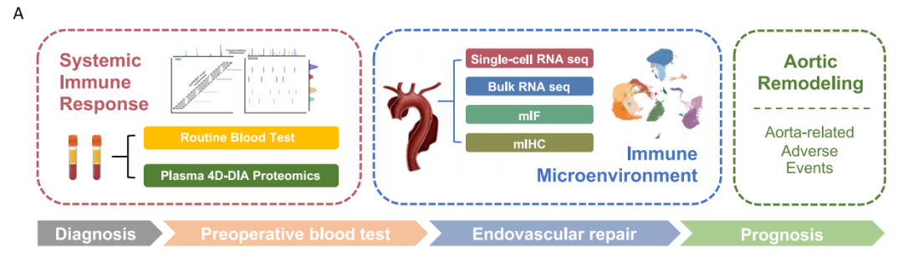
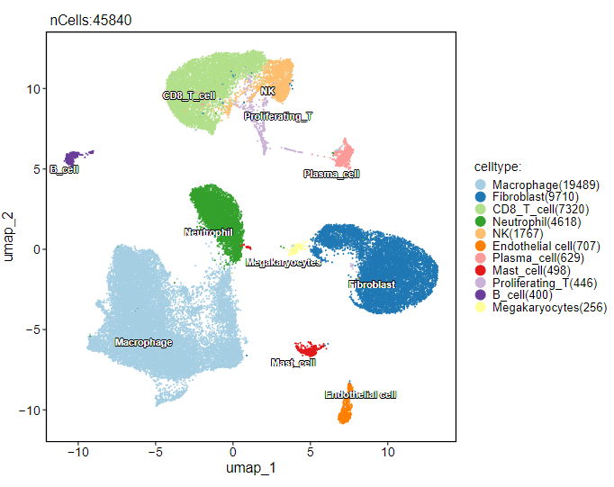
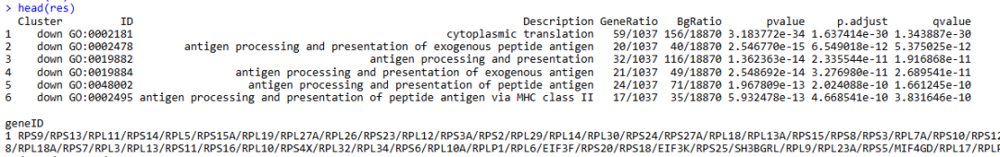
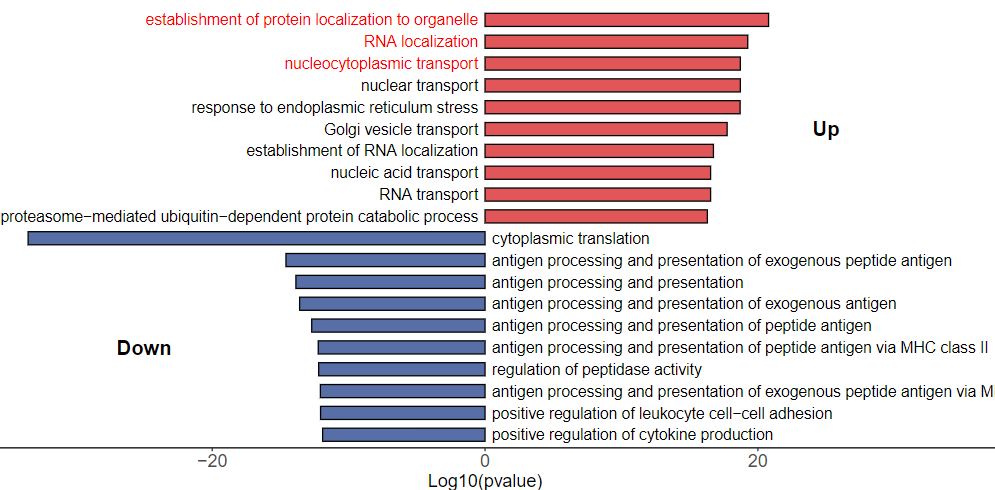
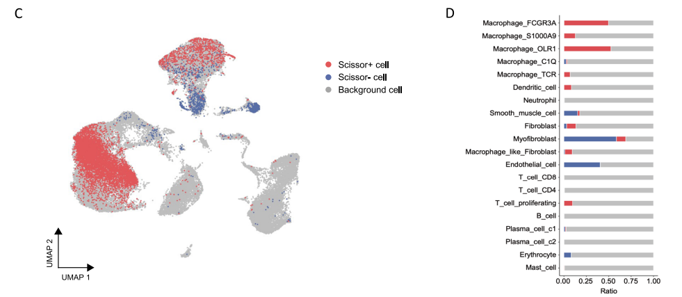

# 突出你的新发现：高亮富集结果中的关键通路绘制

- 专辑：绘图小技巧2025
- 公众号：生信技能树
- 发布时间：2025-02-12 20:14
- 原文：[微信公众平台](https://mp.weixin.qq.com/s?__biz=MzAxMDkxODM1Ng%3D%3D&mid=2247538234&idx=1&sn=f262f1933ebd7902c5a72d87249053d5&chksm=9b4b1681ac3c9f97a0b24af0e6a7605d4568b6a7b8eeeb488d7ec9079535af10bcbddd96e360)

---
> 今天来学习一篇于2024年12月30日发表在Nature Communications上的文献，标题为：《**Integrated multi-omics profiling reveals neutrophil extracellular traps potentiate Aortic dissection progression**》。这个文献中的双向富集结果展示了 Scissor+ cells 与 Scissor- cells 差异分析后GO BP富集结果，并高亮了通路中的关键通路：中性粒细胞的激活、趋化和脱颗粒。

这个文章给我们提供了一种筛选与疾病高度相关的细胞亚群方法，即Scissor算法，它利用单细胞数据和 bulk RNA-seq 数据及表型信息识别与疾病高度相关的细胞亚群。关于什么是 Scissor+ cells 细胞以及 如何鉴定 Scissor+ cells 与 Scissor- cells，我们下期介绍，前面生信技能树也有相关介绍的贴子：

- [寻找表型特异性单细胞亚群的工具Scissor](https://mp.weixin.qq.com/s?__biz=MzAxMDkxODM1Ng==&mid=2247510495&idx=1&sn=e5fff63aed5568e47f8a52c23bd77a58&scene=21#wechat_redirect)

- [整合单细胞数据和Bulk数据的多种方法（二）：R包Scissor](https://mp.weixin.qq.com/s?__biz=MzAxMDkxODM1Ng==&mid=2247520158&idx=2&sn=47c80d140c2994d0575c24605cd914b4&scene=21#wechat_redirect)



>
>
> Fig. 2 \| A phenotype-associated macrophage subset orchestrates neutrophil within aortic microenvironment. F A bar plot of the GO enrichment of biological processes showing the significantly enriched pathways in Scissor+ cells.

#### 今天先来绘制上面的富集结果双向通路图，并熟悉文章数据背景，分析思路。

## 数据背景

作者的样本采样以及数据组学思路如下，这里作者还做了预实验蛋白组学：



image-20250212184910682

其中单细胞数据来自三名健康个体和三名急性主动脉夹层（AD）患者的主动脉。数据为：https://www.ncbi.nlm.nih.gov/geo/query/acc.cgi?acc=GSE254132。

下载并解压之后的文件如下：

```r
.
├── ATAD1
│   ├── barcodes.tsv.gz
│   ├── features.tsv.gz
│   ├── matrix.mtx.gz
│   └── web_summary.html
├── ATAD2
│   ├── barcodes.tsv.gz
│   ├── features.tsv.gz
│   ├── matrix.mtx.gz
│   └── web_summary.html
├── ATAD3
│   ├── barcodes.tsv.gz
│   ├── features.tsv.gz
│   ├── matrix.mtx.gz
│   └── web_summary.html
├── NA1
│   ├── barcodes.tsv.gz
│   ├── features.tsv.gz
│   ├── matrix.mtx.gz
│   └── web_summary.html
├── NA2
│   ├── barcodes.tsv.gz
│   ├── features.tsv.gz
│   ├── matrix.mtx.gz
│   └── web_summary.html
└── NA3
    ├── barcodes.tsv.gz
    ├── features.tsv.gz
    └── matrix.mtx.gz
```

## 数据简单处理并分析

### 1、先读取并创建Seurat对象：

```r
###
### Create: Jianming Zeng
### Date:  2023-12-31
### Email: jmzeng1314@163.com
### Blog: http://www.bio-info-trainee.com/
### Forum:  http://www.biotrainee.com/thread-1376-1-1.html
### CAFS/SUSTC/Eli Lilly/University of Macau
### Update Log: 2023-12-31   First version
### Update Log: 2024-12-09   by juan zhang (492482942@qq.com)
###

rm(list=ls())
options(stringsAsFactors = F)
library(ggsci)
library(dplyr)
library(future)
library(Seurat)
library(clustree)
library(cowplot)
library(data.table)
library(ggplot2)
library(patchwork)
library(stringr)
library(qs)
library(Matrix)
getwd()

# 创建目录
getwd()
gse <- "GSE254132"
dir.create(gse)

# 下载raw文件夹
# https://ftp.ncbi.nlm.nih.gov/geo/series/GSE163nnn/GSE163558/suppl/GSE163558_RAW.tar
# 使用正则表达式替换：\w{3}$ 匹配每个单词最后的三个字符替换为空字符串，即去掉它们
s <- gsub("(\\w{3}$)", "", gse, perl = TRUE)
s
file <- paste0(gse,"_RAW.tar")
file
url <- paste0("https://ftp.ncbi.nlm.nih.gov/geo/series/",s,"nnn/",gse,"/suppl/",gse,"_RAW.tar")
url
#downloader::download(url, destfile = file)

# 方式一：标准文件夹
###### step1: 导入数据 ######
samples <- list.dirs("GSE254132/", recursive = F, full.names = F)
samples
scRNAlist <- lapply(samples, function(pro){
  #pro <- samples[1]
  print(pro)
  folder <- file.path("GSE254132/", pro)
  folder
  counts <- Read10X(folder, gene.column = 2)
  sce <- CreateSeuratObject(counts, project=pro)
  return(sce)
})
names(scRNAlist) <-  samples
scRNAlist

# merge
sce.all <- merge(scRNAlist[[1]], y=scRNAlist[-1], add.cell.ids=samples)
sce.all <- JoinLayers(sce.all) # seurat v5
sce.all

# 查看特征
as.data.frame(sce.all@assays$RNA$counts[1:10, 1:2])
head(sce.all@meta.data, 10)
table(sce.all$orig.ident)

library(qs)
qsave(sce.all, file="GSE254132/sce.all.qs")
```

共得到 53864  个细胞，然后简单质控并降维聚类分群，得到如下注释结果：



### 2、功能富集分析

我这里还没有做完 Scissor+ cells 细胞的鉴定，所以本次就随意提取巨噬细胞，分析巨噬细胞在 二分组：健康和急性主动脉夹层（AD）的组间差异并进行功能富集分析，得到一个富集结果用于绘图。

```r
# 加载包
library(org.Hs.eg.db)
library(clusterProfiler)
library(ggplot2)
# 得到 疾病和正常对照组
table(sce.all.int$orig.ident)
sce.all.int$group <- ifelse(grepl("ATAD", sce.all.int$orig.ident), "ATAD", "NA")
table(sce.all.int$group)
table(sce.all.int$group, sce.all.int$orig.ident)

# 提取其中的巨噬细胞
sce_sub <- subset(sce.all.int, idents = c("Macrophage"))
sce_sub
Idents(sce_sub) <- "group"

# 组间差异分析
sce.sub.markers <- FindMarkers(sce_sub, ident.1 = "ATAD", ident.2 = "NA", logfc.threshold = 0.25, min.pct = 0.1)
sce.sub.markers <- sce.sub.markers[sce.sub.markers$p_val_adj < 0.01, ]
sce.sub.markers$name <- rownames(sce.sub.markers)
sce.sub.markers$g <- ifelse(sce.sub.markers$avg_log2FC>0, "up", "down")
head(sce.sub.markers)
table(sce.sub.markers$g)


# 基因转成ENTREZID
ids <- bitr(sce.sub.markers$name, fromType = "SYMBOL",toType = "ENTREZID", OrgDb = "org.Hs.eg.db")
head(ids)
# 合并ENTREZID到obj.markers中
data <- merge(sce.sub.markers, ids, by.x="name", by.y="SYMBOL")
head(data)
gcSample <- split(data$ENTREZID, data$g)
str(gcSample)

## 富集分析
# KEGG
# xx_kegg <- compareCluster(gcSample, fun="enrichKEGG", organism="hsa", pvalueCutoff=1, qvalueCutoff=1)
# GO
xx_go <- compareCluster(gcSample, fun="enrichGO", OrgDb="org.Hs.eg.db", ont="BP", pvalueCutoff=1, qvalueCutoff=1)
res <- xx_go@compareClusterResult
head(res)

## 将富集结果中的 ENTREZID 重新转为 SYMBOL
Symbol <- mapIds(get("org.Hs.eg.db"), keys = sce.sub.markers$name, keytype = "SYMBOL", column="ENTREZID")
head(Symbol)
for (i in 1:dim(res)[1]) {
  arr = unlist(strsplit(as.character(res[i,"geneID"]), split="/"))
  gene_names = paste(unique(names(Symbol[Symbol %in% arr])), collapse="/")
  res[i,"geneID"] = gene_names
}
head(res)
```



### 3、绘制

还是大家喜欢的ggplot2定制化绘图，先提取绘图数据并简单处理：高亮其实很简单，一个颜色向量里面设置关注通路的颜色为红色

```r
## 通路筛选Top10
enrich <- res %>%
  group_by(Cluster) %>%
  top_n(n = 10, wt = -pvalue)

# 绘图数据
dt <- enrich
# 通路排序
dt <- dt[order(dt$Cluster,dt$pvalue, decreasing = F), ]
dt$Description <- factor(dt$Description, levels = rev(unique(dt$Description)))
dt$Cluster <- factor(dt$Cluster, levels = c("up","down"))

# 得到双向横坐标，上调的应该在右边，乘以一个正值
dt$lable <- ifelse(dt$Cluster=="up", 1, -1)
dt$pvalue_loc <- -log10(dt$pvalue)
dt$pvalue_loc <- dt$pvalue_loc * dt$lable
head(dt)

# 调整添加的y轴方向通路的对其方式
dt$lable_hjust <- ifelse(dt$Cluster=="up", 1, 0)
# 对其的x轴起点，上调通路在x轴左边，起点隔0.5, 避免与柱子粘在一起
dt$lable_xloc <- ifelse(dt$Cluster=="up", -0.5, 0.5)

# 设置通路高亮颜色，这里随便选了三条通路进行高亮，标为红色
dt$label_color <- "black"
dt$label_color[1:3] <- "red"

head(dt)
summary(dt$pvalue_loc)
```

绘图，条形图：

```r
## 绘图
color <- c(up="#e15759", down="#586ea6")
color

p <- ggplot(dt, aes(x = pvalue_loc, y = Description, fill = Cluster)) +
  geom_bar(stat = "identity",color="black", width = 0.6) + # 绘制条形图，边框为黑色
  scale_fill_manual(values = color) +
  scale_x_continuous(limits = c(-34,34)) +
  geom_text(data = dt, aes(x=lable_xloc, y = Description, label = Description, hjust = lable_hjust),
            color=dt$label_color, size = 4.5) +  # 添加通路名称
  labs(x="Log10(pvalue)", y=NULL, title="") +
  annotate("text", x = 25,  y = 15, label = "Up", size=6, fontface = "bold", color="black") +
  annotate("text", x = -25, y =5, label = "Down", size=6, fontface = "bold", color="black") +
  theme_classic() +
  theme( axis.text.x = element_text(size = 15),
    axis.title.x = element_text(size = 15),
    axis.text.y = element_blank(), # 不显示Y轴标签
    axis.line.y = element_blank(),
    axis.ticks.y = element_blank(),
    legend.position = 'none' )
p
ggsave(filename = "Enrich_cometplot.pdf", width = 12, height = 6, plot = p)
```

结果如下：



看文献时，突然想起导师的日常灵魂发问，深入骨髓那种：这个文章做了什么？如何做的？结论是什么？**这个文章你觉得最有意思的地方在哪？**

嗯，我觉得文章中如何使用 Scissor算法鉴定与 急性主动脉夹层相关的细胞亚群这个地方比较有意思。这种细胞亚群鉴定出来后，我可以看看他具体是什么细胞类型，他是倾向于一种细胞亚群比如T细胞都是 Scissor+细胞呢还是T细胞里面只有一部分是？如果是后者，他有什么比较特殊的特征吗？这一群细胞可能会发挥什么作用呢？下期，我们来学习！



### **友情宣传**

[生信入门&数据挖掘线上直播课2025年1月班](https://mp.weixin.qq.com/s?__biz=MzI1Njk4ODE0MQ==&mid=2247527230&idx=1&sn=7156afcd5ab734c7d391b9048695747a&scene=21#wechat_redirect)

[时隔5年，我们的生信技能树VIP学徒继续招生啦](http://mp.weixin.qq.com/s?__biz=MzAxMDkxODM1Ng==&mid=2247524148&idx=1&sn=7806da6feb41a36493c519c1cfc1d3ac&chksm=9b4bdf8fac3c569960369602f1ef26639cb366b250f233b2297d1f059471c0458335bfc0b829&scene=21#wechat_redirect)

[满足你生信分析计算需求的低价解决方案](https://mp.weixin.qq.com/s?__biz=MzAxMDkxODM1Ng==&mid=2247535760&idx=2&sn=1e02a2e982a046ecf6389231e6768d5b&scene=21#wechat_redirect)

<!-- wechat-article-fetcher: complete -->
