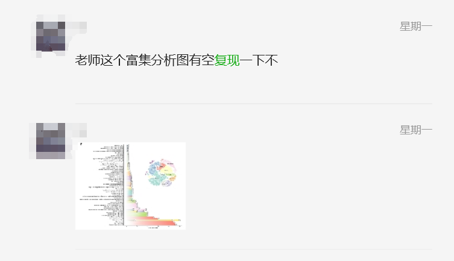
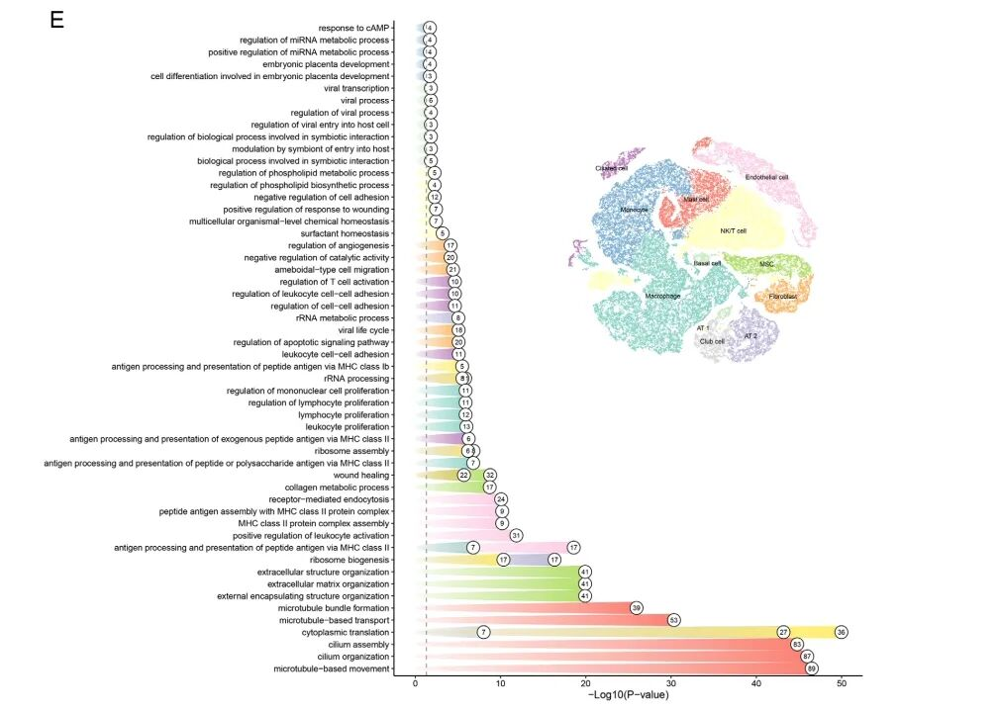
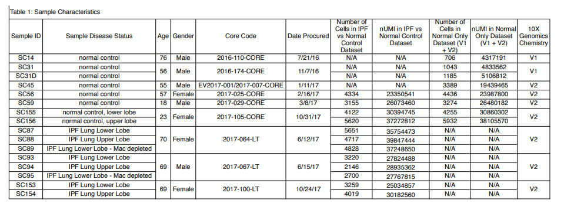
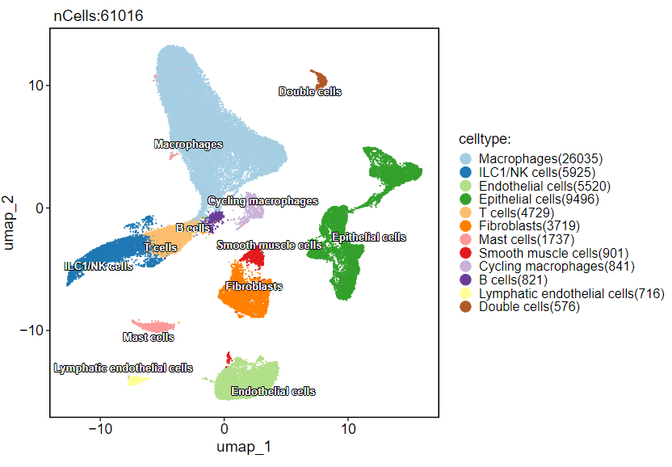
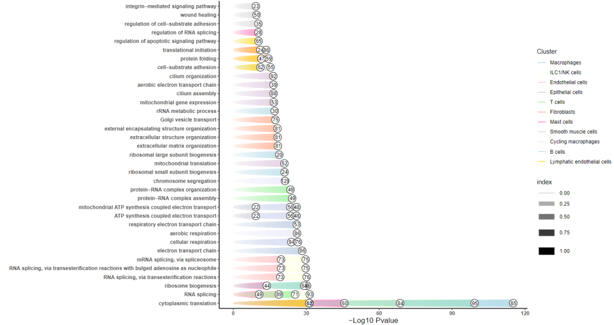
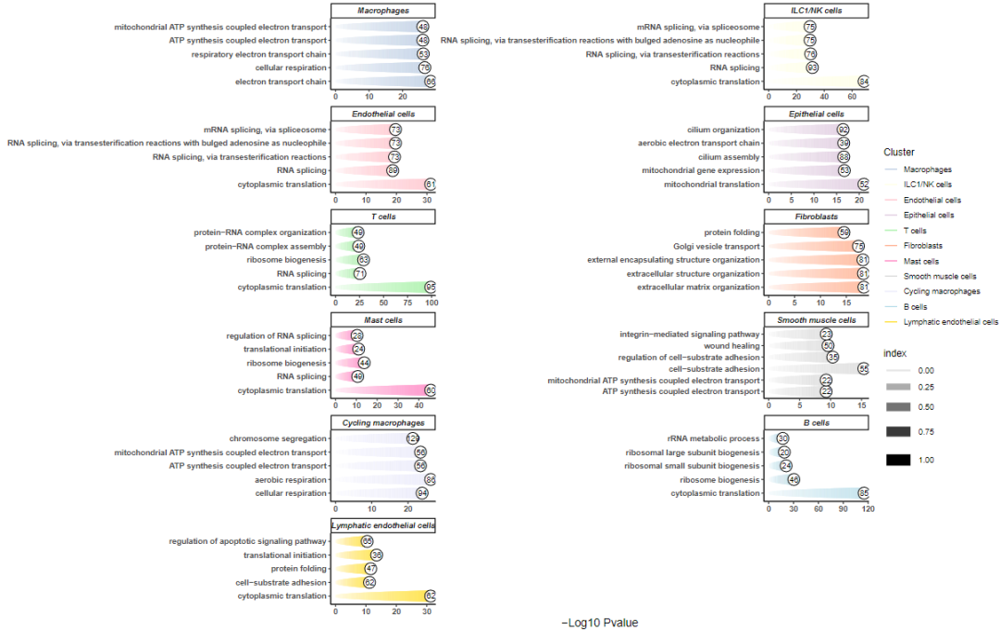

# 用流星图/彗星图（在此之前还不认识这种图呢！）展示富集分析结果

- 专辑：绘图小技巧2025
- 公众号：生信技能树
- 发布时间：2025-02-07 18:14
- 原文：[微信公众平台](https://mp.weixin.qq.com/s?__biz=MzAxMDkxODM1Ng%3D%3D&mid=2247538003&idx=1&sn=e7489f68ec86515c43ac902f485daeef&chksm=9b4b15e8ac3c9cfe35e6d036bf4a1ef56f4ccb5fd13e6f49a72f9b7403f264033c6735124eac)

---
> **我们生信技能树的单细胞python群里面收到一位学员的需求，问下面这个图怎么画**。我一看，我去这是什么图啊，看上去都是一排排的美甲！激动地搓搓手，这就来研究一下怎么搞！



## 图片背景

这幅图来自 2024 年 6 月份发表在 Int J Mol Sci杂志上的文献：《Novel AT2 Cell Subpopulations and Diagnostic Biomarkers in IPF: Integrating Machine Learning with Single-Cell Analysis》。**我左思右想没能想到这是个什么图，图的含义当然很好理解，就去问了一下张俊，果然他画过，一下子就从他那里得到了图的名字：流星图（机智如我）。**他的笔记见：[富集分析流星图?](https://mp.weixin.qq.com/s?__biz=MzkyMTI1MTYxNA==&mid=2247513571&idx=1&sn=65c28c7798caee6a68208c7f8c50cc2b&scene=21#wechat_redirect)



图注：横坐标为-log10(pvalue)，纵坐标为通路，彗星的头为一个圈，里面是此通路中的差异基因个数，颜色为不同的细胞亚群。

>
>
> Figure 2. Molecular characterization of the cellular heterogeneity of human IPF lung tissue according to dataset GSE128033. (E) Representative enriched GO terms enriched in each cell type are depicted. The numbers at the front end of the column represent the number of genes enriched in the GO term.

## 数据背景

文章中的单细胞数据为：GSE128033，https://www.ncbi.nlm.nih.gov/geo/query/acc.cgi?acc=GSE128033。

包括 8个特发性纤维化（IPF）样本和10个正常样本，共66500个细胞（文章中过滤后的细胞数）。



以下是来自这个数据对应的文献中使用 kimi 整理后的细胞类型及其对应的 marker 基因，细胞名与基因名放在同一行：

- Club cells: SCGB1A1, SCGB3A2

- Alveolar type I (AT1) cells: AGER

- Alveolar type II (AT2) cells: SFTPC

- Ciliated cells: FOXJ1

- Basal airway cells: KRT5

- Goblet cells: MUC5B

- Fibroblasts: COL1A1, COL1A2, PDGFRA

- Smooth muscle cells: DES, ACTG2

- Endothelial cells: VWF

- Lymphatic endothelial cells: LYVE1

- Pericytes: RGS5

- Macrophages: AIF1, CD163

- Dendritic cells: CD1C

- Mast cells: TPSAB1

- T lymphocytes: CD3, CD8A

- B lymphocytes: MS4A1, CD20, IGKC, MZB1

- NK cells: GNLY

## 数据预处理：GSE128033

简单读取进来：

```r
###
### Create: Jianming Zeng
### Date:  2023-12-31
### Email: jmzeng1314@163.com
### Blog: http://www.bio-info-trainee.com/
### Forum:  http://www.biotrainee.com/thread-1376-1-1.html
### CAFS/SUSTC/Eli Lilly/University of Macau
### Update Log: 2023-12-31   First version
### Update Log: 2024-12-09   by juan zhang (492482942@qq.com)
###

rm(list=ls())
options(stringsAsFactors = F)
library(ggsci)
library(dplyr)
library(future)
library(Seurat)
library(clustree)
library(cowplot)
library(data.table)
library(ggplot2)
library(patchwork)
library(stringr)
library(qs)
library(Matrix)
getwd()

# 创建目录
getwd()
gse <- "GSE128033"
dir.create(gse)

# 下载 raw 文件夹
# https://ftp.ncbi.nlm.nih.gov/geo/series/GSE163nnn/GSE163558/suppl/GSE163558_RAW.tar
# 使用正则表达式替换：\w{3}$ 匹配每个单词最后的三个字符替换为空字符串，即去掉它们
s <- gsub("(\\w{3}$)", "", gse, perl = TRUE)
s
url <- paste0("https://ftp.ncbi.nlm.nih.gov/geo/series/",s,"nnn/",gse,"/suppl/",gse,"_RAW.tar")
url
file <- paste0(gse,"_RAW.tar")
file
# downloader::download(url, destfile = file)

###### step1: 导入数据 ######
# GSE128033为整理后的每个文件里都是标准的三个文件
samples <- list.dirs("GSE128033/", recursive = F, full.names = F)
samples
scRNAlist <- lapply(samples, function(pro){
  #pro <- samples[1]
  print(pro)
  folder <- file.path("GSE128033/", pro)
  folder
  counts <- Read10X(folder, gene.column = 2)
  sce <- CreateSeuratObject(counts, project=pro, min.features=3)
  return(sce)
})
names(scRNAlist) <-  samples
scRNAlist

# merge
sce.all <- merge(scRNAlist[[1]], y=scRNAlist[-1], add.cell.ids=samples)
sce.all <- JoinLayers(sce.all) # seurat v5
sce.all


# 查看特征
as.data.frame(sce.all@assays$RNA$counts[1:10, 1:2])
sce.all$Sample <- sce.all$orig.ident
sce.all$orig.ident <- str_split(sce.all$orig.ident, pattern = "_", n=2,simplify = T)[,2]
head(sce.all@meta.data, 10)
table(sce.all$orig.ident)

library(qs)
qsave(sce.all, file="GSE128033/sce.all.qs")
```

然后经过简单的质控与去批次，并降维聚类细胞注释，得到下面的UMAP图：



## 绘图，开整

### 1、对每个亚群做差异分析得到差异基因

这里先去掉双细胞：

```r
# 加载包
library(org.Hs.eg.db)
library(clusterProfiler)
library(ggplot2)

table(Idents(sce.all.int))
sce.all.int <- subset(sce.all.int, ident="Double cells", invert=T)

# 差异分析
sce.markers <- FindAllMarkers(sce.all.int, only.pos = TRUE, min.pct = 0.2, return.thresh = 0.01)
head(sce.markers)

# 查看top10
top10 <- sce.markers %>%
  group_by(cluster) %>%
  dplyr::filter(avg_log2FC > 1) %>%
  slice_head(n = 10) %>%
  ungroup()

# 基因转成ENTREZID
Symbol <- mapIds(get("org.Hs.eg.db"), keys = sce.markers$gene, keytype = "SYMBOL", column="ENTREZID")
head(Symbol)
ids <- bitr(sce.markers$gene,fromType = "SYMBOL",toType = "ENTREZID", OrgDb = "org.Hs.eg.db")
head(ids)

# 合并ENTREZID到obj.markers中
data <- merge(sce.markers, ids, by.x="gene", by.y="SYMBOL")
head(data)

gcSample <- split(data$ENTREZID, data$cluster)
gcSample
```

### 2、富集分析

这里单细胞的多个亚群功能富集使用 `clusterProfiler` 包的`compareCluster`函数：

```r
## 富集分析
# KEGG
# xx_kegg <- compareCluster(gcSample, fun="enrichKEGG", organism="hsa", pvalueCutoff=1, qvalueCutoff=1)
# GO
xx_go <- compareCluster(gcSample, fun="enrichGO", OrgDb="org.Hs.eg.db", ont="BP", pvalueCutoff=1, qvalueCutoff=1)
res <- xx_go@compareClusterResult
head(res)

## 将富集结果中的 ENTREZID 重新转为 SYMBOL
for (i in 1:dim(res)[1]) {
  arr = unlist(strsplit(as.character(res[i,"geneID"]), split="/"))
  gene_names = paste(unique(names(Symbol[Symbol %in% arr])), collapse="/")
  res[i,"geneID"] = gene_names
}
head(res)

## 通路筛选Top5
enrich <- res %>%
  group_by(Cluster) %>%
  top_n(n = 5, wt = -pvalue)

dt <- enrich
dt <- dt[order(dt$pvalue,dt$Cluster, decreasing = F), ]
dt$Description <- factor(dt$Description, levels = unique(dt$Description))
colnames(dt)
```

### 3、绘图

用到的包为`ggforce`。`geom_link()`这是`ggplot2`中用于绘制线段的函数。

- `x = 0`：设置线段起点的x坐标为0。

- `y = Description`：设置线段起点的y坐标为数据框中的`Description`列的值。

- `xend = -log10(pvalue)`：设置线段终点的x坐标为`pvalue`列值的负对数（以10为底）。

- `yend = Description`：设置线段终点的y坐标与起点相同，即`Description`列的值。

- `alpha = after_stat(index)`：设置线段的透明度，`after_stat(index)`表示在计算统计量后使用`index`值来确定透明度。

- `color = Cluster`：根据`Cluster`列的值来设置线段的颜色。

- `size = after_stat(index)`：根据`index`值来设置线段的大小。

- `n = 500`：设置线段的平滑度，`n`参数指定了在绘制线段时使用的点的数量，较大的值会使线段更平滑。

- `index` 是 `stat` 函数计算后生成的一个内部变量，通常用于表示数据点在统计变换后的位置或顺序，值的范围为0-1。

- `after_stat(index)`：根据密度估计的值调整线段的透明度或大小，从而在图中突出显示密度较高的区域。

```r
## 绘图
library(ggforce)
head(dt)
table(dt$Cluster)

colors <- c(
  "Macrophages" = "#B0C4DE",
  "Mast cells" = "#FF69B4",
  "Endothelial cells" = "#FFB6C1",
  "ILC1/NK cells" = "#FFFFE0",
  "B cells" = "#ADD8E6",
  "T cells" = "#90EE90",
  "Fibroblasts" = "#FFA07A",
  "Smooth muscle cells" = "#D3D3D3",
  "Epithelial cells" = "#D8BFD8",
  "Cycling macrophages" = "#E6E6FA",
  "Lymphatic endothelial cells" = "#FFD700"
)

p <- ggplot(dt) +
  geom_link(aes(x = 0, y = Description,
               xend = -log10(pvalue), yend = Description,
               alpha = after_stat(index),
               color = Cluster,
               size = after_stat(index)),
            n = 500, show.legend = T)
p

p1 <- p +
  geom_point(aes(x = -log10(pvalue),y = Description), color = "black", fill = "white",size = 6,shape = 21) +
  geom_text(aes(x = -log10(pvalue), y = Description), label=dt$Count, size=3, nudge_x=0.05) +
  theme_classic() +
  theme(panel.grid = element_blank(),
        strip.text = element_text(face = "bold.italic"),
        #axis.text = element_text(color = "black"),
        axis.line = element_line(color = "black", size = 0.6), # 加粗x轴和y轴的线条
        axis.text = element_text(face = "bold"), # 加粗x轴和y轴的标签
        axis.title = element_text( size = 13)    # 加粗x轴和y轴的标题
        ) +
  xlab("-Log10 Pvalue") + ylab("") +
  scale_color_manual(values = colors)
p1
ggsave(filename = "Enrich_cometplot.pdf", width = 15, height = 8, plot = p1)
```

结果如下：



但是这里感觉像张俊那个做分面会更好看，来看下：

```r
# 加分面
p2 <- p1 +
  facet_wrap(~Cluster,scales = "free",ncol = 2)
p2

ggsave(filename = "Enrich_cometplot_facet.pdf", width = 16, height = 10, plot = p2)
```



Perfect！又学了一种新图！如果你需要这里面处理后的数据，可以留言或者：Biotree123。

### 友情宣传

[生信入门&数据挖掘线上直播课2025年1月班](https://mp.weixin.qq.com/s?__biz=MzI1Njk4ODE0MQ==&mid=2247527230&idx=1&sn=7156afcd5ab734c7d391b9048695747a&scene=21#wechat_redirect)

[时隔5年，我们的生信技能树VIP学徒继续招生啦](http://mp.weixin.qq.com/s?__biz=MzAxMDkxODM1Ng==&mid=2247524148&idx=1&sn=7806da6feb41a36493c519c1cfc1d3ac&chksm=9b4bdf8fac3c569960369602f1ef26639cb366b250f233b2297d1f059471c0458335bfc0b829&scene=21#wechat_redirect)

[满足你生信分析计算需求的低价解决方案](https://mp.weixin.qq.com/s?__biz=MzAxMDkxODM1Ng==&mid=2247535760&idx=2&sn=1e02a2e982a046ecf6389231e6768d5b&scene=21#wechat_redirect)

<!-- wechat-article-fetcher: complete -->
