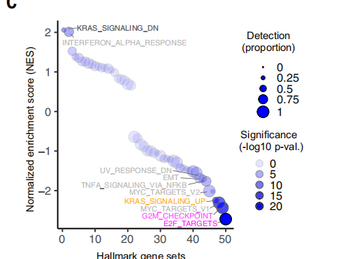
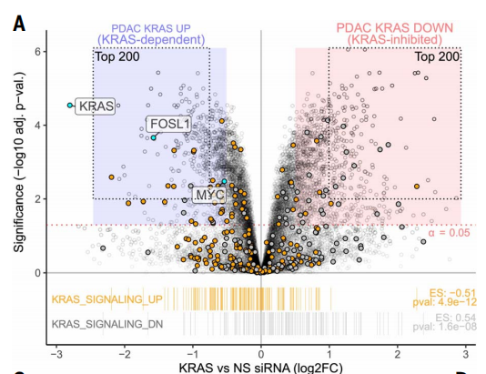
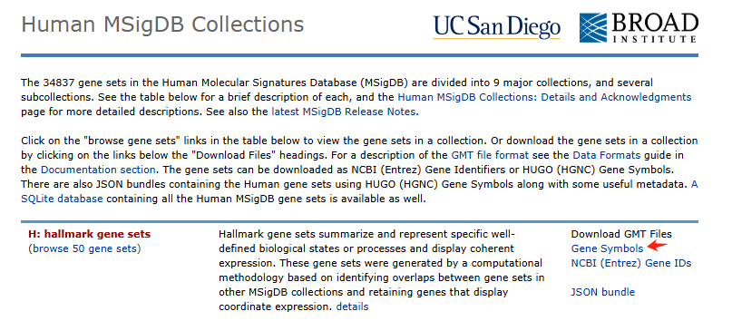
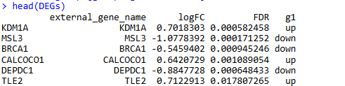
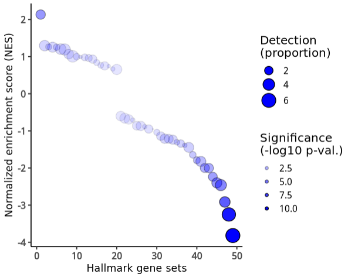
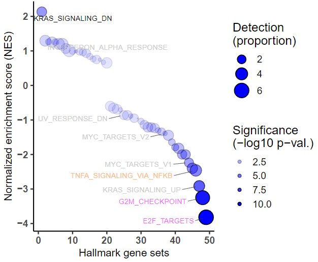

# Science杂志高颜值GSEA打分排序图

- 专辑：绘图小技巧2025
- 公众号：生信技能树
- 发布时间：2025-02-05 17:40
- 原文：[微信公众平台](https://mp.weixin.qq.com/s?__biz=MzAxMDkxODM1Ng%3D%3D&mid=2247537935&idx=1&sn=494eae3c7b11b4afca650ab1f82d1350&chksm=9b4b15b4ac3c9ca2e34e696a53bacf0defccce0530fa7079564f3ed0bf1152a34a0b8205f84b)

---
> 前面给大家介绍过一个高颜值富集分析结果展示图：[一种很新的功能富集结果展示方法](https://mp.weixin.qq.com/s?__biz=MzAxMDkxODM1Ng==&mid=2247537055&idx=1&sn=26544d5687fbe6001391e869ea84e692&scene=21#wechat_redirect)。今天来还是来复现这篇 2024 年 6 月份发表在 顶刊 science 杂志上的文献《**Defining the KRAS- and ERK-dependent transcriptome in KRAS-mutant cancers**》中另一个富集分析GSEA结果图，图片以及含义如下：

含义：**作者对 KRAS versus NS siRNA 处理的 PDAC 细胞系差异基因进行 GSEA 分析，基因集为 50 个 Hallmark gene sets**。然后取每条通路的 NES 打分从高到低进行排序，并绘制散点图。**点的大小**为 Detection：应该为每个通路中基因在所有样本中表达的 count 大于 5 的占比（我们这里并没有表达矩阵，就用基因集大小替代好了）。**点的颜色**为通路显著性：-log10 pvalue。



图注：

>
>
> Fig. 1. Establishment and evaluation of a KRAS dependent gene expression program in KRAS-mutant PDAC. (C) GSEA for 50 Hallmark gene sets within DEGs after KRAS siRNA treatment. Detection is based on the presence of a gene in all eight PDAC cell lines at \>5 reads.

关于可不可以用差异基因进行GSEA分析，我们前面讨论过：[IF10+杂志文章只用统计学显著的差异基因做GSEA就合理吗？](https://mp.weixin.qq.com/s?__biz=MzAxMDkxODM1Ng==&mid=2247537475&idx=1&sn=0ba7600556f909d01727f59010d7a9f9&scene=21#wechat_redirect)

## 数据背景介绍

### 1、PDAC细胞系KRAS siRNA RNA测序

为了确定 KRAS 依赖性转录组，作者对一组八个人类 KRAS 突变型 胰腺导管腺癌PDAC的细胞系在经过 24 小时 KRAS 小干扰 RNA（siRNA）处理后的基因转录变化（图 S1A 和 B）进行了 RNA 测序（RNA-seq）。数据可在这里下载：**PRJNA980201** https://www.ebi.ac.uk/ena/browser/view/PRJNA980201?show=related-records。

Note：

- NS缩写：control non-specific ("NS") siRNA。

- KRAS siRNA是一种小干扰RNA（siRNA），通过特异性靶向KRAS基因的mRNA，从而抑制其表达，达到治疗KRAS突变肿瘤的目的。


差异分析结果如下：The 677 KRAS-dependent (UP) and 1051 KRAS-inhibited (DN) genes (**log2FC \> 0.5, adj. p \< 0.05**) are indicated by the light blue– and light red–shaded rectangles underlaid on plot, respectively。



差异结果在表格S1：**Data S1.** Differential expression statistics for genes in KRAS versus NS siRNA treated PDAC cells, using RNA-sequencing。

### 2、50 Hallmark gene sets

Hallmark 通路可以在GSEA 的 MSigDB 数据库去下载 gmt 格式：https://www.gsea-msigdb.org/gsea/msigdb/human/collections.jsp



## GSEA分析

GSEA的输入数据为差异基因排序列表，排序指标为log2FC值：

### 1、读取数据

```r
rm(list=ls())
# 加载R包
library(ggplot2)
library(tibble)
library(ggrepel)
library(tidyverse)
library(dplyr)
library(patchwork)

##### 01、加载数据

# 加载：KRAS vs NS siRNA（log2FC）
group1 <- read.csv("./data/science.adk0775_data_s1.csv" )
head(group1)

# 提取FDR值和FC值
group1 <- group1[,c("external_gene_name","logFC","FDR" )]
group1 <- group1[group1$external_gene_name!="", ]
group1 <- distinct(group1,external_gene_name,.keep_all = T)
rownames(group1) <- group1$external_gene_name
head(group1)

# 增加一列上下调：log2FC > 0.5, adj. p < 0.05
group1$g1 <- "normal"
group1$g1[group1$logFC >0.5 & group1$FDR < 0.05 ] <- "up"
group1$g1[group1$logFC < -0.5 & group1$FDR < 0.05 ] <- "down"
table(group1$g1)
# down normal     up
# 675  12876   1043

# 获得差异基因
DEGs <- group1[group1$g1!="normal",]
head(DEGs)

# 得到排序列表
DEGs <- DEGs[order(DEGs$logFC, decreasing = T),]
genelist <- DEGs$logFC
names(genelist) <- DEGs$external_gene_name
head(genelist)
# NPPC   SMTNL2    KCNK3     CHPF PCDHGA12  EXOC3L1
# 2.860472 2.712068 2.551034 2.536558 2.499657 2.446140

tail(genelist)
```

得到 1718个差异基因：



### 2、读取 50 Hallmark gene sets 通路并富集：

```r
## === HALLMARK通路富集
geneset <- read.gmt("data/h.all.v2024.1.Hs.symbols.gmt")
table(geneset$term)
geneset$term <- gsub(pattern = "HALLMARK_","", geneset$term)

# 运行,输出全部结果
egmt <- GSEA(genelist, TERM2GENE=geneset, pvalueCutoff = 1, minGSSize = 1, maxGSSize = 500000)
colnames(egmt@result)
head(egmt[, 1:6])
```

### 3、使用 ggplot2 定制化绘图

取出绘图需要的列，并进行相关设置：

```r
# 绘图
data <- egmt[,c("ID", "NES","setSize","pvalue")]
data$setSize_1 <- data$setSize/10
head(data)

# 给Y轴的通路名设置为因子，排序
data <- data[order(data$NES, decreasing = T),]
data$ID <- factor(data$ID, levels = data$ID)
data$xlab <- 1:49
head(data)
summary(data$NES)
summary(data$setSize_1)

# 图中标出的通路名字
label <- c( "KRAS_SIGNALING_DN", "INTERFERON_ALPHA_RESPONSE",
  "UV_RESPONSE_DN", "EMT", "TNFA_SIGNALING_VIA_NFKB", "MYC_TARGETS_V2",
  "KRAS_SIGNALING_UP", "MYC_TARGETS_V1", "G2M_CHECKPOINT", "E2F_TARGETS" )

# 没有EMT通路
data_label <- data[data$ID %in% label,]
data_label
# 图中通路的颜色
data_label$col <- c("black", "grey80","grey80","grey80","grey80","#ffb882","grey80","#ff5eff","#ff5eff")
```

使用ggplot2绘图：

```r
p <- ggplot(data = data, aes(x = xlab, y = NES)) +
  geom_point(aes(size = setSize_1, alpha = -log10(pvalue)), shape = 21, stroke = 0.7,fill = "#0000ff", colour = "black") + # stroke：设置点的边框宽度。
  scale_size_continuous(range = c(0.2, 8)) +
  xlab(label = "Hallmark gene sets") +
  ylab(label = "Normalized enrichment score (NES)") +
  theme_classic(base_size = 15) +
  scale_x_continuous(breaks = seq(0, 50, by = 10), labels = seq(0, 50, by = 10) ) + # 设置x轴的刻度线和刻度标签
  scale_y_continuous( breaks = seq(-4, 2.3, by = 1), labels = seq(-4, 2.3, by = 1) ) +
  guides(size = guide_legend(title = "Detection\n(proportion)"),
         alpha = guide_legend(title = "Significance\n(-log10 p-val.)") ) +  # 修改图例标题
  theme(
    axis.line = element_line(color = "black", size = 0.6), # 加粗x轴和y轴的线条
    axis.text = element_text(face = "bold"), # 加粗x轴和y轴的标签
    axis.title = element_text( size = 13)    # 加粗x轴和y轴的标题
  )

p
```



添加通路标签：

```r
# 添加label：vjust（垂直调整）或hjust（水平调整）
p3 <- p +
  geom_text_repel(data= data_label, aes(x = xlab, y = NES,label = ID), size = 3, color = data_label$col,
                  force=20,                # 将重叠的文本标签相互推开的强度。force 参数的值越大，标签之间的排斥力度也越大，这会导致标签在图中更分散地排列
                  point.padding = 0.5,     # 设置文本标签与对应点之间的最小距离
                  min.segment.length = 0,  # 长度大于0就可以添加引线
                  hjust = 1.2,             # 文本标签的右侧与指定位置对齐
                  segment.color="grey20",
                  segment.size=0.3,        # 设置引导线的粗细
                  segment.alpha=0.8,       # 文本标签中连接线段的透明度
                  nudge_y=-0.1             # 在y轴方向上微调标签位置
                  )
p3

# 保存
ggsave(filename = "Figure1C.pdf", plot = p3, width = 6.2, height = 5)
```

结果如下：



### 友情宣传：

[生信入门&数据挖掘线上直播课2025年1月班](https://mp.weixin.qq.com/s?__biz=MzI1Njk4ODE0MQ==&mid=2247527230&idx=1&sn=7156afcd5ab734c7d391b9048695747a&scene=21#wechat_redirect)

[时隔5年，我们的生信技能树VIP学徒继续招生啦](http://mp.weixin.qq.com/s?__biz=MzAxMDkxODM1Ng==&mid=2247524148&idx=1&sn=7806da6feb41a36493c519c1cfc1d3ac&chksm=9b4bdf8fac3c569960369602f1ef26639cb366b250f233b2297d1f059471c0458335bfc0b829&scene=21#wechat_redirect)

[满足你生信分析计算需求的低价解决方案](https://mp.weixin.qq.com/s?__biz=MzAxMDkxODM1Ng==&mid=2247535760&idx=2&sn=1e02a2e982a046ecf6389231e6768d5b&scene=21#wechat_redirect)

<!-- wechat-article-fetcher: complete -->
