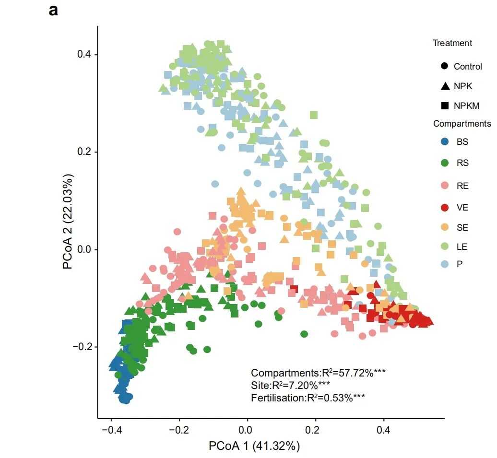
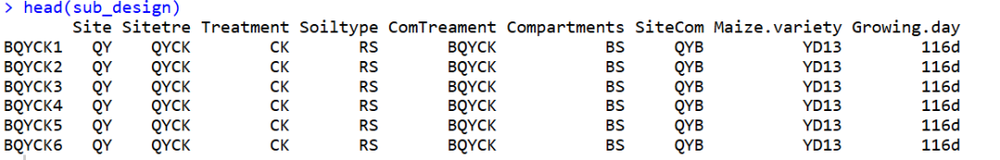
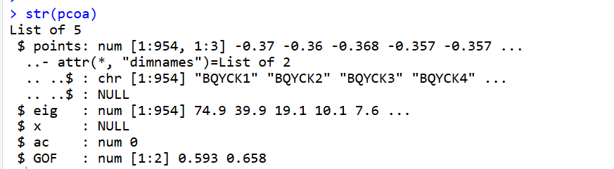
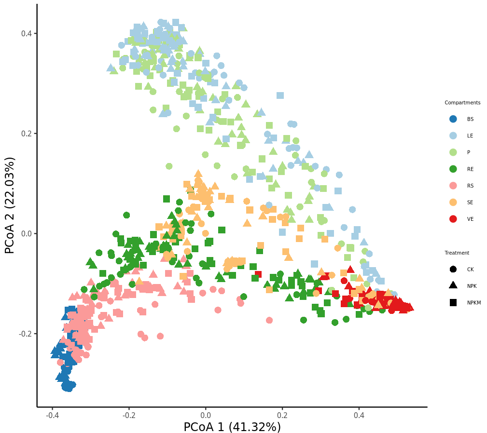

# 物种Beta多样性PCoA分析

- 专辑：绘图小技巧2025
- 公众号：生信技能树
- 发布时间：2025-02-01 21:38
- 原文：[微信公众平台](https://mp.weixin.qq.com/s?__biz=MzAxMDkxODM1Ng%3D%3D&mid=2247537723&idx=1&sn=172fec1697c601edef4c2194b13c9a54&chksm=9b4b1480ac3c9d96e0615d3e171a954f67a6ad9d293a26780fecdae86283737b0120f253cc35)

---
前面我们已经给大家介绍过来自 nature communications 杂志的高颜值小提琴图：《[NC杂志同款高颜值小提琴图](https://mp.weixin.qq.com/s?__biz=MzAxMDkxODM1Ng==&mid=2247537553&idx=1&sn=d60bcf0ec06858a21c2e0eb52e55fea3&scene=21#wechat_redirect)》以及《[nature communications 杂志同款三元图：Ternary plots](https://mp.weixin.qq.com/s?__biz=MzAxMDkxODM1Ng==&mid=2247537683&idx=1&sn=2efed317d095c95f03700804d4b8cefa&scene=21#wechat_redirect)》，今天来学习PCoA分析，文献还是《**A highly conserved core bacterial microbiota with nitrogen-fixation capacity inhabits the xylem sap in maize plants**》，图片如下：



图注：

> 图1：土壤类型和施肥对玉米微生物组的影响。a.采用加权UniFrac距离对整个数据集进行无约束主坐标分析（PCoA）。（\***P \< 0.001，通过Adonis进行的置换多元方差分析（PerMANOVA））。**
>
> **Control**：不施肥；
>
> **NPK**：氮、磷、钾化肥；
>
> **NPKM**：有机肥料+化肥；
>
> BS：散装土；RS：根际土；RE：根内圈；VE：木质部汁液；SE：茎内圈；LE：叶内圈；P：叶表面。

## PCoA分析含义

> 物种Beta多样性PCoA分析是一种用于研究不同样本之间物种组成差异的统计方法。以下是对其的详细解释：
>
> ### 1. **Beta多样性**
>
> Beta多样性是指不同样本或群落之间的物种组成差异，反映了群落结构对环境变化的响应。它主要关注的是样本之间的差异，而不是单个样本内的物种多样性。
>
> ### 2. **PCoA分析**
>
> PCoA（主坐标分析）是一种基于距离矩阵的降维方法，用于将复杂的高维数据投影到低维空间（通常是二维或三维），以便更直观地展示样本之间的相似性和差异。在物种Beta多样性分析中，PCoA通过以下步骤实现：
>
> - **计算距离矩阵**：选择合适的距离度量方法（如Bray-Curtis距离、Jaccard距离等）计算样本之间的相似性或差异。
>
> - **降维处理**：将距离矩阵转换为低维空间中的坐标，通常选择前两个或三个主坐标（PC1、PC2、PC3）进行可视化。
>
> - **结果可视化**：以散点图的形式展示样本在低维空间中的分布，点与点之间的距离越近，表示样本的物种组成越相似。
>
> ### 3. **分析意义**
>
> - **揭示群落差异**：通过PCoA分析，可以直观地观察到不同样本或群落之间的物种组成差异，从而判断它们的相似性和差异性。
>
> - **评估环境影响**：结合环境变量，可以进一步分析环境因素对物种组成的影响，为生态研究和环境保护提供依据。
>
> - **显著性检验**：虽然PCoA本身无法直接提供显著性差异，但可以结合PERMANOVA等统计方法对群落结构的差异进行显著性检验。
>
> ### 4. **实际应用**
>
> 在微生物群落研究中，PCoA分析常用于比较不同环境条件下的微生物群落结构，帮助研究人员理解环境变化对微生物群落的影响。例如，在土壤微生物研究中，通过PCoA分析可以发现污染土壤与未污染土壤之间的微生物群落差异。
>
> 总之，物种Beta多样性PCoA分析是一种强大的工具，能够帮助研究人员深入理解不同样本之间的物种组成差异及其生态意义。

## 数据背景

数据地址：https://github.com/PlantNutrition/Liyu

- Fig1/metadata.txt：样本表型数据

- Fig1/weighted_unifrac.txt：样本与样本之间的 unifrac 距离矩阵

### 1、读取样本表型数据

```r
rm(list=ls())
library(ggplot2)
knitr::opts_chunk$set(echo = TRUE, warning=FALSE)

# 读取样本表型数据
sub_design <- read.table("Fig1/metadata.txt", header=T, row.names=1, sep="\t")
head(sub_design)
str(sub_design)
dim(sub_design)
colnames(sub_design)
table(sub_design$Site)
table(sub_design$Sitetre)
```



数据每一列的含义：

- `Site`：采样地点

- `Sitetre`：对采样地点的进一步细分

&nbsp;

- `Treatment`：具体的处理方式，例如“CK”表示对照组（无处理）

- `Soiltype`：土壤类型或样本来源的部位

&nbsp;

- `ComTreament`：组合处理方式

- `Compartments`：样本的具体部位或组织

- `SiteCom`：结合采样地点和样本部位

&nbsp;

- `Maize.variety`：玉米的品种

&nbsp;

- `Growing.day`：样本采集时玉米的生长天数

### 2、读取距离矩阵

读取并取交集

```r
# 读取距离矩阵
beta <- read.table("Fig1/weighted_unifrac.txt", header=T, row.names=1, sep="\t", comment.char="")
head(beta)
dim(beta)
beta[1:5,1:6]
colnames(beta)
rownames(beta)

# 取交集
idx = rownames(sub_design) %in% rownames(beta)
sub_design <- sub_design[idx,]
sub_beta <- beta[rownames(sub_design),rownames(sub_design)]
```

## PCoA分析

PCoA本质上是一种特殊的MDS分析，适用于基于距离矩阵的数据降维：

`k=3`：这个参数指定了输出的主坐标数量。`k=3`表示函数将返回前三个主坐标（PC1、PC2、PC3）。这些主坐标可以用于后续的可视化分析

`eig=T`：这个参数设置为`TRUE`，表示函数返回特征值（eigenvalues）。特征值可以用来评估每个主坐标解释的变异量。特征值越大，说明该主坐标解释的变异越多，对样本差异的贡献越大。

```r
# pcoa分析
pcoa <- cmdscale(sub_beta, k=3, eig=T)
str(pcoa)
pcoa

# 提取前三个主坐标
points <- as.data.frame(pcoa$points)
colnames(points) <- c("x", "y", "z")
head(points)

# 提取特征值
eig <- pcoa$eig

# 将主坐标于样本表型数据合并
points <- cbind(points, sub_design[match(rownames(points), rownames(sub_design)), ])
head(points)

# 设置样本的具体部位为因子
Compartments <- factor(points$Compartments,levels = c("BS","RS","RE","VE","SE","LE","P"))
head(Compartments)
table(Compartments)

# 设置处理为因子
Treatment <- factor(points$Treatment,levels = c("CK","NPK","NPKM"))
Treatment
table(Treatment)
```



## 绘图展示结果

PCoA 分析结果可以使用前两个主成分绘制散点图进行展示，点的形状为不同的处理条件，颜色为不同样本部位

```r
# 设置颜色
col <- c("#1F78B4","#A6CEE3","#B2DF8A","#33A02C","#FB9A99","#FDBF6F","#E31A1C")

# 绘制 PCoA 分析结果点图
p <- ggplot(points, aes(x=x, y=y,color=Compartments,shape=Treatment)) +
  geom_point(size=3) +
  labs(x=paste("PCoA 1 (", format(100 * eig[1] / sum(eig), digits=4), "%)", sep=""),
       y=paste("PCoA 2 (", format(100 * eig[2] / sum(eig), digits=4), "%)",sep="")) +
  scale_colour_manual(values = col) +
  theme_classic() +
  theme(axis.text.x = element_text(size = 8),
        axis.text.y = element_text(size = 8),
        axis.title.y= element_text(size=12),
        axis.title.x = element_text(size = 12),
        legend.title=element_text(size=5),legend.text=element_text(size=5)
        )

p
```

结果如下：

> 来自BS、RS、RE、VE、SE、LE和P样本的数据进行无约束主坐标分析（PCoA）显示，地上部分细菌微生物组的Beta多样性与根部和土壤微生物组的Beta多样性存在差异。




### 往期精彩

[nature communications 杂志同款三元图：Ternary plots](https://mp.weixin.qq.com/s?__biz=MzAxMDkxODM1Ng==&mid=2247537683&idx=1&sn=2efed317d095c95f03700804d4b8cefa&scene=21#wechat_redirect)

[绘制NC杂志同款高颜值小提琴图](https://mp.weixin.qq.com/s?__biz=MzAxMDkxODM1Ng==&mid=2247537553&idx=1&sn=d60bcf0ec06858a21c2e0eb52e55fea3&scene=21#wechat_redirect)

[给你的单细胞umap图加个cell杂志同款的圈](https://mp.weixin.qq.com/s?__biz=MzAxMDkxODM1Ng==&mid=2247537290&idx=1&sn=ad76831349df67bb5236370dab088536&scene=21#wechat_redirect)

[高颜值复杂热图绘制小技巧](https://mp.weixin.qq.com/s?__biz=MzAxMDkxODM1Ng==&mid=2247537091&idx=1&sn=23f4aa643cf8c731221c3abe857ce150&scene=21#wechat_redirect)

[一种很新的功能富集结果展示方法](https://mp.weixin.qq.com/s?__biz=MzAxMDkxODM1Ng==&mid=2247537055&idx=1&sn=26544d5687fbe6001391e869ea84e692&scene=21#wechat_redirect)

[KEGG富集结果7大分类展示](https://mp.weixin.qq.com/s?__biz=MzAxMDkxODM1Ng==&mid=2247536875&idx=2&sn=67fe96abc9c8a139edebfa8a89728df8&scene=21#wechat_redirect)

[5种方式美化你的单细胞umap散点图](https://mp.weixin.qq.com/s?__biz=MzAxMDkxODM1Ng==&mid=2247536822&idx=1&sn=5f695d4ee6d8ba00a0961c02c4cf83bd&scene=21#wechat_redirect)

<!-- wechat-article-fetcher: complete -->
