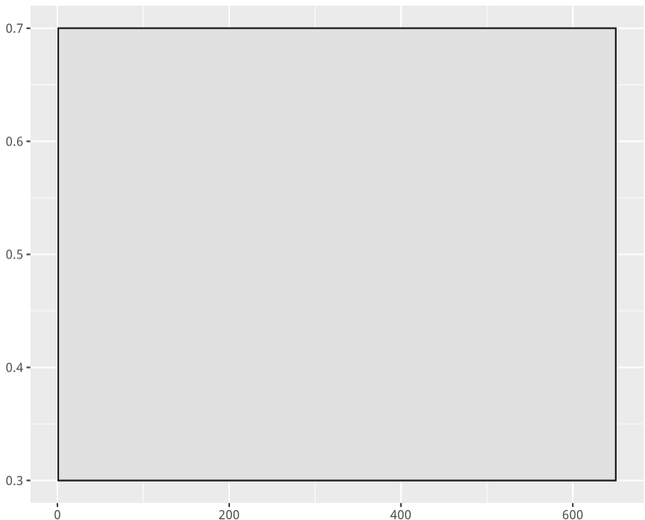
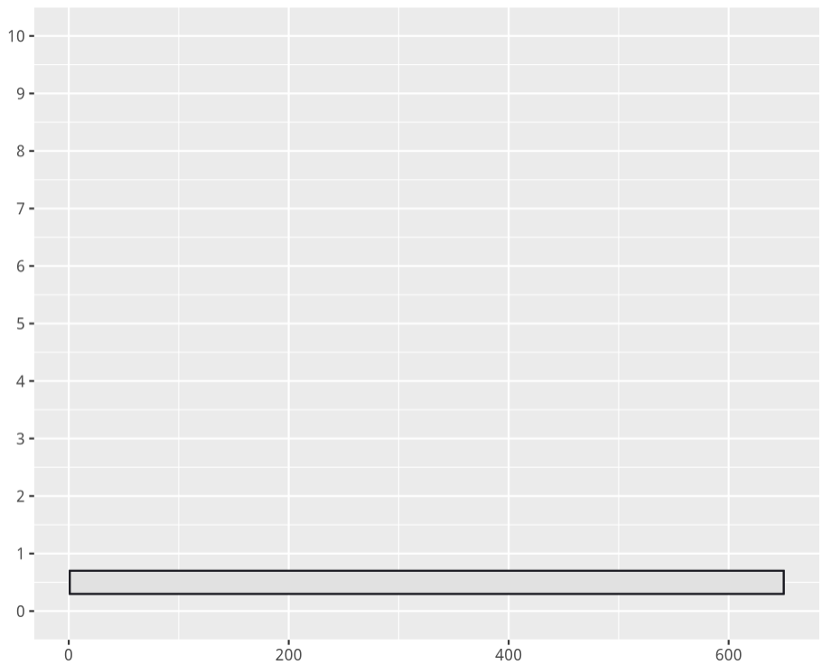
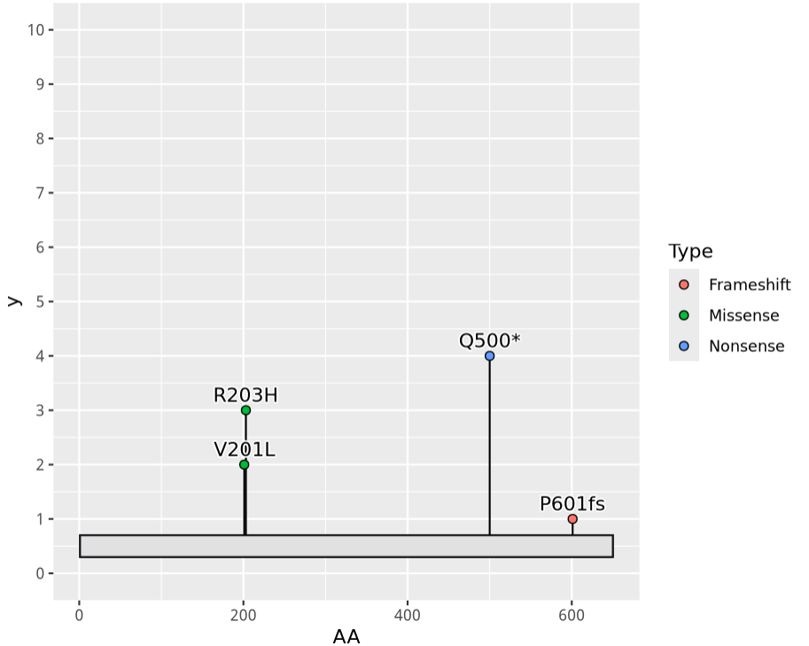
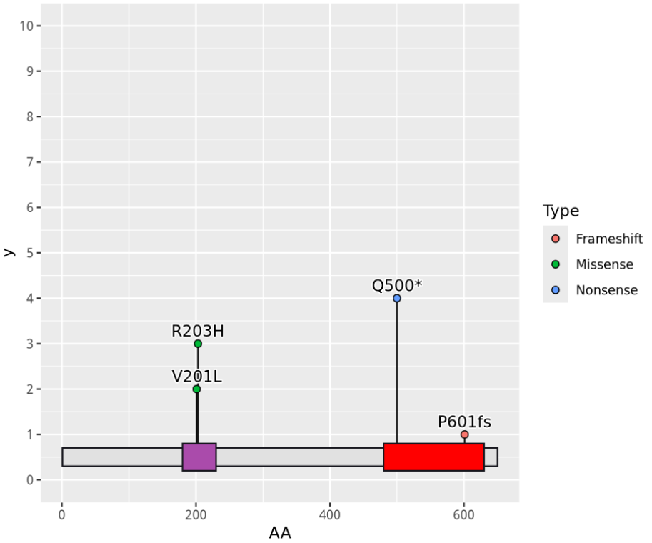
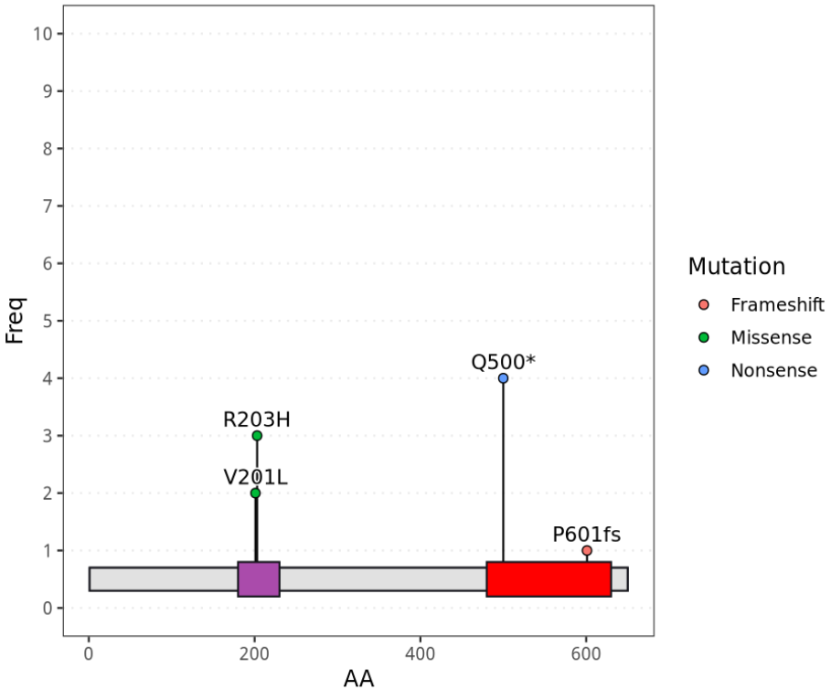
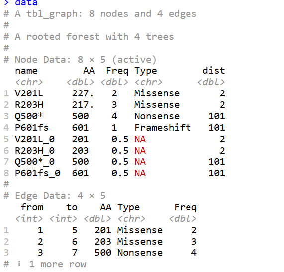
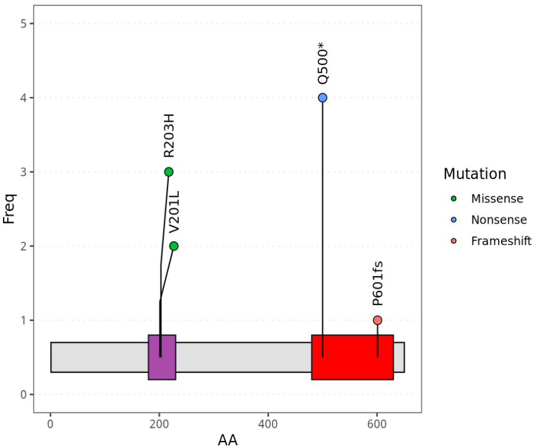
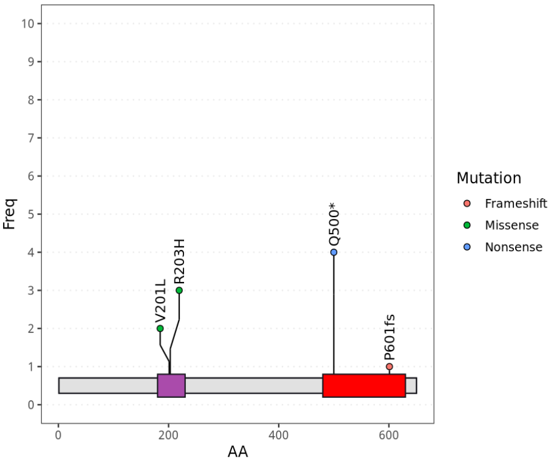

# ggplot2（r包）绘制基因棒棒糖图

- 专辑：绘图小技巧2025
- 公众号：生信技能树
- 发布时间：2025-01-31 20:01
- 原文：[微信公众平台](https://mp.weixin.qq.com/s?__biz=MzAxMDkxODM1Ng%3D%3D&mid=2247537683&idx=2&sn=7b7697ec767f8a66a6f23a005d758f74&chksm=9b4b14a8ac3c9dbee7d3dd542eefc8e39d6d10a31fcaaab9212840c8f1720c1bd997089ce690)

---
> 前面我们已经学习了四个包来绘制展示基因突变信息的棒棒图，其实，ggplot2也可以绘制，见资源：https://stackoverflow.com/questions/77473777/adding-branches-to-ggplot-mutation-lollipop-plot

前面已经介绍的四个软件：

- [maftools（r包）绘制棒棒图等](https://mp.weixin.qq.com/s?__biz=MzAxMDkxODM1Ng==&mid=2247537553&idx=2&sn=8512c282fdeaaa54642fbe5a4ba5c396&scene=21#wechat_redirect)

- [trackview（r包）包绘制 基因棒棒图](https://mp.weixin.qq.com/s?__biz=MzAxMDkxODM1Ng==&mid=2247537475&idx=2&sn=8cf87ed30689c8d1cdbea85ec3233643&scene=21#wechat_redirect)

- [GenVisR（r包）介绍：基因组可视化工具](https://mp.weixin.qq.com/s?__biz=MzAxMDkxODM1Ng==&mid=2247537617&idx=2&sn=c9f6907c800f4db038ff49198d74d077&scene=21#wechat_redirect)

- [G3viz（r包）绘制基因棒棒糖图](https://mp.weixin.qq.com/s?__biz=MzAxMDkxODM1Ng==&mid=2247537650&idx=2&sn=eafd9e7cc36f15bd153572b860ab12b4&scene=21#wechat_redirect)

## 数据准备

这里制作了四个位点突变新的示例数据：

```r
rm(list=ls())
library(ggplot2)
library(ggrepel)

mut.df <- data.frame("AA" = c(201, 203, 500, 601),
                     "Mut" = c("V201L", "R203H", "Q500*", "P601fs"),
                     "Type" = c("Missense", "Missense", "Nonsense", "Frameshift"),
                     "Freq" = c(2,3,4,1))

mut.df
# AA    Mut       Type Freq
# 1 201  V201L   Missense    2
# 2 203  R203H   Missense    3
# 3 500  Q500*   Nonsense    4
# 4 601 P601fs Frameshift    1

domain.df <- data.frame("Feature" = c("Start", "Dom1", "Dom2", "End"),
                        "Type" = c("str", "dom", "dom", "str"),
                        "Start" = c(1, 180, 480, 650),
                        "End" = c(1, 230, 630, 650))

domain.df

# Feature Type Start End
# 1   Start  str     1   1
# 2    Dom1  dom   180 230
# 3    Dom2  dom   480 630
# 4     End  str   650 650

str.fill <- "#E1E1E1"
str.col <- "#16161D"

dom.fill <- c("Dom2" = "#FF0000", "Dom1" = "#AA4BAB")
dom.col <- c("#16161D")
```

## ggplot2 绘制

### 1、使用`geom_rect`函数绘制边框

```r
## 绘图
# 绘制边框
gp <- ggplot() +
  geom_rect(data = subset(domain.df, Type == "str"),
            mapping = aes(xmin = min(Start), xmax = max(End), ymin = 0.3, ymax = 0.7),
            fill = str.fill,
            colour = str.col)
gp
```



### 2、将上边绘制的边框压缩成一个长条形

```r
# 添加y轴范围，刻度，将上边绘制的边框压缩成一个长条形
gp <- gp + scale_y_continuous(limits = c(0, 10), breaks = 0:10)
gp
```



### 3、添加棒棒图

使用`geom_segment`添加棒棒图的棒子，`geom_point`添加棒棒图上面的圈圈，`geom_text_repel`添加对应的文字

```r
# 添加棒棒图
gp <- gp + geom_segment(data = mut.df,
                        mapping = aes(x = AA, xend = AA, y = 0.7, yend = Freq)) +
  geom_point(data = mut.df,
             mapping = aes(x = AA, y = Freq, fill = Type),
             shape = 21,
             size = 2) +
  geom_text_repel(data = mut.df,
                  mapping = aes(x = AA, y = Freq, label = Mut),
                  bg.colour = "white",
                  seed = 12345,
                  nudge_y = 0.25)

gp
```



### 4、添加结构区域

再使用`geom_rect`添加突变区域：

```r
# 添加结构区域
gp <- gp + geom_rect(data = subset(domain.df, Type == "dom"),
                     mapping = aes(xmin = Start, xmax = End, ymin = 0.2, ymax = 0.8, fill = Feature, group = Feature),
                     fill = dom.fill[subset(domain.df, Type == "dom")$Feature],
                     colour = dom.col)
gp
```



### 5、修改主题

优化一下配色，主题：

```r
# 修改主题
gp <- gp +
  theme_bw() +
  theme(panel.grid.minor = element_blank(),
        panel.grid.major.x = element_blank(),
        panel.grid.major.y = element_line(linetype = "dotted")) +
  labs(x = "AA", y = "Freq", fill = "Mutation")

gp
```



### 6、再优化：将两个重叠的棒子分开不重叠

整理一下数据变成适合的数据格式：

```r
###############################
library(tidyverse)
library(tidygraph)
library(ggraph)

data <- mut.df %>%
  select(Mut, AA, Type, Freq) %>%
  mutate(Base = paste0(Mut, '_0'), .after = 'Mut') %>%
  as_tbl_graph() %>%
  mutate(AA = rep(mut.df$AA, 2),
         Freq = c(mut.df$Freq, rep(0.5, nrow(mut.df))),
         Type = c(mut.df$Type, rep(NA, nrow(mut.df)))) %>%
  mutate(dist = sapply(AA, \(x) min(abs(x - mut.df$AA[!mut.df$AA %in% x])))) %>%
  mutate(AA = ifelse(!is.na(Type) & dist < 20,
                     runif(n(), -50, 50), 0) + AA)

data
```



绘图：不重叠的棒棒使用`geom_edge_elbow`函数

```r
data %>%
  ggraph(layout = 'manual', x = AA, y = Freq) + # 绘制一个空白图
  # 绘制边框
  geom_rect(data = subset(domain.df, Type == "str"),
            mapping = aes(xmin = min(Start), xmax = max(End),
                          ymin = 0.3, ymax = 0.7),
            fill = str.fill,
            colour = str.col) +
  # 绘制突变结构域
  geom_rect(data = subset(domain.df, Type == "dom"),
            mapping = aes(xmin = Start, xmax = End, ymin = 0.2,
                          ymax = 0.8, fill = Feature, group = Feature),
            fill = dom.fill[subset(domain.df, Type == "dom")$Feature],
            colour = dom.col) +
  # 添加不重叠的棒棒
  geom_edge_elbow(aes(direction = 1), strength = 0.5) +
  # 添加棒棒上面的圈圈
  geom_node_point(shape = 21, aes(fill = Type, size = Type)) +
  # 添加棒棒上的突变信息
  geom_node_text(aes(label = ifelse(is.na(Type), '', name)),
                 angle = 90, hjust = -0.3) +
  # 优化圈圈的大小
  scale_size_manual(values = rep(3, 3), breaks = unique(mut.df$Type),
                    guide = 'none') +
  scale_fill_discrete(breaks = unique(mut.df$Type)) +
  theme_bw() +
  theme(panel.grid.minor = element_blank(),
        panel.grid.major.x = element_blank(),
        panel.grid.major.y = element_line(linetype = "dotted")) +
  labs(x = "AA", y = "Freq", fill = "Mutation") +
  ylim(c(0, 5))
```

结果如下：



### 7、再优化：两个棒棒之间添加一下空格

首先，作者写了一个函数增加两个重叠的棒棒间的空格：

```r
# function to shift the x-axis coordinates when points are too close
shift.lollipop.x <- function(mut.pos = NULL, total.length = NULL, shift.factor = 0.05){

  pos.dif <- 0
  for (i in 1:length(mut.pos)){
    pos.dif <- c(pos.dif, mut.pos[i+1] - mut.pos[i])
  }

  idx <- which(pos.dif < shift.factor*total.length)

  ## deal with odd and even sets of points
  if (median(idx) %% 1==0){
    mut.pos[idx[idx < median(idx)]] <- mut.pos[idx[idx < median(idx)]] - shift.factor*total.length
    mut.pos[idx[idx > median(idx)]] <- mut.pos[idx[idx > median(idx)]] + shift.factor*total.length
  } else {
    mut.pos[idx[idx == median(idx)-0.5]] <- mut.pos[idx[idx == median(idx)-0.5]] - 0.5*shift.factor*total.length
    mut.pos[idx[idx == median(idx)+0.5]] <- mut.pos[idx[idx == median(idx)+0.5]] + 0.5*shift.factor*total.length

    mut.pos[idx[idx < median(idx)-0.5]] <- mut.pos[idx[idx < median(idx)-0.5]] - shift.factor*total.length
    mut.pos[idx[idx > median(idx)+0.5]] <- mut.pos[idx[idx > median(idx)+0.5]] + shift.factor*total.length
  }

  mut.pos

}

# function to split the segment into 3 parts
shift.lollipop.y <- function(x, start.y = 0.7){
  mod.start <- x - start.y

  set1 <- start.y + mod.start/3
  set2 <- set1 + mod.start/3

  as.data.frame(cbind(set1,set2))
}
```

使用上面定义的函数修改数据并绘图：

```r
# 修改数据
mut.df$Shift.AA <- shift.lollipop.x(mut.df$AA, 650)
mut.df <- cbind(mut.df, shift.lollipop.y(mut.df$Freq, 0.7))

str.fill <- "#E1E1E1"
str.col <- "#16161D"
dom.fill <- c("Dom2" = "#FF0000", "Dom1" = "#AA4BAB")
dom.col <- c("#16161D")

# 绘图
gp <- ggplot() +
  geom_rect(data = subset(domain.df, Type == "str"),
            mapping = aes(xmin = min(Start), xmax = max(End), ymin = 0.3, ymax = 0.7),
            fill = str.fill,
            colour = str.col) +
  scale_y_continuous(limits = c(0, 10), breaks = 0:10) +
  geom_segment(data = mut.df,
               mapping = aes(x = AA, xend = AA, y = 0.7, yend = set1)) +
  geom_segment(data = mut.df,
               mapping = aes(x = AA, xend = Shift.AA, y = set1, yend = set2)) +
  geom_segment(data = mut.df,
               mapping = aes(x = Shift.AA, xend = Shift.AA, y = set2, yend = Freq)) +
  geom_point(data = mut.df,
             mapping = aes(x = Shift.AA, y = Freq, fill = Type),
             shape = 21,
             size = 2) +
  geom_text_repel(data = mut.df,
                  mapping = aes(x = Shift.AA, y = Freq, label = Mut),
                  bg.colour = "white",
                  seed = 12345,
                  nudge_y = 0.25,
                  angle = 90) +
  geom_rect(data = subset(domain.df, Type == "dom"),
                     mapping = aes(xmin = Start, xmax = End, ymin = 0.2, ymax = 0.8, fill = Feature, group = Feature),
                     fill = dom.fill[subset(domain.df, Type == "dom")$Feature],
                     colour = dom.col)

gp <- gp +
  theme_bw() +
  theme(panel.grid.minor = element_blank(),
        panel.grid.major.x = element_blank(),
        panel.grid.major.y = element_line(linetype = "dotted")) +
  labs(x = "AA", y = "Freq", fill = "Mutation")

gp
```

最终效果如下：



### 友情宣传：

[生信入门&数据挖掘线上直播课2025年1月班](https://mp.weixin.qq.com/s?__biz=MzI1Njk4ODE0MQ==&mid=2247527230&idx=1&sn=7156afcd5ab734c7d391b9048695747a&scene=21#wechat_redirect)

[时隔5年，我们的生信技能树VIP学徒继续招生啦](http://mp.weixin.qq.com/s?__biz=MzAxMDkxODM1Ng==&mid=2247524148&idx=1&sn=7806da6feb41a36493c519c1cfc1d3ac&chksm=9b4bdf8fac3c569960369602f1ef26639cb366b250f233b2297d1f059471c0458335bfc0b829&scene=21#wechat_redirect)

[满足你生信分析计算需求的低价解决方案](https://mp.weixin.qq.com/s?__biz=MzAxMDkxODM1Ng==&mid=2247535760&idx=2&sn=1e02a2e982a046ecf6389231e6768d5b&scene=21#wechat_redirect)

<!-- wechat-article-fetcher: complete -->
