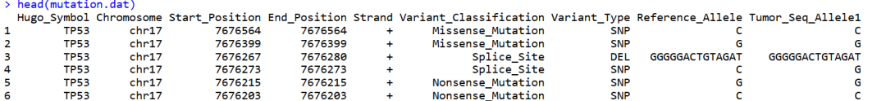
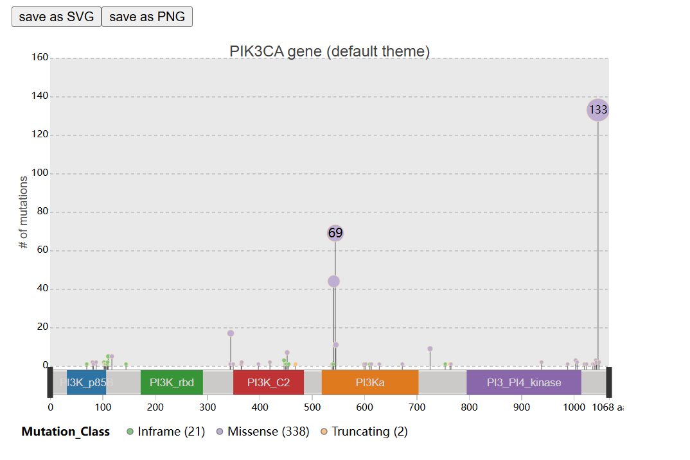
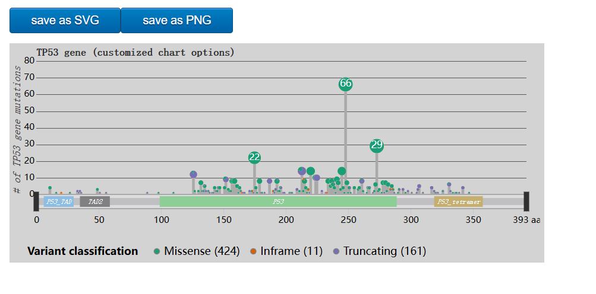
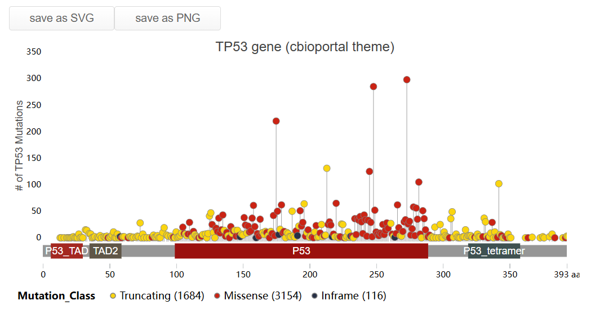

# G3viz（r包）绘制基因棒棒糖图

- 专辑：绘图小技巧2025
- 公众号：生信技能树
- 发布时间：2025-01-30 15:22
- 原文：[微信公众平台](https://mp.weixin.qq.com/s?__biz=MzAxMDkxODM1Ng%3D%3D&mid=2247537650&idx=2&sn=eafd9e7cc36f15bd153572b860ab12b4&chksm=9b4b1349ac3c9a5f205ae6f256429dfc1c091941a78559c23f1c45fa58a231146a05f14d1115)

---
> 今天介绍个一款绘制基因棒棒图的软件于2020年2月发表在Bioinformatics杂志上，标题为：《G3viz: an R package to interactively visualize genetic mutation data using a lollipop-diagram》。G3viz是一个R软件包，可以直观且有效地可视化遗传突变数据能够帮助研究人员更好地理解基因组数据并验证发现，提供了一个易于使用的棒棒糖图工具。它使用户能够在RStudio或网页浏览器中交互式地可视化遗传突变的详细翻译效应，而无需掌握任何HTML5/JavaScript技术。

首先，还是老习惯，推荐大家去学习官网：https://g3viz.github.io/g3viz/。

前面已经介绍了三个软件：

- [maftools（r包）绘制棒棒图等](https://mp.weixin.qq.com/s?__biz=MzAxMDkxODM1Ng==&mid=2247537553&idx=2&sn=8512c282fdeaaa54642fbe5a4ba5c396&scene=21#wechat_redirect)

- [trackview（r包）包绘制 基因棒棒图](https://mp.weixin.qq.com/s?__biz=MzAxMDkxODM1Ng==&mid=2247537475&idx=2&sn=8cf87ed30689c8d1cdbea85ec3233643&scene=21#wechat_redirect)

- [GenVisR（r包）介绍：基因组可视化工具](https://mp.weixin.qq.com/s?__biz=MzAxMDkxODM1Ng==&mid=2247537617&idx=2&sn=c9f6907c800f4db038ff49198d74d077&scene=21#wechat_redirect)

## G3viz 的功能特点包括：

- 交互式功能：包括缩放、平移、工具提示、刷选以及交互式图例

- 可突出显示和标记位置突变

- 提供8种现成可用的图表主题

- 个性化绘图：拥有超过50种图表选项以及35种以上的配色方案

- 可将图表保存为PNG或高质量SVG格式

- 内置功能用于检索蛋白质结构域信息以及解析基因异构体

- 内置功能可将遗传突变类型（即变异分类）映射到突变类别

- 集成支持通过API从cBioPortal检索癌症突变数据并进行可视化

## 安装一下

```r
## 使用西湖大学的 Bioconductor镜像
options(BioC_mirror="https://mirrors.westlake.edu.cn/bioconductor")
options("repos"=c(CRAN="https://mirrors.westlake.edu.cn/CRAN/"))
library(devtools)
# install from github
devtools::install_github("g3viz/g3viz")
```

## 绘图：小试牛刀

### 1、从`MAF`文件绘制基因突变棒棒图

突变注释格式（MAF）是一种常用的以制表符分隔的文本文件，用于存储汇总的突变信息。它可以通过像vcf2maf这样的工具从VCF文件生成。MAF文件中变异等位基因的翻译效应通常在名为Variant_Classification或Mutation_Type的列中（例如，Frame_Shift_Del，Splice_Site）。在本例中，TCGA-BRCA研究的体细胞突变数据最初是从GDC数据门户网站下载的。

```r
rm(list=ls())
# load g3viz package
library(g3viz)

# System file
maf.file <- system.file("extdata", "TCGA.BRCA.varscan.somatic.maf.gz", package = "g3viz")
maf.file

# [1] "/usr/local/software/miniconda3/envs/R4.4/lib/R/library/g3viz/extdata/TCGA.BRCA.varscan.somatic.maf.gz"

mutation.dat <- readMAF(maf.file)
head(mutation.dat)
colnames(mutation.dat)
str(mutation.dat)
```



绘图：

```r
chart.options <- g3Lollipop.theme(theme.name = "default",
                                  title.text = "PIK3CA gene (default theme)")

g3Lollipop(mutation.dat,
           gene.symbol = "PIK3CA",
           plot.options = chart.options,
           output.filename = "default_theme")
```



### 2、从`CSV` or `TSV`文件绘制基因突变棒棒图

在这个例子中，从CSV或TSV文件中读取遗传突变数据，并使用一些可定制的图表选项进行可视化。请注意，这相当于使用了暗色主题的图表。

```r
# load data
mutation.csv <- system.file("extdata", "ccle.csv", package = "g3viz")
mutation.csv
# [1] "/usr/local/software/miniconda3/envs/R4.4/lib/R/library/g3viz/extdata/ccle.csv"

mutation.dat <- readMAF(mutation.csv,
                        gene.symbol.col = "Hugo_Symbol",
                        variant.class.col = "Variant_Classification",
                        protein.change.col = "amino_acid_change",
                        sep = ",")  # column-separator of csv file

# set up chart options
plot.options <- g3Lollipop.options(
  # Chart settings
  chart.width = 600,
  chart.type = "pie",
  chart.margin = list(left = 30, right = 20, top = 20, bottom = 30),
  chart.background = "#d3d3d3",
  transition.time = 300,
  # Lollipop track settings
  lollipop.track.height = 200,
  lollipop.track.background = "#d3d3d3",
  lollipop.pop.min.size = 1,
  lollipop.pop.max.size = 8,
  lollipop.pop.info.limit = 5.5,
  lollipop.pop.info.dy = "0.24em",
  lollipop.pop.info.color = "white",
  lollipop.line.color = "#a9A9A9",
  lollipop.line.width = 3,
  lollipop.circle.color = "#ffdead",
  lollipop.circle.width = 0.4,
  lollipop.label.ratio = 2,
  lollipop.label.min.font.size = 12,
  lollipop.color.scheme = "dark2",
  highlight.text.angle = 60,
  # Domain annotation track settings
  anno.height = 16,
  anno.margin = list(top = 0, bottom = 0),
  anno.background = "#d3d3d3",
  anno.bar.fill = "#a9a9a9",
  anno.bar.margin = list(top = 4, bottom = 4),
  domain.color.scheme = "pie5",
  domain.margin = list(top = 2, bottom = 2),
  domain.text.color = "white",
  domain.text.font = "italic 8px Serif",
  # Y-axis label
  y.axis.label = "# of TP53 gene mutations",
  axis.label.color = "#303030",
  axis.label.alignment = "end",
  axis.label.font = "italic 12px Serif",
  axis.label.dy = "-1.5em",
  y.axis.line.color = "#303030",
  y.axis.line.width = 0.5,
  y.axis.line.style = "line",
  y.max.range.ratio = 1.1,
  # Chart title settings
  title.color = "#303030",
  title.text = "TP53 gene (customized chart options)",
  title.font = "bold 12px monospace",
  title.alignment = "start",
  # Chart legend settings
  legend = TRUE,
  legend.margin = list(left=20, right = 0, top = 10, bottom = 5),
  legend.interactive = TRUE,
  legend.title = "Variant classification",
  # Brush selection tool
  brush = TRUE,
  brush.selection.background = "#F8F8FF",
  brush.selection.opacity = 0.3,
  brush.border.color = "#a9a9a9",
  brush.border.width = 1,
  brush.handler.color = "#303030",
  # tooltip and zoom
  tooltip = TRUE,
  zoom = TRUE
)

g3Lollipop(mutation.dat,
           gene.symbol = "TP53",
           protein.change.col = "amino_acid_change",
           btn.style = "blue", # blue-style chart download buttons
           plot.options = plot.options,
           output.filename = "customized_plot")
```

上面这个设置也太多了，应该都是默认参数：



### 3、从`cBioPortal`读取数据绘制基因突变棒棒图

cBioPortal 提供了许多癌症基因组数据集的下载。G3viz 有一种便捷的方式可以直接从该门户网站检索数据。

在这个例子中，首先检索 `msk_impact_2017 `研究中 `TP53` 基因的遗传突变数据，然后使用内置的 `cbioportal` 主题对数据进行可视化，以模拟`cBioPortal`的`mutation_mapper`功能。

```r
# Retrieve mutation data of "msk_impact_2017" from cBioPortal
mutation.dat <- getMutationsFromCbioportal("msk_impact_2017", "TP53")
mutation.dat

# "cbioportal" chart theme
plot.options <- g3Lollipop.theme(theme.name = "cbioportal",
                                 title.text = "TP53 gene (cbioportal theme)",
                                 y.axis.label = "# of TP53 Mutations")

g3Lollipop(mutation.dat,
           gene.symbol = "TP53",
           btn.style = "gray", # gray-style chart download buttons
           plot.options = plot.options,
           output.filename = "cbioportal_theme")
```



今天这个软件还不错，快去试试看！

### 友情宣传：

[生信入门&数据挖掘线上直播课2025年1月班](https://mp.weixin.qq.com/s?__biz=MzI1Njk4ODE0MQ==&mid=2247527230&idx=1&sn=7156afcd5ab734c7d391b9048695747a&scene=21#wechat_redirect)

[时隔5年，我们的生信技能树VIP学徒继续招生啦](http://mp.weixin.qq.com/s?__biz=MzAxMDkxODM1Ng==&mid=2247524148&idx=1&sn=7806da6feb41a36493c519c1cfc1d3ac&chksm=9b4bdf8fac3c569960369602f1ef26639cb366b250f233b2297d1f059471c0458335bfc0b829&scene=21#wechat_redirect)

[满足你生信分析计算需求的低价解决方案](https://mp.weixin.qq.com/s?__biz=MzAxMDkxODM1Ng==&mid=2247535760&idx=2&sn=1e02a2e982a046ecf6389231e6768d5b&scene=21#wechat_redirect)

<!-- wechat-article-fetcher: complete -->
